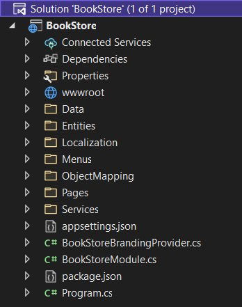
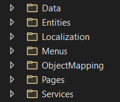
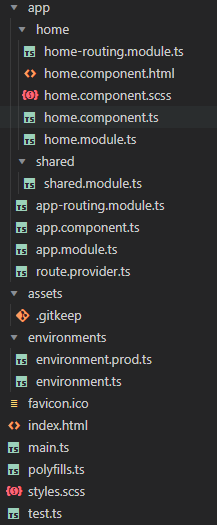

# Application (Single Layer) Startup Template

## Introduction

This template provides a simple solution structure with a single project. This document explains that solution structure in details.

### The Difference Between the Application Startup Templates

ABP's [Application Startup Template](Application.md) provides a well-organized and layered solution to create maintainable business applications based on the [Domain Driven Design](../Domain-Driven-Design.md) (DDD) practices. However, some developers find this template a little bit complex for simple and short-term applications. The single-layer application template has been created to provide a simpler development model for such applications. This template has the same functionality, features and modules on runtime with the [Application Startup Template](Application.md) but the development model is minimal and everything is in a single project (`.csproj`).

## How to Start with It?

You can use the [ABP CLI](../CLI.md) to create a new project using this startup template. Alternatively, you can generate a CLI command for this startup template from the [Get Started](https://abp.io/get-started) page. In this section, we will use the ABP CLI.

Firstly, install the ABP CLI if you haven't installed it before:

```bash
dotnet tool install -g Volo.Abp.Cli
```

Then, use the `abp new` command in an empty folder to create a new solution:

```bash
abp new Acme.BookStore -t app-nolayers
```

* `Acme.BookStore` is the solution name, like *YourCompany.YourProduct*. You can use single-level, two-level or three-level naming.
* In this example, the `-t` (or `--template`) option specifies the template name.

### Specify the UI Framework

This template provides multiple UI frameworks:

* `mvc`: ASP.NET Core MVC UI with Razor Pages (default)
* `blazor`: Blazor UI
* `blazor-server`: Blazor Server UI
* `angular`: Angular UI
* `none`: Without UI (for HTTP API development)

Use the `-u` (or `--ui`) option to specify the UI framework while creating the solution:

```bash
abp new Acme.BookStore -t app-nolayers -u angular
```

This example specifies the UI type (the `-u` option) as `angular`. You can also specify `mvc`, `blazor`, `blazor-server` or `none` for the UI type.

### Specify the Database Provider

This template supports the following database providers:

- `ef`: Entity Framework Core (default)
- `mongodb`: MongoDB

Use the `-d` (or `--database-provider`) option to specify the database provider while creating the solution:

```bash
abp new Acme.BookStore -t app-nolayers -d mongodb
```

## Solution Structure

If you don't specify any additional options while creating an `app-nolayers` template, you will have a solution as shown below:



In the next sections, we will explain the structure based on this example. Your startup solution can be slightly different based on your preferences.

### Folder Structure

Since this template provides a single-project solution, we've separated concerns into folders instead of projects. You can see the pre-defined folders as shown below:



* Define your database mappings (for [EF Core](../Entity-Framework-Core.md) or [MongoDB](../MongoDB.md)) and [repositories](../Repositories.md) in the `Data` folder.
* Define your [entities](../Entities.md) in the `Entities` folder.
* Define your UI localization keys/values in the `Localization` folder.
* Define your UI menu items in the `Menus` folder.
* Define your [object-to-object mapping](../Object-To-Object-Mapping.md) classes in the `ObjectMapping` folder.
* Define your UI pages (Razor Pages) in the `Pages` folder (create `Controllers` and `Views` folder yourself if you prefer the MVC pattern).
* Define your [application services](../Application-Services.md) in the `Services` folder. 

### How to Run?

Before running the application, you need to create the database and seed the initial data. To do that, you can run the following command in the directory of your project (in the same folder of the `.csproj` file):

```bash
dotnet run --migrate-database
```

This command will create the database and seed the initial data for you. Then you can run the application with any IDE that supports .NET or by running the `dotnet run` command in the directory of your project. The default username is `admin` and the password is `1q2w3E*`.

> While creating a database & applying migrations seem only necessary for relational databases, you should run this command even if you choose a NoSQL database provider (like MongoDB). In that case, it still seeds the initial data which is necessary for the application.

### The Angular UI 

If you choose `Angular` as the UI framework, the solution will be separated into two folders:

* An `angular` folder that contains the Angular UI application, the client-side code.
* An `aspnet-core` folder that contains the ASP.NET Core solution (a single project), the server-side code.

The server-side is similar to the solution described in the *Solution Structure* section above. This project serves the API, so the Angular application can consume it.

The client-side application consumes the HTTP APIs as mentioned. You can see the folder structure of the Angular project shown below:


