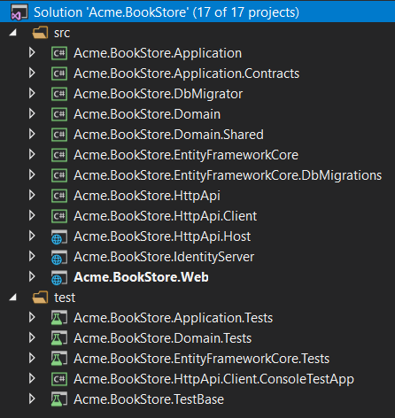
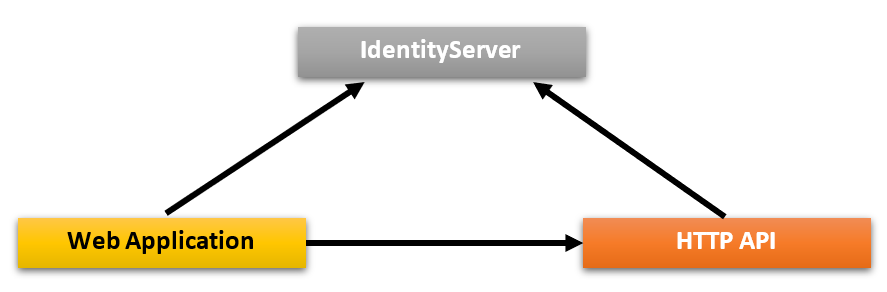
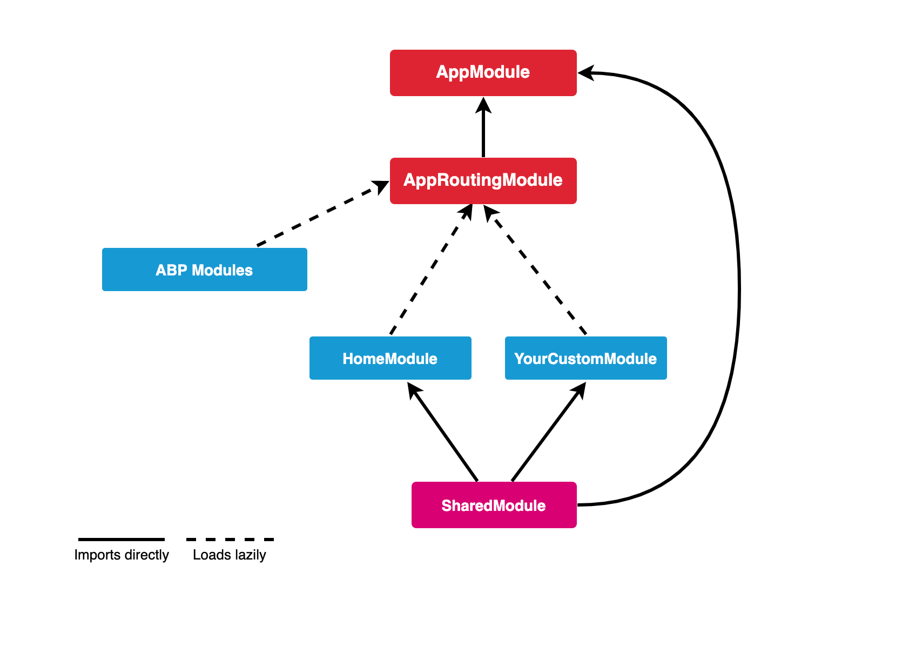

# Application Startup Template

## Introduction

This template provides a layered application structure based on the [Domain Driven Design](../Domain-Driven-Design.md) (DDD) practices. 

This document explains **the solution structure** and projects in details. If you want to start quickly, follow the guides below:

* [The getting started document](../Getting-Started-With-Startup-Templates.md) explains how to create a new application in a few minutes.
* [The application development tutorial](../Tutorials/Part-1) explains step by step application development.

## How to Start With?

You can use the [ABP CLI](../CLI.md) to create a new project using this startup template. Alternatively, you can directly create & download from the [Get Started](https://abp.io/get-started) page. CLI approach is used here.

First, install the ABP CLI if you haven't installed before:

````bash
dotnet tool install -g Volo.Abp.Cli
````

Then use the `abp new` command in an empty folder to create a new solution:

````bash
abp new Acme.BookStore -t app
````

* `Acme.BookStore` is the solution name, like *YourCompany.YourProduct*. You can use single level, two-levels or three-levels naming.
* This example specified the template name (`-t` or `--template` option). However, `app` is already the default template if you don't specify it.

### Specify the UI Framework

This template provides multiple UI frameworks:

* `mvc`: ASP.NET Core MVC UI with Razor Pages (default)
* `blazor`: Blazor UI
* `angular`: Angular UI

Use `-u` or `--ui` option to specify the UI framework:

````bash
abp new Acme.BookStore -u angular
````

### Specify the Database Provider

This template supports the following database providers:

- `ef`: Entity Framework Core (default)
- `mongodb`: MongoDB

Use `-d` (or `--database-provider`) option to specify the database provider:

````bash
abp new Acme.BookStore -d mongodb
````

### Specify the Mobile Application Framework

This template supports the following mobile application frameworks:

- `react-native`: React Native

Use `-m` (or `--mobile`) option to specify the mobile application framework:

````bash
abp new Acme.BookStore -m react-native
````

If not specified, no mobile application will be created.

## Solution Structure

Based on the options you've specified, you will get a slightly different solution structure.

### Default Structure

If you don't specify any additional option, you will have a solution like shown below:


Projects are organized in `src` and `test` folders. `src` folder contains the actual application which is layered based on [DDD](../Domain-Driven-Design.md) principles as mentioned before.

The diagram below shows the layers & project dependencies of the application:


Each section below will explain the related project & its dependencies.

#### .Domain.Shared Project

This project contains constants, enums and other objects these are actually a part of the domain layer, but needed to be used by all layers/projects in the solution.

A `BookType` enum and a `BookConsts` class (which may have some constant fields for the `Book` entity, like `MaxNameLength`) are good candidates for this project.

* This project has no dependency to other projects in the solution. All other projects depend on this directly or indirectly.

#### .Domain Project

This is the domain layer of the solution. It mainly contains [entities, aggregate roots](../Entities.md), [domain services](../Domain-Services.md), [value objects](../Value-Objects.md), [repository interfaces](../Repositories.md) and other domain objects.

A `Book` entity, a `BookManager` domain service and an `IBookRepository` interface are good candidates for this project.

* Depends on the `.Domain.Shared` because it uses constants, enums and other objects defined in that project.

#### .Application.Contracts Project

This project mainly contains [application service](../Application-Services.md) **interfaces** and [Data Transfer Objects](../Data-Transfer-Objects.md) (DTO) of the application layer. It does exists to separate interface & implementation of the application layer. In this way, the interface project can be shared to the clients as a contract package.

An `IBookAppService` interface and a `BookCreationDto` class are good candidates for this project.

* Depends on the `.Domain.Shared` because it may use constants, enums and other shared objects of this project in the application service interfaces and DTOs.

#### .Application Project

This project contains the [application service](../Application-Services.md) **implementations** of the interfaces defined in the `.Application.Contracts` project.

A `BookAppService` class is a good candidate for this project.

* Depends on the `.Application.Contracts` project to be able to implement the interfaces and use the DTOs.
* Depends on the `.Domain` project to be able to use domain objects (entities, repository interfaces... etc.) to perform the application logic.

#### .EntityFrameworkCore Project

This is the integration project for the EF Core. It defines the `DbContext` and implements repository interfaces defined in the `.Domain` project.

* Depends on the `.Domain` project to be able to reference to entities and repository interfaces.

> This project is available only if you are using EF Core as the database provider. If you select another database provider, its name will be different.

#### .DbMigrator Project

This is a console application which simplifies to execute database migrations on development and production environments. When you run this application, it;

* Creates the database if necessary.
* Applies the pending database migrations.
* Seeds initial data if needed.

> This project has its own `appsettings.json` file. So, if you want to change the database connection string, remember to change this file too.

Especially, seeding initial data is important at this point. ABP has a modular data seed infrastructure. See [its documentation](../Data-Seeding.md) for more about the data seeding.

While creating database & applying migrations seems only necessary for relational databases, this projects comes even if you choose a NoSQL database provider (like MongoDB). In that case, it still seeds initial data which is necessary for the application.

* Depends on the `.EntityFrameworkCore` project (for EF Core) since it needs to access to the migrations.
* Depends on the `.Application.Contracts` project to be able to access permission definitions, because initial data seeder grants all permissions for the admin role by default.

#### .HttpApi Project

This project is used to define your API Controllers.

Most of time you don't need to manually define API Controllers since ABP's [Auto API Controllers](../API/Auto-API-Controllers.md) feature creates them automagically based on your application layer. However, in case of you need to write API controllers, this is the best place to do it.

* Depends on the `.Application.Contracts` project to be able to inject the application service interfaces.

#### .HttpApi.Client Project

This is a project that defines C# client proxies to use the HTTP APIs of the solution. You can share this library to 3rd-party clients, so they can easily consume your HTTP APIs in their Dotnet applications (For other type of applications, they can still use your APIs, either manually or using a tool in their own platform)

Most of time you don't need to manually create C# client proxies, thanks to ABP's [Dynamic C# API Clients](../API/Dynamic-CSharp-API-Clients.md) feature.

`.HttpApi.Client.ConsoleTestApp` project is a console application created to demonstrate the usage of the client proxies.

* Depends on the `.Application.Contracts` project to be able to share the same application service interfaces and DTOs with the remote service.

> You can delete this project & dependencies if you don't need to create C# client proxies for your APIs.

#### .Web Project

This project contains the User Interface (UI) of the application if you are using ASP.NET Core MVC UI. It contains Razor pages, JavaScript files, CSS files, images and so on...

This project contains the main `appsettings.json` file that contains the connection string and other configuration of the application.

* Depends on the `.HttpApi` since UI layer needs to use APIs and application service interfaces of the solution.

> If you check the source code of the `.Web.csproj` file, you will see the references to the `.Application` and the `.EntityFrameworkCore` projects.
>
> These references are actually not needed while coding your UI layer, because UI layer normally doesn't depend on the EF Core or the Application layer's implementation. This startup templates are ready for the tiered deployment, where API layer is hosted in a separate server than the UI layer.
>
> However, if you don't choose the `--tiered` option, these references will be in the .Web project to be able to host the Web, API and application layers in a single application endpoint.
>
> This gives you to ability to use domain entities & repositories in your presentation layer. However, this is considered as a bad practice according to the DDD.

#### Test Projects

The solution has multiple test projects, one for each layer:

* `.Domain.Tests` is used to test the domain layer.
* `.Application.Tests` is used to test the application layer.
* `.EntityFrameworkCore.Tests` is used to test EF Core configuration and custom repositories.
* `.Web.Tests` is used to test the UI (if you are using ASP.NET Core MVC UI).
* `.TestBase` is a base (shared) project for all tests.

In addition, `.HttpApi.Client.ConsoleTestApp` is a console application (not an automated test project) which demonstrate the usage of HTTP APIs from a .NET application.

Test projects are prepared for integration testing;

* It is fully integrated to ABP framework and all services in your application.
* It uses SQLite in-memory database for EF Core. For MongoDB, it uses the [Mongo2Go](https://github.com/Mongo2Go/Mongo2Go) library.
* Authorization is disabled, so any application service can be easily used in tests.

You can still create unit tests for your classes which will be harder to write (because you will need to prepare mock/fake objects), but faster to run (because it only tests a single class and skips all initialization process).

#### How to Run?

Set `.Web` as the startup project and run the application. Default username is `admin` and password is `1q2w3E*`.

See [Getting Started With the ASP.NET Core MVC Template](../Getting-Started-AspNetCore-MVC-Template.md) for more information.

### Tiered Structure

If you have selected the ASP.NET Core UI and specified the `--tiered` option, the solution created will be a tiered solution. The purpose of the tiered structure is to be able to **deploy Web application and HTTP API to different servers**:


* Browser runs your UI by executing HTML, CSS & JavaScript.
* Web servers hosts static UI files (CSS, JavaScript, image... etc.) & dynamic components (e.g. Razor pages). It performs HTTP requests to the API server to execute the business logic of the application.
* API Server hosts the HTTP APIs which then use application & domain layers of the application to perform the business logic.
* Finally, database server hosts your database.

So, the resulting solution allows a 4-tiered deployment, by comparing to 3-tiered deployment of the default structure explained before.

> Unless you actually need to such a 4-tiered deployment, its suggested to go with the default structure which is simpler to develop, deploy and maintain.

The solution structure is shown below:



As different from the default structure, two new projects come into play: `.IdentityServer` & `.HttpApi.Host`.

#### .IdentityServer Project

This project is used as an authentication server for other projects. `.Web` project uses OpenId Connect Authentication to get identity and access tokens for the current user from the IdentityServer. Then uses the access token to call the HTTP API server. HTTP API server uses bearer token authentication to obtain claims from the access token to authorize the current user.



ABP uses the open source [IdentityServer4](https://identityserver.io/) framework for the authentication between applications. See [IdentityServer4 documentation](http://docs.identityserver.io) for details about the IdentityServer4 and OpenID Connect protocol.

It has its own `appsettings.json` that contains database connection and other configurations.

#### .HttpApi.Host Project

This project is an application that hosts the API of the solution. It has its own `appsettings.json` that contains database connection and other configurations.

#### .Web Project

Just like the default structure, this project contains the User Interface (UI) of the application. It contains razor pages, JavaScript files, style files, images and so on...

This project contains an `appsettings.json` file, but this time it does not have a connection string because it never connects to the database. Instead, it mainly contains endpoint of the remote API server and the authentication server.

#### Pre-requirements

* [Redis](https://redis.io/): The applications use Redis as as distributed cache. So, you need to have Redis installed & running.

#### How to Run?

You should run the application with the given order:

* First, run the `.IdentityServer` since other applications depends on it.
* Then run the `.HttpApi.Host` since it is used by the `.Web` application.
* Finally, you can run the `.Web` project and login to the application (using `admin` as the username and `1q2w3E*` as the password).

### Angular UI

If you choose `Angular` as the UI framework (using the `-u angular` option), the solution is being separated into two folders:

* `angular` folder contains the Angular UI application, the client-side code.
* `aspnet-core` folder contains the ASP.NET Core solution, the server-side code.

The server-side is similar to the solution described above. `*.HttpApi.Host` project serves the API, so the `Angular` application consumes it.

Angular application folder structure looks like below:


Each of ABP Commercial modules is an NPM package. Some ABP modules are added as a dependency in `package.json`. These modules install with their dependencies. To see all ABP packages, you can run the following command in the `angular` folder:

```bash
yarn list --pattern abp
```

Angular application module structure:



#### AppModule

`AppModule` is the root module of the application. Some of ABP modules and some essential modules imported to the `AppModule`.

ABP Config modules also have imported to `AppModule`  for initially requirements of lazy-loadable ABP modules.

#### AppRoutingModule

There are lazy-loadable ABP modules in the `AppRoutingModule` as routes.

> Paths of ABP Modules should not be changed.

You should add `routes` property in the `data` object to add a link on the menu to redirect to your custom pages.

```js
{
   path: 'dashboard',
   loadChildren: () => import('./dashboard/dashboard.module').then(m => m.DashboardModule),
   canActivate: [AuthGuard, PermissionGuard],
   data: {
      routes: {
         name: 'ProjectName::Menu:Dashboard',
         order: 2,
         iconClass: 'fa fa-dashboard',
         requiredPolicy: 'ProjectName.Dashboard.Host'
      } as ABP.Route
   }
}
```
In the above example;
*  If the user is not logged in, AuthGuard blocks access and redirects to the login page.
*  PermissionGuard checks the user's permission with `requiredPolicy` property of the `rotues` object. If the user is not authorized to access the page, the 403 page appears.
*  `name` property of `routes` is the menu link label. A localization key can be defined .
*  `iconClass` property of `routes` object is the menu link icon class.
*  `requiredPolicy` property of `routes` object is the required policy key to access the page.

After the above `routes` definition, if the user is authorized, the dashboard link will appear on the menu.

#### Shared Module

The modules that may be required for all modules have imported to the `SharedModule`. You should import the `SharedModule` to all modules.

See the [Sharing Modules](https://angular.io/guide/sharing-ngmodules) document.

#### Environments

The files under the `src/environments` folder has the essential configuration of the application.

#### Home Module

Home module is an example lazy-loadable module that loads on the root address of the application.

#### Styles

The required style files added to `styles` array in the `angular.json`. `AppComponent` loads some style files lazily via `LazyLoadService` after the main bundle is loaded to shorten the first rendering time.

#### Testing

You should create your tests in the same folder as the file file you want to test.

See the [testing document](https://angular.io/guide/testing).

#### Depended Packages

* [NG Bootstrap](https://ng-bootstrap.github.io/) is used as UI component library.
* [NGXS](https://www.ngxs.io/) is used as state management library.
* [angular-oauth2-oidc](https://github.com/manfredsteyer/angular-oauth2-oidc) is used to support for OAuth 2 and OpenId Connect (OIDC).
* [Chart.js](https://www.chartjs.org/) is used to create widgets.
* [ngx-validate](https://github.com/ng-turkey/ngx-validate) is used for dynamic validation of reactive forms.

### React Native

if `-m react-native` option is spesified in new project command, the solution includes the [React Native](https://reactnative.dev/) application in the `react-native` folder.

The server-side is similar to the solution described above. `*.HttpApi.Host` project serves the API, so the React Native application consumes it.

The React Native application was generated with [Expo](https://expo.io/). Expo is a set of tools built around React Native to help you quickly start an app and, while it has many features.

React Native application folder structure as like below:


* `App.js` is bootstrap component of the application.
* `Environment.js` file has the essential configuration of the application. `prod` and `dev` configurations defined in this file. 
* [Contexts](https://reactjs.org/docs/context.html) are created in the `src/contexts` folder.
* [Higher order components](https://reactjs.org/docs/higher-order-components.html) are created in the`src/hocs` folder.
* [Custom hooks](https://reactjs.org/docs/hooks-custom.html#extracting-a-custom-hook) are created in the`src/hooks`.
* [Axios interceptors](https://github.com/axios/axios#interceptors) are created in the `src/interceptors` folder.
* Utility functions are exported from `src/utils` folder.

#### Components

Components that can be used on all screens are created in the `src/components` folder. All components have created as a function that able to use [hooks](https://reactjs.org/docs/hooks-intro.html).

#### Screens


Screens are created by creating folders that separate their names in the `src/screens` folder. Certain parts of some screens can be split into components.

Each screen is used in a navigator in the `src/navigators` folder.

#### Navigation

[React Navigation](https://reactnavigation.org/) is used as a navigation library. Navigators are created in the `src/navigators`. A [drawer](https://reactnavigation.org/docs/drawer-based-navigation/) navigator and several [stack](https://reactnavigation.org/docs/hello-react-navigation/#installing-the-stack-navigator-library) navigators have created in this folder. See the [above diagram](#screens) for navigation structure.

#### State Management

[Redux](https://redux.js.org/) is used as state management library. [Redux Toolkit](https://redux-toolkit.js.org/) library is used as a toolset for efficient Redux development.

Actions, reducers, sagas, selectors are created in the `src/store` folder. Store folder as like below:


* [**Store**](https://redux.js.org/basics/store) is defined in the `src/store/index.js` file.
* [**Actions**](https://redux.js.org/basics/actions/) are payloads of information that send data from your application to your store.
* [**Reducers**](https://redux.js.org/basics/reducers) specify how the application's state changes in response to actions sent to the store. 
* [**Redux-Saga**](https://redux-saga.js.org/) is a library that aims to make application side effects (i.e. asynchronous things like data fetching and impure things like accessing the browser cache) easier to manage. Sagas are created in the `src/store/sagas` folder.
* [**Reselect**](https://github.com/reduxjs/reselect) library is used to create memoized selectors. Selectors are created in the `src/store/selectors` folder.

#### APIs

[Axios](https://github.com/axios/axios) is used as an HTTP client library. An Axios instance has exported from  `src/api/API.js` file to make HTTP calls with the same config. `src/api` folder also has the API files that have been created for API calls.

#### Theming

[Native Base](https://nativebase.io/) is used as UI components library. Native Base components can customize easily. See the [Native Base customize](https://docs.nativebase.io/customizing-components) documentation. We followed the same way.

* Native Base theme variables are in the `src/theme/variables` folder.
* Native Base component styles are in the `src/theme/components` folder. These files have been generated with Native Base's `ejectTheme` script.
* Styles of components override with the files under the `src/theme/overrides` folder.

#### Testing

Unit tests will be created.

See the [Testing Overview](https://reactjs.org/docs/testing.html) document.

#### Depended Libraries

* [Native Base](https://nativebase.io/) is used as UI components library.
* [React Navigation](https://reactnavigation.org/) is used as navigation library.
* [Axios](https://github.com/axios/axios) is used as HTTP client library.
* [Redux](https://redux.js.org/) is used as state management library.
* [Redux Toolkit](https://redux-toolkit.js.org/) library is used as a toolset for efficient Redux development.
* [Redux-Saga](https://redux-saga.js.org/) is used to manage asynchronous processes.
* [Redux Persist](https://github.com/rt2zz/redux-persist) is used as state persistance.
* [Reselect](https://github.com/reduxjs/reselect) is used to create memoized selectors.
* [i18n-js](https://github.com/fnando/i18n-js) is used as i18n library.
* [expo-font](https://docs.expo.io/versions/latest/sdk/font/) library allows loading fonts easily.
* [Formik](https://github.com/jaredpalmer/formik) is used to build forms.
* [Yup](https://github.com/jquense/yup) is used for form validations.

## Social / External Logins

If you want to configure social/external logins for your application, please follow the [Social/External Logins](../Authentication/Social-External-Logins.md) document.

## What's Next?

- [The getting started document](../Getting-Started.md) explains how to create a new application in a few minutes.
- [The application development tutorial](../Tutorials/Part-1.md) explains step by step application development.
