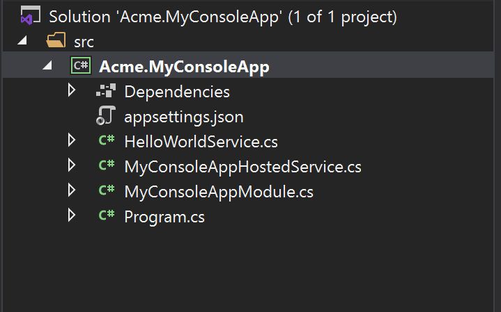

# Console Application Startup Template

This template is used to create a minimalist console application project.

## How to Start With?

First, install the [ABP CLI](../CLI.md) if you haven't installed before:

````bash
dotnet tool install -g Volo.Abp.Cli
````

Then use the `abp new` command in an empty folder to create a new solution:

````bash
abp new Acme.MyConsoleApp -t console
````

`Acme.MyConsoleApp` is the solution name, like *YourCompany.YourProduct*. You can use single level, two-levels or three-levels naming.

## Solution Structure

After you use the above command to create a solution, you will have a solution like shown below:



* `HelloWorldService` is a sample service that implements the `ITransientDependency` interface to register this service to the [dependency injection](../Dependency-Injection.md) system.