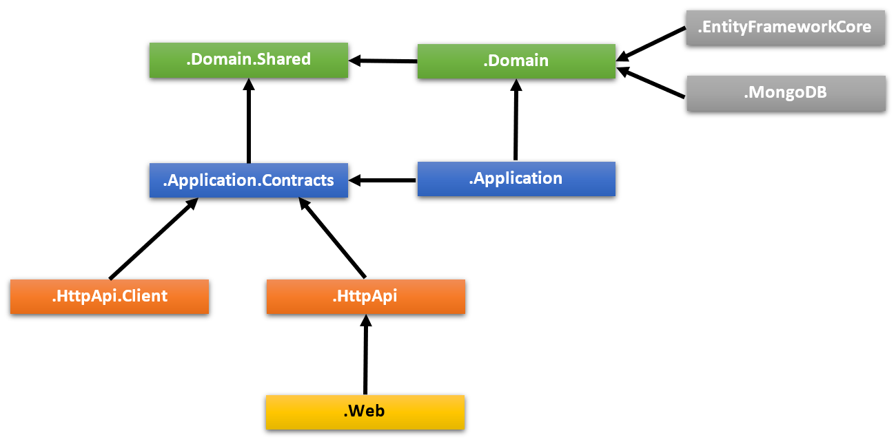

# MVC Module Startup Template

This template can be used to create a **reusable [application module](../Modules/Index.md)** based on the [module development best practices & conventions](../Best-Practices/Index.md). It is also suitable for creating **microservices** (with or without UI).

## How to Start With?

You can use the [ABP CLI](../CLI.md) to create a new project using this startup template. Alternatively, you can directly create & download from the [Get Started](https://abp.io/get-started) page. CLI approach is used here.

First, install the ABP CLI if you haven't installed before:

```bash
dotnet tool install -g Volo.Abp.Cli
```

Then use the `abp new` command in an empty folder to create a new solution:

```bash
abp new Acme.IssueManagement -t module
```

- `Acme.IssueManagement` is the solution name, like *YourCompany.YourProduct*. You can use single level, two-levels or three-levels naming.

### Without User Interface

The template comes with an MVC UI by default. You can use `--no-ui` option to not include the UI layer.

````bash
abp new Acme.IssueManagement -t module --no-ui
````

## Solution Structure

Based on the options you've specified, you will get a slightly different solution structure. If you don't specify any option, you will have a solution like shown below:


Projects are organized as `src`, `test` and `host` folders:

* `src` folder contains the actual module which is layered based on [DDD](../Domain-Driven-Design.md) principles.
* `test` folder contains unit & integration tests.
* `host` folder contains applications with different configurations to demonstrate how to host the module in an application. These are not a part of the module, but useful on development.

The diagram below shows the layers & project dependencies of the module:



Each section below will explain the related project & its dependencies.

### .Domain.Shared Project

This project contains constants, enums and other objects these are actually a part of the domain layer, but needed to be used by all layers/projects in the solution.

An `IssueType` enum and an `IssueConsts` class (which may have some constant fields for the `Issue` entity, like `MaxTitleLength`) are good candidates for this project.

- This project has no dependency to other projects in the solution. All other projects depend on this directly or indirectly.

### .Domain Project

This is the domain layer of the solution. It mainly contains [entities, aggregate roots](../Entities.md), [domain services](../Domain-Services.md), [value types](../Value-Types.md), [repository interfaces](../Repositories.md) and other domain objects.

An `Issue` entity, an `IssueManager` domain service and an `IIssueRepository` interface are good candidates for this project.

- Depends on the `.Domain.Shared` because it uses constants, enums and other objects defined in that project.

### .Application.Contracts Project

This project mainly contains [application service](../Application-Services.md) **interfaces** and [Data Transfer Objects](../Data-Transfer-Objects.md) (DTO) of the application layer. It does exists to separate interface & implementation of the application layer. In this way, the interface project can be shared to the clients as a contract package.

An `IIssueAppService` interface and an `IssueCreationDto` class are good candidates for this project.

- Depends on the `.Domain.Shared` because it may use constants, enums and other shared objects of this project in the application service interfaces and DTOs.

### .Application Project

This project contains the [application service](../Application-Services.md) **implementations** of the interfaces defined in the `.Application.Contracts` project.

An `IssueAppService` class is a good candidate for this project.

- Depends on the `.Application.Contracts` project to be able to implement the interfaces and use the DTOs.
- Depends on the `.Domain` project to be able to use domain objects (entities, repository interfaces... etc.) to perform the application logic.

### .EntityFrameworkCore Project

This is the integration project for EF Core. It defines the `DbContext` and implements repository interfaces defined in the `.Domain` project.

- Depends on the `.Domain` project to be able to reference to entities and repository interfaces.

> You can delete this project if you don't want to support EF Core for your module.

### .MongoDB Project

This is the integration project for MongoDB.

- Depends on the `.Domain` project to be able to reference to entities and repository interfaces.

> You can delete this project if you don't want to support MongoDB for your module.

### Test Projects

The solution has multiple test projects, one for each layer:

- `.Domain.Tests` is used to test the domain layer.
- `.Application.Tests` is used to test the application layer.
- `.EntityFrameworkCore.Tests` is used to test EF Core configuration and custom repositories.
- `.MongoDB.Tests` is used to test MongoDB configuration and custom repositories.
- `.TestBase` is a base (shared) project for all tests.

In addition, `.HttpApi.Client.ConsoleTestApp` is a console application (not an automated test project) which demonstrate the usage of HTTP APIs from a Dotnet application.

Test projects are prepared for integration testing;

- It is fully integrated to ABP framework and all services in your application.
- It uses SQLite in-memory database for EF Core. For MongoDB, it uses the [Mongo2Go](https://github.com/Mongo2Go/Mongo2Go) library.
- Authorization is disabled, so any application service can be easily used in tests.

You can still create unit tests for your classes which will be harder to write (because you will need to prepare mock/fake objects), but faster to run (because it only tests a single class and skips all initialization process).

> Domain & Application tests are using EF Core. If you remove EF Core integration or you want to use MongoDB for testing these layers, you should manually change project references & module dependencies.

### Host Projects

The solution has a few host applications to run your module. Host applications are used to run your module in a fully configured application. It is useful on development. Host applications includes some other modules in addition to the module being developed:

Host applications support two types of scenarios.

#### Single (Unified) Application Scenario

If your module has a UI, then `.Web.Unified` application is used to host the UI and API on a single point. It has its own `appsettings.json` file (that includes the database connection string) and EF Core database migrations.

For the `.Web.Unified` application, there is a single database, named `YourProjectName_Unified` (like *IssueManagement_Unified* for this sample).

> If you've selected the `--no-ui` option, this project will not be in your solution.

##### How to Run?

Set it as the startup project, run `Update-Database` command for the EF Core from Package Manager Console and run your application. Default username is `admin` and password is `1q2w3E*`.

#### Separated Deployment & Databases Scenario

In this scenario, there are three applications;

* `.IdentityServer` application is an authentication server used by other applications. It has its own `appsettings.json` that contains database connection and other configurations.
* `.HttpApi.Host` hosts the HTTP API of the module. It has its own `appsettings.json` that contains database connections and other configurations.
* `.Web.Host` host the UI of the module. This project contains an `appsettings.json` file, but it does not have a connection string because it never connects to the database. Instead, it mainly contains endpoint of the remote API server and the authentication server.

The diagram below shows the relation of the applications:


`.Web.Host` project uses OpenId Connect Authentication to get identity and access tokens for the current user from the `.IdentityServer`. Then uses the access token to call the `.HttpApi.Host`. HTTP API server uses bearer token authentication to obtain claims from the access token to authorize the current user.

##### How to Run?

You should run the application with the given order:

- First, run the `.IdentityServer` since other applications depends on it.
- Then run the `.HttpApi.Host` since it is used by the `.Web.Host` application.
- Finally, you can run the `.Web.Host` project and login to the application using `admin` as the username and `1q2w3E*` as the password.
