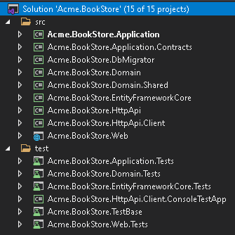

# MVC Application Startup Template

## Introduction

This template provides a layered (or tiered, based on the preference) application structure based on the [Domain Driven Design](../Domain-Driven-Design.md) (DDD) practices.

## How to Start With

You can use the [ABP CLI](../CLI.md) to create a new project using this startup template. Alternatively, you can directly create & download from the [Get Started](https://abp.io/get-started) page. CLI approach is used here.

First, install the ABP CLI as described in [its document](../CLI.md). Then use the `abp new` command in an empty folder to create a new solution:

````bash
abp new Acme.BookStore -t mvc
````

* `Acme.BookStore` is the solution name, like *YourCompany.YourProduct*. See the [CLI document](../CLI.md) for different naming styles.
* This example specified the template name (`-t` or `--template` option). However, `mvc` is the default template and used even if you don't specify it.

### Specify Database Provider

This template supports the following database providers:

- `ef`: Entity Framework Core (default)
- `mongodb`: MongoDB

Use the `-d` (or `--database-provider`) to specify the database provider:

````bash
abp new Acme.BookStore -t mvc -d mongodb
````

### Create a Tiered Solution

`--tiered` option is used to create a tiered solution where Web and Http API layers are physically separated. If not specified, it creates a layered solution which is less complex and suitable for most scenarios.

````bash
abp new Acme.BookStore --tiered
````

See the "Tiered Structure" section below for the tiered approach.

## Solution Structure

Based on the options you've specified, you will get a slightly different solution structure.

### Default Structure

If you don't specify any option, you will have a solution like shown below:



Projects are organized in `src` and `test` folders. `src` folder contains the actual application which is layered based on [DDD](../Domain-Driven-Design.md) principles as mentioned before.

--------------------

**TODO: Add a graphic to illustrate dependencies between projects.**

------------------

Each section below will explain the related project.

#### .Domain Project

This is the domain layer of the solution. It mainly contains [entities, aggregate roots](../Entities.md), [domain services](../Domain-Services.md), [value types](../Value-Types.md), [repository interfaces](../Repositories.md) and other domain objects of the solution.

A `Book` entity and a `IBookRepository` interface are good candidates for this project.

* Depends on the `.Domain.Shared` because it uses constants, enums and other objects defined in that project.

#### .Domain.Shared Project

This project contains constants, enums and other objects these are actually a part of the domain layer, but needed to be used by all layers/projects in the solution.

A `BookType` enum and a `BookConts` class (which may have some constant fields for the `Book` entity, like `MaxNameLength`) are good candidates for this project.

This project has no dependency to other projects in the solution.

#### .Application.Contracts Project

This project mainly contains [application service](../Application-Services.md) **interfaces** and [Data Transfer Objects](../Data-Transfer-Objects.md) (DTO) of the application layer. It does exists to separate interface & implementation of the application layer. In this way, the interface project can be shared to the clients as a contract package.

* Depends on the `.Domain.Shared` because it may use constants, enums and other shared objects in the application service interfaces and DTOs.

#### .Application Project

This project contains the [application service](../Application-Services.md) implementations of the interfaces defined in the `.Application.Contracts` project.

* Depends on the `.Application.Contracts` project to be able to implement the interfaces and use the DTOs.
* Depends on the `.Domain` project to be able to use domain objects (entities, repository interfaces... etc.) to perform the application logic.

#### .EntityFrameworkCore Project

This is the integration project for the EF Core. It defines the `DbContext` and implements repository interfaces defined in the `.Domain` project.

* Depends on the `.Domain` project to be able to reference to entities and repository interfaces.

> This project is available only if you are using EF Core as the database provider.

#### .EntityFrameworkCore.DbMigrations Project

Contains EF Cor database migrations for the solution. It has a separated `DbContext` to dedicated to manage migrations.

ABP is a modular framework and with an ideal design, each module has its own `DbContext` class. This is where the migration `DbContext` comes into play and unifies all `DbContext` configurations into a single model to maintain a single database schema.

Notice that the migration `DbContext` is only used for database migrations and *not used on runtime*.

* Depends on the `.EntityFrameworkCore` project since it re-uses the configuration defined for the `DbContext` of the application.

> This project is available only if you are using EF Core as the database provider.

#### .DbMigrator Project

This is a console application which simplifies to execute database migrations on development and production environments. When you this application;

* Creates the database if necessary.
* Applies database migrations.
* Seeds initial data.

> This project has its own `appsettings.json` file. So, if you want to change the database connection string, remember to change this file.

Especially, seeding initial data is important at this point. ABP has a modular data seed infrastructure. See [its documentation](../Data-Seeding.md) for more about the data seeding.

While creating database & applying migrations seems only necessary for relational databases, this projects comes even if you choose a NoSQL database provider (like MongoDB). In that case, it still seeds initial data which is necessary for the application.

* Depends on the `.EntityFrameworkCore.DbMigrations` project (for EF Core) since it needs to access to the migrations.
* Depends on the `.Application.Contracts` project to be able to access permission definitions, because initial data seeder grants permissions for the admin user.

#### .HttpApi Project

This project is used to define your API Controllers.

Most of time you don't need to manually define API Controllers since ABP's [Auto API Controllers](../AspNetCore/Auto-API-Controllers.md) feature creates them automagically based on your application layer. However, in case of you need to write API controllers, this is the best place to do it.

* Depends on the `.Application.Contracts` project to be able to inject the application service interfaces.

#### .HttpApi.Client Project

This is a project that defines C# client proxies to use the HTTP APIs of the solution. You can share this library to 3rd-party clients, so they can easily consume your HTTP APIs in their Dotnet applications.

`.HttpApi.Client.ConsoleTestApp` project is a console application created to demonstrate the usage of the client proxies.

Most of time you don't need to manually create C# client proxies, thanks to ABP's [Cynamic C# API Clients](../AspNetCore/Dynamic-CSharp-API-Clients.md) feature.

* Depends on the `.Application.Contracts` project to be able to share the same application service interfaces and DTOs with the remote service.

#### .Web Project

This project contains the User Interface (UI) of the application. It contains razor pages, javascript files, css files, images and so on...

* Depends on the `.HttpApi` since UI layer needs to use APIs and application service interfaces of the solution.

> If you check the source code of the `.Web.csproj` file, you will see the references to the `.Application` and the `.EntityFrameworkCore.DbMigrations` projects.
>
> These references are actually not needed on development, because UI layer normally doesn't depend on the EF Core or the Application implementation. This startup templates are ready for the tiered deployment, where API layer is hosted in a separate server than the UI layer.
>
> However, if you don't choose the `--tiered` option, these references will be in the .Web project to be able to host the Web, API and application layers in a single application endpoint.
>
> This gives you to ability to use domain entities in your presentation layer. However, this is considered as a bad practice according to the DDD.

#### Test Projects

The solution has multiple test projects, one for each layer:

* `.Domain.Tests` is used to test the domain layer.
* `.Application.Tests` is used to test the application layer.
* `.EntityFrameworkCore.Tests` is used to test EF Core configuration and custom repositories.
* `.Web.Tests` is used to test the UI.
* `.TestBase` is a base (shared) project for all tests.

In addition, `.HttpApi.Client.ConsoleTestApp` is a console application (not an automated test project) which demonstrate the usage of HTTP APIs from a Dotnet application.

### Tiered Structure

TODO

### Other Database Providers

TODO

#### MongoDB

TODO