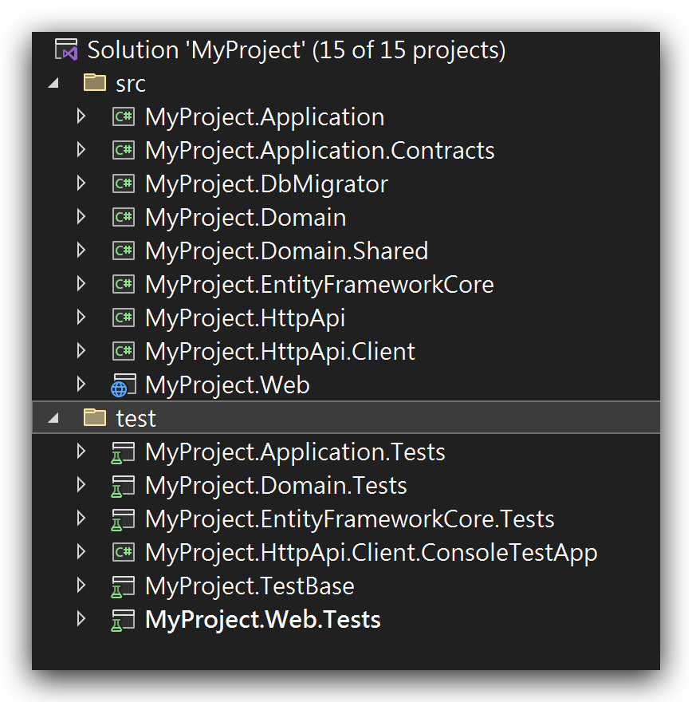
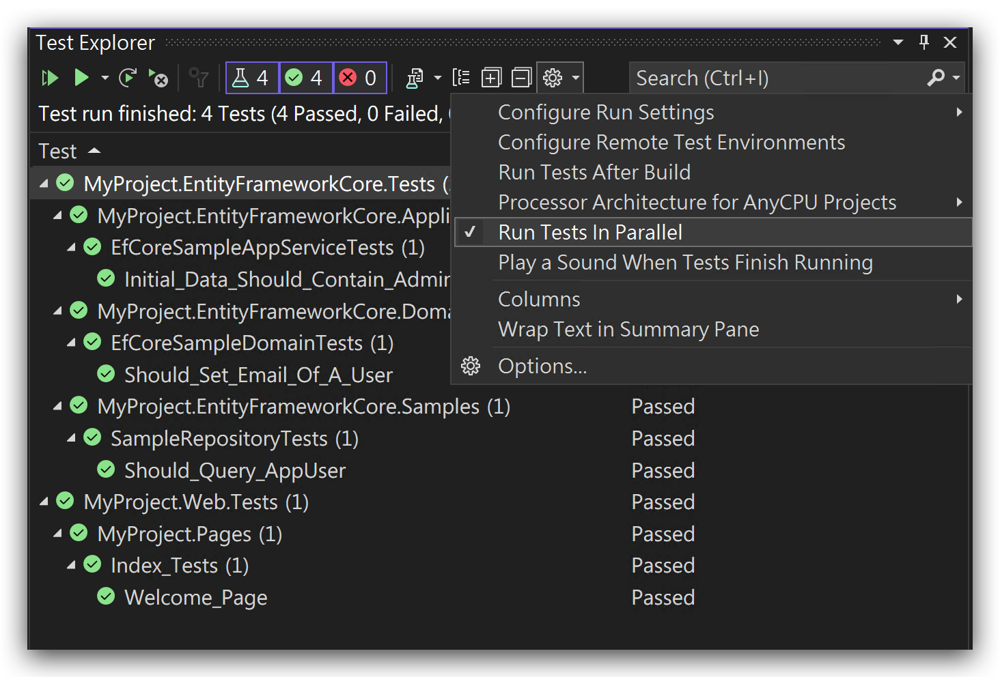

# Automated Testing

ABP Framework has been designed with testability in mind. There are some different levels of automated testing;

* **Unit Tests**: You typically test a single class (or a very few classes together). These tests will be fast. However, you generally need to deal with mocking for the dependencies of your service(s).
* **Integration Tests**: You typically test a service, but this time you don't mock the fundamental infrastructure and services to see if they properly working together.
* **UI Tests**: You test the UI of the application, just like the users interact with your application.

## The Application Startup Template

The [Application Startup Template](Startup-Templates/Application.md) comes with the test infrastructure properly installed and configured for you.

### The Test Projects

See the following solution structure in the Visual Studio:



There are more than one test project, organized by the layers;

* `Domain.Tests` is used to test your Domain Layer objects (like [Domain Services](Domain-Services.md) and [Entities](Entities.md)).
* `Application.Tests` is used to test your Application Layer (like [Application Services](Application-Services.md)).
* `EntityFrameworkCore.Tests` is used to test your custom repository implementations or EF Core mappings (this project will be different if you use another [Database Provider](Data-Access.md)).
* `Web.Tests` is used to test the UI Layer (like Pages, Controllers and View Components)
* `TestBase` contains some classes those are shared/used by the other projects.

> `HttpApi.Client.ConsoleTestApp` is not an automated test application. It is an example Console Application that shows how to consume your HTTP APIs from a .NET Console Application.

The following sections will introduce the base classes and other infrastructure included in these projects.

### The Test Infrastructure

The startup solution has the following libraries already installed;

* [xUnit](https://xunit.net/) as the test framework.
* [NSubstitute](https://nsubstitute.github.io/) as the mocking library.
* [Shouldly](https://github.com/shouldly/shouldly) as the assertion library.

While you are free to replace them with your favorite tools, this document and examples will be base on these tooling.

## The Test Explorer

You can use the Test Explorer to view and run the tests in Visual Studio. For other IDEs, see their own documentation.

### Open the Test Explorer

Open the *Test Explorer*, under the *Tests* menu, if it is not already open:


### Run the Tests

Then you can click to the Run All or Run buttons to run the tests. The initial startup template has some sample tests for you: 


### Run Tests In Parallel

The test infrastructure is compatible to run the tests in parallel. It is **strongly suggested** to run all the tests in parallel, which is pretty faster then running them one by one.

To enable it, click to the caret icon near to the settings (gear) button and select the *Run Tests In Parallel*.



## Unit Tests

For Unit Tests, you don't need to much infrastructure. You typically instantiate your class and provide some pre-configured mocked objects to prepare your object to test.

### Classes Without Dependencies

In this simplest case, the class you want to test has no dependencies. In this case, you can directly instantiate your class, call its methods and make your assertions.

#### Example: Testing an Entity

Assume that you've an `Issue` [entity](Entities.md) as shown below:

````csharp
using System;
using Volo.Abp.Domain.Entities;

namespace MyProject.Issues
{
    public class Issue : AggregateRoot<Guid>
    {
        public string Title { get; set; }
        public string Description { get; set; }
        public bool IsLocked { get; set; }
        public bool IsClosed { get; private set; }
        public DateTime? CloseDate { get; private set; }

        public void Close()
        {
            IsClosed = true;
            CloseDate = DateTime.UtcNow;
        }

        public void Open()
        {
            if (!IsClosed)
            {
                return;
            }

            if (IsLocked)
            {
                throw new IssueStateException("You can not open a locked issue!");
            }

            IsClosed = true;
            CloseDate = null;
        }
    }
}

````

Notice that the `IsClosed` and `CloseDate` properties have private setters to force some business rules by using the `Open()` and `Close()` methods;

* Whenever you close an issue, the `CloseDate` should be set to the [current time](Timing.md).
* An issue can not be re-opened if it is locked. And if it is re-opened, the `CloseDate` should be set to `null`.

Since the `Issue` entity is a part of the Domain Layer, we should test it in the `Domain.Tests` project. Create an `Issue_Tests` class inside the `Domain.Tests` project:

````csharp
using Shouldly;
using Xunit;

namespace MyProject.Issues
{
    public class Issue_Tests
    {
        [Fact]
        public void Should_Set_The_CloseDate_Whenever_Close_An_Issue()
        {
            // Arrange

            var issue = new Issue();
            issue.CloseDate.ShouldBeNull(); // null at the beginning

            // Act

            issue.Close();

            // Assert

            issue.IsClosed.ShouldBeTrue();
            issue.CloseDate.ShouldNotBeNull();
        }
    }
}
````

This test follows the AAA (Arrange-Act-Assert) pattern;

* **Arrange** part creates an `Issue` entity and ensures the `CloseDate` is `null` at the beginning.
* **Act** part executes the method we want to test for this case.
* **Assert** part checks if the `Issue` properties are same as we expect to be.

`[Fact]` attribute is defined by the [xUnit](https://xunit.net/) library and marks a method as a test method. `Should...` extension methods are provided by the [Shouldly](https://github.com/shouldly/shouldly) library. You can directly use the `Assert` class of the xUnit, but Shouldly makes it much comfortable and straightforward.

When you execute the tests, you will see that is passes successfully:


Let's add two more test methods:

````csharp
[Fact]
public void Should_Allow_To_ReOpen_An_Issue()
{
    // Arrange

    var issue = new Issue();
    issue.Close();

    // Act

    issue.Open();

    // Assert

    issue.IsClosed.ShouldBeFalse();
    issue.CloseDate.ShouldBeNull();
}

[Fact]
public void Should_Not_Allow_To_ReOpen_A_Locked_Issue()
{
    // Arrange

    var issue = new Issue();
    issue.Close();
    issue.IsLocked = true;

    // Act & Assert

    Assert.Throws<IssueStateException>(() =>
    {
        issue.Open();
    });
}
````

`Assert.Throws` checks if the executed code throws a matching exception.

> See the xUnit & Shoudly documentations to learn more about these libraries.

### Classes With Dependencies

TODO

## Integration Tests

TODO

## UI Tests

TODO

## Best Practices

TODO