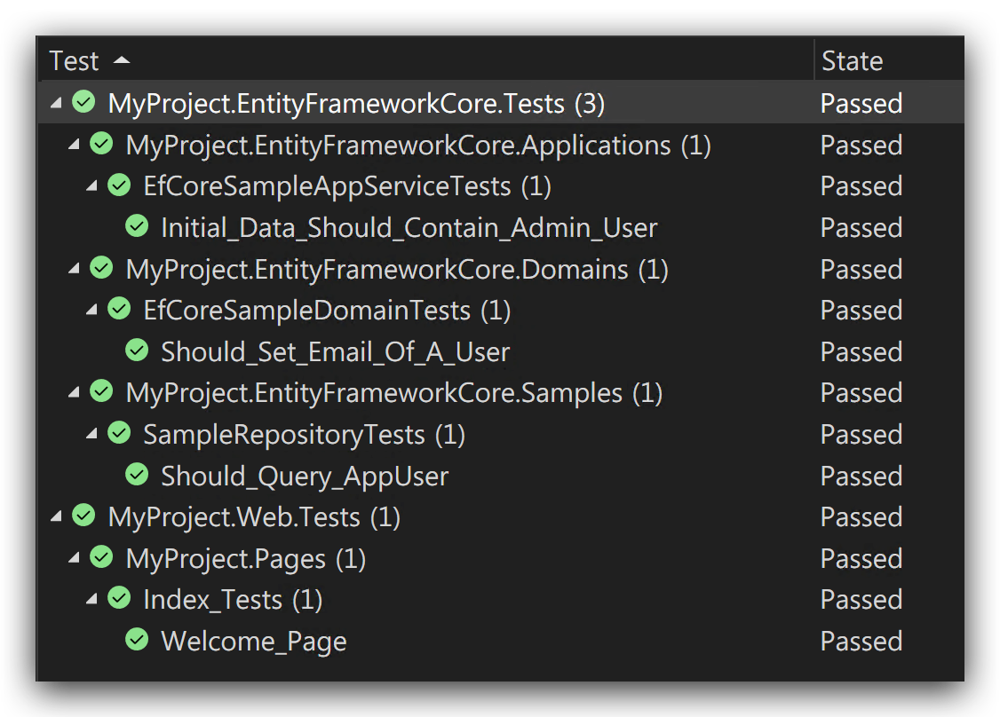

# Automated Testing

## Introduction

ABP Framework has been designed with testability in mind. There are some different levels of automated testing;

* **Unit Tests**: You typically test a single class (or a very few classes together). These tests will be fast. However, you generally need to deal with mocking for the dependencies of your service(s).
* **Integration Tests**: You typically test a service, but this time you don't mock the fundamental infrastructure and services to see if they properly working together.
* **UI Tests**: You test the UI of the application, just like the users interact with your application.

### Unit Tests vs Integration Tests

Integration tests have some significant **advantages** compared to unit tests;

* **Easier to write** since you don't work to establish mocking and dealing with the dependencies.
* Your test code runs with all the real services and infrastructure (including database mapping and queries), so it is much closer to the **real application test**.

While they have some drawbacks;

* They are **slower** compared to unit tests since all the infrastructure is prepared for each test case.
* A bug in a service may make multiple test cases broken, so it may be **harder to find the real problem** in some cases.

We suggest to go mixed: Write unit or integration test where it is necessary and you find effective to write and maintain it.

## The Application Startup Template

The [Application Startup Template](Startup-Templates/Application.md) comes with the test infrastructure properly installed and configured for you.

### The Test Projects

See the following solution structure in the Visual Studio:


There are more than one test project, organized by the layers;

* `Domain.Tests` is used to test your Domain Layer objects (like [Domain Services](Domain-Services.md) and [Entities](Entities.md)).
* `Application.Tests` is used to test your Application Layer (like [Application Services](Application-Services.md)).
* `EntityFrameworkCore.Tests` is used to test your custom repository implementations or EF Core mappings (this project will be different if you use another [Database Provider](Data-Access.md)).
* `Web.Tests` is used to test the UI Layer (like Pages, Controllers and View Components)
* `TestBase` contains some classes those are shared/used by the other projects.

> `HttpApi.Client.ConsoleTestApp` is not an automated test application. It is an example Console Application that shows how to consume your HTTP APIs from a .NET Console Application.

The following sections will introduce the base classes and other infrastructure included in these projects.

### The Test Infrastructure

The startup solution has the following libraries already installed;

* [xUnit](https://xunit.net/) as the test framework.
* [NSubstitute](https://nsubstitute.github.io/) as the mocking library.
* [Shouldly](https://github.com/shouldly/shouldly) as the assertion library.

While you are free to replace them with your favorite tools, this document and examples will be base on these tooling.

## The Test Explorer

You can use the Test Explorer to view and run the tests in Visual Studio. For other IDEs, see their own documentation.

### Open the Test Explorer

Open the *Test Explorer*, under the *Tests* menu, if it is not already open:


### Run the Tests

Then you can click to the Run All or Run buttons to run the tests. The initial startup template has some sample tests for you: 



### Run Tests In Parallel

The test infrastructure is compatible to run the tests in parallel. It is **strongly suggested** to run all the tests in parallel, which is pretty faster then running them one by one.

To enable it, click to the caret icon near to the settings (gear) button and select the *Run Tests In Parallel*.


## Unit Tests

For Unit Tests, you don't need to much infrastructure. You typically instantiate your class and provide some pre-configured mocked objects to prepare your object to test.

### Classes Without Dependencies

In this simplest case, the class you want to test has no dependencies. In this case, you can directly instantiate your class, call its methods and make your assertions.

#### Example: Testing an Entity

Assume that you've an `Issue` [entity](Entities.md) as shown below:

````csharp
using System;
using Volo.Abp.Domain.Entities;

namespace MyProject.Issues
{
    public class Issue : AggregateRoot<Guid>
    {
        public string Title { get; set; }
        public string Description { get; set; }
        public bool IsLocked { get; set; }
        public bool IsClosed { get; private set; }
        public DateTime? CloseDate { get; private set; }

        public void Close()
        {
            IsClosed = true;
            CloseDate = DateTime.UtcNow;
        }

        public void Open()
        {
            if (!IsClosed)
            {
                return;
            }

            if (IsLocked)
            {
                throw new IssueStateException("You can not open a locked issue!");
            }

            IsClosed = true;
            CloseDate = null;
        }
    }
}

````

Notice that the `IsClosed` and `CloseDate` properties have private setters to force some business rules by using the `Open()` and `Close()` methods;

* Whenever you close an issue, the `CloseDate` should be set to the [current time](Timing.md).
* An issue can not be re-opened if it is locked. And if it is re-opened, the `CloseDate` should be set to `null`.

Since the `Issue` entity is a part of the Domain Layer, we should test it in the `Domain.Tests` project. Create an `Issue_Tests` class inside the `Domain.Tests` project:

````csharp
using Shouldly;
using Xunit;

namespace MyProject.Issues
{
    public class Issue_Tests
    {
        [Fact]
        public void Should_Set_The_CloseDate_Whenever_Close_An_Issue()
        {
            // Arrange

            var issue = new Issue();
            issue.CloseDate.ShouldBeNull(); // null at the beginning

            // Act

            issue.Close();

            // Assert

            issue.IsClosed.ShouldBeTrue();
            issue.CloseDate.ShouldNotBeNull();
        }
    }
}
````

This test follows the AAA (Arrange-Act-Assert) pattern;

* **Arrange** part creates an `Issue` entity and ensures the `CloseDate` is `null` at the beginning.
* **Act** part executes the method we want to test for this case.
* **Assert** part checks if the `Issue` properties are same as we expect to be.

`[Fact]` attribute is defined by the [xUnit](https://xunit.net/) library and marks a method as a test method. `Should...` extension methods are provided by the [Shouldly](https://github.com/shouldly/shouldly) library. You can directly use the `Assert` class of the xUnit, but Shouldly makes it much comfortable and straightforward.

When you execute the tests, you will see that is passes successfully:


Let's add two more test methods:

````csharp
[Fact]
public void Should_Allow_To_ReOpen_An_Issue()
{
    // Arrange

    var issue = new Issue();
    issue.Close();

    // Act

    issue.Open();

    // Assert

    issue.IsClosed.ShouldBeFalse();
    issue.CloseDate.ShouldBeNull();
}

[Fact]
public void Should_Not_Allow_To_ReOpen_A_Locked_Issue()
{
    // Arrange

    var issue = new Issue();
    issue.Close();
    issue.IsLocked = true;

    // Act & Assert

    Assert.Throws<IssueStateException>(() =>
    {
        issue.Open();
    });
}
````

`Assert.Throws` checks if the executed code throws a matching exception.

> See the xUnit & Shoudly documentations to learn more about these libraries.

### Classes With Dependencies

If your service has dependencies and you want to unit test this service, you need to mock the dependencies.

#### Example: Testing a Domain Service

Assume that you've an `IssueManager` [Domain Service](Domain-Services.md) that is defined as below:

````csharp
using System;
using System.Threading.Tasks;
using Volo.Abp;
using Volo.Abp.Domain.Services;

namespace MyProject.Issues
{
    public class IssueManager : DomainService
    {
        public const int MaxAllowedOpenIssueCountForAUser = 3;

        private readonly IIssueRepository _issueRepository;

        public IssueManager(IIssueRepository issueRepository)
        {
            _issueRepository = issueRepository;
        }

        public async Task AssignToUserAsync(Issue issue, Guid userId)
        {
            var issueCount = await _issueRepository.GetIssueCountOfUserAsync(userId);

            if (issueCount >= MaxAllowedOpenIssueCountForAUser)
            {
                throw new BusinessException(
                    code: "IM:00392",
                    message: $"You can not assign more" +
                             $"than {MaxAllowedOpenIssueCountForAUser} issues to a user!"
                );
            }

            issue.AssignedUserId = userId;
        }
    }
}
````

`IssueManager` depends on the `IssueRepository` service, that will be mocked in this example.

**Business Rule**: The example `AssignToUserAsync` doesn't allow to assign more than 3 (`MaxAllowedOpenIssueCountForAUser` constant) issues to a user. If you want to assign an issue in this case, you first need to unassign an existing issue.

The test case below tries to make a valid assignment:

````csharp
using System;
using System.Threading.Tasks;
using NSubstitute;
using Shouldly;
using Volo.Abp;
using Xunit;

namespace MyProject.Issues
{
    public class IssueManager_Tests
    {
        [Fact]
        public async Task Should_Assign_An_Issue_To_A_User()
        {
            // Arrange

            var userId = Guid.NewGuid();

            var fakeRepo = Substitute.For<IIssueRepository>();
            fakeRepo.GetIssueCountOfUserAsync(userId).Returns(1);

            var issueManager = new IssueManager(fakeRepo);

            var issue = new Issue();

            // Act

            await issueManager.AssignToUserAsync(issue, userId);

            //Assert

            issue.AssignedUserId.ShouldBe(userId);
            await fakeRepo.Received(1).GetIssueCountOfUserAsync(userId);
        }
    }
}
````

* `Substitute.For<IIssueRepository>` creates a mock (fake) object that is passed into the `IssueManager` constructor.
* `fakeRepo.GetIssueCountOfUserAsync(userId).Returns(1)` ensures that the `GetIssueCountOfUserAsync` method of the repository returns `1`.
* `issueManager.AssignToUserAsync` doesn't throw any exception since the repository returns `1` for the currently assigned issue count.
* `issue.AssignedUserId.ShouldBe(userId);` line checks if the `AssignedUserId` has the correct value.
* `await fakeRepo.Received(1).GetIssueCountOfUserAsync(userId);` checks if the `IssueManager` called the `GetIssueCountOfUserAsync` method exactly one time.

Let's add a second test to see if it prevents to assign issues to a user more than the allowed count:

````csharp
[Fact]
public async Task Should_Not_Allow_To_Assign_Issues_Over_The_Limit()
{
    // Arrange

    var userId = Guid.NewGuid();

    var fakeRepo = Substitute.For<IIssueRepository>();
    fakeRepo
        .GetIssueCountOfUserAsync(userId)
        .Returns(IssueManager.MaxAllowedOpenIssueCountForAUser);

    var issueManager = new IssueManager(fakeRepo);

    // Act & Assert

    var issue = new Issue();

    await Assert.ThrowsAsync<BusinessException>(async () =>
    {
        await issueManager.AssignToUserAsync(issue, userId);
    });

    issue.AssignedUserId.ShouldBeNull();
    await fakeRepo.Received(1).GetIssueCountOfUserAsync(userId);
}
````

> For more information on the mocking, see the [NSubstitute](https://nsubstitute.github.io/) documentation.

It is relatively easy to mock a single dependency. But, when your dependencies grow, it gets harder to setup the test objects and mock all the dependencies. See the *Integration Tests* section that doesn't require mocking the dependencies.

### Tip: Share the Test Class Constructor

[xUnit](https://xunit.net/) creates a **new test class instance** (`IssueManager_Tests` for this example) for each test method. So, you can move some *Arrange* code into the constructor to reduce the code duplication. The constructor will be executed for each test case and doesn't affect each other, even if they work in parallel.

**Example: Refactor the `IssueManager_Tests` to reduce the code duplication**

````csharp
using System;
using System.Threading.Tasks;
using NSubstitute;
using Shouldly;
using Volo.Abp;
using Xunit;

namespace MyProject.Issues
{
    public class IssueManager_Tests
    {
        private readonly Guid _userId;
        private readonly IIssueRepository _fakeRepo;
        private readonly IssueManager _issueManager;
        private readonly Issue _issue;

        public IssueManager_Tests()
        {
            _userId = Guid.NewGuid();
            _fakeRepo = Substitute.For<IIssueRepository>();
            _issueManager = new IssueManager(_fakeRepo);
            _issue = new Issue();
        }

        [Fact]
        public async Task Should_Assign_An_Issue_To_A_User()
        {
            // Arrange            
            _fakeRepo.GetIssueCountOfUserAsync(_userId).Returns(1);

            // Act
            await _issueManager.AssignToUserAsync(_issue, _userId);

            //Assert
            _issue.AssignedUserId.ShouldBe(_userId);
            await _fakeRepo.Received(1).GetIssueCountOfUserAsync(_userId);
        }

        [Fact]
        public async Task Should_Not_Allow_To_Assign_Issues_Over_The_Limit()
        {
            // Arrange
            _fakeRepo
                .GetIssueCountOfUserAsync(_userId)
                .Returns(IssueManager.MaxAllowedOpenIssueCountForAUser);

            // Act & Assert
            await Assert.ThrowsAsync<BusinessException>(async () =>
            {
                await _issueManager.AssignToUserAsync(_issue, _userId);
            });

            _issue.AssignedUserId.ShouldBeNull();
            await _fakeRepo.Received(1).GetIssueCountOfUserAsync(_userId);
        }
    }
}
````

> Keep your test code clean to create a maintainable test suite.

## Integration Tests

### The Integration Test Infrastructure

ABP Provides a complete infrastructure to write integration tests. All the ABP infrastructure and services will perform in your tests. The application startup template comes with the necessary infrastructure pre-configured for you;

#### The Database

The startup template is configured to use in-memory SQL database for the EF Core (for MongoDB, it uses [Mongo2Go](https://github.com/Mongo2Go/Mongo2Go) library). So, all the configuration and queries are performed against a real database and you can even test database transactions.

Using in-memory SQL database has two main advantages;

* It is faster compared to an external DBMS.
* It create a **new fresh database** for each test case, so tests doesn't affect each other.

#### The Seed Data

Writing tests against an empty database is not practical. In most cases, you need to some initial data in the database. For example, if you write a test class that query, update and delete the Products, it would be helpful to have a few products in the database before executing the test case.

ABP's [Data Seeding](Data-Seeding.md) system is a powerful way to seed the initial data. The application startup template has a *YourProject*TestDataSeedContributor class in the `.TestBase` project. You can fill it to have an initial data that you can use for each test method.

#### AbpIntegratedTest Class

`AbpIntegratedTest<T>` class (defined in the [Volo.Abp.TestBase](https://www.nuget.org/packages/Volo.Abp.TestBase) package) is used to write tests integrated to the ABP Framework. `T` is the Type of the root module to setup and initialize the application.

**Example: Create a test class derived from the `AbpIntegratedTest`**

````csharp
using Volo.Abp.Testing;

namespace MyProject.Issues
{
    public class IssueManager_Integration_Tests
        : AbpIntegratedTest<MyProjectDomainModule>
    {

    }
}
````

TODO

## UI Tests

TODO

## Best Practices

TODO