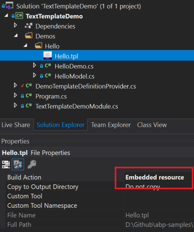
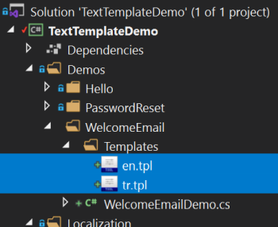
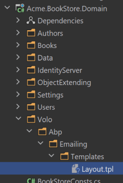

# Razor Integration

## Installation

It is suggested to use the [ABP CLI](CLI.md) to install this package.

### Using the ABP CLI

Open a command line window in the folder of the project (.csproj file) and type the following command:

````bash
abp add-package Volo.Abp.TextTemplating.Scriban
````

### Manual Installation

If you want to manually install;

1. Add the [Volo.Abp.TextTemplating.Scriban](https://www.nuget.org/packages/Volo.Abp.TextTemplating.Scriban) NuGet package to your project:

````
Install-Package Volo.Abp.TextTemplating.Scriban
````

2. Add the `AbpTextTemplatingScribanModule` to the dependency list of your module:

````csharp
[DependsOn(
    //...other dependencies
    typeof(AbpTextTemplatingScribanModule) //Add the new module dependency
    )]
public class YourModule : AbpModule
{
}
````

## Defining Templates

Before rendering a template, you should define it. Create a class inheriting from the `TemplateDefinitionProvider` base class:

````csharp
public class DemoTemplateDefinitionProvider : TemplateDefinitionProvider
{
    public override void Define(ITemplateDefinitionContext context)
    {
        context.Add(
            new TemplateDefinition("Hello") //template name: "Hello"
                .WithVirtualFilePath(
                    "/Demos/Hello/Hello.tpl", //template content path
                    isInlineLocalized: true
                )
                .WithScribanEngine()
        );
    }
}
````

* `context` object is used to add new templates or get the templates defined by depended modules. Used `context.Add(...)` to define a new template.
* `TemplateDefinition` is the class represents a template. Each template must have a unique name (that will be used while you are rendering the template).
* `/Demos/Hello/Hello.tpl` is the path of the template file.
* `isInlineLocalized` is used to declare if you are using a single template for all languages (`true`) or different templates for each language (`false`). See the Localization section below for more.
* `WithRenderEngine` method is used to set the render engine of the template.

### The Template Content

`WithVirtualFilePath` indicates that we are using the [Virtual File System](Virtual-File-System.md) to store the template content. Create a `Hello.tpl` file inside your project and mark it as "**embedded resource**" on the properties window:



Example `Hello.tpl` content is shown below:

````
Hello  :)
````

The [Virtual File System](Virtual-File-System.md) requires to add your files in the `ConfigureServices` method of your [module](Module-Development-Basics.md) class:

````csharp
Configure<AbpVirtualFileSystemOptions>(options =>
{
    options.FileSets.AddEmbedded<TextTemplateDemoModule>("TextTemplateDemo");
});
````

* `TextTemplateDemoModule` is the module class that you define your template in.
* `TextTemplateDemo` is the root namespace of your project.

## Rendering the Template

`ITemplateRenderer` service is used to render a template content.

### Example: Rendering a Simple Template

````csharp
public class HelloDemo : ITransientDependency
{
    private readonly ITemplateRenderer _templateRenderer;

    public HelloDemo(ITemplateRenderer templateRenderer)
    {
        _templateRenderer = templateRenderer;
    }

    public async Task RunAsync()
    {
        var result = await _templateRenderer.RenderAsync(
            "Hello", //the template name
            new HelloModel
            {
                Name = "John"
            }
        );

        Console.WriteLine(result);
    }
}
````

* `HelloDemo` is a simple class that injects the `ITemplateRenderer` in its constructor and uses it inside the `RunAsync` method.
* `RenderAsync` gets two fundamental parameters:
  * `templateName`: The name of the template to be rendered (`Hello` in this example).
  * `model`: An object that is used as the `model` inside the template (a `HelloModel` object in this example).

The result shown below for this example:

````csharp
Hello John :)
````

### Anonymous Model

While it is suggested to create model classes for the templates, it would be practical (and possible) to use anonymous objects for simple cases:

````csharp
var result = await _templateRenderer.RenderAsync(
    "Hello",
    new
    {
        Name = "John"
    }
);
````

In this case, we haven't created a model class, but created an anonymous object as the model.

### PascalCase vs snake_case

PascalCase property names (like `UserName`) is used as snake_case (like `user_name`) in the templates.

## Localization

It is possible to localize a template content based on the current culture. There are two types of localization options described in the following sections.

### Inline localization

Inline localization uses the [localization system](Localization.md) to localize texts inside templates.

#### Example: Reset Password Link

Assuming you need to send an email to a user to reset her/his password. Here, the template content:

````
<a title="" href=""></a>
````

`L` function is used to localize the given key based on the current user culture. You need to define the `ResetMyPassword` key inside your localization file:

````json
"ResetMyPasswordTitle": "Reset my password",
"ResetMyPassword": "Hi {0}, Click here to reset your password"
````

You also need to declare the localization resource to be used with this template, inside your template definition provider class:

````csharp
context.Add(
    new TemplateDefinition(
            "PasswordReset", //Template name
            typeof(DemoResource) //LOCALIZATION RESOURCE
        )
        .WithScribanEngine()
        .WithVirtualFilePath(
            "/Demos/PasswordReset/PasswordReset.tpl", //template content path
            isInlineLocalized: true
        )
);
````

That's all. When you render this template like that:

````csharp
var result = await _templateRenderer.RenderAsync(
    "PasswordReset", //the template name
    new PasswordResetModel
    {
        Name = "john",
        Link = "https://abp.io/example-link?userId=123&token=ABC"
    }
);
````

You will see the localized result:

````csharp
<a title="Reset my password" href="https://abp.io/example-link?userId=123&token=ABC">Hi john, Click here to reset your password</a>
````

> If you define the [default localization resource](Localization.md) for your application, then no need to declare the resource type for the template definition.

### Multiple Contents Localization

Instead of a single template that uses the localization system to localize the template, you may want to create different template files for each language. It can be needed if the template should be completely different for a specific culture rather than simple text localizations.

#### Example: Welcome Email Template

Assuming that you want to send a welcome email to your users, but want to define a completely different template based on the user culture.

First, create a folder and put your templates inside it, like `en.tpl`, `tr.tpl`... one for each culture you support:



Then add your template definition in the template definition provider class:

````csharp
context.Add(
    new TemplateDefinition(
            name: "WelcomeEmail",
            defaultCultureName: "en"
        )
        .WithScribanEngine()
        .WithVirtualFilePath(
            "/Demos/WelcomeEmail/Templates", //template content folder
            isInlineLocalized: false
        )
);
````

* Set **default culture name**, so it fallbacks to the default culture if there is no template for the desired culture.
* Specify **the template folder** rather than a single template file.
* Set `isInlineLocalized` to `false` for this case.

That's all, you can render the template for the current culture:

````csharp
var result = await _templateRenderer.RenderAsync("WelcomeEmail");
````

> Skipped the modal for this example to keep it simple, but you can use models as just explained before.

### Specify the Culture

`ITemplateRenderer` service uses the current culture (`CultureInfo.CurrentUICulture`) if not specified. If you need, you can specify the culture as the `cultureName` parameter:

````csharp
var result = await _templateRenderer.RenderAsync(
    "WelcomeEmail",
    cultureName: "en"
);
````

## Layout Templates

Layout templates are used to create shared layouts among other templates. It is similar to the layout system in the ASP.NET Core MVC / Razor Pages.

### Example: Email HTML Layout Template

For example, you may want to create a single layout for all of your email templates.

First, create a template file just like before:

````xml
<!DOCTYPE html>
<html lang="en" xmlns="http://www.w3.org/1999/xhtml">
<head>
    <meta charset="utf-8" />
</head>
<body>
    
</body>
</html>
````

* A layout template must have a **** part as a place holder for the rendered child content.

The register your template in the template definition provider:

````csharp
context.Add(
    new TemplateDefinition(
        "EmailLayout",
        isLayout: true //SET isLayout!
    )
    .WithScribanEngine()
    .WithVirtualFilePath(
        "/Demos/EmailLayout/EmailLayout.tpl",
        isInlineLocalized: true
    )
);
````

Now, you can use this template as the layout of any other template:

````csharp
context.Add(
    new TemplateDefinition(
            name: "WelcomeEmail",
            defaultCultureName: "en",
            layout: "EmailLayout" //Set the LAYOUT
        )
        .WithScribanEngine()
        .WithVirtualFilePath(
            "/Demos/WelcomeEmail/Templates",
            isInlineLocalized: false
        )
);
````

## Global Context

ABP passes the `model` that can be used to access to the model inside the template. You can pass more global variables if you need.

An example template content:

````
A global object value: 
````

This template assumes that that is a `myGlobalObject` object in the template rendering context. You can provide it like shown below:

````csharp
var result = await _templateRenderer.RenderAsync(
    "GlobalContextUsage",
    globalContext: new Dictionary<string, object>
    {
        {"myGlobalObject", "TEST VALUE"}
    }
);
````

The rendering result will be:

````
A global object value: TEST VALUE
````

## Replacing the Existing Templates

It is possible to replace a template defined by a module that used in your application. In this way, you can customize the templates based on your requirements without changing the module code.

### Option-1: Using the Virtual File System

The [Virtual File System](Virtual-File-System.md) allows you to override any file by placing the same file into the same path in your project.

#### Example: Replace the Standard Email Layout Template

ABP Framework provides an [email sending system](Emailing.md) that internally uses the text templating to render the email content. It defines a standard email layout template in the `/Volo/Abp/Emailing/Templates/Layout.tpl` path. The unique name of the template is `Abp.StandardEmailTemplates.Layout` and this string is defined as a constant on the `Volo.Abp.Emailing.Templates.StandardEmailTemplates` static class.

Do the following steps to replace the template file with your own;

**1)** Add a new file into the same location (`/Volo/Abp/Emailing/Templates/Layout.tpl`) in your project:



**2)** Prepare your email layout template:

````html
<!DOCTYPE html>
<html lang="en" xmlns="http://www.w3.org/1999/xhtml">
<head>
    <meta charset="utf-8" />
</head>
<body>
    <h1>This my header</h1>

    

    <footer>
      This is my footer...
    </footer>
</body>
</html>
````

This example simply adds a header and footer to the template and renders the content between them (see the *Layout Templates* section above to understand it).

**3)** Configure the embedded resources in the `.csproj` file

* Add [Microsoft.Extensions.FileProviders.Embedded](https://www.nuget.org/packages/Microsoft.Extensions.FileProviders.Embedded) NuGet package to the project.
* Add `<GenerateEmbeddedFilesManifest>true</GenerateEmbeddedFilesManifest>` into the `<PropertyGroup>...</PropertyGroup>` section of your `.csproj` file.
* Add the following code into your `.csproj` file:

````xml
<ItemGroup>
  <None Remove="Volo\Abp\Emailing\Templates\*.tpl" />
  <EmbeddedResource Include="Volo\Abp\Emailing\Templates\*.tpl" />
</ItemGroup>
````

This makes the template files "embedded resource".

**4)** Configure the virtual file system

Configure the `AbpVirtualFileSystemOptions` in the `ConfigureServices` method of your [module](Module-Development-Basics.md) to add the embedded files into the virtual file system:

```csharp
Configure<AbpVirtualFileSystemOptions>(options =>
{
    options.FileSets.AddEmbedded<BookStoreDomainModule>();
});
```

`BookStoreDomainModule` should be your module name, in this example code.

> Be sure that your module (directly or indirectly) [depends on](Module-Development-Basics.md) the `AbpEmailingModule`. Because the VFS can override files based on the dependency order.

Now, your template will be used when you want to render the email layout template.

### Option-2: Using the Template Definition Provider

You can create a template definition provider class that gets the email layout template and changes the virtual file path for the template.

**Example: Use the `/MyTemplates/EmailLayout.tpl` file instead of the standard template**

```csharp
using Volo.Abp.DependencyInjection;
using Volo.Abp.Emailing.Templates;
using Volo.Abp.TextTemplating;

namespace MyProject
{
    public class MyTemplateDefinitionProvider
        : TemplateDefinitionProvider, ITransientDependency
    {
        public override void Define(ITemplateDefinitionContext context)
        {
            var emailLayoutTemplate = context.GetOrNull(StandardEmailTemplates.Layout);

            emailLayoutTemplate
                .WithVirtualFilePath(
                    "/MyTemplates/EmailLayout.tpl",
                    isInlineLocalized: true
                );
        }
    }
}
```

You should still add the file `/MyTemplates/EmailLayout.tpl` to the virtual file system as explained before. This approach allows you to locate templates in any folder instead of the folder defined by the depended module.

Beside the template content, you can manipulate the template definition properties, like `DisplayName`, `Layout` or `LocalizationSource`.

## Advanced Features

This section covers some internals and more advanced usages of the text templating system.

### Template Content Provider

`ITemplateRenderer` is used to render the template, which is what you want for most of the cases. However, you can use the `ITemplateContentProvider` to get the raw (not rendered) template contents.

> `ITemplateContentProvider` is internally used by the `ITemplateRenderer` to get the raw template contents.

Example:

````csharp
public class TemplateContentDemo : ITransientDependency
{
    private readonly ITemplateContentProvider _templateContentProvider;

    public TemplateContentDemo(ITemplateContentProvider templateContentProvider)
    {
        _templateContentProvider = templateContentProvider;
    }

    public async Task RunAsync()
    {
        var result = await _templateContentProvider
            .GetContentOrNullAsync("Hello");

        Console.WriteLine(result);
    }
}
````

The result will be the raw template content:

````
Hello  :)
````

* `GetContentOrNullAsync` returns `null` if no content defined for the requested template.
* It can get a `cultureName` parameter that is used if template has different files for different cultures (see Multiple Contents Localization section above).

### Template Content Contributor

`ITemplateContentProvider` service uses `ITemplateContentContributor` implementations to find template contents. There is a single pre-implemented content contributor, `VirtualFileTemplateContentContributor`, which gets template contents from the virtual file system as described above.

You can implement the `ITemplateContentContributor` to read raw template contents from another source.

Example:

````csharp
public class MyTemplateContentProvider
    : ITemplateContentContributor, ITransientDependency
{
    public async Task<string> GetOrNullAsync(TemplateContentContributorContext context)
    {
        var templateName = context.TemplateDefinition.Name;

        //TODO: Try to find content from another source
        return null;
    }
}

````

Return `null` if your source can not find the content, so `ITemplateContentProvider` fallbacks to the next contributor.

### Template Definition Manager

`ITemplateDefinitionManager` service can be used to get the template definitions (created by the template definition providers).

## See Also

* [The source code of the sample application](https://github.com/abpframework/abp-samples/tree/master/TextTemplateDemo) developed and referred through this document.
* [Localization system](Localization.md).
* [Virtual File System](Virtual-File-System.md).
