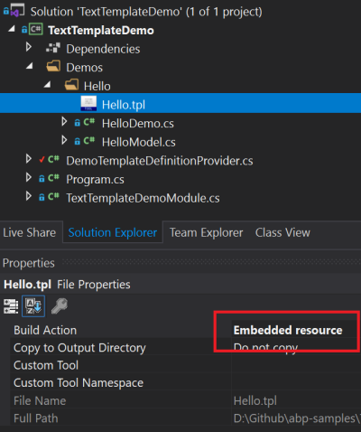

# Text Templating

## Introduction

ABP Framework provides a simple, yet efficient text template system. Text templating is used to dynamically render contents based on a template and a model (a data object):

TEMPLATE + MODEL => RENDERED CONTENT

It is very similar to an ASP.NET Core Razor View (or Page):

RAZOR VIEW (or PAGE) + MODEL => HTML CONTENT

You can use the rendered output for any purpose, like sending emails or preparing some reports.

### Example

Here, a simple template:

````
Hello {{model.name}} :)
````

You can define a class with a `Name` property to render this template:

````csharp
public class HelloModel
{
    public string Name { get; set; }
}
````

If you render the template with a `HelloModel` with the `Name` is `John`, the rendered output is will be:

````
Hello John :)
````

Template rendering engine is very powerful;

* It is based on the [Scriban](https://github.com/lunet-io/scriban) library, so it supports **conditional logics**, **loops** and much more.
* Template content **can be localized**.
* You can define **layout templates** to be used as the layout while rendering other templates.
* You can pass arbitrary objects to the template context (beside the model) for advanced scenarios.

## Installation

It is suggested to use the [ABP CLI](CLI.md) to install this package.

### Using the ABP CLI

Open a command line window in the folder of the project (.csproj file) and type the following command:

````bash
abp add-package Volo.Abp.TextTemplating
````

### Manual Installation

If you want to manually install;

1. Add the [Volo.Abp.TextTemplating](https://www.nuget.org/packages/Volo.Abp.TextTemplating) NuGet package to your project:

````
Install-Package Volo.Abp.TextTemplating
````

2. Add the `AbpTextTemplatingModule` to the dependency list of your module:

````csharp
[DependsOn(
    //...other dependencies
    typeof(AbpTextTemplatingModule) //Add the new module dependency
    )]
public class YourModule : AbpModule
{
}
````

## Defining Templates

Before rendering a template, you should define it. Create a class inheriting from the `TemplateDefinitionProvider` base class:

````csharp
public class DemoTemplateDefinitionProvider : TemplateDefinitionProvider
{
    public override void Define(ITemplateDefinitionContext context)
    {
        context.Add(
            new TemplateDefinition("Hello") //template name: "Hello"
                .WithVirtualFilePath(
                    "/Demos/Hello/Hello.tpl", //template content path
                    isInlineLocalized: true
                )
        );
    }
}
````

* `context` object is used to add new templates or get the templates defined by depended modules. Used `context.Add(...)` to define a new template.
* `TemplateDefinition` is the class represents a template. Each template must have a unique name (that will be used while you are rendering the template).
* `/Demos/Hello/Hello.tpl` is the path of the template file.
* `isInlineLocalized` is used to declare if you are using a single template for all languages (`true`) or different templates for each language (`false`). See the Localization section below for more.

### The Template Content

`WithVirtualFilePath` indicates that we are using the [Virtual File System](Virtual-File-System.md) to store the template content. Create a `Hello.tpl` file inside your project and mark it as "**embedded resource**" on the properties window:



Example `Hello.tpl` content is shown below:

````
Hello {{model.name}} :)
````

The [Virtual File System](Virtual-File-System.md) requires to add your files in the `ConfigureServices` method of your [module](Module-Development-Basics.md) class:

````csharp
Configure<AbpVirtualFileSystemOptions>(options =>
{
    options.FileSets.AddEmbedded<TextTemplateDemoModule>("TextTemplateDemo");
});
````

* `TextTemplateDemoModule` is the module class that you define your template in.
* `TextTemplateDemo` is the root namespace of your project.

## Rendering the Template

`ITemplateRenderer` service is used to render a template content.

### Example: Rendering a Simple Template

````csharp
public class HelloDemo : ITransientDependency
{
    private readonly ITemplateRenderer _templateRenderer;

    public HelloDemo(ITemplateRenderer templateRenderer)
    {
        _templateRenderer = templateRenderer;
    }

    public async Task RunAsync()
    {
        var result = await _templateRenderer.RenderAsync(
            "Hello", //the template name
            new HelloModel
            {
                Name = "John"
            }
        );

        Console.WriteLine(result);
    }
}
````

* `HelloDemo` is a simple class that injects the `ITemplateRenderer` in its constructor and uses it inside the `RunAsync` method.
* `RenderAsync` gets two fundamental parameters:
  * `templateName`: The name of the template to be rendered (`Hello` in this example).
  * `model`: An object that is used as the `model` inside the template (a `HelloModel` object in this example).

The result shown below for this example:

````csharp
Hello John :)
````

### Anonymous Model

While it is suggested to create model classes for the templates, it would be practical (and possible) to use anonymous objects for simple cases:

````csharp
var result = await _templateRenderer.RenderAsync(
    "Hello",
    new
    {
        Name = "John"
    }
);
````

In this case, we haven't created a model class, but created an anonymous object as the model.

### PascalCase vs camelCase

PascalCase property names (like `UserName`) is used as camelCase (like `userName`) in the templates.

## Localization

It is possible to localize a template content based on the current culture. There are two types of localization options described in the following sections.

### Inline localization

Inline localization uses the [localization system](Localization.md) to localize texts inside templates.

#### Example: Reset Password Link

Assuming you need to send an email to a user to reset her/his password. Here, the template content:

````
<a href="{{model.link}}">{{L "ResetMyPassword"}}</a>
````

`L` function is used to localize the given key based on the current user culture. You need to define the `ResetMyPassword` key inside your localization file:

````json
"ResetMyPassword": "Click here to reset your password"
````

You also need to declare the localization resource to be used with this template, inside your template definition provider class:

````csharp
context.Add(
    new TemplateDefinition(
            "PasswordReset", //Template name
            typeof(DemoResource) //LOCALIZATION RESOURCE
        ).WithVirtualFilePath(
            "/Demos/PasswordReset/PasswordReset.tpl", //template content path
            isInlineLocalized: true
        )
);
````

That's all. When you render this template like that:

````csharp
var result = await _templateRenderer.RenderAsync(
    "PasswordReset", //the template name
    new PasswordResetModel
    {
        Link = "https://abp.io/example-link?userId=123&token=ABC"
    }
);
````

You will see the localized result:

````csharp
<a href="https://abp.io/example-link?userId=123&token=ABC">Click here to reset your password</a>
````

> If you define the [default localization resource](Localization.md) for your application, then no need to declare the resource type for the template definition.

### Multiple Contents Localization

Instead of a single template that uses the localization system to localize the template, you may want to create different template files for each language. It can be needed if the template should be completely different for a specific culture rather than simple text localizations.

#### Example: Welcome Email Template

Assuming that you want to send a welcome email to your users, but want to define a completely different template based on the user culture.

First, create a folder and put your templates inside it, like `en.tpl`, `tr.tpl`... one for each culture you support:


Then add your template definition in the template definition provider class:

````csharp
context.Add(
    new TemplateDefinition(
            name: "WelcomeEmail",
            defaultCultureName: "en"
        )
        .WithVirtualFilePath(
            "/Demos/WelcomeEmail/Templates", //template content folder
            isInlineLocalized: false
        )
);
````

* Set **default culture name**, so it fallbacks to the default culture if there is no template for the desired culture.
* Specify **the template folder** rather than a single template file.
* Set `isInlineLocalized` to `false` for this case.

That's all, you can render the template for the current culture:

````csharp
var result = await _templateRenderer.RenderAsync("WelcomeEmail");
````

> Skipped the modal for this example to keep it simple, but you can use models as just explained before.

### Specify the Culture

`ITemplateRenderer` service uses the current culture (`CultureInfo.CurrentUICulture`) if not specified. If you need, you can specify the culture as the `cultureName` parameter:

````csharp
var result = await _templateRenderer.RenderAsync(
    "WelcomeEmail",
    cultureName: "en"
);
````

## Layout Templates

Layout templates are used to create shared layouts among other templates. It is similar to the layout system in the ASP.NET Core MVC / Razor Pages.

### Example: Email HTML Layout Template

For example, you may want to create a single layout for all of your email templates.

First, create a template file just like before:

````xml
<!DOCTYPE html>
<html lang="en" xmlns="http://www.w3.org/1999/xhtml">
<head>
    <meta charset="utf-8" />
</head>
<body>
    {{content}}
</body>
</html>
````

* A layout template must have a **{{content}}** part as a place holder for the rendered child content.

The register your template in the template definition provider:

````csharp
context.Add(
    new TemplateDefinition(
        "EmailLayout",
        isLayout: true //SET isLayout!
    ).WithVirtualFilePath(
        "/Demos/EmailLayout/EmailLayout.tpl",
        isInlineLocalized: true
    )
);
````

Now, you can use this template as the layout of any other template:

````csharp
context.Add(
    new TemplateDefinition(
            name: "WelcomeEmail",
            defaultCultureName: "en",
            layout: "EmailLayout" //Set the LAYOUT
        ).WithVirtualFilePath(
            "/Demos/WelcomeEmail/Templates",
            isInlineLocalized: false
        )
);
````

## Global Context

ABP passes the `model` that can be used to access to the model inside the template. You can pass more global variables if you need.

An example template content:

````
A global object value: {{myGlobalObject}}
````

This template assumes that that is a `myGlobalObject` object in the template rendering context. You can provide it like shown below:

````csharp
var result = await _templateRenderer.RenderAsync(
    "GlobalContextUsage",
    globalContext: new Dictionary<string, object>
    {
        {"myGlobalObject", "TEST VALUE"}
    }
);
````

The rendering result will be:

````
A global object value: TEST VALUE
````


## Template Content Provider

When you want to get your stored template content you can use `ITemplateContentProvider`. 

`ITemplateContentProvider` has one method that named `GetContentOrNullAsync` with two different overriding, and it returns you a string of template content or null. (**without rendering**)

- `templateName` (_string_) or `templateDefinition` (_`TemplateDefinition`_)
- `cultureName` (_string_)
- `tryDefaults` (_bool_)
- `useCurrentCultureIfCultureNameIsNull` (_bool_)

### Usage

First parametres of `GetContentOrNullAsync` (`templateName` or `templateDefinition`) are required, the other three parametres can be null.

If you want to get exact culture content, set `tryDefaults` and `useCurrentCultureIfCultureNameIsNull` as a `false`. Because the `GetContentOrNullAsync` tries to return content of template.

> Example Scenario

> If you have a template content that culture "`es`", when you try to get template content with "`es-MX`" it will try to return first "`es-MX`", if it fails it will return "`es`" content. If you set `tryDefaults` and `useCurrentCultureIfCultureNameIsNull` as `false` it will return `null`.

## Template Definition Manager

When you want to get your `Template Definitions`, you can use a singleton service that named `Template Definition Manager` in runtime.

To use it, inject `ITemplateDefinitionManager` service. 

It has three method that you can get your Template Definitions.

- `Get`
- `GetOrNull`
- `GetAll`

`Get` and `GetOrNull` requires a string parameter that name of template definition. `Get` will throw error when it is not exist but `GetOrNull` returns `null`.

`GetAll` returns you all registered template definitions.

## Template Content Contributor

You can store your `Template Contents` in any resource. To make it, just create a class that implements `ITemplateContentContributor` interface. 

`ITemplateContentContributor` has a one method that named `GetOrNullAsync`. This method must return content **without rendering** if that is exist in your resource or must return `null`. 