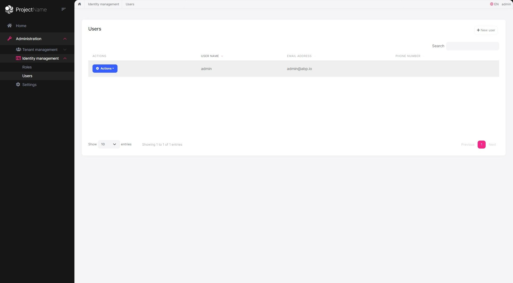

# The Official Themes
ABP Framework provides a complete UI theming system. While you can build your own themes, you can use the following pre-built themes freely in your applications.

## The Basic Theme
The Basic Theme is a minimalist theme that doesn't add any styling on top of the plain [Bootstrap](https://getbootstrap.com/) styles. You can take the Basic Theme as the base theme and build your own theme or styling on top of it. Here, a screenshot from the theme:

### Documentation

- [Basic Theme - MVC UI](../UI/AspNetCore/Basic-Theme.md)
- [Basic Theme - Blazor UI](../UI/Blazor/Basic-Theme.md)
- [Basic Theme - Angular UI](../UI/Angular/Basic-Theme.md)

## The LeptonX Lite Theme
**LeptonX Lite** is the free version of the [LeptonX Theme](https://x.leptontheme.com/), which is a part of the ABP Commercial. Here, a screenshot from the theme:

### Documentation

- [LeptonX Lite - MVC UI](LeptonXLite/AspNetCore.md)
- [LeptonX Lite - Blazor UI](LeptonXLite/Blazor.md)
- [LeptonX Lite - Angular UI](LeptonXLite/Angular.md)

## See Also

* [Theming - MVC UI](../UI/AspNetCore/Theming.md)
* [Theming - Blazor UI](../UI/Blazor/Theming.md)
* [Theming - Angular UI](../UI/Angular/Theming.md)