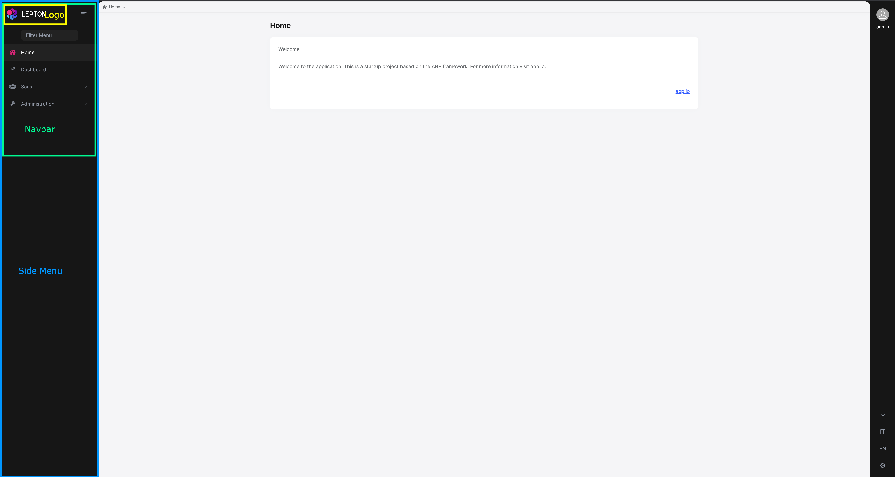
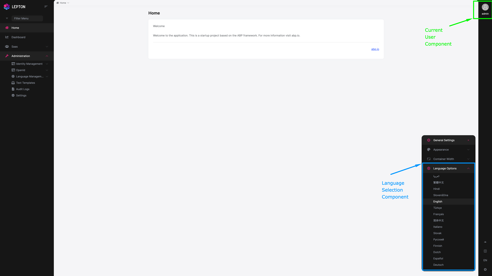

# How to replace LeptonX components in Angular

LeptonX uses the Replaceable Component System of ABP. For more information, please see [Component Replacement](https://docs.abp.io/en/abp/latest/UI/Angular/Component-Replacement).

## Components

It is the list of the  Replaceable Component of LeptonX. You can change the components with your component.

```typescript
export const enum eThemeLeptonXComponents {
  AccountLayout = 'Theme.AccountLayoutComponent',
  ApplicationLayout = 'Theme.ApplicationLayoutComponent',
  ApplicationLayoutHeader = 'Theme.ApplicationLayoutHeaderComponent',
  ApplicationLayoutFooter = 'Theme.ApplicationLayoutFooterComponent',
  CurrentUser = 'Theme.CurrentUserComponent',
  CurrentUserImage = 'Theme.CurrentUserImageComponent',
  EmptyLayout = 'Theme.EmptyLayoutComponent',
  FullScreen = 'Theme.FullScreenComponent',
  Languages = 'Theme.LanguagesComponent',
  Logo = 'Theme.LogoComponent',
  Routes = 'Theme.RoutesComponent',
  Navbar = 'Theme.NavbarComponent',
  NavbarMobile = 'Theme.NavbarMobileComponent',
  NavItems = 'Theme.NavItemsComponent',
  Sidebar = 'Theme.Sidebar',
}
```

### Account Layout

If you want to use Account-Layout, your project must use 'resource owner flow.' Otherwise, it will redirect to the server-side login page. Please see [Resource Owner Password Flow](https://docs.abp.io/en/abp/latest/UI/Angular/Authorization#resource-owner-password-flow).


### ApplicationLayout





