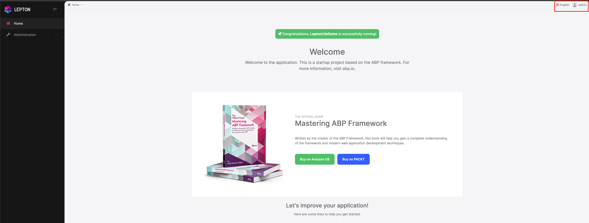

# LeptonX Lite Angular UI

LeptonX Lite has implementation for the ABP Framework Angular Client. It's a simplified variation of the [LeptonX Theme](https://x.leptontheme.com/).

> If you are looking for a professional, enterprise ready theme, you can check the [LeptonX Theme](https://x.leptontheme.com/), which is a part of [ABP Commercial](https://commercial.abp.io/).

> See the [Theming document](https://docs.abp.io/en/abp/latest/UI/AspNetCore/Theming) to learn about themes.

## Installation

This theme is **already installed** when you create a new solution using the startup templates. If you are using any other template, you can install this theme by following the steps below:

To add `LeptonX-lite` into your project,

- Install `@abp/ng.theme.lepton-x`

```bash
yarn add @abp/ng.theme.lepton-x
```

- Install `bootstrap-icons`

```bash
yarn add bootstrap-icons
```

- Then, we need to edit the styles array in `angular.json` to replace the existing style with the new one in the following link : 

* [Styles - Angular UI](../../UI/Angular/Theme-Configurations.md)

Add the following style

```json
"node_modules/bootstrap-icons/font/bootstrap-icons.css",
```

- Finally, remove `ThemeBasicModule` from `app.module.ts`, and import the related modules in `app.module.ts`

```js
import { ThemeLeptonXModule } from "@abp/ng.theme.lepton-x";
import { SideMenuLayoutModule } from "@abp/ng.theme.lepton-x/layouts";

@NgModule({
  imports: [
    // ...

    // do not forget to remove ThemeBasicModule
    //  ThemeBasicModule.forRoot(),
    ThemeLeptonXModule.forRoot(),
    SideMenuLayoutModule.forRoot(),
  ],
  // ...
})
export class AppModule {}
```

Note: If you employ [Resource Owner Password Flow](https://docs.abp.io/en/abp/latest/UI/Angular/Authorization#resource-owner-password-flow) for authorization, you should import the following module as well:

```js
import { AccountLayoutModule } from "@abp/ng.theme.lepton-x/account";

@NgModule({
  // ...
  imports: [
    // ...
    AccountLayoutModule.forRoot(),
    // ...
  ],
  // ...
})
export class AppModule {}
```

To change the logos and brand color of `LeptonX`, simply add the following CSS to the `styles.scss`

```css
:root {
  --lpx-logo: url("/assets/images/logo.png");
  --lpx-logo-icon: url("/assets/images/logo-icon.png");
  --lpx-brand: #edae53;
}
```

- `--lpx-logo` is used to place the logo in the menu.
- `--lpx-logo-icon` is a square icon used when the menu is collapsed.
- `--lpx-brand` is a color used throughout the application, especially on active elements.

### Server Side

In order to migrate to LeptonX on your server side projects (Host and/or AuthServer projects), please follow the [Server Side Migration](AspNetCore.md) document.

## Customization

### Layouts

The Angular version of LeptonX Lite provides **layout components** for your **user interface** on [ABP Framework Theming](https://docs.abp.io/en/abp/latest/UI/Angular/Theming). You can use the layouts to **organize your user interface**. You can replace the **layout components** and some parts of the **layout components** with the [ABP replaceable component system](https://docs.abp.io/en/abp/latest/UI/Angular/Component-Replacement).

The main responsibility of a theme is to **provide** the layouts. There are **three pre-defined layouts that must be implemented by all the themes:**

- **ApplicationLayoutComponent:** The **default** layout which is used by the **main** application pages.
- **AccountLayoutComponent:** Mostly used by the **account module** for **login**, **register**, **forgot password**... pages.
- **EmptyLayoutComponent:** The **Minimal** layout that **has no layout components** at all.

The **Layout components** and all the replacable components are predefined in `eThemeLeptonXComponents` as enum.

### How to replace a component

```js
import { ReplaceableComponentsService } from '@abp/ng.core'; // imported ReplaceableComponentsService
import { eIdentityComponents } from '@abp/ng.identity'; // imported eIdentityComponents enum
import { eThemeLeptonXComponents } from '@abp/ng.theme.lepton-x';   // imported eThemeLeptonXComponents enum

//...

@Component(/* component metadata */)
export class AppComponent {
  constructor(
    private replaceableComponents: ReplaceableComponentsService, // injected the service
  ) {
    this.replaceableComponents.add({
      component: YourNewApplicationLayoutComponent,
      key: eThemeLeptonXComponents.ApplicationLayout,
    });
  }
}
```

See the [Component Replacement](https://docs.abp.io/en/abp/latest/UI/Angular/Component-Replacement) documentation for more information on how to replace components.

### Brand Component

The **brand component** is a simple component that can be used to display your brand. It contains a **logo** and a **company name**. You can change the logo via css but if you want to change logo component, the key is `eThemeLeptonXComponents.Logo`

```js
///...
this.replaceableComponents.add({
  component: YourNewLogoComponent,
  key: eThemeLeptonXComponents.Logo,
});
///...
```


## Breadcrumb Component

On websites that have a lot of pages, **breadcrumb navigation** can greatly **enhance the way users find their way** around. In terms of **usability**, breadcrumbs reduce the number of actions a website **visitor** needs to take in order to get to a **higher-level page**, and they **improve** the **findability** of **website sections** and **pages**.

```js
///...
this.replaceableComponents.add({
  component: YourNewSidebarComponent,
  key: eThemeLeptonXComponents.Breadcrumb,
});
///...
```


## Sidebar Menu Component

Sidebar menus have been used as a **directory for Related Pages** to a **Service** offering, **Navigation** items to a **specific service** or topic and even just as **Links** the user may be interested in.

```js
///...
this.replaceableComponents.add({
  component: YourNewSidebarComponent,
  key: eThemeLeptonXComponents.Sidebar,
});
///...
```


## Page Alerts Component

Provides contextual **feedback messages** for typical user actions with a handful of **available** and **flexible** **alert messages**. Alerts are available for any length of text, as well as an **optional dismiss button**.


```js
///...
this.replaceableComponents.add({
  component: YourNewPageAlertContainerComponent,
  key: eThemeLeptonXComponents.PageAlertContainer,
});
///...
```

## Toolbar Component



Toolbar items are used to add **extra functionality to the toolbar**. The toolbar is a **horizontal bar** that **contains** a group of **toolbar items**.

```js
///...
this.replaceableComponents.add({
  component: YourNewNavItemsComponent,
  key: eThemeLeptonXComponents.NavItems,
});
///...
```

## Toolbar Items

There are two parts to the toolbar. The first is Language-Switch. The second is the User-Profile element. You can swap out each of these parts individually.

## Language Switch Component

Think about a **multi-lingual** website and the first thing that could **hit your mind** is **the language switch component**. A **navigation bar** is a **great place** to **embed a language switch**. By embedding the language switch in the navigation bar of your website, you would **make it simpler** for users to **find it** and **easily** switch the **language** <u>**without trying to locate it across the website.**</u>


```js
///...
this.replaceableComponents.add({
  component: YourNewLanguagesComponent,
  key: eThemeLeptonXComponents.Languages,
});
///...
```

## User Menu Component

The **User Menu** is the **menu** that **drops down** when you **click your name** or **profile picture** in the **upper right corner** of your page (**in the toolbar**). It drops down options such as **Settings**, **Logout**, etc.


```js
///...
this.replaceableComponents.add({
  component: YourNewCurrentUserComponent,
  key: eThemeLeptonXComponents.CurrentUser,
});
///...
```

Note: The language selection component in the Volo app is not replaceable. It is part of the settings menu.

## Mobile Navbar Component

The **mobile navbar component** is used to display the **navbar menu on mobile devices**. The mobile navbar component is a **dropdown menu** that contains language selection and user menu.


```js
///...
this.replaceableComponents.add({
  component: YourNewMobileNavbarComponent,
  key: eThemeLeptonXComponents.MobileNavbar,
});
///...
```

## Mobile Navbar Items.

There are two parts of the mobile navbar. The mobile navbar has Language-Switch and User-Profile. You can swap out each of these parts individually.

The Mobile language-Selection component key is `eThemeLeptonXComponents.MobileLanguageSelection`.

The Mobile User-Profile component key is `eThemeLeptonXComponents.MobileUserProfile`.

## Footer Component


The Footer is the section of content at the very bottom of the site. This section of the content can be modified.
Inject **FooterLinksService** and use the **setFooterInfo** method of **FooterLinksService** 
to assign path or link and description.
**descUrl** and **footerLinks** are nullable. Constant **footerLinks** are on the right side of footer. 


```js
///...

const footerLinks = [
  {
    link: "/components/bootstrap/badge",
    text: "Manage Your Profile",
  },
  {
    link: "/components/bootstrap/border",
    text: "My Security Logs",
  },
];

const footerInfo: FooterNav = {
  desc: "Home",
  descUrl: "/components/home",
  footerLinks: footerLinks,
};

this.footerLinksService.setFooterInfo(footerInfo);

///...
```
If you want to change the footer component, the key is `eThemeLeptonXComponents.Footer`

```js
///...
this.replaceableComponents.add({
  component: YourNewFooterComponent,
  key: eThemeLeptonXComponents.Footer,
});
///...
```


