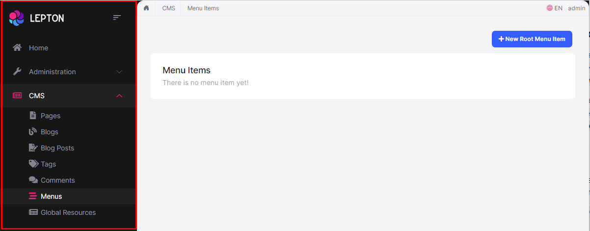

# LeptonX Lite MVC UI
LeptonX Lite has implementation for the ABP Framework Razor Pages. It's a simplified variation of the [LeptonX Theme](https://x.leptontheme.com/).

>   If you are looking for a professional, enterprise ready theme, you can check the [LeptonX Theme](https://x.leptontheme.com/), which is a part of [ABP Commercial](https://commercial.abp.io/).

> See the [Theming document](https://docs.abp.io/en/abp/latest/UI/AspNetCore/Theming) to learn about themes.

## Installation

This theme is **already installed** when you create a new solution using the startup templates. If you are using any other template, you can install this theme by following the steps below:

- Add the **Volo.Abp.AspNetCore.Mvc.UI.Theme.LeptonXLite** package to your **Web** application.

```bash
dotnet add package Volo.Abp.AspNetCore.Mvc.UI.Theme.LeptonXLite --prerelease
```

- Remove the **Volo.Abp.AspNetCore.Mvc.UI.Theme.Basic** reference from the project since it's not necessary after switching to LeptonX Lite.

- Make sure the old theme is removed and LeptonX is added in your Module class.

```diff
[DependsOn(
     // Remove the BasicTheme module from DependsOn attribute
-    typeof(AbpAspNetCoreMvcUiBasicThemeModule),
     
     // Add the LeptonX Lite module to DependsOn attribute
+    typeof(AbpAspNetCoreMvcUiLeptonXLiteThemeModule),
)]
```

- Replace `BasicThemeBundles` with `LeptonXLiteThemeBundles` in AbpBundlingOptions

```diff
Configure<AbpBundlingOptions>(options =>
{
    options.StyleBundles.Configure(
        // Remove the following line
-       BasicThemeBundles.Styles.Global,
        // Add the following line instead
+       LeptonXLiteThemeBundles.Styles.Global
        bundle =>
        {
            bundle.AddFiles("/global-styles.css");
        }
    );
});
```

## Customization

### Layouts

LeptonX Lite Mvc provides **layouts** for your **user interface** based [ABP Framework Theming](https://docs.abp.io/en/abp/latest/UI/AspNetCore/Theming). You can use **layouts** to **organize your user interface**. 

The main responsibility of a theme is to **provide** the layouts. There are **three pre-defined layouts that must be implemented by all the themes:**

* **Application:** The **default** layout which is used by the **main** application pages.
  
* **Account:** Mostly used by the **account module** for **login**, **register**, **forgot password**... pages.
  
* **Empty:** The **Minimal** layout that **has no layout components** at all.

**Layout names** are **constants** defined in the `LeptonXLiteTheme` class in the **Mvc** project **root**.

> The layout pages define under the `Themes/LeptonXLite/Layouts` folder and you can **override it** by creating a file with the **same name** and **under** the **same folder**. 

### Toolbars
LeptonX Lite includes separeted toolbars for desktop & mobile. You can manage toolbars independently. Toolbar names can be accessible in the **LeptonXLiteToolbars** class.

- `LeptonXLiteToolbars.Main`
- `LeptonXLiteToolbars.MainMobile`

```csharp
public class MyProjectNameMainToolbarContributor : IToolbarContributor
{
    public async Task ConfigureToolbarAsync(IToolbarConfigurationContext context)
    {
        if (context.Toolbar.Name == LeptonXLiteToolbars.Main)
        {
            context.Toolbar.Items.Add(new ToolbarItem(typeof(MyDesktopComponent)));
        }

        if (context.Toolbar.Name == LeptonXLiteToolbars.MainMobile)
        {
            context.Toolbar.Items.Add(new ToolbarItem(typeof(MyMobileComponent)));
        }
    }
}
```
# LeptonX Lite Mvc Components

Abp **helps** you make **highly customizable UI**. You can easily **customize** your themes to fit your needs. **The Virtual File System** makes it possible to **manage files** that **do not physically** exist on the **file system** (disk). It's mainly used to embed **(js, css, image..)** files into assemblies and **use them like** physical files at runtime. An application (or another module) can **override** a **virtual file of a module** just like placing a file with the **same name** and **extension** into the **same folder** of the **virtual file**.

LeptonX Lite is built on the [Abp Framework](https://abp.io/), so you can **easily** customize your Asp.Net Core Mvc user interface by following [Abp Mvc UI Customization](https://docs.abp.io/en/abp/latest/UI/AspNetCore/Customization-xUser-Interface).

## Brand Component

The **brand component** is a simple component that can be used to display your brand. It contains a **logo** and a **company name**.

 

### How to override the Brand Component in LeptonX Lite Mvc

* The **brand component page (.cshtml file)** is defined in the `Themes/LeptonXLite/Components/Brand/Default.cshtml` file and you can **override it** by creating a file with the **same name** and **under** the **same folder**.  

* The **brand component (C# file)** is defined in the `Themes/LeptonXLite/Components/Brand/MainNavbarBrandViewComponent.cs` file and you can **override it** by creating a file with the **same name** and under the **same folder**.  

## Breadcrumb Component

On websites that have a lot of pages, **breadcrumb navigation** can greatly **enhance the way users find their way** around. In terms of **usability**, breadcrumbs reduce the number of actions a website **visitor** needs to take in order to get to a **higher-level page**, and they **improve** the **findability** of **website sections** and **pages**.

 

### How to override the Breadcrumb Component in LeptonX Lite Mvc

* The **breadcrumb component page (.cshtml file)** is defined in the `Themes/LeptonXLite/Components/Breadcrumbs/Default.cshtml` file and you can **override it** by creating a file with the **same name** and **under** the **same folder**.  

* The **breadcrumb component (C# file)** is defined in the `Themes/LeptonXLite/Components/Breadcrumbs/BreadcrumbsViewComponent.cs` file and you can **override it** by creating a file with the **same name** and **under** the **same folder**. 

## Sidebar Menu Component

Sidebar menus have been used as **a directory for Related Pages** to a **Service** offering, **Navigation** items to a **specific service** or topic and even just as **Links** the user may be interested in.

 

### How to override the Sidebar Menu Component in LeptonX Lite Mvc

* **Sidebar menu page (.cshtml)** is defined in the `Themes/LeptonXLite/Components/Menu/Default.cshtml` file and you can **override it** by creating a file with the **same name** and **under** the **same folder**. 

* If you want to **override the menu component (C#)** you can override the `Themes/LeptonXLite/Components/Menu/MainMenuViewComponent.cs` file and you can **override it** by creating a file with the **same name** and **under** the **same folder**. 

> The **sidebar menu** renders menu items **dynamically**. The **menu item** is a **partial view** and is defined in the `Themes/LeptonXLite/Components/Menu/_MenuItem.cshtml` file and you can **override it** by creating a file with the **same name** and **under** the **same folder**. 

## Page Alerts Component

Provides contextual **feedback messages** for typical user actions with the handful of **available** and **flexible** **alert messages**. Alerts are available for any length of text, as well as an **optional dismiss button**. 

 

### How to override the Page Alerts Component in LeptonX Lite Mvc

* The **page alerts component page (.cshtml file)** is defined in the `Themes/LeptonXLite/Components/PageAlerts/Default.cshtml` file and you can **override it** by creating a file with the **same name** and **under** the **same folder**.

* The **page alerts component (C#)** is defined in the `Themes/LeptonXLite/Components/PageAlerts/PageAlertsViewComponent.cs` file and you can **override it** by creating a file with the **same name** and **under** the **same folder**.

## Toolbar Component

Toolbar items are used to add **extra functionality to the toolbar**. The toolbar is a **horizontal bar** that **contains** a group of **toolbar items**. 

### How to override the Toolbar Component in LeptonX Lite Mvc

* The **toolbar component page (.cshtml file)** is defined in the `Themes/LeptonXLite/Components/Toolbar/Default.cshtml` file and you can **override it** by creating a file with the **same name** and **under** the **same folder**.

* The **toolbar component (C#)** is defined in the `Themes/LeptonXLite/Components/Toolbar/ToolbarViewComponent.cs` file and you can **override it** by creating a file with the **same name** and **under** the **same folder**.

## Toolbar Item Component

The toolbar item is a **single item** that **contains** a **link**, an **icon**, a **label** etc..

### How to override the Toolbar Item Component in LeptonX Lite Mvc

* The **toolbar item component page (.cshtml file)** is defined in the `Themes/LeptonXLite/Components/ToolbarItems/Default.cshtml` file and you can **override it** by creating a file with the **same name** and **under** the **same folder**.

* The **toolbar item component (C#)** is defined in the `Themes/LeptonXLite/Components/ToolbarItems/ToolbarItemsViewComponent.cs` file and you can **override it** by creating a file with the **same name** and **under** the **same folder**.

You can find the toolbar components below:

## Language Switch Component

Think about a **multi-lingual** website and the first thing that could **hit your mind** is **the language switch component**. A **navigation bar** is a **great place** to **embed a language switch**. By embedding the language switch in the navigation bar of your website, you would **make it simpler** for users to **find it** and **easily** switch the **language**  <u>**without trying to locate it across the website.**</u>

 

### How to override the Language Switch Component in LeptonX Lite Mvc

* The **language switch component page (.cshtml file)** is defined in the `Themes/LeptonXLite/Components/LanguageSwitch/Default.cshtml` file and you can **override it** by creating a file with the **same name** and **under** the **same folder**.

* The **language switch component (C#)** is defined in the `Themes/LeptonXLite/Components/LanguageSwitch/LanguageSwitchViewComponent.cs` file and you can **override it** by creating a file with the **same name** and **under** the **same folder**.

## Mobile Language Switch Component

The **mobile** **language switch component** is used to switch the language of the website **on mobile devices**. The mobile language switch component is a **dropdown menu** that **contains all the languages** of the website.

 

### How to override the Mobile Language Switch Component in LeptonX Lite Mvc

* The **mobile language switch component page (.cshtml file)** is defined in the `Themes/LeptonXLite/Components/MobileLanguageSwitch/Default.cshtml` file and you can **override it** by creating a file with the **same name** and **under** the **same folder**.

* The **mobile language switch component (C#)** is defined in the `Themes/LeptonXLite/Components/MobileLanguageSwitch/MobileLanguageSwitchViewComponent.cs` file and you can **override it** by creating a file with the **same name** and **under** the **same folder**.

## User Menu Component

The **User Menu** is the **menu** that **drops down** when you **click your name** or **profile picture** in the **upper right corner** of your page (**in the toolbar**). It drops down options such as **Settings**, **Logout**, etc.

 

### How to override the User Menu Component in LeptonX Lite Mvc

* The **user menu component page (.cshtml file)** is defined in the `Themes/LeptonXLite/Components/UserMenu/Default.cshtml` file and you can **override it** by creating a file with the **same name** and **under** the **same folder**.

* The **user menu component (C#)** is defined in the `Themes/LeptonXLite/Components/UserMenu/UserMenuViewComponent.cs` file and you can **override it** by creating a file with the **same name** and **under** the **same folder**.

## Mobile User Menu Component

The **mobile user menu component** is used to display the **user menu on mobile devices**. The mobile user menu component is a **dropdown menu** that contains all the **options** of the **user menu**.

 

### How to override the Mobile User Menu Component in LeptonX Lite Mvc

* The **mobile user menu component page (.cshtml file)** is defined in the `Themes/LeptonXLite/Components/MobileUserMenu/Default.cshtml` file and you can **override it** by creating a file with the **same name** and **under** the **same folder**.

* The **mobile user menu component (C#)** is defined in the `Themes/LeptonLite/Components/MobileUserMenu/MobileUserMenuViewComponent.cs` file and you can **override it** by creating a file with the **same name** and **under** the **same folder**.
