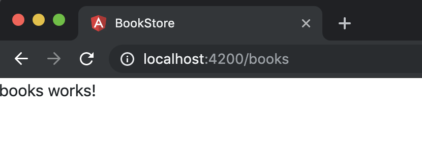
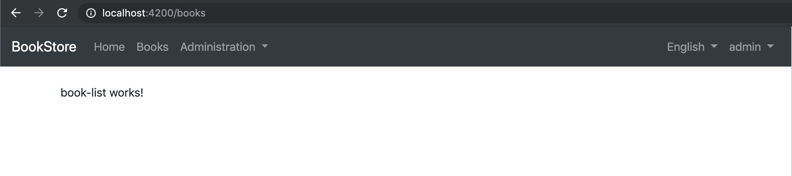
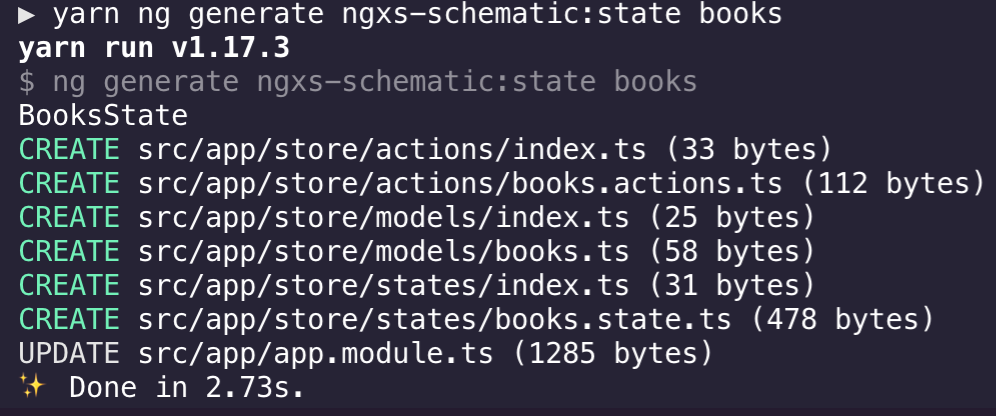
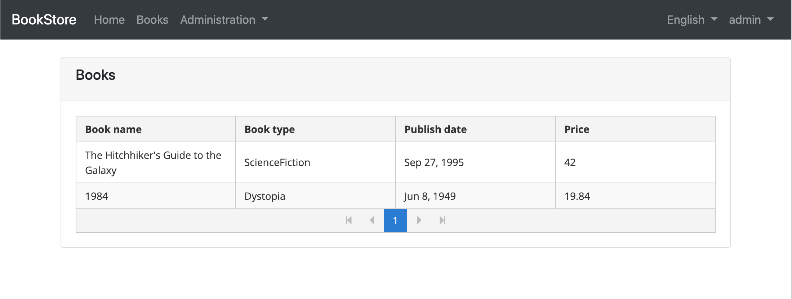
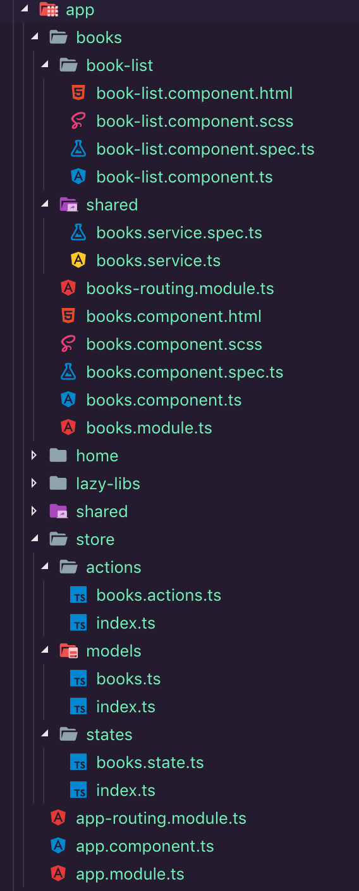

## Angular Tutorial - Part I

### About this Tutorial

In this tutorial series, you will build an application that is used to manage a list of books & their authors. **Angular** will be used as the UI framework and **MongoDB** will be used as the database provider.

This is the first part of the ASP.NET Core MVC tutorial series. See all parts:

- **Part I: Create the project and a book list page (this tutorial)**
- [Part II: Create, Update and Delete books](Part-II.md)

You can access to the **source code** of the application from the GitHub repository (TOD: link).

### Creating the Project

Create a new project named `Acme.BookStore` by selecting the Angular as the UI framework and MongoDB as the database provider, create the database and run the application by following the [Getting Started document](../../Getting-Started-Angular-Template.md).

### Solution Structure (Backend)

This is how the layered solution structure looks after it's created:


> You can see the [Application template document](../../Startup-Templates/Application.md) to understand the solution structure in details. However, you will understand the basics with this tutorial.

### Create the Book Entity

Domain layer in the startup template is separated into two projects:

- `Acme.BookStore.Domain` contains your [entities](../../Entities.md), [domain services](../../Domain-Services.md) and other core domain objects.
- `Acme.BookStore.Domain.Shared` contains constants, enums or other domain related objects those can be shared with clients.

Define [entities](../../Entities.md) in the **domain layer** (`Acme.BookStore.Domain` project) of the solution. The main entity of the application is the `Book`. Create a class, named `Book`, in the `Acme.BookStore.Domain` project as shown below:

```C#
using System;
using Volo.Abp.Domain.Entities.Auditing;

namespace Acme.BookStore
{
    public class Book : AuditedAggregateRoot<Guid>
    {
        public string Name { get; set; }

        public BookType Type { get; set; }

        public DateTime PublishDate { get; set; }

        public float Price { get; set; }
    }
}
```

- ABP has two fundamental base classes for entities: `AggregateRoot` and `Entity`. **Aggregate Root** is one of the **Domain Driven Design (DDD)** concepts. See [entity document](../../Entities.md) for details and best practices.
- `Book` entity inherits `AuditedAggregateRoot` which adds some auditing properties (`CreationTime`, `CreatorId`, `LastModificationTime`... etc.) on top of the `AggregateRoot` class.
- `Guid` is the **primary key type** of the `Book` entity.

#### BookType Enum

Define the `BookType` enum in the `Acme.BookStore.Domain.Shared` project:

```C#
namespace Acme.BookStore
{
    public enum BookType
    {
        Undefined,
        Adventure,
        Biography,
        Dystopia,
        Fantastic,
        Horror,
        Science,
        ScienceFiction,
        Poetry
    }
}
```

#### Add Book Entity to Your DbContext

Add a `IMongoCollection` property to the `BookStoreMongoDbContext` inside the `Acme.BookStore.MongoDB` project:

````csharp
public class BookStoreMongoDbContext : AbpMongoDbContext
{
    public IMongoCollection<Book> Books => Collection<Book>();
    ...
}
````

#### Add Seed (Sample) Data

This section is optional, but it would be good to have an initial data in the database in the first run. ABP provides a [data seed system](../../Data-Seeding.md). Create a class deriving from the `IDataSeedContributor` in the `.Domain` project:

````csharp
using System;
using System.Threading.Tasks;
using Volo.Abp.Data;
using Volo.Abp.DependencyInjection;
using Volo.Abp.Domain.Repositories;

namespace Acme.BookStore
{
    public class BookStoreDataSeederContributor
        : IDataSeedContributor, ITransientDependency
    {
        private readonly IRepository<Book, Guid> _bookRepository;

        public BookStoreDataSeederContributor(IRepository<Book, Guid> bookRepository)
        {
            _bookRepository = bookRepository;
        }

        public async Task SeedAsync(DataSeedContext context)
        {
            if (await _bookRepository.GetCountAsync() > 0)
            {
                return;
            }

            await _bookRepository.InsertAsync(
                new Book
                {
                    Name = "1984",
                    Type = BookType.Dystopia,
                    PublishDate = new DateTime(1949, 6, 8),
                    Price = 19.84f
                }
            );

            await _bookRepository.InsertAsync(
                new Book
                {
                    Name = "The Hitchhiker's Guide to the Galaxy",
                    Type = BookType.ScienceFiction,
                    PublishDate = new DateTime(1995, 9, 27),
                    Price = 42.0f
                }
            );
        }
    }
}

````

`BookStoreDataSeederContributor` simply inserts two books into database if there is no book added before. ABP automatically discovers and executes this class when you seed the database by running the `Acme.BookStore.DbMigrator` project.

### Create the Application Service

The next step is to create an [application service](../../Application-Services.md) to manage (create, list, update, delete...) the books. Application layer in the startup template is separated into two projects:

- `Acme.BookStore.Application.Contracts` mainly contains your DTOs and application service interfaces.
- `Acme.BookStore.Application` contains the implementations of your application services.

#### BookDto

Create a DTO class named `BookDto` into the `Acme.BookStore.Application.Contracts` project:

```C#
using System;
using Volo.Abp.Application.Dtos;

namespace Acme.BookStore
{
    public class BookDto : AuditedEntityDto<Guid>
    {
        public string Name { get; set; }

        public BookType Type { get; set; }

        public DateTime PublishDate { get; set; }

        public float Price { get; set; }
    }
}
```

- **DTO** classes are used to **transfer data** between the *presentation layer* and the *application layer*. See the [Data Transfer Objects document](../../Data-Transfer-Objects.md) for more details.
- `BookDto` is used to transfer book data to the presentation layer in order to show the book information on the UI.
- `BookDto` is derived from the `AuditedEntityDto<Guid>` which has audit properties just like the `Book` class defined above.

It will be needed to convert `Book` entities to `BookDto` objects while returning books to the presentation layer. [AutoMapper](https://automapper.org) library can automate this conversion when you define the proper mapping. Startup template comes with AutoMapper configured, so you can just define the mapping in the `BookStoreApplicationAutoMapperProfile` class in the `Acme.BookStore.Application` project:

```csharp
using AutoMapper;

namespace Acme.BookStore
{
    public class BookStoreApplicationAutoMapperProfile : Profile
    {
        public BookStoreApplicationAutoMapperProfile()
        {
            CreateMap<Book, BookDto>();
        }
    }
}
```

#### CreateUpdateBookDto

Create a DTO class named `CreateUpdateBookDto` into the `Acme.BookStore.Application.Contracts` project:

```c#
using System;
using System.ComponentModel.DataAnnotations;

namespace Acme.BookStore
{
    public class CreateUpdateBookDto
    {
        [Required]
        [StringLength(128)]
        public string Name { get; set; }

        [Required]
        public BookType Type { get; set; } = BookType.Undefined;

        [Required]
        public DateTime PublishDate { get; set; }

        [Required]
        public float Price { get; set; }
    }
}
```

- This DTO class is used to get book information from the user interface while creating or updating a book.
- It defines data annotation attributes (like `[Required]`) to define validations for the properties. DTOs are [automatically validated](../../Validation.md) by the ABP framework.

Next, add a mapping in `BookStoreApplicationAutoMapperProfile` from the `CreateUpdateBookDto` object to the `Book` entity:

```csharp
CreateMap<CreateUpdateBookDto, Book>();
```

#### IBookAppService

Define an interface named `IBookAppService` in the `Acme.BookStore.Application.Contracts` project:

```C#
using System;
using Volo.Abp.Application.Dtos;
using Volo.Abp.Application.Services;

namespace Acme.BookStore
{
    public interface IBookAppService : 
        ICrudAppService< //Defines CRUD methods
            BookDto, //Used to show books
            Guid, //Primary key of the book entity
            PagedAndSortedResultRequestDto, //Used for paging/sorting on getting a list of books
            CreateUpdateBookDto, //Used to create a new book
            CreateUpdateBookDto> //Used to update a book
    {

    }
}
```

- Defining interfaces for application services is <u>not required</u> by the framework. However, it's suggested as a best practice.
- `ICrudAppService` defines common **CRUD** methods: `GetAsync`, `GetListAsync`, `CreateAsync`, `UpdateAsync` and `DeleteAsync`. It's not required to extend it. Instead, you could inherit from the empty `IApplicationService` interface and define your own methods manually.
- There are some variations of the `ICrudAppService` where you can use separated DTOs for each method.

#### BookAppService

Implement the `IBookAppService` as named `BookAppService` in the `Acme.BookStore.Application` project:

```C#
using System;
using Volo.Abp.Application.Dtos;
using Volo.Abp.Application.Services;
using Volo.Abp.Domain.Repositories;

namespace Acme.BookStore
{
    public class BookAppService : 
        CrudAppService<Book, BookDto, Guid, PagedAndSortedResultRequestDto,
                            CreateUpdateBookDto, CreateUpdateBookDto>,
        IBookAppService
    {
        public BookAppService(IRepository<Book, Guid> repository) 
            : base(repository)
        {

        }
    }
}
```

- `BookAppService` is derived from `CrudAppService<...>` which implements all the CRUD methods defined above.
- `BookAppService` injects `IRepository<Book, Guid>` which is the default repository for the `Book` entity. ABP automatically creates default repositories for each aggregate root (or entity). See the [repository document](../../Repositories.md).
- `BookAppService` uses `IObjectMapper` to convert `Book` objects to `BookDto` objects and `CreateUpdateBookDto` objects to `Book` objects. The Startup template uses the [AutoMapper](http://automapper.org/) library as the object mapping provider. You defined the mappings before, so it will work as expected.

### Auto API Controllers

You normally create **Controllers** to expose application services as **HTTP API** endpoints. Thus allowing browser or 3rd-party clients to call them via AJAX. ABP can [**automagically**](../../AspNetCore/Auto-API-Controllers.md) configures your application services as MVC API Controllers by convention.

#### Swagger UI

The startup template is configured to run the [swagger UI](https://swagger.io/tools/swagger-ui/) using the [Swashbuckle.AspNetCore](https://github.com/domaindrivendev/Swashbuckle.AspNetCore) library. Run the `Acme.BookStore.HttpApi.Host` application and enter `https://localhost:XXXX/swagger/` (replace XXXX by your own port) as URL on your browser.

You will see some built-in service endpoints as well as the `Book` service and its REST-style endpoints:


Swagger has a nice UI to test APIs. You can try to execute the `[GET] /api/app/book` API to get a list of books.

### Create the Books Page

It's time to create something visible and usable!


In this Angular Application, [Angular CLI](https://angular.io/cli) will be used to creating modules, components, services, etc. ,  [NGXS](https://ngxs.gitbook.io/ngxs/) will be used as state management and [Ng Bootstrap](https://ng-bootstrap.github.io/#/home) will be used as the UI library.


Open a terminal window and go to `angular` folder and then run `yarn` command for installing packages.

Run the following command line for creating `BooksModule`

```bash
yarn ng generate module books --route books --module app.module
```


Run `yarn start` and then open `http://localhost:4200/books` on a browser.



Books page works but you need some configuration for the application layout.

Let's start the coding.

>[Visual Studio Code](https://code.visualstudio.com/) will be used in this tutorial.

Open the `app-routing.module.ts` and replace `books` route to the below route.

```typescript
import { LayoutApplicationComponent } from '@abp/ng.theme.basic';-

//...  
{
  path: 'books',
  component: LayoutApplicationComponent,
  loadChildren: () => import('./books/books.module').then(m => m.BooksModule),
  data: {
    routes: {
      name: 'Books',
    } as ABP.Route,
  },
},
```

If you would like to see your route on the navigation bar of `LayoutApplication`, you must add the `data` object with `name` property in your route.

>ABP themes have three layouts. These layouts are `LayoutApplication`, `LayoutAccount` and `LayoutEmpty`. [Check these layouts.](https://github.com/abpframework/abp/tree/dev/npm/ng-packs/packages/theme-basic/src/lib/components)


`LayoutApplication` successfully added and `Books` successfully added to the navigation bar.

Let's create the `book-list.component`.


Replace the `books.component.html` to the following line

```html
<router-outlet></router-outlet>
```

Run the below command on the terminal in the root folder.

`yarn ng generate component books/book-list`


Import the `SharedModule` to the `BooksModule`

```typescript
import { SharedModule } from '../shared/shared.module';

@NgModule({
  //...
  imports: [
    //...
    SharedModule
  ],
})
export class BooksModule {}
```

After, update to `routes` in `books-routing.module.ts`

```typescript
import { BookListComponent } from './book-list/book-list.component';

const routes: Routes = [
  {
    path: '',
    component: BooksComponent,
    children: [{ path: '', component: BookListComponent }],
  },
];

@NgModule({
  imports: [RouterModule.forChild(routes)],
  exports: [RouterModule],
})
export class BooksRoutingModule {}
```



It seems good.

Now, you created `BookListComponent` and added in the `BooksRoutingModule`.


<h3>Create the Books State</h3>

In this step, [NGXS Schematic](https://github.com/mehmet-erim/ngxs-schematic) will be used to generate state.

Run the next command on terminal.

`yarn ng generate ngxs-schematic:state books`



```typescript
// books.ts

export namespace Books {
  export interface State {
    books: any;
  }
}
```

```typescript
// books.actions.ts

export class BooksAction {
  static readonly type = '[Books] Action';
  constructor(public payload?: any) { }
}
```
>See [Actions on NGXS Document](https://ngxs.gitbook.io/ngxs/concepts/actions)

```typescript
// books.state.ts

import { State, Action, StateContext, Selector } from '@ngxs/store';
import { BooksAction } from '../actions/books.actions';
import { Books } from '../models/books';

@State<Books.State> ({
  name: 'BooksState',
  defaults: { books: {} } as Books.State
})
export class BooksState {
  @Selector()
  static getBooks({ books }: Books.State) {
    return books;
  }

  constructor() { }

  @Action(BooksAction)
  booksAction({ getState, patchState }: StateContext<Books.State>, { payload }: BooksAction) {
    const state = getState();
    patchState({
      ...state,
    });
  }
}
```
>See [State on NGXS Document](https://ngxs.gitbook.io/ngxs/concepts/state)

NGXS Schematic created the above files and added `BooksState` to `NgxsModule` in `app.modules.ts`.

```typescript
// app.module.ts

import { BooksState } from './store/states/books.state';

@NgModule({
  imports: [
    //...
    NgxsModule.forRoot([BooksState]),
  ],
  //...
})
export class AppModule {}
```

<h3>Get Books Data from Backend</h3>

Firstly, you have to create the response type of book API.
>Book response type must be the same as the backend response type. You can use swagger for response types.

Add the below types to `books.ts`

```typescript
import { ABP } from '@abp/ng.core';

export namespace Books {
  export interface State {
    books: Response;
  }

  export type Response = ABP.PagedResponse<Book>;

  export interface Book {
    name: string;
    type: Type;
    publishDate: string;
    price: number;
    lastModificationTime: string;
    lastModifierId: string;
    creationTime: string;
    creatorId: string;
    id: string;
  }

  export enum Type {
    Undefined,
    Adventure,
    Biography,
    Dystopia,
    Fantastic,
    Horror,
    Science,
    ScienceFiction,
    Poetry,
  }
}
```

OK, you ready to create a service.

```bash
yarn ng generate service books/shared/books
```


Add a get method to this service.

```typescript
import { Injectable } from '@angular/core';
import { RestService, Rest } from '@abp/ng.core';
import { Books } from '../../store/models';
import { Observable } from 'rxjs';

@Injectable({
  providedIn: 'root',
})
export class BooksService {
  constructor(private rest: RestService) {}

  get(): Observable<Books.Response> {
    const request: Rest.Request<null> = {
      method: 'GET',
      url: '/api/app/book',
    };

    return this.rest.request<null, Books.Response>(request);
  }
}
```

Replace the following code block to `books.actions.ts`.

```typescript
export class GetBooks {
  static readonly type = '[Books] Get';
}
```

Replace the next code block to `books.state.ts`.

```typescript
import { State, Action, StateContext, Selector } from '@ngxs/store';
import { GetBooks } from '../actions/books.actions';
import { Books } from '../models/books';
import { BooksService } from '../../books/shared/books.service';
import { tap } from 'rxjs/operators';

@State<Books.State>({
  name: 'BooksState',
  defaults: { books: {} } as Books.State,
})
export class BooksState {
  @Selector()
  static getBooks({ books }: Books.State) {
    return books.items || [];
  }

  constructor(private booksService: BooksService) {}

  @Action(GetBooks)
  get({ patchState }: StateContext<Books.State>) {
    /* Suggestion:
    You never subscribe to an observable here
    and don't forget to return
    */
    return this.booksService.get().pipe(
      tap(books => {
        patchState({
          books,
        });
      }),
    );
  }
}

```
>See the [Selectors on NGXS Document](https://ngxs.gitbook.io/ngxs/concepts/select#memoized-selectors)

You ready to get books and list in the table.

```typescript
import { Component, OnInit } from '@angular/core';
import { Store, Select } from '@ngxs/store';
import { BooksState } from '../../store/states';
import { Observable } from 'rxjs';
import { Books } from '../../store/models';
import { GetBooks } from '../../store/actions';

@Component({
  selector: 'app-book-list',
  templateUrl: './book-list.component.html',
  styleUrls: ['./book-list.component.scss'],
})
export class BookListComponent implements OnInit {
  @Select(BooksState.getBooks)
  books$: Observable<Books.Book[]>;

  booksType = Books.Type;

  loading = false;

  constructor(private store: Store) {}

  ngOnInit() {
    this.loading = true;
    this.store.dispatch(new GetBooks())
    .subscribe(() => {
      // This subscribe block runs when the action completed successfully
      this.loading = false
    };
  }
}
```

>See the [Dispatching Actions](https://ngxs.gitbook.io/ngxs/concepts/store#dispatching-actions) and [Select](https://ngxs.gitbook.io/ngxs/concepts/select)  on NGXS Document

Copy next code block to `book-list.component.html`.

```html
<div id="wrapper" class="card">
  <div class="card-header">
    <div class="row">
      <div class="col col-md-6">
        <h5 class="card-title">
          Books
        </h5>
      </div>
    </div>
  </div>
  <div class="card-body">
    <p-table [value]="books$ | async" [loading]="loading" [paginator]="true" [rows]="10">
      <ng-template pTemplate="header">
        <tr>
          <th>Book name</th>
          <th>Book type</th>
          <th>Publish date</th>
          <th>Price</th>
        </tr>
      </ng-template>
      <ng-template pTemplate="body" let-data>
        <tr>
          <td>{{ data.name }}</td>
          <td>{{ booksType[data.type] }}</td>
          <td>{{ data.publishDate | date }}</td>
          <td>{{ data.price }}</td>
        </tr>
      </ng-template>
    </p-table>
  </div>
</div>
```
> PrimeNG Table used in this component. See the [PrimeNG Table Document](https://www.primefaces.org/primeng/#/table)

The final UI and file tree are shown below:





> Check the folder structure on [Angular Style Guide](https://angular.io/guide/styleguide#file-tree)


### Next Part

See the [next part](Part-II.md) of this tutorial.
