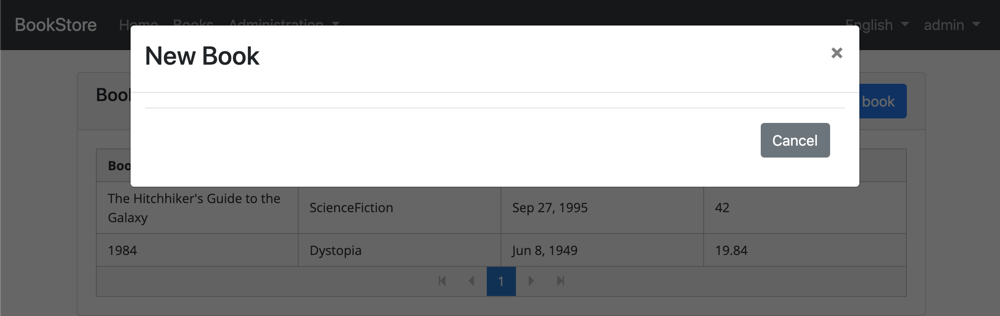
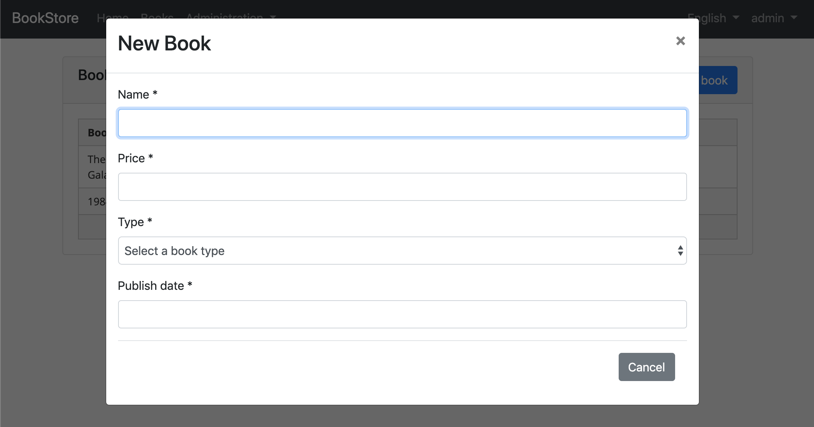
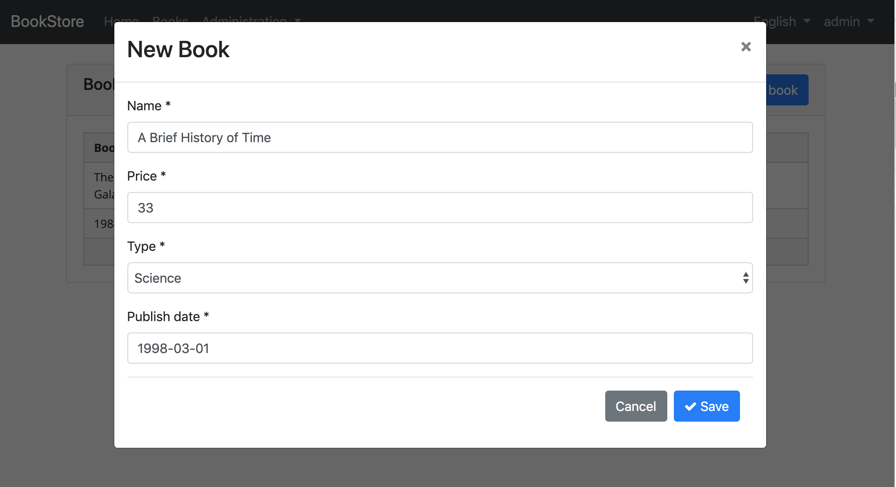
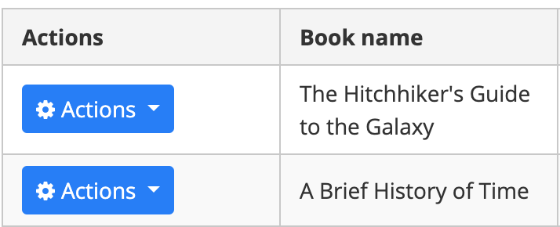
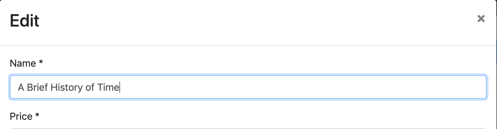
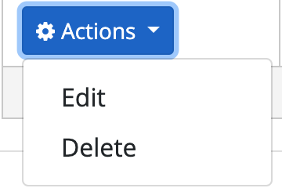
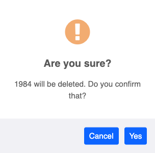

## Angular Tutorial - Part II

### About this Tutorial

This is the second part of the Angular tutorial series. See all parts:

- [Part I: Create the project and a book list page](Part-I.md)
- **Part II: Create, Update and Delete books (this tutorial)**
- [Part III: Integration Tests](Part-III.md)

You can access to the **source code** of the application from the [GitHub repository](https://github.com/abpframework/abp/tree/dev/samples/BookStore-Angular-MongoDb).

### Creating a New Book

In this section, you will learn how to create a new modal dialog form to create a new book.

#### Type Definition

Create an interface, named `CreateUpdateBookInput` in the `books.ts` as shown below:

```js
export namespace Books {
  //...
  export interface CreateUpdateBookInput {
    name: string;
    type: BookType;
    publishDate: string;
    price: number;
  }
}
```

`CreateUpdateBookInput` interface matches the `CreateUpdateBookDto` in the backend.

#### Service Method

Open the `books.service.ts` and add a new method, named `create` to perform an HTTP POST request to the server:

```js
create(createBookInput: Books.CreateUpdateBookInput): Observable<Books.Book> {
  return this.restService.request<Books.CreateUpdateBookInput, Books.Book>({
    method: 'POST',
    url: '/api/app/book',
    body: createBookInput
  });
}
```

- `restService.request` function gets generic parameters for the types sent to and received from the server. This example sends a `CreateUpdateBookInput` object and receives a `Book` object (you can set `void` for request or return type if not used).

#### State Definitions

Add the `CreateUpdateBook` action to the `books.actions.ts` as shown below:

```js
import { Books } from '../models';

export class CreateUpdateBook {
  static readonly type = '[Books] Create Update Book';
  constructor(public payload: Books.CreateUpdateBookInput) {}
}
```

Open `books.state.ts` and define the `save` method that will listen to a `CreateUpdateBook` action to create a book:

```js
import { ... , CreateUpdateBook } from '../actions/books.actions';
import { ... , switchMap } from 'rxjs/operators';
//...
@Action(CreateUpdateBook)
save(ctx: StateContext<Books.State>, action: CreateUpdateBook) {
  return this.booksService
      .create(action.payload)
      .pipe(switchMap(() => ctx.dispatch(new GetBooks())));
}
```

When the `SaveBook` action dispatched, the save method is executed. It call `create` method of the `BooksService` defined before. After the service call, `BooksState` dispatches the `GetBooks` action to get books again from the server to refresh the page.

#### Add a Modal to BookListComponent

Open the `book-list.component.html` and add the `abp-modal` to show/hide the modal to create a new book.

```html
<abp-modal [(visible)]="isModalOpen">
  <ng-template #abpHeader>
    <h3>New Book</h3>
  </ng-template>

  <ng-template #abpBody> </ng-template>

  <ng-template #abpFooter>
    <button type="button" class="btn btn-secondary" #abpClose>
      Cancel
    </button>
  </ng-template>
</abp-modal>
```

`abp-modal` is a pre-built component to show modals. While you could use another approach to show a modal, `abp-modal` provides additional benefits.

Add a button, labeled `New book` to show the modal:

```html
<div class="row">
  <div class="col col-md-6">
    <h5 class="card-title">
      Books
    </h5>
  </div>
  <div class="text-right col col-md-6">
    <button id="create-role" class="btn btn-primary" type="button" (click)="createBook()">
      <i class="fa fa-plus mr-1"></i> <span>New book</span>
    </button>
  </div>
</div>
```

Open the `book-list.component.ts` and add `isModalOpen` variable and `createBook` method to show/hide the modal.

```js
isModalOpen = false;

//...

createBook() {
  this.isModalOpen = true;
}
```



#### Create a Reactive Form

> [Reactive forms](https://angular.io/guide/reactive-forms) provide a model-driven approach to handling form inputs whose values change over time.

Add a `form` variable and inject a `FormBuilder` service to the `book-list.component.ts` as shown below (remember add the import statement).

```js
import { FormGroup, FormBuilder } from '@angular/forms';

form: FormGroup;

constructor(
  //...
  private fb: FormBuilder
) {}
```

> The [FormBuilder](https://angular.io/api/forms/FormBuilder) service provides convenient methods for generating controls. It reduces the amount of boilerplate needed to build complex forms.

Add the `buildForm` method to create book form.

```js
buildForm() {
  this.form = this.fb.group({
    name: ['', Validators.required],
    type: [null, Validators.required],
    publishDate: [null, Validators.required],
    price: [null, Validators.required],
  });
}
```

- The `group` method of `FormBuilder` (`fb`) creates a `FormGroup`.
- Added `Validators.required` static method that validates the related form element.

Modify the `createBook` method as shown below:

```js
createBook() {
  this.buildForm();
  this.isModalOpen = true;
}
```

#### Create the DOM Elements of the Form

Open `book-list.component.html` and add the form in the body template of the modal.

```html
<ng-template #abpBody>
  <form [formGroup]="form">
    <div class="form-group">
      <label for="book-name">Name</label><span> * </span>
      <input type="text" id="book-name" class="form-control" formControlName="name" autofocus />
    </div>

    <div class="form-group">
      <label for="book-price">Price</label><span> * </span>
      <input type="number" id="book-price" class="form-control" formControlName="price" />
    </div>

    <div class="form-group">
      <label for="book-type">Type</label><span> * </span>
      <select class="form-control" id="book-type" formControlName="type">
        <option [ngValue]="null">Select a book type</option>
        <option [ngValue]="booksType[type]" *ngFor="let type of bookTypeArr"> {{ type }}</option>
      </select>
    </div>

    <div class="form-group">
      <label>Publish date</label><span> * </span>
      <input
        #datepicker="ngbDatepicker"
        class="form-control"
        name="datepicker"
        formControlName="publishDate"
        ngbDatepicker
        (click)="datepicker.toggle()"
      />
    </div>
  </form>
</ng-template>
```

- This template creates a form with Name, Price, Type and Publish date fields.

> We've used [NgBootstrap datepicker](https://ng-bootstrap.github.io/#/components/datepicker/overview) in this component.

Open the `book-list.component.ts` and then create an array, named `bookTypeArr`:

```js
//...
form: FormGroup;

bookTypeArr = Object.keys(Books.BookType).filter(
    bookType => typeof this.booksType[bookType] === 'number'
);
```

The `bookTypeArr` contains the fields of the `BookType` enum. Resulting array is shown below:

```js
['Adventure', 'Biography', 'Dystopia', 'Fantastic' ...]
```

This array was used in the previous form template (in the `ngFor` loop).

#### Datepicker Requirements

You need to import `NgbDatepickerModule` to the `books.module.ts`:

```js
import { NgbDatepickerModule } from '@ng-bootstrap/ng-bootstrap';

@NgModule({
  imports: [
    // ...
    NgbDatepickerModule,
  ],
})
export class BooksModule {}
```

Then open the `book-list.component.ts` and add `providers` as shown below:

```js
import { NgbDateNativeAdapter, NgbDateAdapter } from '@ng-bootstrap/ng-bootstrap';

@Component({
  // ...
  providers: [{ provide: NgbDateAdapter, useClass: NgbDateNativeAdapter }],
})
export class BookListComponent implements OnInit {
// ...
```

> The `NgbDateAdapter` converts Datepicker value to `Date` type. See the [datepicker adapters](https://ng-bootstrap.github.io/#/components/datepicker/overview) for more details.



#### Saving the Book

Open the `book-list.component.html` and add an `abp-button` to save the form.

```html
<ng-template #abpFooter>
  <button type="button" class="btn btn-secondary" #abpClose>
    Cancel
  </button>
  <button class="btn btn-primary" (click)="save()">
    <i class="fa fa-check mr-1"></i>
    Save
  </button>
</ng-template>
```

This adds a save button to the bottom area of the modal:



Then define a `save` method in the `BookListComponent`:

```js
save() {
  if (this.form.invalid) {
    return;
  }

  this.store.dispatch(new CreateUpdateBook(this.form.value)).subscribe(() => {
    this.isModalOpen = false;
    this.form.reset();
  });
}
```

### Updating An Existing Book

#### BooksService

Open the `books.service.ts` and then add the `getById` and `update` methods.

```js
getById(id: string): Observable<Books.Book> {
  return this.restService.request<void, Books.Book>({
    method: 'GET',
    url: `/api/app/book/${id}`
  });
}

update(updateBookInput: Books.CreateUpdateBookInput, id: string): Observable<Books.Book> {
  return this.restService.request<Books.CreateUpdateBookInput, Books.Book>({
    method: 'PUT',
    url: `/api/app/book/${id}`,
    body: updateBookInput
  });
}
```

#### CreateUpdateBook Action

Open the `books.actins.ts` and add `id` parameter to the `CreateUpdateBook` action:

```js
export class CreateUpdateBook {
  static readonly type = '[Books] Create Update Book';
  constructor(public payload: Books.CreateUpdateBookInput, public id?: string) {}
}
```

Open `books.state.ts` and modify the `save` method as show below:

```js
@Action(CreateUpdateBook)
save(ctx: StateContext<Books.State>, action: CreateUpdateBook) {
  let request;

  if (action.id) {
    request = this.booksService.update(action.payload, action.id);
  } else {
    request = this.booksService.create(action.payload);
  }

  return request.pipe(switchMap(() => ctx.dispatch(new GetBooks())));
}
```

#### BookListComponent

Inject `BooksService` dependency by adding it to the `book-list.component.ts` constructor and add a variable named `selectedBook`.

```js
import { BooksService } from '../shared/books.service';
//...
selectedBook = {} as Books.Book;

constructor(
  //...
  private booksService: BooksService
)
```

`booksService` is used to get the editing book to prepare the form. Modify the `buildForm` method to reuse the same form while editing a book.

```js
buildForm() {
  this.form = this.fb.group({
    name: [this.selectedBook.name || '', Validators.required],
    type: this.selectedBook.type || null,
    publishDate: this.selectedBook.publishDate ? new Date(this.selectedBook.publishDate) : null,
    price: this.selectedBook.price || null,
  });
}
```

Add the `editBook` method as shown below:

```js
  editBook(id: string) {
    this.booksService.getById(id).subscribe(book => {
      this.selectedBook = book;
      this.buildForm();
      this.isModalOpen = true;
    });
  }
```

Added `editBook` method to get the editing book, build the form and show the modal.

Now, add the `selectedBook` definition to `createBook` method to reuse the same form while creating a new book:

```js
  createBook() {
    this.selectedBook = {} as Books.Book;
    //...
  }
```

Modify the `save` method to pass the id of the selected book as shown below:

```js
save() {
  if (this.form.invalid) {
    return;
  }

  this.store.dispatch(new CreateUpdateBook(this.form.value, this.selectedBook.id))
    .subscribe(() => {
      this.isModalOpen = false;
      this.form.reset();
    });
}
```

#### Add "Actions" Dropdown to the Table

Open the `book-list.component.html` and add modify the `p-table` as shown below:

```html
<p-table [value]="books$ | async" [loading]="loading" [paginator]="true" [rows]="10">
  <ng-template pTemplate="header">
    <tr>
      <th>Actions</th>
      <th>Book name</th>
      <th>Book type</th>
      <th>Publish date</th>
      <th>Price</th>
    </tr>
  </ng-template>
  <ng-template pTemplate="body" let-data>
    <tr>
      <td>
        <div ngbDropdown class="d-inline-block">
          <button
            class="btn btn-primary btn-sm dropdown-toggle"
            data-toggle="dropdown"
            aria-haspopup="true"
            ngbDropdownToggle
          >
            <i class="fa fa-cog mr-1"></i>Actions
          </button>
          <div ngbDropdownMenu>
            <button ngbDropdownItem (click)="editBook(data.id)">Edit</button>
          </div>
        </div>
      </td>
      <td>{{ data.name }}</td>
      <td>{{ booksType[data.type] }}</td>
      <td>{{ data.publishDate | date }}</td>
      <td>{{ data.price }}</td>
    </tr>
  </ng-template>
</p-table>
```

- Added a `th` for the "Actions" column.
- Added `button` with `ngbDropdownToggle` to open actions when clicked the button.

> We've used to [NgbDropdown](https://ng-bootstrap.github.io/#/components/dropdown/examples) for the dropdown menu of actions.

The final UI looks like:



Update the modal header to change the title based on the current operation:

```html
<ng-template #abpHeader>
  <h3>{{ selectedBook.id ? 'Edit' : 'New Book' }}</h3>
</ng-template>
```



### Deleting an Existing Book

#### BooksService

Open `books.service.ts` and add a `delete` method to delete a book with the `id` by performing an HTTP request to the related endpoint:

```js
delete(id: string): Observable<void> {
  return this.restService.request<void, void>({
    method: 'DELETE',
    url: `/api/app/book/${id}`
  });
}
```

#### DeleteBook Action

Add an action named `DeleteBook` to `books.actions.ts`:

```js
export class DeleteBook {
  static readonly type = '[Books] Delete';
  constructor(public id: string) {}
}
```

Open the `books.state.ts` and add the `delete` method that will listen to the `DeleteBook` action to delete a book:

```js
import { ... , DeleteBook } from '../actions/books.actions';
//...
@Action(DeleteBook)
delete(ctx: StateContext<Books.State>, action: DeleteBook) {
  return this.booksService.delete(action.id).pipe(switchMap(() => ctx.dispatch(new GetBooks())));
}
```

- Added `DeleteBook` to the import list.
- Uses `bookService` to delete the book.

#### Add a Delete Button

Open `book-list.component.html` and modify the `ngbDropdownMenu` to add the delete button as shown below:

```html
<div ngbDropdownMenu>
  ...
  <button ngbDropdownItem (click)="delete(data.id, data.name)">
    Delete
  </button>
</div>
```

The final actions dropdown UI looks like below:



#### Delete Confirmation Dialog

Open `book-list.component.ts` and inject the `ConfirmationService`.

```js
import { ConfirmationService } from '@abp/ng.theme.shared';
//...
constructor(
	//...
  private confirmationService: ConfirmationService
)
```

> `ConfirmationService` is a simple service provided by ABP framework that internally uses the PrimeNG.

Add a delete method to the `BookListComponent`:

```js
import { ... , DeleteBook } from '../../store/actions';
import { ... , Toaster } from '@abp/ng.theme.shared';
//...
delete(id: string, name: string) {
  this.confirmationService
    .error(`${name} will be deleted. Do you confirm that?`, 'Are you sure?')
    .subscribe(status => {
      if (status === Toaster.Status.confirm) {
        this.store.dispatch(new DeleteBook(id));
      }
    });
}
```

The `delete` method shows a confirmation popup and subscribes for the user response. `DeleteBook` action dispatched only if user clicks to the `Yes` button. The confirmation popup looks like below:



### Next Part

See the [next part](Part-III.md) of this tutorial.
