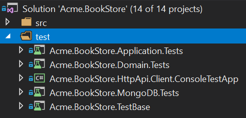
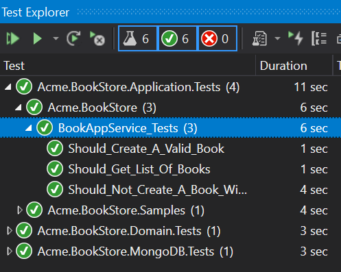

## ASP.NET Core MVC Tutorial - Part III

### About this Tutorial

This is the third part of the Angular tutorial series. See all parts:

- [Part I: Create the project and a book list page](Part-I.md)
- [Part II: Create, Update and Delete books](Part-II.md)
- **Part III: Integration Tests (this tutorial)**

This part covers the **server side** tests. You can access to the **source code** of the application from the [GitHub repository](https://github.com/abpframework/abp/tree/dev/samples/BookStore-Angular-MongoDb).

### Test Projects in the Solution

There are multiple test projects in the solution:



Each project is used to test the related application project. Test projects use the following libraries for testing:

* [xunit](https://xunit.github.io/) as the main test framework.
* [Shoudly](http://shouldly.readthedocs.io/en/latest/) as an assertion library.
* [NSubstitute](http://nsubstitute.github.io/) as a mocking library.

### Adding Test Data

Startup template contains the `BookStoreTestDataSeedContributor` class in the `Acme.BookStore.TestBase` project that creates some data to run tests on.

Change the `BookStoreTestDataSeedContributor` class as show below:

````C#
using System;
using System.Threading.Tasks;
using Volo.Abp.Data;
using Volo.Abp.DependencyInjection;
using Volo.Abp.Domain.Repositories;
using Volo.Abp.Guids;

namespace Acme.BookStore
{
    public class BookStoreTestDataSeedContributor
        : IDataSeedContributor, ITransientDependency
    {
        private readonly IRepository<Book, Guid> _bookRepository;
        private readonly IGuidGenerator _guidGenerator;

        public BookStoreTestDataSeedContributor(
            IRepository<Book, Guid> bookRepository, 
            IGuidGenerator guidGenerator)
        {
            _bookRepository = bookRepository;
            _guidGenerator = guidGenerator;
        }

        public async Task SeedAsync(DataSeedContext context)
        {
            await _bookRepository.InsertAsync(
                new Book
                {
                    Id = _guidGenerator.Create(),
                    Name = "Test book 1",
                    Type = BookType.Fantastic,
                    PublishDate = new DateTime(2015, 05, 24),
                    Price = 21
                }
            );

            await _bookRepository.InsertAsync(
                new Book
                {
                    Id = _guidGenerator.Create(),
                    Name = "Test book 2",
                    Type = BookType.Science,
                    PublishDate = new DateTime(2014, 02, 11),
                    Price = 15
                }
            );
        }
    }
}
````

* Injected `IRepository<Book, Guid>` and used it in the `SeedAsync` to create two book entities as the test data.
* Used `IGuidGenerator` service to create GUIDs. While `Guid.NewGuid()` would perfectly work for testing, `IGuidGenerator` has additional features especially important while using real databases (see the [Guid generation document](../../Guid-Generation.md) for more).

### Testing the BookAppService

Create a test class named `BookAppService_Tests` in the `Acme.BookStore.Application.Tests` project:

````C#
using System.Threading.Tasks;
using Shouldly;
using Volo.Abp.Application.Dtos;
using Xunit;

namespace Acme.BookStore
{
    public class BookAppService_Tests : BookStoreApplicationTestBase
    {
        private readonly IBookAppService _bookAppService;

        public BookAppService_Tests()
        {
            _bookAppService = GetRequiredService<IBookAppService>();
        }

        [Fact]
        public async Task Should_Get_List_Of_Books()
        {
            //Act
            var result = await _bookAppService.GetListAsync(
                new PagedAndSortedResultRequestDto()
            );

            //Assert
            result.TotalCount.ShouldBeGreaterThan(0);
            result.Items.ShouldContain(b => b.Name == "Test book 1");
        }
    }
}
````

* `Should_Get_List_Of_Books` test simply uses `BookAppService.GetListAsync` method to get and check the list of users.

Add a new test that creates a valid new book:

````C#
[Fact]
public async Task Should_Create_A_Valid_Book()
{
    //Act
    var result = await _bookAppService.CreateAsync(
        new CreateUpdateBookDto
        {
            Name = "New test book 42",
            Price = 10,
            PublishDate = DateTime.Now,
            Type = BookType.ScienceFiction
        }
    );

    //Assert
    result.Id.ShouldNotBe(Guid.Empty);
    result.Name.ShouldBe("New test book 42");
}
````

Add a new test that tries to create an invalid book and fails:

````C#
[Fact]
public async Task Should_Not_Create_A_Book_Without_Name()
{
    var exception = await Assert.ThrowsAsync<AbpValidationException>(async () =>
    {
        await _bookAppService.CreateAsync(
            new CreateUpdateBookDto
            {
                Name = "",
                Price = 10,
                PublishDate = DateTime.Now,
                Type = BookType.ScienceFiction
            }
        );
    });

    exception.ValidationErrors
        .ShouldContain(err => err.MemberNames.Any(mem => mem == "Name"));
}
````

* Since the `Name` is empty, ABP throws an `AbpValidationException`.

Open the **Test Explorer Window** (use Test -> Windows -> Test Explorer menu if it is not visible) and **Run All** tests:



Congratulations, green icons show that tests have been successfully passed!