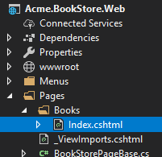
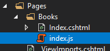

## ASP.NET Core MVC Tutorial - Part I

### About this Tutorial

In this tutorial series, you will build an application that is used to manage a list of books & their authors. **Entity Framework Core** (EF Core) will be used as the ORM provider as it is the default database provider.

This is the first part of the ASP.NET Core MVC tutorial series. See all parts:

- **Part I: Create the project and a book list page (this tutorial)**
- [Part II: Create, Update and Delete books](Part-II.md)
- [Part III: Integration Tests](Part-III.md)

You can access to the **source code** of the application from [the GitHub repository](https://github.com/abpframework/abp/tree/master/samples/BookStore).

> You can also watch [this video course](https://amazingsolutions.teachable.com/p/lets-build-the-bookstore-application) prepared by an ABP community member, based on this tutorial.

### Creating the Project

Create a new project named `Acme.BookStore`, create the database and run the application by following the [Getting Started document](../../Getting-Started-AspNetCore-MVC-Template.md).

### Solution Structure

This is how the layered solution structure looks after it's created:


> You can see the [Application template document](../../Startup-Templates/Application.md) to understand the solution structure in details. However, you will understand the basics with this tutorial.

### Create the Book Entity

Domain layer in the startup template is separated into two projects:

- `Acme.BookStore.Domain` contains your [entities](../../Entities.md), [domain services](../../Domain-Services.md) and other core domain objects.
- `Acme.BookStore.Domain.Shared` contains constants, enums or other domain related objects those can be shared with clients.

Define [entities](../../Entities.md) in the **domain layer** (`Acme.BookStore.Domain` project) of the solution. The main entity of the application is the `Book`. Create a class, named `Book`, in the `Acme.BookStore.Domain` project as shown below:

````C#
using System;
using Volo.Abp.Domain.Entities.Auditing;

namespace Acme.BookStore
{
    public class Book : AuditedAggregateRoot<Guid>
    {
        public string Name { get; set; }

        public BookType Type { get; set; }

        public DateTime PublishDate { get; set; }

        public float Price { get; set; }

        protected Book()
        {

        }

        public Book(Guid id, string name, BookType type, DateTime publishDate, float price)
        :base(id)
        {
            Name = name;
            Type = type;
            PublishDate = publishDate;
            Price = price;
        }
    }
}
````

* ABP has two fundamental base classes for entities: `AggregateRoot` and `Entity`. **Aggregate Root** is one of the **Domain Driven Design (DDD)** concepts. See [entity document](../../Entities.md) for details and best practices.
* `Book` entity inherits `AuditedAggregateRoot` which adds some auditing properties (`CreationTime`, `CreatorId`, `LastModificationTime`... etc.) on top of the `AggregateRoot` class.
* `Guid` is the **primary key type** of the `Book` entity.

#### BookType Enum

Define the `BookType` enum in the `Acme.BookStore.Domain.Shared` project:

````C#
namespace Acme.BookStore
{
    public enum BookType
    {
        Undefined,
        Adventure,
        Biography,
        Dystopia,
        Fantastic,
        Horror,
        Science,
        ScienceFiction,
        Poetry
    }
}
````

#### Add Book Entity to Your DbContext

EF Core requires you to relate entities with your DbContext. The easiest way to do this is to add a `DbSet` property to the `BookStoreDbContext` class in the `Acme.BookStore.EntityFrameworkCore` project, as shown below:

````C#
    public class BookStoreDbContext : AbpDbContext<BookStoreDbContext>
    {
        public DbSet<Book> Books { get; set; }
		...
    }
````

#### Configure Your Book Entity

Open `BookStoreDbContextModelCreatingExtensions.cs` file in the `Acme.BookStore.EntityFrameworkCore` project and add following code to the end of the `ConfigureBookStore` method to configure the Book entity:

````C#
builder.Entity<Book>(b =>
{
    b.ToTable(BookStoreConsts.DbTablePrefix + "Books", BookStoreConsts.DbSchema);
    b.ConfigureByConvention(); //auto configure for the base class props
    b.Property(x => x.Name).IsRequired().HasMaxLength(128);
});
````

#### Add New Migration & Update the Database

The Startup template uses [EF Core Code First Migrations](https://docs.microsoft.com/en-us/ef/core/managing-schemas/migrations/) to create and maintain the database schema. Open the **Package Manager Console (PMC)** (under the *Tools/Nuget Package Manager* menu), select the `Acme.BookStore.EntityFrameworkCore.DbMigrations` as the **default project** and execute the following command:


This will create a new migration class inside the `Migrations` folder. Then execute the `Update-Database` command to update the database schema:

````
PM> Update-Database
````

#### Add Sample Data

`Update-Database` command created the `AppBooks` table in the database. Open your database and enter a few sample rows, so you can show them on the page:


### Create the Application Service

The next step is to create an [application service](../../Application-Services.md) to manage (create, list, update, delete...) the books. Application layer in the startup template is separated into two projects:

* `Acme.BookStore.Application.Contracts` mainly contains your DTOs and application service interfaces.
* `Acme.BookStore.Application` contains the implementations of your application services.

#### BookDto

Create a DTO class named `BookDto` into the `Acme.BookStore.Application.Contracts` project:

````C#
using System;
using Volo.Abp.Application.Dtos;

namespace Acme.BookStore
{
    public class BookDto : AuditedEntityDto<Guid>
    {
        public string Name { get; set; }

        public BookType Type { get; set; }

        public DateTime PublishDate { get; set; }

        public float Price { get; set; }
    }
}
````

* **DTO** classes are used to **transfer data** between the *presentation layer* and the *application layer*. See the [Data Transfer Objects document](../../Data-Transfer-Objects.md) for more details.
* `BookDto` is used to transfer book data to the presentation layer in order to show the book information on the UI.
* `BookDto` is derived from the `AuditedEntityDto<Guid>` which has audit properties just like the `Book` class defined above.

It will be needed to convert `Book` entities to `BookDto` objects while returning books to the presentation layer. [AutoMapper](https://automapper.org) library can automate this conversion when you define the proper mapping. Startup template comes with AutoMapper configured, so you can just define the mapping in the `BookStoreApplicationAutoMapperProfile` class in the `Acme.BookStore.Application` project:

````csharp
using AutoMapper;

namespace Acme.BookStore
{
    public class BookStoreApplicationAutoMapperProfile : Profile
    {
        public BookStoreApplicationAutoMapperProfile()
        {
            CreateMap<Book, BookDto>();
        }
    }
}
````

#### CreateUpdateBookDto

Create a DTO class named `CreateUpdateBookDto` into the `Acme.BookStore.Application.Contracts` project:

````c#
using System;
using System.ComponentModel.DataAnnotations;

namespace Acme.BookStore
{
    public class CreateUpdateBookDto
    {
        [Required]
        [StringLength(128)]
        public string Name { get; set; }

        [Required]
        public BookType Type { get; set; } = BookType.Undefined;

        [Required]
        public DateTime PublishDate { get; set; }

        [Required]
        public float Price { get; set; }
    }
}
````

* This DTO class is used to get book information from the user interface while creating or updating a book.
* It defines data annotation attributes (like `[Required]`) to define validations for the properties. DTOs are [automatically validated](../../Validation.md) by the ABP framework.

Next, add a mapping in `BookStoreApplicationAutoMapperProfile` from the `CreateUpdateBookDto` object to the `Book` entity:

````csharp
CreateMap<CreateUpdateBookDto, Book>();
````

#### IBookAppService

Define an interface named `IBookAppService` in the `Acme.BookStore.Application.Contracts` project:

````C#
using System;
using Volo.Abp.Application.Dtos;
using Volo.Abp.Application.Services;

namespace Acme.BookStore
{
    public interface IBookAppService : 
        ICrudAppService< //Defines CRUD methods
            BookDto, //Used to show books
            Guid, //Primary key of the book entity
            PagedAndSortedResultRequestDto, //Used for paging/sorting on getting a list of books
            CreateUpdateBookDto, //Used to create a new book
            CreateUpdateBookDto> //Used to update a book
    {

    }
}
````

* Defining interfaces for application services is <u>not required</u> by the framework. However, it's suggested as a best practice.
* `ICrudAppService` defines common **CRUD** methods: `GetAsync`, `GetListAsync`, `CreateAsync`, `UpdateAsync` and `DeleteAsync`. It's not required to extend it. Instead, you could inherit from the empty `IApplicationService` interface and define your own methods manually.
* There are some variations of the `ICrudAppService` where you can use separated DTOs for each method.

#### BookAppService

Implement the `IBookAppService` as named `BookAppService` in the `Acme.BookStore.Application` project:

````C#
using System;
using Volo.Abp.Application.Dtos;
using Volo.Abp.Application.Services;
using Volo.Abp.Domain.Repositories;

namespace Acme.BookStore
{
    public class BookAppService : 
        CrudAppService<Book, BookDto, Guid, PagedAndSortedResultRequestDto,
                       CreateUpdateBookDto, CreateUpdateBookDto>,
        IBookAppService
    {
        public BookAppService(IRepository<Book, Guid> repository) 
            : base(repository)
        {

        }
    }
}
````

* `BookAppService` is derived from `CrudAppService<...>` which implements all the CRUD methods defined above.
* `BookAppService` injects `IRepository<Book, Guid>` which is the default repository for the `Book` entity. ABP automatically creates default repositories for each aggregate root (or entity). See the [repository document](../../Repositories.md).
* `BookAppService` uses `IObjectMapper` to convert `Book` objects to `BookDto` objects and `CreateUpdateBookDto` objects to `Book` objects. The Startup template uses the [AutoMapper](http://automapper.org/) library as the object mapping provider. You defined the mappings before, so it will work as expected.

### Auto API Controllers

You normally create **Controllers** to expose application services as **HTTP API** endpoints. Thus allowing browser or 3rd-party clients to call them via AJAX. ABP can [**automagically**](../../AspNetCore/Auto-API-Controllers.md) configures your application services as MVC API Controllers by convention.

#### Swagger UI

The startup template is configured to run the [swagger UI](https://swagger.io/tools/swagger-ui/) using the [Swashbuckle.AspNetCore](https://github.com/domaindrivendev/Swashbuckle.AspNetCore) library. Run the application and enter `https://localhost:XXXX/swagger/` (replace XXXX by your own port) as URL on your browser.

You will see some built-in service endpoints as well as the `Book` service and its REST-style endpoints:


Swagger has a nice UI to test APIs. You can try to execute the `[GET] /api/app/book` API to get a list of books.

### Dynamic JavaScript Proxies

It's common to call HTTP API endpoints via AJAX from the **JavaScript** side. You can use `$.ajax` or another tool to call the endpoints. However, ABP offers a better way.

ABP **dynamically** creates JavaScript **proxies** for all API endpoints. So, you can use any **endpoint** just like calling a **JavaScript function**.

#### Testing in the Browser Developer Console

You can easily test the JavaScript proxies using your favorite browser's **Developer Console** now. Run the application, open your browser's **developer tools** (shortcut: F12), switch to the **Console** tab, type the following code and press enter:

````js
acme.bookStore.book.getList({}).done(function (result) { console.log(result); });
````

* `acme.bookStore` is the namespace of the `BookAppService` converted to [camelCase](https://en.wikipedia.org/wiki/Camel_case).
* `book` is the conventional name for the `BookAppService` (removed AppService postfix and converted to camelCase).
* `getList` is the conventional name for the `GetListAsync` method defined in the `AsyncCrudAppService` base class (removed Async postfix and converted to camelCase).
* `{}` argument is used to send an empty object to the `GetListAsync` method which normally expects an object of type `PagedAndSortedResultRequestDto` that is used to send paging and sorting options to the server (all properties are optional, so you can send an empty object).
* `getList` function returns a `promise`. So, you can pass a callback to the `done` (or `then`) function to get the result from the server.

Running this code produces the following output:


You can see the **book list** returned from the server. You can also check the **network** tab of the developer tools to see the client to server communication:


Let's **create a new book** using the `create` function:

````js
acme.bookStore.book.create({ name: 'Foundation', type: 7, publishDate: '1951-05-24', price: 21.5 }).done(function (result) { console.log('successfully created the book with id: ' + result.id); });
````

You should see a message in the console something like that:

````
successfully created the book with id: f3f03580-c1aa-d6a9-072d-39e75c69f5c7
````

Check the `Books` table in the database to see the new book row. You can try `get`, `update` and `delete` functions yourself.

### Create the Books Page

It's time to create something visible and usable! Instead of classic MVC, we will use the new [Razor Pages UI](https://docs.microsoft.com/en-us/aspnet/core/tutorials/razor-pages/razor-pages-start) approach which is recommended by Microsoft.

Create a new `Books` folder under the `Pages` folder of the `Acme.BookStore.Web` project and add a new Razor Page named `Index.cshtml`:



Open the `Index.cshtml` and change the content as shown below:

````html
@page
@using Acme.BookStore.Web.Pages.Books
@inherits Acme.BookStore.Web.Pages.BookStorePage
@model IndexModel

<h2>Books</h2>
````

* This code changes the default inheritance of the Razor View Page Model so it **inherits** from the `BookStorePage` class (instead of `PageModel`).  The `BookStorePage` class which comes with the startup template and provides some shared properties/methods used by all pages.
* Ensure that the `IndexModel` (*Index.cshtml.cs)* has the `Acme.BookStore.Web.Pages.Books` namespace, or update it in the `Index.cshtml`.

#### Add Books Page to the Main Menu

Open the `BookStoreMenuContributor` class in the `Menus` folder and add the following code to the end of the `ConfigureMainMenuAsync` method:

````c#
context.Menu.AddItem(
    new ApplicationMenuItem("BooksStore", l["Menu:BookStore"])
        .AddItem(new ApplicationMenuItem("BooksStore.Books", l["Menu:Books"], url: "/Books"))
);
````

#### Localizing the Menu Items

Localization texts are located under the `Localization/BookStore` folder of the `Acme.BookStore.Domain.Shared` project:


Open the `en.json` file and add localization texts for `Menu:BookStore` and `Menu:Books` keys to the end of the file:

````json
{
  "culture": "en",
  "texts": {
    "Menu:BookStore": "Book Store",
    "Menu:Books": "Books"
  }
}
````

* ABP's localization system is built on [ASP.NET Core's standard localization](https://docs.microsoft.com/en-us/aspnet/core/fundamentals/localization) system and extends it in many ways. See the [localization document](../../Localization.md) for details.
* Localization key names are arbitrary. You can set any name. We prefer to add `Menu:` prefix for menu items to distinguish from other texts. If a text is not defined in the localization file, it **fallbacks** to the localization key (ASP.NET Core's standard behavior).

Run the application and see the new menu item has been added to the top bar:


When you click to the Books menu item, you are redirected to the new Books page.

#### Book List

We will use the [Datatables.net](https://datatables.net/) JQuery plugin to show list of tables on the page. Datatables can completely work via AJAX, it is fast and provides a good user experience. Datatables plugin is configured in the startup template, so you can directly use it in any page without including any style or script file to your page.

##### Index.cshtml

Change the `Pages/Books/Index.cshtml` as following:

````html
@page
@inherits Acme.BookStore.Web.Pages.BookStorePage
@model Acme.BookStore.Web.Pages.Books.IndexModel
@section scripts
{
    <abp-script src="/Pages/Books/index.js" />
}
<abp-card>
    <abp-card-header>
        <h2>@L["Books"]</h2>
    </abp-card-header>
    <abp-card-body>
        <abp-table striped-rows="true" id="BooksTable">
            <thead>
                <tr>
                    <th>@L["Name"]</th>
                    <th>@L["Type"]</th>
                    <th>@L["PublishDate"]</th>
                    <th>@L["Price"]</th>
                    <th>@L["CreationTime"]</th>
                </tr>
            </thead>
        </abp-table>
    </abp-card-body>
</abp-card>
````

* `abp-script` [tag helper](https://docs.microsoft.com/en-us/aspnet/core/mvc/views/tag-helpers/intro) is used to add external **scripts** to the page. It has many additional features compared to standard `script` tag. It handles **minification** and **versioning** for example. See the [bundling & minification document](../../AspNetCore/Bundling-Minification.md) for details.
* `abp-card` and `abp-table` are **tag helpers** for Twitter Bootstrap's [card component](http://getbootstrap.com/docs/4.1/components/card/). There are many tag helpers in ABP to easily use most of the [bootstrap](https://getbootstrap.com/) components. You can also use regular HTML tags instead of these tag helpers, but using tag helpers reduces HTML code and prevents errors by help of the intellisense and compile time type checking. See the [tag helpers document](../../AspNetCore/Tag-Helpers/Index.md).
* You can **localize** the column names in the localization file as you did for the menu items above.

##### Add a Script File

Create `index.js` JavaScript file under the `Pages/Books/` folder:



`index.js` content is shown below:

````js
$(function () {
    var dataTable = $('#BooksTable').DataTable(abp.libs.datatables.normalizeConfiguration({
        ajax: abp.libs.datatables.createAjax(acme.bookStore.book.getList),
        columnDefs: [
            { data: "name" },
            { data: "type" },
            { data: "publishDate" },
            { data: "price" },
            { data: "creationTime" }
        ]
    }));
});
````

* `abp.libs.datatables.createAjax` is a helper function to adapt ABP's dynamic JavaScript API proxies to Datatable's format.
* `abp.libs.datatables.normalizeConfiguration` is another helper function. There's no requirement to use it, but it simplifies the datatables configuration by providing conventional values for missing options.
* `acme.bookStore.book.getList` is the function to get list of books (you have seen it before).
* See [Datatable's documentation](https://datatables.net/manual/) for more configuration options.

The final UI is shown below:


### Next Part

See the [next part](Part-II.md) of this tutorial.
