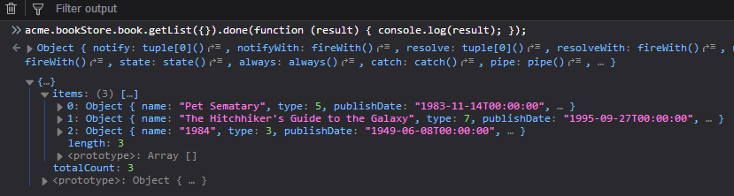
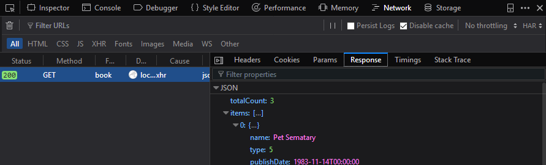
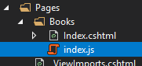
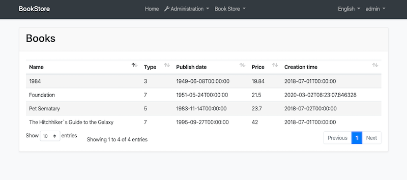
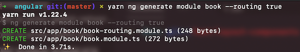
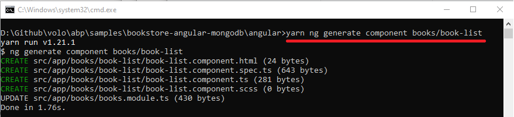
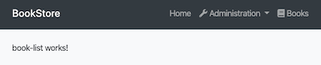
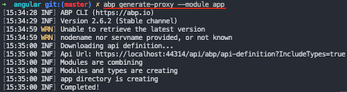
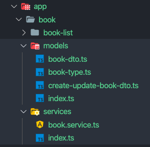
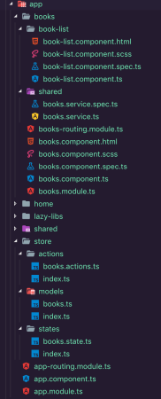

# ASP.NET Core {{UI_Value}} Tutorial - Part 1
````json
//[doc-params]
{
    "UI": ["MVC","NG"]
}
````
{{
if UI == "MVC"
  DB="ef"
  DB_Text="Entity Framework Core"
  UI_Text="mvc"
else if UI == "NG"
  DB="mongodb"
  DB_Text="MongoDB"
  UI_Text="angular"
else
  DB ="?"
  UI_Text="?"
end
}}

## About This Tutorial

In this tutorial series, you will build an ABP based web application named `Acme.BookStore`. This application is used to manage a list of books and their authors. It is developed using the following technologies:

* **{{DB_Text}}** as the ORM provider. 
* **{{UI_Value}}** as the UI Framework.

This tutorial is organized as the following parts;

- **Part-1: Creating the project and book list page (this part)**
- [Part-2: Creating, updating and deleting books](part-2.md)
- [Part-3: Integration tests](part-3.md)

### Source Code

You can find the completed solution on {{if UI == "MVC"}}[the GitHub repository](https://github.com/abpframework/abp-samples/tree/master/BookStore-Mvc-EfCore){{else}}[the GitHub repository](https://github.com/abpframework/abp-samples/tree/master/BookStore-Angular-MongoDb){{end}}.

## Creating the Solution

Before starting to the development, create a new solution named `Acme.BookStore` and run it by following the [getting started tutorial](../Getting-Started-{{if UI == 'NG'}}Angular{{else}}AspNetCore-MVC{{end}}-Template#creating-a-new-project).

## Create the Book Entity

**Domain layer** in the startup template is separated into two projects:

- `Acme.BookStore.Domain` contains your [entities](../Entities.md), [domain services](../Domain-Services.md) and other core domain objects.
- `Acme.BookStore.Domain.Shared` contains `constants`, `enums` or other domain related objects those can be shared with clients.

So, define your entities in the domain layer (`Acme.BookStore.Domain` project) of the solution. 

The main entity of the application is the `Book`. Create a `Books` folder (namespace) in the `Acme.BookStore.Domain` project and add a `Book` class inside it:

````csharp
using System;
using Volo.Abp.Domain.Entities.Auditing;

namespace Acme.BookStore.Books
{
    public class Book : AuditedAggregateRoot<Guid>
    {
        public string Name { get; set; }

        public BookType Type { get; set; }

        public DateTime PublishDate { get; set; }

        public float Price { get; set; }
    }
}
````

* ABP Framework has two fundamental base classes for entities: `AggregateRoot` and `Entity`. **Aggregate Root** is a [Domain Driven Design](../Domain-Driven-Design.md) concept which can be thought as a root entity that is directly queried and worked on (see the [entities document](../Entities.md) for more).
* `Book` entity inherits from the `AuditedAggregateRoot` which adds some base [auditing](../Audit-Logging.md) properties (like `CreationTime`, `CreatorId`, `LastModificationTime`...) on top of the `AggregateRoot` class. ABP automatically manages these properties for you.
* `Guid` is the **primary key type** of the `Book` entity.

> This tutorials leaves the entity properties with **public get/set** for the sake of simplicity. See the [entities document](../Entities.md) if you learn more about DDD best practices.

### BookType Enum

The `Book` entity uses the `BookType` enum. Create the `BookType` in the `Acme.BookStore.Domain.Shared` project:

````csharp
namespace Acme.BookStore
{
    public enum BookType
    {
        Undefined,
        Adventure,
        Biography,
        Dystopia,
        Fantastic,
        Horror,
        Science,
        ScienceFiction,
        Poetry
    }
}
````

The final folder/file structure should be as shown below:


### Add Book Entity to the DbContext

{{if DB == "ef"}}

EF Core requires to relate entities with your `DbContext`. The easiest way to do this is to add a `DbSet` property to the `BookStoreDbContext` class in the `Acme.BookStore.EntityFrameworkCore` project, as shown below:

````csharp
public class BookStoreDbContext : AbpDbContext<BookStoreDbContext>
{
    public DbSet<Book> Books { get; set; }
    //...
}
````

{{end}}

{{if DB == "mongodb"}}

Add a `IMongoCollection<Book> Books` property to the `BookStoreMongoDbContext` inside the `Acme.BookStore.MongoDB` project:

```csharp
public class BookStoreMongoDbContext : AbpMongoDbContext
{
    public IMongoCollection<Book> Books => Collection<Book>();
    //...
}
```

{{end}}

{{if DB == "ef"}}

### Map the Book Entity to a Database Table

Open `BookStoreDbContextModelCreatingExtensions.cs` file in the `Acme.BookStore.EntityFrameworkCore` project and add the mapping code for the `Book` entity. The final class should be the following:

````csharp
using Acme.BookStore.Books;
using Microsoft.EntityFrameworkCore;
using Volo.Abp;
using Volo.Abp.EntityFrameworkCore.Modeling;

namespace Acme.BookStore.EntityFrameworkCore
{
    public static class BookStoreDbContextModelCreatingExtensions
    {
        public static void ConfigureBookStore(this ModelBuilder builder)
        {
            Check.NotNull(builder, nameof(builder));

            /* Configure your own tables/entities inside here */

            builder.Entity<Book>(b =>
            {
                b.ToTable(BookStoreConsts.DbTablePrefix + "Books",
                          BookStoreConsts.DbSchema);
                b.ConfigureByConvention(); //auto configure for the base class props
                b.Property(x => x.Name).IsRequired().HasMaxLength(128);
            });
        }
    }
}
````

* `BookStoreConsts` has constant values for schema and table prefixes for your tables. You don't have to use it, but suggested to control the table prefixes in a single point.
* `ConfigureByConvention()` method gracefully configures/maps the inherited properties. Always use it for all your entities.

### Add Database Migration

The startup template uses [EF Core Code First Migrations](https://docs.microsoft.com/en-us/ef/core/managing-schemas/migrations/) to create and maintain the database schema. Open the **Package Manager Console (PMC)** under the menu *Tools > NuGet Package Manager*.


Select the `Acme.BookStore.EntityFrameworkCore.DbMigrations` as the **default project** and execute the following command:

```bash
Add-Migration "Created_Book_Entity"
```


This will create a new migration class inside the `Migrations` folder of the `Acme.BookStore.EntityFrameworkCore.DbMigrations` project.

Before updating the database, you will learn how to seed initial data to the database.

> If you are using another IDE than the Visual Studio, you can use `dotnet-ef` tool as [documented here](https://docs.microsoft.com/en-us/ef/core/managing-schemas/migrations/?tabs=dotnet-core-cli#create-a-migration).

{{end}}

### Add Sample Seed Data

> It's good to have some initial data in the database before running the application. This section introduces the [Data Seeding](../Data-Seeding.md) system of the ABP framework. You can skip this section if you don't want to create seed data, but it is suggested to follow it to learn this useful ABP Framework feature.

Create a class deriving from the `IDataSeedContributor` in the `*.Domain` project and copy the following code:

```csharp
using System;
using System.Threading.Tasks;
using Acme.BookStore.Books;
using Volo.Abp.Data;
using Volo.Abp.DependencyInjection;
using Volo.Abp.Domain.Repositories;

namespace Acme.BookStore
{
    public class BookStoreDataSeederContributor
        : IDataSeedContributor, ITransientDependency
    {
        private readonly IRepository<Book, Guid> _bookRepository;

        public BookStoreDataSeederContributor(IRepository<Book, Guid> bookRepository)
        {
            _bookRepository = bookRepository;
        }

        public async Task SeedAsync(DataSeedContext context)
        {
            if (await _bookRepository.GetCountAsync() > 0)
            {
                return;
            }

            await _bookRepository.InsertAsync(
                new Book
                {
                    Name = "1984",
                    Type = BookType.Dystopia,
                    PublishDate = new DateTime(1949, 6, 8),
                    Price = 19.84f
                }
            );

            await _bookRepository.InsertAsync(
                new Book
                {
                    Name = "The Hitchhiker's Guide to the Galaxy",
                    Type = BookType.ScienceFiction,
                    PublishDate = new DateTime(1995, 9, 27),
                    Price = 42.0f
                }
            );
        }
    }
}
```

* This code simply uses the `IRepository<Book, Guid>` (the default [repository](../Repositories.md)) to insert two books to the database, if there is no book currently in the database.

### Update the Database

Run the `Acme.BookStore.DbMigrator` application to update the database:


{{if DB == "ef"}}

`.DbMigrator` is a console application that can be run to **migrate the database schema** and **seed the data** on **development** and **production** environments.

{{end}}

{{if DB == "mongodb"}}

While MongoDB **doesn't require** a database schema migration, it is still good to run this application since it **seeds the initial data** on the database. This application can be used on **development** and **production** environments.

{{end}}

### Create the application service

The next step is to create an [application service](../Application-Services.md) to manage the books which will allow us the four basic functions: creating, reading, updating and deleting. Application layer is separated into two projects:

* `Acme.BookStore.Application.Contracts` mainly contains your `DTO`s and application service interfaces.
* `Acme.BookStore.Application` contains the implementations of your application services.

#### BookDto

Create a DTO class named `BookDto` into the `Acme.BookStore.Application.Contracts` project:

````csharp
using System;
using Volo.Abp.Application.Dtos;

namespace Acme.BookStore
{
    public class BookDto : AuditedEntityDto<Guid>
    {
        public string Name { get; set; }

        public BookType Type { get; set; }

        public DateTime PublishDate { get; set; }

        public float Price { get; set; }
    }
}
````

* **DTO** classes are used to **transfer data** between the *presentation layer* and the *application layer*. See the [Data Transfer Objects document](https://docs.abp.io/en/abp/latest/Data-Transfer-Objects) for more details.
* `BookDto` is used to transfer book data to the presentation layer in order to show the book information on the UI.
* `BookDto` is derived from the `AuditedEntityDto<Guid>` which has audit properties just like the `Book` class defined above.

It will be needed to map `Book` entities to `BookDto` objects while returning books to the presentation layer. [AutoMapper](https://automapper.org) library can automate this conversion when you define the proper mapping. The startup template comes with AutoMapper configured, so you can just define the mapping in the `BookStoreApplicationAutoMapperProfile` class in the `Acme.BookStore.Application` project:

````csharp
using AutoMapper;

namespace Acme.BookStore
{
    public class BookStoreApplicationAutoMapperProfile : Profile
    {
        public BookStoreApplicationAutoMapperProfile()
        {
            CreateMap<Book, BookDto>();
        }
    }
}
````

#### CreateUpdateBookDto

Create a DTO class named `CreateUpdateBookDto` into the `Acme.BookStore.Application.Contracts` project:

````csharp
using System;
using System.ComponentModel.DataAnnotations;

namespace Acme.BookStore
{
    public class CreateUpdateBookDto
    {
        [Required]
        [StringLength(128)]
        public string Name { get; set; }

        [Required]
        public BookType Type { get; set; } = BookType.Undefined;

        [Required]
        public DateTime PublishDate { get; set; }

        [Required]
        public float Price { get; set; }
    }
}
````

* This `DTO` class is used to get book information from the user interface while creating or updating a book.
* It defines data annotation attributes (like `[Required]`) to define validations for the properties. `DTO`s are [automatically validated](https://docs.abp.io/en/abp/latest/Validation) by the ABP framework.

Next, add a mapping in `BookStoreApplicationAutoMapperProfile` from the `CreateUpdateBookDto` object to the `Book` entity with the `CreateMap<CreateUpdateBookDto, Book>();` command:

````csharp
using AutoMapper;

namespace Acme.BookStore
{
    public class BookStoreApplicationAutoMapperProfile : Profile
    {
        public BookStoreApplicationAutoMapperProfile()
        {
            CreateMap<Book, BookDto>();
            CreateMap<CreateUpdateBookDto, Book>(); //<--added this line-->
        }
    }
}
````

#### IBookAppService

Create an interface named `IBookAppService` in the `Acme.BookStore.Application.Contracts` project:

````csharp
using System;
using Volo.Abp.Application.Dtos;
using Volo.Abp.Application.Services;

namespace Acme.BookStore
{
    public interface IBookAppService :
        ICrudAppService< //Defines CRUD methods
            BookDto, //Used to show books
            Guid, //Primary key of the book entity
            PagedAndSortedResultRequestDto, //Used for paging/sorting on getting a list of books
            CreateUpdateBookDto, //Used to create a new book
            CreateUpdateBookDto> //Used to update a book
    {

    }
}
````

* Defining interfaces for the application services **are not required** by the framework. However, it's suggested as a best practice.
* `ICrudAppService` defines common **CRUD** methods: `GetAsync`, `GetListAsync`, `CreateAsync`, `UpdateAsync` and `DeleteAsync`. It's not required to extend it. Instead, you could inherit from the empty `IApplicationService` interface and define your own methods manually.
* There are some variations of the `ICrudAppService` where you can use separated DTOs for each method.

#### BookAppService

Implement the `IBookAppService` as named `BookAppService` in the `Acme.BookStore.Application` project:

````csharp
using System;
using Volo.Abp.Application.Dtos;
using Volo.Abp.Application.Services;
using Volo.Abp.Domain.Repositories;

namespace Acme.BookStore
{
    public class BookAppService :
        CrudAppService<Book, BookDto, Guid, PagedAndSortedResultRequestDto,
                       CreateUpdateBookDto, CreateUpdateBookDto>,
        IBookAppService
    {
        public BookAppService(IRepository<Book, Guid> repository)
            : base(repository)
        {

        }
    }
}
````

* `BookAppService` is derived from `CrudAppService<...>` which implements all the CRUD (create, read, update, delete) methods defined above.
* `BookAppService` injects `IRepository<Book, Guid>` which is the default repository for the `Book` entity. ABP automatically creates default repositories for each aggregate root (or entity). See the [repository document](https://docs.abp.io/en/abp/latest/Repositories).
* `BookAppService` uses `IObjectMapper` to map `Book` objects to `BookDto` objects and `CreateUpdateBookDto` objects to `Book` objects. The Startup template uses the [AutoMapper](http://automapper.org/) library as the object mapping provider. We have defined the mappings before, so it will work as expected.

### Auto API Controllers

We normally create **Controllers** to expose application services as **HTTP API** endpoints. This allows browsers or 3rd-party clients to call them via AJAX. ABP can [**automagically**](https://docs.abp.io/en/abp/latest/API/Auto-API-Controllers) configures your application services as MVC API Controllers by convention.

#### Swagger UI

The startup template is configured to run the [Swagger UI](https://swagger.io/tools/swagger-ui/) using the [Swashbuckle.AspNetCore](https://github.com/domaindrivendev/Swashbuckle.AspNetCore) library. Run the application by pressing `CTRL+F5` and navigate to `https://localhost:<port>/swagger/` on your browser. (Replace `<port>` with your own port number.)

You will see some built-in service endpoints as well as the `Book` service and its REST-style endpoints:


Swagger has a nice interface to test the APIs. You can try to execute the `[GET] /api/app/book` API to get a list of books.

{{if UI == "MVC"}}

### Dynamic JavaScript proxies

It's common to call HTTP API endpoints via AJAX from the **JavaScript** side. You can use `$.ajax` or another tool to call the endpoints. However, ABP offers a better way.

ABP **dynamically** creates JavaScript **proxies** for all API endpoints. So, you can use any **endpoint** just like calling a **JavaScript function**.

#### Testing in developer console of the browser

You can easily test the JavaScript proxies using your favorite browser's **Developer Console**. Run the application, open your browser's **developer tools** (*shortcut is F12 for Chrome*), switch to the **Console** tab, type the following code and press enter:

````js
acme.bookStore.book.getList({}).done(function (result) { console.log(result); });
````

* `acme.bookStore` is the namespace of the `BookAppService` converted to [camelCase](https://en.wikipedia.org/wiki/Camel_case).
* `book` is the conventional name for the `BookAppService` (removed `AppService` postfix and converted to camelCase).
* `getList` is the conventional name for the `GetListAsync` method defined in the `AsyncCrudAppService` base class (removed `Async` postfix and converted to camelCase).
* `{}` argument is used to send an empty object to the `GetListAsync` method which normally expects an object of type `PagedAndSortedResultRequestDto` that is used to send paging and sorting options to the server (all properties are optional, so you can send an empty object).
* `getList` function returns a `promise`. You can pass a callback to the `done` (or `then`) function to get the result from the server.

Running this code produces the following output:



You can see the **book list** returned from the server. You can also check the **network** tab of the developer tools to see the client to server communication:



Let's **create a new book** using the `create` function:

````js
acme.bookStore.book.create({ name: 'Foundation', type: 7, publishDate: '1951-05-24', price: 21.5 }).done(function (result) { console.log('successfully created the book with id: ' + result.id); });
````

You should see a message in the console something like that:

````text
successfully created the book with id: 439b0ea8-923e-8e1e-5d97-39f2c7ac4246
````

Check the `Books` table in the database to see the new book row. You can try `get`, `update` and `delete` functions yourself.

### Create the books page

It's time to create something visible and usable! Instead of classic MVC, we will use the new [Razor Pages UI](https://docs.microsoft.com/en-us/aspnet/core/tutorials/razor-pages/razor-pages-start) approach which is recommended by Microsoft.

Create `Books` folder under the `Pages` folder of the `Acme.BookStore.Web` project. Add a new Razor Page by right clicking the Books folder then selecting **Add > Razor Page** menu item. Name it as `Index`:


Open the `Index.cshtml` and change the whole content as shown below:

**Index.cshtml:**

````html
@page
@using Acme.BookStore.Web.Pages.Books
@model IndexModel

<h2>Books</h2>
````


* Set the `IndexModel`'s namespace to `Acme.BookStore.Pages.Books`  in `Index.cshtml.cs`.


**Index.cshtml.cs:**

```csharp
using Microsoft.AspNetCore.Mvc.RazorPages;

namespace Acme.BookStore.Web.Pages.Books
{
    public class IndexModel : PageModel
    {
        public void OnGet()
        {

        }
    }
}
```

#### Add books page to the main menu

Open the `BookStoreMenuContributor` class in the `Menus` folder and add the following code to the end of the `ConfigureMainMenuAsync` method:

````csharp
//...
namespace Acme.BookStore.Web.Menus
{
    public class BookStoreMenuContributor : IMenuContributor
    {
        private async Task ConfigureMainMenuAsync(MenuConfigurationContext context)
        {
            //<-- added the below code
            context.Menu.AddItem(
                new ApplicationMenuItem("BooksStore", l["Menu:BookStore"], icon: "fa fa-book")
                    .AddItem(
                        new ApplicationMenuItem("BooksStore.Books", l["Menu:Books"], url: "/Books")
                    )
            );
            //-->
        }
    }
}
````

{{end}}

#### Localize the menu items

Localization texts are located under the `Localization/BookStore` folder of the `Acme.BookStore.Domain.Shared` project:


Open the `en.json` (*English translations*) file and add the below localization texts to the end of the file:

````json
{
  "Culture": "en",
  "Texts": {
    "Menu:Home": "Home",
    "Welcome": "Welcome",
    "LongWelcomeMessage": "Welcome to the application. This is a startup project based on the ABP framework. For more information, visit abp.io.",

    "Menu:BookStore": "Book Store",
    "Menu:Books": "Books",
    "Actions": "Actions",
    "Edit": "Edit",
    "PublishDate": "Publish date",
    "NewBook": "New book",
    "Name": "Name",
    "Type": "Type",
    "Price": "Price",
    "CreationTime": "Creation time",
    "AreYouSureToDelete": "Are you sure you want to delete this item?",
    "Enum:BookType:0": "Undefined",
    "Enum:BookType:1": "Adventure",
    "Enum:BookType:2": "Biography",
    "Enum:BookType:3": "Dystopia",
    "Enum:BookType:4": "Fantastic",
    "Enum:BookType:5": "Horror",
    "Enum:BookType:6": "Science",
    "Enum:BookType:7": "ScienceFiction",
    "Enum:BookType:8": "Poetry"
  }
}
````

* ABP's localization system is built on [ASP.NET Core's standard localization](https://docs.microsoft.com/en-us/aspnet/core/fundamentals/localization) system and extends it in many ways. See the [localization document](https://docs.abp.io/en/abp/latest/Localization) for details.
* Localization key names are arbitrary. You can set any name. As a best practice, we prefer to add `Menu:` prefix for menu items to distinguish from other texts. If a text is not defined in the localization file, it **fallbacks** to the localization key (as ASP.NET Core's standard behavior).

{{if UI == "MVC"}}

Run the project, login to the application with the username `admin` and password `1q2w3E*` and see the new menu item has been added to the menu.


When you click to the Books menu item under the Book Store parent, you are being redirected to the new Books page.

#### Book list

We will use the [Datatables.net](https://datatables.net/) jQuery plugin to show the book list. [Datatables](https://datatables.net/) can completely work via AJAX, it is fast, popular and provides a good user experience. [Datatables](https://datatables.net/) plugin is configured in the startup template, so you can directly use it in any page without including any style or script file to your page.

##### Index.cshtml

Change the `Pages/Books/Index.cshtml` as following:

````html
@page
@model Acme.BookStore.Web.Pages.Books.IndexModel
@section scripts
{
    <abp-script src="/Pages/Books/index.js" />
}
<abp-card>
    <abp-card-header>
        <h2>@L["Books"]</h2>
    </abp-card-header>
    <abp-card-body>
        <abp-table striped-rows="true" id="BooksTable">
            <thead>
                <tr>
                    <th>@L["Name"]</th>
                    <th>@L["Type"]</th>
                    <th>@L["PublishDate"]</th>
                    <th>@L["Price"]</th>
                    <th>@L["CreationTime"]</th>
                </tr>
            </thead>
        </abp-table>
    </abp-card-body>
</abp-card>
````

* `abp-script` [tag helper](https://docs.microsoft.com/en-us/aspnet/core/mvc/views/tag-helpers/intro) is used to add external **scripts** to the page. It has many additional features compared to standard `script` tag. It handles **minification** and **versioning**. See the [bundling & minification document](https://docs.abp.io/en/abp/latest/UI/AspNetCore/Bundling-Minification) for details.
* `abp-card` and `abp-table` are **tag helpers** for Twitter Bootstrap's [card component](http://getbootstrap.com/docs/4.1/components/card/). There are other useful tag helpers in ABP to easily use most of the [bootstrap](https://getbootstrap.com/) components. You can also use regular HTML tags instead of these tag helpers, but using tag helpers reduces HTML code and prevents errors by help the of IntelliSense and compile time type checking. Further information, see the [tag helpers](https://docs.abp.io/en/abp/latest/UI/AspNetCore/Tag-Helpers/Index) document.
* You can **localize** the column names in the localization file as you did for the menu items above.

##### Add a Script File

Create `index.js` JavaScript file under the `Pages/Books/` folder:



`index.js` content is shown below:

````js
$(function () {
    var dataTable = $('#BooksTable').DataTable(abp.libs.datatables.normalizeConfiguration({
        ajax: abp.libs.datatables.createAjax(acme.bookStore.book.getList),
        columnDefs: [
            { data: "name" },
            { data: "type",
              render: function(data){
                return l('Enum:BookType:' + data);
              }
            },
            { data: "publishDate" },
            { data: "price" },
            { data: "creationTime" }
        ]
    }));
});
````

* `abp.libs.datatables.createAjax` is a helper function to adapt ABP's dynamic JavaScript API proxies to [Datatable](https://datatables.net/)'s format.
* `abp.libs.datatables.normalizeConfiguration` is another helper function. There's no requirement to use it, but it simplifies the [Datatables](https://datatables.net/) configuration by providing conventional values for missing options.
* `acme.bookStore.book.getList` is the function to get list of books (as described in [dynamic JavaScript proxies](#dynamic-javascript-proxies)).
* See [Datatables documentation](https://datatables.net/manual/) for all configuration options.

It's end of this part. The final UI of this work is shown as below:



{{end}}

{{if UI == "NG"}}

### Angular development
#### Create the books page

It's time to create something visible and usable! There are some tools that we will use when developing ABP Angular frontend application:

- [Angular CLI](https://angular.io/cli) will be used to create modules, components and services.
- [Ng Bootstrap](https://ng-bootstrap.github.io/#/home) will be used as the UI component library.
- [ngx-datatable](https://swimlane.gitbook.io/ngx-datatable/) will be used as the datatable library.
- [Visual Studio Code](https://code.visualstudio.com/) will be used as the code editor (you can use your favorite editor).

#### Install NPM packages

Open a new command line interface (terminal window) and go to your `angular` folder and then run `yarn` command to install NPM packages:

```bash
yarn
```

#### BookModule

Run the following command line to create a new module, named `BookModule`:

```bash
yarn ng generate module book --routing true
```



#### Routing

Open the `app-routing.module.ts` file in `src\app` folder and add a route as shown below:

```js
const routes: Routes = [
// ...
// added a new route to the routes array
  {
    path: 'books',
    loadChildren: () => import('./book/book.module').then(m => m.BookModule)
  }
]
```

* We added a lazy-loaded route. See the [Lazy-Loading Feature Modules](https://angular.io/guide/lazy-loading-ngmodules#lazy-loading-feature-modules).

Open the `route.provider.ts` file in `src\app` folder and replace the content as below:

```js
import { RoutesService, eLayoutType } from '@abp/ng.core';
import { APP_INITIALIZER } from '@angular/core';

export const APP_ROUTE_PROVIDER = [
  { provide: APP_INITIALIZER, useFactory: configureRoutes, deps: [RoutesService], multi: true },
];

function configureRoutes(routes: RoutesService) {
  return () => {
    routes.add([
      //...
      // added below element
      {
        path: '/books',
        name: '::Menu:Books',
        iconClass: 'fas fa-book',
        order: 101,
        layout: eLayoutType.application,
      },
    ]);
  };
}
```

* We added a new route element to show a navigation element labeled "Books" on the menu. 
  * `path` is the URL of the route.
  * `name` is the menu item name. A Localization key can be passed.
  * `iconClass` is the icon of the menu item.
  * `order` is the order of the menu item. We define 101 to show the route after the "Administration" item.
  * `layout` is the layout of the BooksModule's routes. `eLayoutType.application`, `eLayoutType.account` or `eLayoutType.empty` can be defined.

For more information, see the [RoutesService document](https://docs.abp.io/en/abp/latest/UI/Angular/Modifying-the-Menu.md#via-routesservice).

#### Book list component

Run the command below on the terminal in the root folder to generate a new component, named book-list:

```bash
yarn ng generate component book/book-list
```



Open `book.module.ts` file in the `app\book` folder and replace the content as below:

```js
import { NgModule } from '@angular/core';
import { CommonModule } from '@angular/common';
import { BookRoutingModule } from './book-routing.module';
import { BookListComponent } from './book-list/book-list.component';
import { SharedModule } from '../shared/shared.module'; //<== added this line ==>

@NgModule({
  declarations: [BookListComponent],
  imports: [
    CommonModule,
    BookRoutingModule,
    SharedModule, //<== added this line ==>
  ],
})
export class BookModule {}
```

* We imported `SharedModule` and added to `imports` array.

Open `book-routing.module.ts`  file in the `app\book` folder and replace the content as below:

```js
import { NgModule } from '@angular/core';
import { Routes, RouterModule } from '@angular/router';
import { BookListComponent } from './book-list/book-list.component'; // <== added this line ==>

// <== replaced routes ==>
const routes: Routes = [
  {
    path: '',
    component: BookListComponent,
  },
];

@NgModule({
  imports: [RouterModule.forChild(routes)],
  exports: [RouterModule]
})
export class BookRoutingModule { }
```

* We imported `BookListComponent` and replaced `routes` const.

Run `yarn start` and wait for Angular to serve the application:

```bash
yarn start
```

Open the browser and navigate to http://localhost:4200/books. We'll see **book-list works!**  text on the books page:



#### Generate proxies

ABP CLI provides `generate-proxy` command that generates client proxies for your HTTP APIs to make easy to consume your services from the client side. Before running generate-proxy command, your host must be up and running. See the [CLI documentation](../CLI.md)

Run the following command in the `angular` folder:

```bash
abp generate-proxy --module app
```



The generated files looks like below:



#### BookListComponent

Open the `book-list.component.ts` file in `app\book\book-list` folder and replace the content as below:

```js
import { ListService, PagedResultDto } from '@abp/ng.core';
import { Component, OnInit } from '@angular/core';
import { BookDto, BookType } from '../models';
import { BookService } from '../services';

@Component({
  selector: 'app-book-list',
  templateUrl: './book-list.component.html',
  styleUrls: ['./book-list.component.scss'],
  providers: [ListService],
})
export class BookListComponent implements OnInit {
  book = { items: [], totalCount: 0 } as PagedResultDto<BookDto>;

  booksType = BookType;

  constructor(public readonly list: ListService, private bookService: BookService) {}

  ngOnInit() {
    const bookStreamCreator = (query) => this.bookService.getListByInput(query);

    this.list.hookToQuery(bookStreamCreator).subscribe((response) => {
      this.book = response;
    });
  }
}
```

* We imported and injected the generated `BookService`.
* We implemented the [ListService](https://docs.abp.io/en/abp/latest/UI/Angular/List-Service) that is a utility service to provide easy pagination, sorting, and search implementation.

Open the `book-list.component.html` file in `app\book\book-list` folder and replace the content as below:

```html
<div class="card">
  <div class="card-header">
    <div class="row">
      <div class="col col-md-6">
        <h5 class="card-title">
          
        </h5>
      </div>
      <div class="text-right col col-md-6"></div>
    </div>
  </div>
  <div class="card-body">
    <ngx-datatable [rows]="book.items" [count]="book.totalCount" [list]="list" default>
      <ngx-datatable-column [name]="'::Name' | abpLocalization" prop="name"></ngx-datatable-column>
      <ngx-datatable-column [name]="'::Type' | abpLocalization" prop="type">
        <ng-template let-row="row" ngx-datatable-cell-template>
          
        </ng-template>
      </ngx-datatable-column>
      <ngx-datatable-column [name]="'::PublishDate' | abpLocalization" prop="publishDate">
        <ng-template let-row="row" ngx-datatable-cell-template>
          
        </ng-template>
      </ngx-datatable-column>
      <ngx-datatable-column [name]="'::Price' | abpLocalization" prop="price">
        <ng-template let-row="row" ngx-datatable-cell-template>
          
        </ng-template>
      </ngx-datatable-column>
    </ngx-datatable>
  </div>
</div>
```

* We added HTML code of book list page.

Now you can see the final result on your browser:


The file system structure of the project:



In this tutorial we have applied the rules of official [Angular Style Guide](https://angular.io/guide/styleguide#file-tree).

{{end}}

### Next Part

See the [part 2](./Part-2.md) for creating, updating and deleting books.
