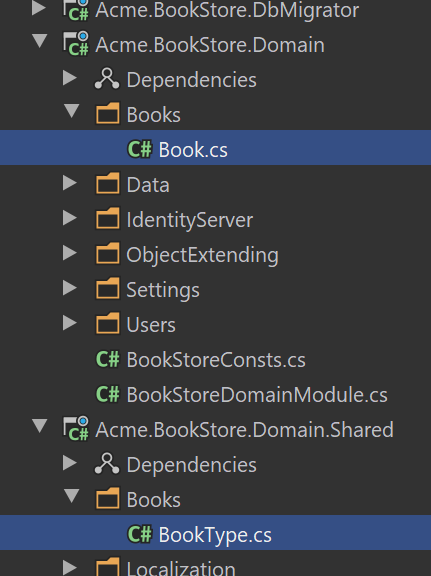
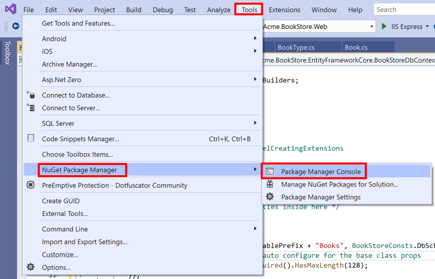
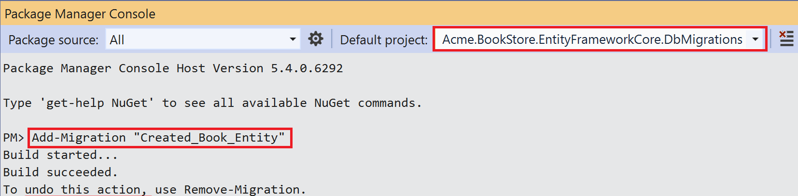
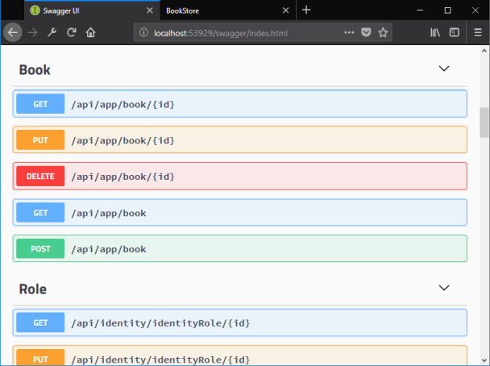

# Web Application Development Tutorial - Part 1: Creating the Server Side
````json
//[doc-params]
{
    "UI": ["MVC","Blazor","NG"],
    "DB": ["EF","Mongo"]
}
````
## About This Tutorial

In this tutorial series, you will build an ABP based web application named `Acme.BookStore`. This application is used to manage a list of books and their authors. It is developed using the following technologies:

* **{{DB_Value}}** as the database provider.
* **{{UI_Value}}** as the UI Framework.

This tutorial is organized as the following parts;

- **Part 1: Creating the server side (this part)**
- [Part 2: The book list page](Part-2.md)
- [Part 3: Creating, updating and deleting books](Part-3.md)
- [Part 4: Integration tests](Part-4.md)
- [Part 5: Authorization](Part-5.md)
- [Part 6: Authors: Domain layer](Part-6.md)
- [Part 7: Authors: Database Integration](Part-7.md)
- [Part 8: Authors: Application Layer](Part-8.md)
- [Part 9: Authors: User Interface](Part-9.md)
- [Part 10: Book to Author Relation](Part-10.md)

### Download the Source Code

This tutorial has multiple versions based on your **UI** and **Database** preferences. We've prepared a few combinations of the source code to be downloaded:

* [MVC (Razor Pages) UI with EF Core](https://github.com/abpframework/abp-samples/tree/master/BookStore-Mvc-EfCore)
* [Blazor UI with EF Core](https://github.com/abpframework/abp-samples/tree/master/BookStore-Blazor-EfCore)
* [Angular UI with MongoDB](https://github.com/abpframework/abp-samples/tree/master/BookStore-Angular-MongoDb)

{{if UI == "MVC" && DB == "EF"}}

### Video Tutorial

This part is also recorded as a video tutorial and **<a href="https://www.youtube.com/watch?v=cJzyIFfAlp8&list=PLsNclT2aHJcPNaCf7Io3DbMN6yAk_DgWJ&index=1" target="_blank">published on YouTube</a>**.

{{end}}

## Creating the Solution

Before starting to the development, create a new solution named `Acme.BookStore` and run it by following the [getting started tutorial](../Getting-Started.md).

## Create the Book Entity

**Domain layer** in the startup template is separated into two projects:

- `Acme.BookStore.Domain` contains your [entities](../Entities.md), [domain services](../Domain-Services.md) and other core domain objects.
- `Acme.BookStore.Domain.Shared` contains `constants`, `enums` or other domain related objects those can be shared with clients.

So, define your entities in the domain layer (`Acme.BookStore.Domain` project) of the solution. 

The main entity of the application is the `Book`. Create a `Books` folder (namespace) in the `Acme.BookStore.Domain` project and add a `Book` class inside it:

````csharp
using System;
using Volo.Abp.Domain.Entities.Auditing;

namespace Acme.BookStore.Books
{
    public class Book : AuditedAggregateRoot<Guid>
    {
        public string Name { get; set; }

        public BookType Type { get; set; }

        public DateTime PublishDate { get; set; }

        public float Price { get; set; }
    }
}
````

* ABP Framework has two fundamental base classes for entities: `AggregateRoot` and `Entity`. **Aggregate Root** is a [Domain Driven Design](../Domain-Driven-Design.md) concept which can be thought as a root entity that is directly queried and worked on (see the [entities document](../Entities.md) for more).
* `Book` entity inherits from the `AuditedAggregateRoot` which adds some base [auditing](../Audit-Logging.md) properties (like `CreationTime`, `CreatorId`, `LastModificationTime`...) on top of the `AggregateRoot` class. ABP automatically manages these properties for you.
* `Guid` is the **primary key type** of the `Book` entity.

> This tutorials leaves the entity properties with **public get/set** for the sake of simplicity. See the [entities document](../Entities.md) if you learn more about DDD best practices.

### BookType Enum

The `Book` entity uses the `BookType` enum. Create a `Books` folder (namespace) in the `Acme.BookStore.Domain.Shared` project and add a `BookType` inside it:

````csharp
namespace Acme.BookStore.Books
{
    public enum BookType
    {
        Undefined,
        Adventure,
        Biography,
        Dystopia,
        Fantastic,
        Horror,
        Science,
        ScienceFiction,
        Poetry
    }
}
````

The final folder/file structure should be as shown below:



### Add Book Entity to the DbContext

{{if DB == "EF"}}

EF Core requires to relate entities with your `DbContext`. The easiest way to do this is to add a `DbSet` property to the `BookStoreDbContext` class in the `Acme.BookStore.EntityFrameworkCore` project, as shown below:

````csharp
public class BookStoreDbContext : AbpDbContext<BookStoreDbContext>
{
    public DbSet<Book> Books { get; set; }
    //...
}
````

{{end}}

{{if DB == "Mongo"}}

Add a `IMongoCollection<Book> Books` property to the `BookStoreMongoDbContext` inside the `Acme.BookStore.MongoDB` project:

```csharp
public class BookStoreMongoDbContext : AbpMongoDbContext
{
    public IMongoCollection<Book> Books => Collection<Book>();
    //...
}
```

{{end}}

{{if DB == "EF"}}

### Map the Book Entity to a Database Table

Open `BookStoreDbContextModelCreatingExtensions.cs` file in the `Acme.BookStore.EntityFrameworkCore` project and add the mapping code for the `Book` entity. The final class should be the following:

````csharp
using Acme.BookStore.Books;
using Microsoft.EntityFrameworkCore;
using Volo.Abp;
using Volo.Abp.EntityFrameworkCore.Modeling;

namespace Acme.BookStore.EntityFrameworkCore
{
    public static class BookStoreDbContextModelCreatingExtensions
    {
        public static void ConfigureBookStore(this ModelBuilder builder)
        {
            Check.NotNull(builder, nameof(builder));

            /* Configure your own tables/entities inside here */

            builder.Entity<Book>(b =>
            {
                b.ToTable(BookStoreConsts.DbTablePrefix + "Books",
                          BookStoreConsts.DbSchema);
                b.ConfigureByConvention(); //auto configure for the base class props
                b.Property(x => x.Name).IsRequired().HasMaxLength(128);
            });
        }
    }
}
````

* `BookStoreConsts` has constant values for schema and table prefixes for your tables. You don't have to use it, but suggested to control the table prefixes in a single point.
* `ConfigureByConvention()` method gracefully configures/maps the inherited properties. Always use it for all your entities.

### Add Database Migration

The startup template uses [EF Core Code First Migrations](https://docs.microsoft.com/en-us/ef/core/managing-schemas/migrations/) to create and maintain the database schema. Open the **Package Manager Console (PMC)** under the menu *Tools > NuGet Package Manager*.



Select the `Acme.BookStore.EntityFrameworkCore.DbMigrations` as the **default project** and execute the following command:

```bash
Add-Migration "Created_Book_Entity"
```



> If you get an error like "*Your startup project ... doesn't reference Microsoft.EntityFrameworkCore.Design. This package is required for the Entity Framework Core Tools to work*", right click to the `Acme.BookStore.EntityFrameworkCore.DbMigrations` project and **Set as the Startup Project** and try again.

This will create a new migration class inside the `Migrations` folder of the `Acme.BookStore.EntityFrameworkCore.DbMigrations` project.

Before updating the database, read the section below to learn how to seed some initial data to the database.

> If you are using another IDE than the Visual Studio, you can use `dotnet-ef` tool as [documented here](https://docs.microsoft.com/en-us/ef/core/managing-schemas/migrations/?tabs=dotnet-core-cli#create-a-migration).

{{end}}

### Add Sample Seed Data

> It's good to have some initial data in the database before running the application. This section introduces the [Data Seeding](../Data-Seeding.md) system of the ABP framework. You can skip this section if you don't want to create seed data, but it is suggested to follow it to learn this useful ABP Framework feature.

Create a class deriving from the `IDataSeedContributor` in the `*.Domain` project by copying the following code:

```csharp
using System;
using System.Threading.Tasks;
using Acme.BookStore.Books;
using Volo.Abp.Data;
using Volo.Abp.DependencyInjection;
using Volo.Abp.Domain.Repositories;

namespace Acme.BookStore
{
    public class BookStoreDataSeederContributor
        : IDataSeedContributor, ITransientDependency
    {
        private readonly IRepository<Book, Guid> _bookRepository;

        public BookStoreDataSeederContributor(IRepository<Book, Guid> bookRepository)
        {
            _bookRepository = bookRepository;
        }

        public async Task SeedAsync(DataSeedContext context)
        {
            if (await _bookRepository.GetCountAsync() <= 0)
            {
                await _bookRepository.InsertAsync(
                    new Book
                    {
                        Name = "1984",
                        Type = BookType.Dystopia,
                        PublishDate = new DateTime(1949, 6, 8),
                        Price = 19.84f
                    },
                    autoSave: true
                );

                await _bookRepository.InsertAsync(
                    new Book
                    {
                        Name = "The Hitchhiker's Guide to the Galaxy",
                        Type = BookType.ScienceFiction,
                        PublishDate = new DateTime(1995, 9, 27),
                        Price = 42.0f
                    },
                    autoSave: true
                );
            }
        }
    }
}
```

* This code simply uses the `IRepository<Book, Guid>` (the default [repository](../Repositories.md)) to insert two books to the database, if there is no book currently in the database.

### Update the Database

Run the `Acme.BookStore.DbMigrator` application to update the database:


`.DbMigrator` is a console application that can be run to **migrate the database schema** and **seed the data** on **development** and **production** environments.

## Create the Application Service

The application layer is separated into two projects:

* `Acme.BookStore.Application.Contracts` contains your [DTO](../Data-Transfer-Objects.md)s and [application service](../Application-Services.md) interfaces.
* `Acme.BookStore.Application` contains the implementations of your application services.

In this section, you will create an application service to get, create, update and delete books using the `CrudAppService` base class of the ABP Framework.

### BookDto

`CrudAppService` base class requires to define the fundamental DTOs for the entity. Create a `Books` folder (namespace) in the `Acme.BookStore.Application.Contracts` project and add a `BookDto` class inside it:

````csharp
using System;
using Volo.Abp.Application.Dtos;

namespace Acme.BookStore.Books
{
    public class BookDto : AuditedEntityDto<Guid>
    {
        public string Name { get; set; }

        public BookType Type { get; set; }

        public DateTime PublishDate { get; set; }

        public float Price { get; set; }
    }
}
````

* **DTO** classes are used to **transfer data** between the *presentation layer* and the *application layer*. See the [Data Transfer Objects document](https://docs.abp.io/en/abp/latest/Data-Transfer-Objects) for more details.
* `BookDto` is used to transfer book data to the presentation layer in order to show the book information on the UI.
* `BookDto` is derived from the `AuditedEntityDto<Guid>` which has audit properties just like the `Book` entity defined above.

It will be needed to map `Book` entities to `BookDto` objects while returning books to the presentation layer. [AutoMapper](https://automapper.org) library can automate this conversion when you define the proper mapping. The startup template comes with AutoMapper pre-configured. So, you can just define the mapping in the `BookStoreApplicationAutoMapperProfile` class in the `Acme.BookStore.Application` project:

````csharp
using Acme.BookStore.Books;
using AutoMapper;

namespace Acme.BookStore
{
    public class BookStoreApplicationAutoMapperProfile : Profile
    {
        public BookStoreApplicationAutoMapperProfile()
        {
            CreateMap<Book, BookDto>();
        }
    }
}
````

> See the [object to object mapping](../Object-To-Object-Mapping.md) document for details.

### CreateUpdateBookDto

Create a `CreateUpdateBookDto` class in the `Books` folder (namespace) of the `Acme.BookStore.Application.Contracts` project:

````csharp
using System;
using System.ComponentModel.DataAnnotations;

namespace Acme.BookStore.Books
{
    public class CreateUpdateBookDto
    {
        [Required]
        [StringLength(128)]
        public string Name { get; set; }

        [Required]
        public BookType Type { get; set; } = BookType.Undefined;

        [Required]
        [DataType(DataType.Date)]
        public DateTime PublishDate { get; set; } = DateTime.Now;

        [Required]
        public float Price { get; set; }
    }
}
````

* This `DTO` class is used to get book information from the user interface while creating or updating a book.
* It defines data annotation attributes (like `[Required]`) to define validations for the properties. `DTO`s are [automatically validated](https://docs.abp.io/en/abp/latest/Validation) by the ABP framework.

Just like done for the `BookDto` above, we should define the mapping from the `CreateUpdateBookDto` object to the `Book` entity. The final class will be like shown below:

````csharp
using Acme.BookStore.Books;
using AutoMapper;

namespace Acme.BookStore
{
    public class BookStoreApplicationAutoMapperProfile : Profile
    {
        public BookStoreApplicationAutoMapperProfile()
        {
            CreateMap<Book, BookDto>();
            CreateMap<CreateUpdateBookDto, Book>();
        }
    }
}
````

### IBookAppService

Next step is to define an interface for the application service. Create an `IBookAppService` interface in the `Books` folder (namespace) of the `Acme.BookStore.Application.Contracts` project:

````csharp
using System;
using Volo.Abp.Application.Dtos;
using Volo.Abp.Application.Services;

namespace Acme.BookStore.Books
{
    public interface IBookAppService :
        ICrudAppService< //Defines CRUD methods
            BookDto, //Used to show books
            Guid, //Primary key of the book entity
            PagedAndSortedResultRequestDto, //Used for paging/sorting
            CreateUpdateBookDto> //Used to create/update a book
    {

    }
}
````

* Defining interfaces for the application services **are not required** by the framework. However, it's suggested as a best practice.
* `ICrudAppService` defines common **CRUD** methods: `GetAsync`, `GetListAsync`, `CreateAsync`, `UpdateAsync` and `DeleteAsync`. It's not required to extend it. Instead, you could inherit from the empty `IApplicationService` interface and define your own methods manually (which will be done for the authors in the next parts).
* There are some variations of the `ICrudAppService` where you can use separated DTOs for each method (like using different DTOs for create and update).

### BookAppService

It is time to implement the `IBookAppService` interface. Create a new class, named `BookAppService` in the `Books` namespace (folder) of the `Acme.BookStore.Application` project:

````csharp
using System;
using Volo.Abp.Application.Dtos;
using Volo.Abp.Application.Services;
using Volo.Abp.Domain.Repositories;

namespace Acme.BookStore.Books
{
    public class BookAppService :
        CrudAppService<
            Book, //The Book entity
            BookDto, //Used to show books
            Guid, //Primary key of the book entity
            PagedAndSortedResultRequestDto, //Used for paging/sorting
            CreateUpdateBookDto>, //Used to create/update a book
        IBookAppService //implement the IBookAppService
    {
        public BookAppService(IRepository<Book, Guid> repository)
            : base(repository)
        {

        }
    }
}
````

* `BookAppService` is derived from `CrudAppService<...>` which implements all the CRUD (create, read, update, delete) methods defined by the `ICrudAppService`.
* `BookAppService` injects `IRepository<Book, Guid>` which is the default repository for the `Book` entity. ABP automatically creates default repositories for each aggregate root (or entity). See the [repository document](https://docs.abp.io/en/abp/latest/Repositories).
* `BookAppService` uses `IObjectMapper` service ([see](../Object-To-Object-Mapping.md)) to map `Book` objects to `BookDto` objects and `CreateUpdateBookDto` objects to `Book` objects. The Startup template uses the [AutoMapper](http://automapper.org/) library as the object mapping provider. We have defined the mappings before, so it will work as expected.

## Auto API Controllers

In a typical ASP.NET Core application, you create **API Controllers** to expose application services as **HTTP API** endpoints. This allows browsers or 3rd-party clients to call them over HTTP.

ABP can [**automagically**](../API/Auto-API-Controllers.md) configures your application services as MVC API Controllers by convention.

### Swagger UI

The startup template is configured to run the [Swagger UI](https://swagger.io/tools/swagger-ui/) using the [Swashbuckle.AspNetCore](https://github.com/domaindrivendev/Swashbuckle.AspNetCore) library. Run the application ({{if UI=="MVC"}}`Acme.BookStore.Web`{{else}}`Acme.BookStore.HttpApi.Host`{{end}}) by pressing `CTRL+F5` and navigate to `https://localhost:<port>/swagger/` on your browser. Replace `<port>` with your own port number.

You will see some built-in service endpoints as well as the `Book` service and its REST-style endpoints:



Swagger has a nice interface to test the APIs.

If you try to execute the `[GET] /api/app/book` API to get a list of books, the server returns such a JSON result:

````json
{
  "totalCount": 2,
  "items": [
    {
      "name": "The Hitchhiker's Guide to the Galaxy",
      "type": 7,
      "publishDate": "1995-09-27T00:00:00",
      "price": 42,
      "lastModificationTime": null,
      "lastModifierId": null,
      "creationTime": "2020-07-03T21:04:18.4607218",
      "creatorId": null,
      "id": "86100bb6-cbc1-25be-6643-39f62806969c"
    },
    {
      "name": "1984",
      "type": 3,
      "publishDate": "1949-06-08T00:00:00",
      "price": 19.84,
      "lastModificationTime": null,
      "lastModifierId": null,
      "creationTime": "2020-07-03T21:04:18.3174016",
      "creatorId": null,
      "id": "41055277-cce8-37d7-bb37-39f62806960b"
    }
  ]
}
````

That's pretty cool since we haven't written a single line of code to create the API controller, but now we have a fully working REST API!

## The Next Part

See the [next part](Part-2.md) of this tutorial.
