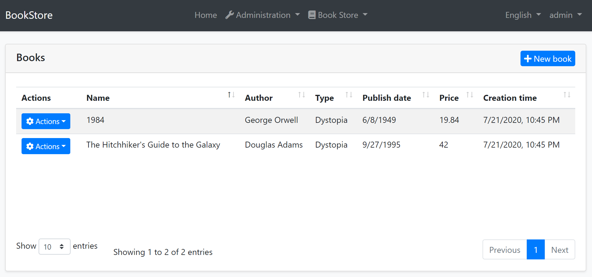
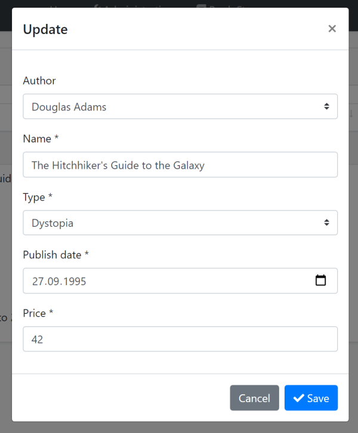
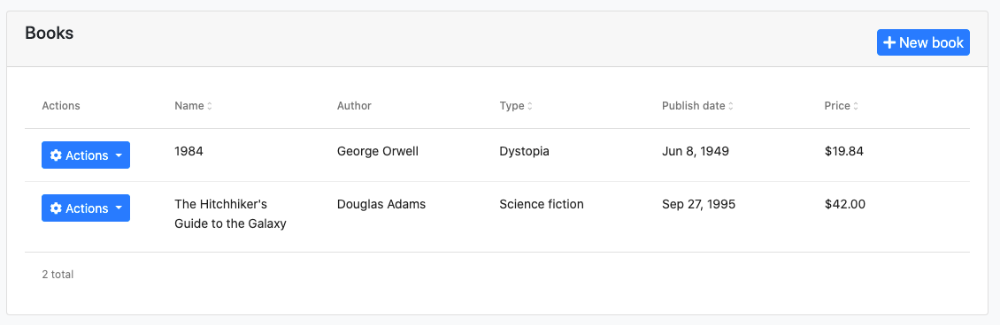
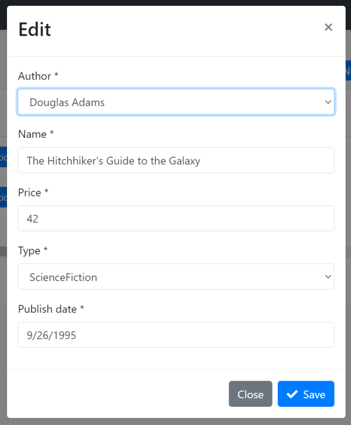
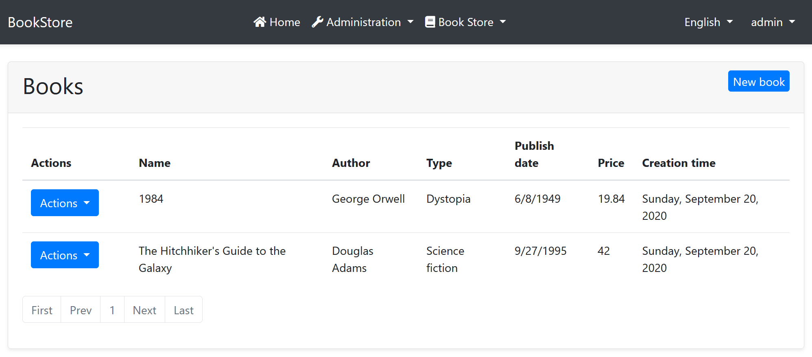
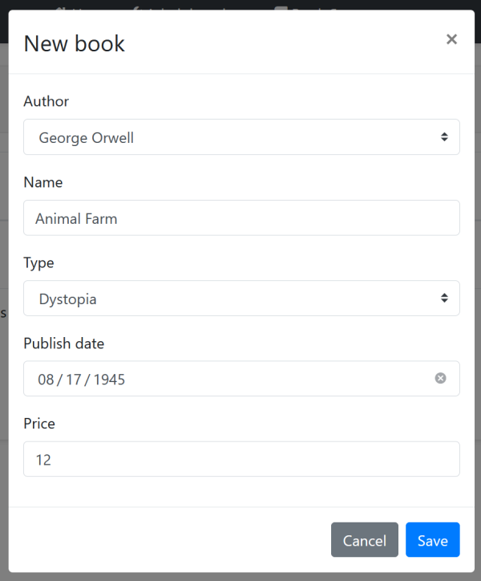

# Web Application Development Tutorial - Part 10: Book to Author Relation
````json
//[doc-params]
{
    "UI": ["MVC","Blazor","BlazorServer","NG"],
    "DB": ["EF","Mongo"]
}
````
## About This Tutorial

In this tutorial series, you will build an ABP based web application named `Acme.BookStore`. This application is used to manage a list of books and their authors. It is developed using the following technologies:

* **{{DB_Value}}** as the ORM provider.
* **{{UI_Value}}** as the UI Framework.

This tutorial is organized as the following parts;

- [Part 1: Creating the server side](Part-1.md)
- [Part 2: The book list page](Part-2.md)
- [Part 3: Creating, updating and deleting books](Part-3.md)
- [Part 4: Integration tests](Part-4.md)
- [Part 5: Authorization](Part-5.md)
- [Part 6: Authors: Domain layer](Part-6.md)
- [Part 7: Authors: Database Integration](Part-7.md)
- [Part 8: Authors: Application Layer](Part-8.md)
- [Part 9: Authors: User Interface](Part-9.md)
- **Part 10: Book to Author Relation (this part)**

### Download the Source Code

This tutorial has multiple versions based on your **UI** and **Database** preferences. We've prepared a few combinations of the source code to be downloaded:

* [MVC (Razor Pages) UI with EF Core](https://github.com/abpframework/abp-samples/tree/master/BookStore-Mvc-EfCore)
* [Blazor UI with EF Core](https://github.com/abpframework/abp-samples/tree/master/BookStore-Blazor-EfCore)
* [Angular UI with MongoDB](https://github.com/abpframework/abp-samples/tree/master/BookStore-Angular-MongoDb)

> If you encounter the "filename too long" or "unzip error" on Windows, it's probably related to the Windows maximum file path limitation. Windows has a maximum file path limitation of 250 characters. To solve this, [enable the long path option in Windows 10](https://docs.microsoft.com/en-us/windows/win32/fileio/maximum-file-path-limitation?tabs=cmd#enable-long-paths-in-windows-10-version-1607-and-later).

> If you face long path errors related to Git, try the following command to enable long paths in Windows. See https://github.com/msysgit/msysgit/wiki/Git-cannot-create-a-file-or-directory-with-a-long-path
> `git config --system core.longpaths true`

## Introduction

We have created `Book` and `Author` functionalities for the book store application. However, currently there is no relation between these entities.

In this tutorial, we will establish a **1 to N** relation between the `Author` and the `Book` entities.

## Add Relation to The Book Entity

Open the `Books/Book.cs` in the `Acme.BookStore.Domain` project and add the following property to the `Book` entity:

````csharp
public Guid AuthorId { get; set; }
````

{{if DB=="EF"}}

> In this tutorial, we preferred to not add a **navigation property** to the `Author` entity from the `Book` class (like `public Author Author { get; set; }`). This is due to follow the DDD best practices (rule: refer to other aggregates only by id). However, you can add such a navigation property and configure it for the EF Core. In this way, you don't need to write join queries while getting books with their authors (like we will done below) which makes your application code simpler.

{{end}}

## Database & Data Migration

Added a new, required `AuthorId` property to the `Book` entity. But, **what about the existing books** on the database? They currently don't have `AuthorId`s and this will be a problem when we try to run the application.

This is a **typical migration problem** and the decision depends on your case;

* If you haven't published your application to the production yet, you can just delete existing books in the database, or you can even delete the entire database in your development environment.
* You can update the existing data programmatically on data migration or seed phase.
* You can manually handle it on the database.

We prefer to **delete the database** {{if DB=="EF"}}(you can run the `Drop-Database` in the *Package Manager Console*){{end}} since this is just an example project and data loss is not important. Since this topic is not related to the ABP Framework, we don't go deeper for all the scenarios.

{{if DB=="EF"}}

### Update the EF Core Mapping

Locate to `OnModelCreating` method in the `BookStoreDbContext` class that under the `EntityFrameworkCore` folder of the `Acme.BookStore.EntityFrameworkCore` project and change the `builder.Entity<Book>` part as shown below:

````csharp
builder.Entity<Book>(b =>
{
    b.ToTable(BookStoreConsts.DbTablePrefix + "Books", BookStoreConsts.DbSchema);
    b.ConfigureByConvention(); //auto configure for the base class props
    b.Property(x => x.Name).IsRequired().HasMaxLength(128);

    // ADD THE MAPPING FOR THE RELATION
    b.HasOne<Author>().WithMany().HasForeignKey(x => x.AuthorId).IsRequired();
});
````

### Add New EF Core Migration

The startup solution is configured to use [Entity Framework Core Code First Migrations](https://docs.microsoft.com/en-us/ef/core/managing-schemas/migrations/). Since we've changed the database mapping configuration, we should create a new migration and apply changes to the database.

Open a command-line terminal in the directory of the `Acme.BookStore.EntityFrameworkCore` project and type the following command:

````bash
dotnet ef migrations add Added_AuthorId_To_Book
````

This should create a new migration class with the following code in its `Up` method:

````csharp
migrationBuilder.AddColumn<Guid>(
    name: "AuthorId",
    table: "AppBooks",
    nullable: false,
    defaultValue: new Guid("00000000-0000-0000-0000-000000000000"));

migrationBuilder.CreateIndex(
    name: "IX_AppBooks_AuthorId",
    table: "AppBooks",
    column: "AuthorId");

migrationBuilder.AddForeignKey(
    name: "FK_AppBooks_AppAuthors_AuthorId",
    table: "AppBooks",
    column: "AuthorId",
    principalTable: "AppAuthors",
    principalColumn: "Id",
    onDelete: ReferentialAction.Cascade);
````

* Adds an `AuthorId` field to the `AppBooks` table.
* Creates an index on the `AuthorId` field.
* Declares the foreign key to the `AppAuthors` table.

> If you are using Visual Studio, you may want to use `Add-Migration Added_AuthorId_To_Book -c BookStoreDbContext` and `Update-Database -Context BookStoreDbContext` commands in the *Package Manager Console (PMC)*. In this case, ensure that {{if UI=="MVC"}}`Acme.BookStore.Web`{{else if UI=="BlazorServer"}}`Acme.BookStore.Blazor`{{else if UI=="Blazor" || UI=="NG"}}`Acme.BookStore.HttpApi.Host`{{end}} is the startup project and `Acme.BookStore.EntityFrameworkCore` is the *Default Project* in PMC.

{{end}}

## Change the Data Seeder

Since the `AuthorId` is a required property of the `Book` entity, current data seeder code can not work. Open the `BookStoreDataSeederContributor` in the `Acme.BookStore.Domain` project and change as the following:

````csharp
using System;
using System.Threading.Tasks;
using Acme.BookStore.Authors;
using Acme.BookStore.Books;
using Volo.Abp.Data;
using Volo.Abp.DependencyInjection;
using Volo.Abp.Domain.Repositories;

namespace Acme.BookStore
{
    public class BookStoreDataSeederContributor
        : IDataSeedContributor, ITransientDependency
    {
        private readonly IRepository<Book, Guid> _bookRepository;
        private readonly IAuthorRepository _authorRepository;
        private readonly AuthorManager _authorManager;

        public BookStoreDataSeederContributor(
            IRepository<Book, Guid> bookRepository,
            IAuthorRepository authorRepository,
            AuthorManager authorManager)
        {
            _bookRepository = bookRepository;
            _authorRepository = authorRepository;
            _authorManager = authorManager;
        }

        public async Task SeedAsync(DataSeedContext context)
        {
            if (await _bookRepository.GetCountAsync() > 0)
            {
                return;
            }

            var orwell = await _authorRepository.InsertAsync(
                await _authorManager.CreateAsync(
                    "George Orwell",
                    new DateTime(1903, 06, 25),
                    "Orwell produced literary criticism and poetry, fiction and polemical journalism; and is best known for the allegorical novella Animal Farm (1945) and the dystopian novel Nineteen Eighty-Four (1949)."
                )
            );

            var douglas = await _authorRepository.InsertAsync(
                await _authorManager.CreateAsync(
                    "Douglas Adams",
                    new DateTime(1952, 03, 11),
                    "Douglas Adams was an English author, screenwriter, essayist, humorist, satirist and dramatist. Adams was an advocate for environmentalism and conservation, a lover of fast cars, technological innovation and the Apple Macintosh, and a self-proclaimed 'radical atheist'."
                )
            );

            await _bookRepository.InsertAsync(
                new Book
                {
                    AuthorId = orwell.Id, // SET THE AUTHOR
                    Name = "1984",
                    Type = BookType.Dystopia,
                    PublishDate = new DateTime(1949, 6, 8),
                    Price = 19.84f
                },
                autoSave: true
            );

            await _bookRepository.InsertAsync(
                new Book
                {
                    AuthorId = douglas.Id, // SET THE AUTHOR
                    Name = "The Hitchhiker's Guide to the Galaxy",
                    Type = BookType.ScienceFiction,
                    PublishDate = new DateTime(1995, 9, 27),
                    Price = 42.0f
                },
                autoSave: true
            );
        }
    }
}
````

The only change is that we set the `AuthorId` properties of the `Book` entities.

> Delete existing books or delete the database before executing the `DbMigrator`. See the *Database & Data Migration* section above for more info.

{{if DB=="EF"}}

You can now run the `.DbMigrator` console application to **migrate** the **database schema** and **seed** the initial data.

{{else if DB=="Mongo"}}

You can now run the `.DbMigrator` console application to **seed** the initial data.

{{end}}

## Application Layer

We will change the `BookAppService` to support the Author relation.

### Data Transfer Objects

Let's begin from the DTOs.

#### BookDto

Open the `BookDto` class in the `Books` folder of the `Acme.BookStore.Application.Contracts` project and add the following properties:

```csharp
public Guid AuthorId { get; set; }
public string AuthorName { get; set; }
```

The final `BookDto` class should be following:

```csharp
using System;
using Volo.Abp.Application.Dtos;

namespace Acme.BookStore.Books
{
    public class BookDto : AuditedEntityDto<Guid>
    {
        public Guid AuthorId { get; set; }

        public string AuthorName { get; set; }

        public string Name { get; set; }

        public BookType Type { get; set; }

        public DateTime PublishDate { get; set; }

        public float Price { get; set; }
    }
}
```

#### CreateUpdateBookDto

Open the `CreateUpdateBookDto` class in the `Books` folder of the `Acme.BookStore.Application.Contracts` project and add an `AuthorId` property as shown:

````csharp
public Guid AuthorId { get; set; }
````

#### AuthorLookupDto

Create a new class, `AuthorLookupDto`, inside the `Books` folder of the `Acme.BookStore.Application.Contracts` project:

````csharp
using System;
using Volo.Abp.Application.Dtos;

namespace Acme.BookStore.Books
{
    public class AuthorLookupDto : EntityDto<Guid>
    {
        public string Name { get; set; }
    }
}
````

This will be used in a new method that will be added to the `IBookAppService`.

### IBookAppService

Open the `IBookAppService` interface in the `Books` folder of the `Acme.BookStore.Application.Contracts` project and add a new method, named `GetAuthorLookupAsync`, as shown below:

````csharp
using System;
using System.Threading.Tasks;
using Volo.Abp.Application.Dtos;
using Volo.Abp.Application.Services;

namespace Acme.BookStore.Books
{
    public interface IBookAppService :
        ICrudAppService< //Defines CRUD methods
            BookDto, //Used to show books
            Guid, //Primary key of the book entity
            PagedAndSortedResultRequestDto, //Used for paging/sorting
            CreateUpdateBookDto> //Used to create/update a book
    {
        // ADD the NEW METHOD
        Task<ListResultDto<AuthorLookupDto>> GetAuthorLookupAsync();
    }
}
````

This new method will be used from the UI to get a list of authors and fill a dropdown list to select the author of a book.

### BookAppService

Open the `BookAppService` class in the `Books` folder of the `Acme.BookStore.Application` project and replace the file content with the following code:

{{if DB=="EF"}}

```csharp
using System;
using System.Collections.Generic;
using System.Linq;
using System.Linq.Dynamic.Core;
using System.Threading.Tasks;
using Acme.BookStore.Authors;
using Acme.BookStore.Permissions;
using Microsoft.AspNetCore.Authorization;
using Volo.Abp.Application.Dtos;
using Volo.Abp.Application.Services;
using Volo.Abp.Domain.Entities;
using Volo.Abp.Domain.Repositories;

namespace Acme.BookStore.Books
{
    [Authorize(BookStorePermissions.Books.Default)]
    public class BookAppService :
        CrudAppService<
            Book, //The Book entity
            BookDto, //Used to show books
            Guid, //Primary key of the book entity
            PagedAndSortedResultRequestDto, //Used for paging/sorting
            CreateUpdateBookDto>, //Used to create/update a book
        IBookAppService //implement the IBookAppService
    {
        private readonly IAuthorRepository _authorRepository;

        public BookAppService(
            IRepository<Book, Guid> repository,
            IAuthorRepository authorRepository)
            : base(repository)
        {
            _authorRepository = authorRepository;
            GetPolicyName = BookStorePermissions.Books.Default;
            GetListPolicyName = BookStorePermissions.Books.Default;
            CreatePolicyName = BookStorePermissions.Books.Create;
            UpdatePolicyName = BookStorePermissions.Books.Edit;
            DeletePolicyName = BookStorePermissions.Books.Create;
        }

        public override async Task<BookDto> GetAsync(Guid id)
        {
            //Get the IQueryable<Book> from the repository
            var queryable = await Repository.GetQueryableAsync();

            //Prepare a query to join books and authors
            var query = from book in queryable
                join author in await _authorRepository.GetQueryableAsync() on book.AuthorId equals author.Id
                where book.Id == id
                select new { book, author };

            //Execute the query and get the book with author
            var queryResult = await AsyncExecuter.FirstOrDefaultAsync(query);
            if (queryResult == null)
            {
                throw new EntityNotFoundException(typeof(Book), id);
            }

            var bookDto = ObjectMapper.Map<Book, BookDto>(queryResult.book);
            bookDto.AuthorName = queryResult.author.Name;
            return bookDto;
        }

        public override async Task<PagedResultDto<BookDto>> GetListAsync(PagedAndSortedResultRequestDto input)
        {
            //Get the IQueryable<Book> from the repository
            var queryable = await Repository.GetQueryableAsync();

            //Prepare a query to join books and authors
            var query = from book in queryable
                join author in await _authorRepository.GetQueryableAsync() on book.AuthorId equals author.Id
                select new {book, author};

            //Paging
            query = query
                .OrderBy(NormalizeSorting(input.Sorting))
                .Skip(input.SkipCount)
                .Take(input.MaxResultCount);

            //Execute the query and get a list
            var queryResult = await AsyncExecuter.ToListAsync(query);

            //Convert the query result to a list of BookDto objects
            var bookDtos = queryResult.Select(x =>
            {
                var bookDto = ObjectMapper.Map<Book, BookDto>(x.book);
                bookDto.AuthorName = x.author.Name;
                return bookDto;
            }).ToList();

            //Get the total count with another query
            var totalCount = await Repository.GetCountAsync();

            return new PagedResultDto<BookDto>(
                totalCount,
                bookDtos
            );
        }

        public async Task<ListResultDto<AuthorLookupDto>> GetAuthorLookupAsync()
        {
            var authors = await _authorRepository.GetListAsync();

            return new ListResultDto<AuthorLookupDto>(
                ObjectMapper.Map<List<Author>, List<AuthorLookupDto>>(authors)
            );
        }

        private static string NormalizeSorting(string sorting)
        {
            if (sorting.IsNullOrEmpty())
            {
                return $"book.{nameof(Book.Name)}";
            }

            if (sorting.Contains("authorName", StringComparison.OrdinalIgnoreCase))
            {
                return sorting.Replace(
                    "authorName",
                    "author.Name",
                    StringComparison.OrdinalIgnoreCase
                );
            }

            return $"book.{sorting}";
        }
    }
}
```

Let's see the changes we've done:

* Added `[Authorize(BookStorePermissions.Books.Default)]` to authorize the methods we've newly added/overrode (remember, authorize attribute is valid for all the methods of the class when it is declared for a class).
* Injected `IAuthorRepository` to query from the authors.
* Overrode the `GetAsync` method of the base `CrudAppService`, which returns a single `BookDto` object with the given `id`.
  * Used a simple LINQ expression to join books and authors and query them together for the given book id.
  * Used `AsyncExecuter.FirstOrDefaultAsync(...)` to execute the query and get a result. It is a way to use asynchronous LINQ extensions without depending on the database provider API. Check the [repository documentation](../Repositories.md) to understand why we've used it.
  * Throws an `EntityNotFoundException` which results an `HTTP 404` (not found) result if requested book was not present in the database.
  * Finally, created a `BookDto` object using the `ObjectMapper`, then assigning the `AuthorName` manually.
* Overrode the `GetListAsync` method of the base `CrudAppService`, which returns a list of books. The logic is similar to the previous method, so you can easily understand the code.
* Created a new method: `GetAuthorLookupAsync`. This simple gets all the authors. The UI uses this method to fill a dropdown list and select and author while creating/editing books.

{{else if DB=="Mongo"}}

```csharp
using System;
using System.Collections.Generic;
using System.Linq.Dynamic.Core;
using System.Linq;
using System.Threading.Tasks;
using Acme.BookStore.Authors;
using Acme.BookStore.Permissions;
using Microsoft.AspNetCore.Authorization;
using Volo.Abp.Application.Dtos;
using Volo.Abp.Application.Services;
using Volo.Abp.Domain.Repositories;

namespace Acme.BookStore.Books
{
    [Authorize(BookStorePermissions.Books.Default)]
    public class BookAppService :
        CrudAppService<
            Book, //The Book entity
            BookDto, //Used to show books
            Guid, //Primary key of the book entity
            PagedAndSortedResultRequestDto, //Used for paging/sorting
            CreateUpdateBookDto>, //Used to create/update a book
        IBookAppService //implement the IBookAppService
    {
        private readonly IAuthorRepository _authorRepository;

        public BookAppService(
            IRepository<Book, Guid> repository,
            IAuthorRepository authorRepository)
            : base(repository)
        {
            _authorRepository = authorRepository;
            GetPolicyName = BookStorePermissions.Books.Default;
            GetListPolicyName = BookStorePermissions.Books.Default;
            CreatePolicyName = BookStorePermissions.Books.Create;
            UpdatePolicyName = BookStorePermissions.Books.Edit;
            DeletePolicyName = BookStorePermissions.Books.Create;
        }

        public async override Task<BookDto> GetAsync(Guid id)
        {
            var book = await Repository.GetAsync(id);
            var bookDto = ObjectMapper.Map<Book, BookDto>(book);

            var author = await _authorRepository.GetAsync(book.AuthorId);
            bookDto.AuthorName = author.Name;

            return bookDto;
        }

        public async override Task<PagedResultDto<BookDto>>
            GetListAsync(PagedAndSortedResultRequestDto input)
        {
            //Set a default sorting, if not provided
            if (input.Sorting.IsNullOrWhiteSpace())
            {
                input.Sorting = nameof(Book.Name);
            }

            //Get the IQueryable<Book> from the repository
            var queryable = await Repository.GetQueryableAsync();

            //Get the books
            var books = await AsyncExecuter.ToListAsync(
                queryable
                    .OrderBy(input.Sorting)
                    .Skip(input.SkipCount)
                    .Take(input.MaxResultCount)
            );

            //Convert to DTOs
            var bookDtos = ObjectMapper.Map<List<Book>, List<BookDto>>(books);

            //Get a lookup dictionary for the related authors
            var authorDictionary = await GetAuthorDictionaryAsync(books);

            //Set AuthorName for the DTOs
            bookDtos.ForEach(bookDto => bookDto.AuthorName =
                             authorDictionary[bookDto.AuthorId].Name);

            //Get the total count with another query (required for the paging)
            var totalCount = await Repository.GetCountAsync();

            return new PagedResultDto<BookDto>(
                totalCount,
                bookDtos
            );
        }

        public async Task<ListResultDto<AuthorLookupDto>> GetAuthorLookupAsync()
        {
            var authors = await _authorRepository.GetListAsync();

            return new ListResultDto<AuthorLookupDto>(
                ObjectMapper.Map<List<Author>, List<AuthorLookupDto>>(authors)
            );
        }

        private async Task<Dictionary<Guid, Author>>
            GetAuthorDictionaryAsync(List<Book> books)
        {
            var authorIds = books
                .Select(b => b.AuthorId)
                .Distinct()
                .ToArray();

            var queryable = await _authorRepository.GetQueryableAsync();

            var authors = await AsyncExecuter.ToListAsync(
                queryable.Where(a => authorIds.Contains(a.Id))
            );

            return authors.ToDictionary(x => x.Id, x => x);
        }
    }
}
```

Let's see the changes we've done:

* Added `[Authorize(BookStorePermissions.Books.Default)]` to authorize the methods we've newly added/overrode (remember, authorize attribute is valid for all the methods of the class when it is declared for a class).
* Injected `IAuthorRepository` to query from the authors.
* Overrode the `GetAsync` method of the base `CrudAppService`, which returns a single `BookDto` object with the given `id`.
* Overrode the `GetListAsync` method of the base `CrudAppService`, which returns a list of books. This code separately queries the authors from database and sets the name of the authors in the application code. Instead, you could create a custom repository method and perform a join query or take the power of the MongoDB API to get the books and their authors in a single query, which would be more performant.
* Created a new method: `GetAuthorLookupAsync`. This simple gets all the authors. The UI uses this method to fill a dropdown list and select and author while creating/editing books.

{{end}}

### Object to Object Mapping Configuration

Introduced the `AuthorLookupDto` class and used object mapping inside the `GetAuthorLookupAsync` method. So, we need to add a new mapping definition inside the `BookStoreApplicationAutoMapperProfile.cs` file of the `Acme.BookStore.Application` project:

````csharp
CreateMap<Author, AuthorLookupDto>();
````

## Unit Tests

Some of the unit tests will fail since we made some changed on the `AuthorAppService`. Open the `BookAppService_Tests` in the `Books` folder of the `Acme.BookStore.Application.Tests` project and change the content as the following:

```csharp
using System;
using System.Linq;
using System.Threading.Tasks;
using Acme.BookStore.Authors;
using Shouldly;
using Volo.Abp.Application.Dtos;
using Volo.Abp.Validation;
using Xunit;

namespace Acme.BookStore.Books
{ {{if DB=="Mongo"}}
    [Collection(BookStoreTestConsts.CollectionDefinitionName)]{{end}}
    public class BookAppService_Tests : BookStoreApplicationTestBase
    {
        private readonly IBookAppService _bookAppService;
        private readonly IAuthorAppService _authorAppService;

        public BookAppService_Tests()
        {
            _bookAppService = GetRequiredService<IBookAppService>();
            _authorAppService = GetRequiredService<IAuthorAppService>();
        }

        [Fact]
        public async Task Should_Get_List_Of_Books()
        {
            //Act
            var result = await _bookAppService.GetListAsync(
                new PagedAndSortedResultRequestDto()
            );

            //Assert
            result.TotalCount.ShouldBeGreaterThan(0);
            result.Items.ShouldContain(b => b.Name == "1984" &&
                                       b.AuthorName == "George Orwell");
        }

        [Fact]
        public async Task Should_Create_A_Valid_Book()
        {
            var authors = await _authorAppService.GetListAsync(new GetAuthorListDto());
            var firstAuthor = authors.Items.First();

            //Act
            var result = await _bookAppService.CreateAsync(
                new CreateUpdateBookDto
                {
                    AuthorId = firstAuthor.Id,
                    Name = "New test book 42",
                    Price = 10,
                    PublishDate = System.DateTime.Now,
                    Type = BookType.ScienceFiction
                }
            );

            //Assert
            result.Id.ShouldNotBe(Guid.Empty);
            result.Name.ShouldBe("New test book 42");
        }

        [Fact]
        public async Task Should_Not_Create_A_Book_Without_Name()
        {
            var exception = await Assert.ThrowsAsync<AbpValidationException>(async () =>
            {
                await _bookAppService.CreateAsync(
                    new CreateUpdateBookDto
                    {
                        Name = "",
                        Price = 10,
                        PublishDate = DateTime.Now,
                        Type = BookType.ScienceFiction
                    }
                );
            });

            exception.ValidationErrors
                .ShouldContain(err => err.MemberNames.Any(m => m == "Name"));
        }
    }
}
```

* Changed the assertion condition in the `Should_Get_List_Of_Books` from `b => b.Name == "1984"` to `b => b.Name == "1984" && b.AuthorName == "George Orwell"` to check if the author name was filled.
* Changed the `Should_Create_A_Valid_Book` method to set the `AuthorId` while creating a new book, since it is required anymore.

## The User Interface

{{if UI=="MVC"}}

### The Book List

Book list page change is trivial. Open the `Pages/Books/Index.js` in the `Acme.BookStore.Web` project and add the following column definition between the `name` and `type` columns:

````js
...
{
    title: l('Name'),
    data: "name"
},

// ADDED the NEW AUTHOR NAME COLUMN
{
    title: l('Author'),
    data: "authorName"
},

{
    title: l('Type'),
    data: "type",
    render: function (data) {
        return l('Enum:BookType:' + data);
    }
},
...
````

When you run the application, you can see the *Author* column on the table:



### Create Modal

Open the `Pages/Books/CreateModal.cshtml.cs` in the `Acme.BookStore.Web` project and change the file content as shown below:

```csharp
using System;
using System.Collections.Generic;
using System.ComponentModel;
using System.ComponentModel.DataAnnotations;
using System.Linq;
using System.Threading.Tasks;
using Acme.BookStore.Books;
using Microsoft.AspNetCore.Mvc;
using Microsoft.AspNetCore.Mvc.Rendering;
using Volo.Abp.AspNetCore.Mvc.UI.Bootstrap.TagHelpers.Form;

namespace Acme.BookStore.Web.Pages.Books
{
    public class CreateModalModel : BookStorePageModel
    {
        [BindProperty]
        public CreateBookViewModel Book { get; set; }

        public List<SelectListItem> Authors { get; set; }

        private readonly IBookAppService _bookAppService;

        public CreateModalModel(
            IBookAppService bookAppService)
        {
            _bookAppService = bookAppService;
        }

        public async Task OnGetAsync()
        {
            Book = new CreateBookViewModel();

            var authorLookup = await _bookAppService.GetAuthorLookupAsync();
            Authors = authorLookup.Items
                .Select(x => new SelectListItem(x.Name, x.Id.ToString()))
                .ToList();
        }

        public async Task<IActionResult> OnPostAsync()
        {
            await _bookAppService.CreateAsync(
                ObjectMapper.Map<CreateBookViewModel, CreateUpdateBookDto>(Book)
                );
            return NoContent();
        }

        public class CreateBookViewModel
        {
            [SelectItems(nameof(Authors))]
            [DisplayName("Author")]
            public Guid AuthorId { get; set; }

            [Required]
            [StringLength(128)]
            public string Name { get; set; }

            [Required]
            public BookType Type { get; set; } = BookType.Undefined;

            [Required]
            [DataType(DataType.Date)]
            public DateTime PublishDate { get; set; } = DateTime.Now;

            [Required]
            public float Price { get; set; }
        }
    }
}
```

* Changed type of the `Book` property from `CreateUpdateBookDto` to the new `CreateBookViewModel` class defined in this file. The main motivation of this change to customize the model class based on the User Interface (UI) requirements. We didn't want to use UI-related `[SelectItems(nameof(Authors))]` and `[DisplayName("Author")]` attributes inside the `CreateUpdateBookDto` class.
* Added `Authors` property that is filled inside the `OnGetAsync` method using the `IBookAppService.GetAuthorLookupAsync` method defined before.
* Changed the `OnPostAsync` method to map `CreateBookViewModel` object to a `CreateUpdateBookDto`  object since `IBookAppService.CreateAsync` expects a parameter of this type.

### Edit Modal

Open the `Pages/Books/EditModal.cshtml.cs` in the `Acme.BookStore.Web` project and change the file content as shown below:

```csharp
using System;
using System.Collections.Generic;
using System.ComponentModel;
using System.ComponentModel.DataAnnotations;
using System.Linq;
using System.Threading.Tasks;
using Acme.BookStore.Books;
using Microsoft.AspNetCore.Mvc;
using Microsoft.AspNetCore.Mvc.Rendering;
using Volo.Abp.AspNetCore.Mvc.UI.Bootstrap.TagHelpers.Form;

namespace Acme.BookStore.Web.Pages.Books
{
    public class EditModalModel : BookStorePageModel
    {
        [BindProperty]
        public EditBookViewModel Book { get; set; }

        public List<SelectListItem> Authors { get; set; }

        private readonly IBookAppService _bookAppService;

        public EditModalModel(IBookAppService bookAppService)
        {
            _bookAppService = bookAppService;
        }

        public async Task OnGetAsync(Guid id)
        {
            var bookDto = await _bookAppService.GetAsync(id);
            Book = ObjectMapper.Map<BookDto, EditBookViewModel>(bookDto);

            var authorLookup = await _bookAppService.GetAuthorLookupAsync();
            Authors = authorLookup.Items
                .Select(x => new SelectListItem(x.Name, x.Id.ToString()))
                .ToList();
        }

        public async Task<IActionResult> OnPostAsync()
        {
            await _bookAppService.UpdateAsync(
                Book.Id,
                ObjectMapper.Map<EditBookViewModel, CreateUpdateBookDto>(Book)
            );

            return NoContent();
        }

        public class EditBookViewModel
        {
            [HiddenInput]
            public Guid Id { get; set; }

            [SelectItems(nameof(Authors))]
            [DisplayName("Author")]
            public Guid AuthorId { get; set; }

            [Required]
            [StringLength(128)]
            public string Name { get; set; }

            [Required]
            public BookType Type { get; set; } = BookType.Undefined;

            [Required]
            [DataType(DataType.Date)]
            public DateTime PublishDate { get; set; } = DateTime.Now;

            [Required]
            public float Price { get; set; }
        }
    }
}
```

* Changed type of the `Book` property from `CreateUpdateBookDto` to the new `EditBookViewModel` class defined in this file, just like done before for the create modal above.
* Moved the `Id` property inside the new `EditBookViewModel` class.
* Added `Authors` property that is filled inside the `OnGetAsync` method using the `IBookAppService.GetAuthorLookupAsync` method.
* Changed the `OnPostAsync` method to map `EditBookViewModel` object to a `CreateUpdateBookDto`  object since `IBookAppService.UpdateAsync` expects a parameter of this type.

These changes require a small change in the `EditModal.cshtml`. Remove the `<abp-input asp-for="Id" />` tag since we no longer need to it (since moved it to the `EditBookViewModel`). The final content of the `EditModal.cshtml` should be following:

````html
@page
@using Acme.BookStore.Localization
@using Acme.BookStore.Web.Pages.Books
@using Microsoft.Extensions.Localization
@using Volo.Abp.AspNetCore.Mvc.UI.Bootstrap.TagHelpers.Modal
@model EditModalModel
@inject IStringLocalizer<BookStoreResource> L
@{
    Layout = null;
}
<abp-dynamic-form abp-model="Book" asp-page="/Books/EditModal">
    <abp-modal>
        <abp-modal-header title="@L["Update"].Value"></abp-modal-header>
        <abp-modal-body>
            <abp-form-content />
        </abp-modal-body>
        <abp-modal-footer buttons="@(AbpModalButtons.Cancel|AbpModalButtons.Save)"></abp-modal-footer>
    </abp-modal>
</abp-dynamic-form>
````

### Object to Object Mapping Configuration

The changes above requires to define some object to object mappings. Open the `BookStoreWebAutoMapperProfile.cs` in the `Acme.BookStore.Web` project and add the following mapping definitions inside the constructor:

```csharp
CreateMap<Pages.Books.CreateModalModel.CreateBookViewModel, CreateUpdateBookDto>();
CreateMap<BookDto, Pages.Books.EditModalModel.EditBookViewModel>();
CreateMap<Pages.Books.EditModalModel.EditBookViewModel, CreateUpdateBookDto>();
```

You can run the application and try to create a new book or update an existing book. You will see a drop down list on the create/update form to select the author of the book:



{{else if UI=="NG"}}

### Service Proxy Generation

Since the HTTP APIs have been changed, you need to update Angular client side [service proxies](../UI/Angular/Service-Proxies.md). Before running `generate-proxy` command, your host must be up and running.

Run the following command in the `angular` folder (you may need to stop the angular application):

```bash
abp generate-proxy -t ng
```
This command will update the service proxy files under the `/src/app/proxy/` folder.

### The Book List

Book list page change is trivial. Open the `/src/app/book/book.component.html` and add the following column definition between the `Name` and `Type` columns:

````html
<ngx-datatable-column
  [name]="'::Author' | abpLocalization"
  prop="authorName"
  [sortable]="false"
></ngx-datatable-column>
````

When you run the application, you can see the *Author* column on the table:



### Create/Edit Forms

The next step is to add an Author selection (dropdown) to the create/edit forms. The final UI will look like the one shown below:



Added the Author dropdown as the first element in the form.

Open the `/src/app/book/book.component.ts` and and change the content as shown below:

````js
import { ListService, PagedResultDto } from '@abp/ng.core';
import { Component, OnInit } from '@angular/core';
import { BookService, BookDto, bookTypeOptions, AuthorLookupDto } from '@proxy/books';
import { FormGroup, FormBuilder, Validators } from '@angular/forms';
import { NgbDateNativeAdapter, NgbDateAdapter } from '@ng-bootstrap/ng-bootstrap';
import { ConfirmationService, Confirmation } from '@abp/ng.theme.shared';
import { Observable } from 'rxjs';
import { map } from 'rxjs/operators';

@Component({
  selector: 'app-book',
  templateUrl: './book.component.html',
  styleUrls: ['./book.component.scss'],
  providers: [ListService, { provide: NgbDateAdapter, useClass: NgbDateNativeAdapter }],
})
export class BookComponent implements OnInit {
  book = { items: [], totalCount: 0 } as PagedResultDto<BookDto>;

  form: FormGroup;

  selectedBook = {} as BookDto;

  authors$: Observable<AuthorLookupDto[]>;

  bookTypes = bookTypeOptions;

  isModalOpen = false;

  constructor(
    public readonly list: ListService,
    private bookService: BookService,
    private fb: FormBuilder,
    private confirmation: ConfirmationService
  ) {
    this.authors$ = bookService.getAuthorLookup().pipe(map((r) => r.items));
  }

  ngOnInit() {
    const bookStreamCreator = (query) => this.bookService.getList(query);

    this.list.hookToQuery(bookStreamCreator).subscribe((response) => {
      this.book = response;
    });
  }

  createBook() {
    this.selectedBook = {} as BookDto;
    this.buildForm();
    this.isModalOpen = true;
  }

  editBook(id: string) {
    this.bookService.get(id).subscribe((book) => {
      this.selectedBook = book;
      this.buildForm();
      this.isModalOpen = true;
    });
  }

  buildForm() {
    this.form = this.fb.group({
      authorId: [this.selectedBook.authorId || null, Validators.required],
      name: [this.selectedBook.name || null, Validators.required],
      type: [this.selectedBook.type || null, Validators.required],
      publishDate: [
        this.selectedBook.publishDate ? new Date(this.selectedBook.publishDate) : null,
        Validators.required,
      ],
      price: [this.selectedBook.price || null, Validators.required],
    });
  }

  save() {
    if (this.form.invalid) {
      return;
    }

    const request = this.selectedBook.id
      ? this.bookService.update(this.selectedBook.id, this.form.value)
      : this.bookService.create(this.form.value);

    request.subscribe(() => {
      this.isModalOpen = false;
      this.form.reset();
      this.list.get();
    });
  }

  delete(id: string) {
    this.confirmation.warn('::AreYouSureToDelete', 'AbpAccount::AreYouSure').subscribe((status) => {
      if (status === Confirmation.Status.confirm) {
        this.bookService.delete(id).subscribe(() => this.list.get());
      }
    });
  }
}
````

* Added imports for the `AuthorLookupDto`, `Observable` and `map`.
* Added `authors$: Observable<AuthorLookupDto[]>;` field after the `selectedBook`.
* Added `this.authors$ = bookService.getAuthorLookup().pipe(map((r) => r.items));` into the constructor.
* Added ` authorId: [this.selectedBook.authorId || null, Validators.required],` into the `buildForm()` function.

Open the `/src/app/book/book.component.html` and add the following form group just before the book name form group:

````html
<div class="form-group">
  <label for="author-id">Author</label><span> * </span>
  <select class="form-control" id="author-id" formControlName="authorId">
    <option [ngValue]="null">Select author</option>
    <option [ngValue]="author.id" *ngFor="let author of authors$ | async">
      
    </option>
  </select>
</div>
````

That's all. Just run the application and try to create or edit an author.

{{end}}

{{if UI == "Blazor" || UI == "BlazorServer"}}

### The Book List

It is very easy to show the *Author Name* in the book list. Open the `/Pages/Books.razor` file in the `Acme.BookStore.Blazor` project and add the following `DataGridColumn` definition just after the `Name` (book name) column:

````xml
<DataGridColumn TItem="BookDto"
                Field="@nameof(BookDto.AuthorName)"
                Caption="@L["Author"]"></DataGridColumn>
````

When you run the application, you can see the *Author* column on the table:



### Create Book Modal

Add the following field to the `@code` section of the `Books.razor` file:

````csharp
IReadOnlyList<AuthorLookupDto> authorList = Array.Empty<AuthorLookupDto>();
````

Override the `OnInitializedAsync` method and adding the following code:

````csharp
protected override async Task OnInitializedAsync()
{
    await base.OnInitializedAsync();
    authorList = (await AppService.GetAuthorLookupAsync()).Items;
}
````

* It is essential to call the `base.OnInitializedAsync()` since `AbpCrudPageBase` has some initialization code to be executed.

The final `@code` block should be the following:

````csharp
@code
{
    //ADDED A NEW FIELD
    IReadOnlyList<AuthorLookupDto> authorList = Array.Empty<AuthorLookupDto>();

    public Books() // Constructor
    {
        CreatePolicyName = BookStorePermissions.Books.Create;
        UpdatePolicyName = BookStorePermissions.Books.Edit;
        DeletePolicyName = BookStorePermissions.Books.Delete;
    }

    //GET AUTHORS ON INITIALIZATION
    protected override async Task OnInitializedAsync()
    {
        await base.OnInitializedAsync();
        authorList = (await AppService.GetAuthorLookupAsync()).Items;
    }
}
````

Finally, add the following `Field` definition into the `ModalBody` of the *Create* modal, as the first item, before the `Name` field:

````xml
<Field>
    <FieldLabel>@L["Author"]</FieldLabel>
    <Select TValue="Guid" @bind-SelectedValue="@NewEntity.AuthorId">
        <SelectItem TValue="Guid" Value="Guid.Empty">@L["PickAnAuthor"]</SelectItem>
        @foreach (var author in authorList)
        {
            <SelectItem TValue="Guid" Value="@author.Id">
                @author.Name
            </SelectItem>
        }
        </Select>
</Field>
````

This requires to add a new localization key to the `en.json` file:

````js
"PickAnAuthor": "Pick an author"
````

You can run the application to see the *Author Selection* while creating a new book:



### Edit Book Modal

Add the following `Field` definition into the `ModalBody` of the *Edit* modal, as the first item, before the `Name` field:

````xml
<Field>
    <FieldLabel>@L["Author"]</FieldLabel>
    <Select TValue="Guid" @bind-SelectedValue="@EditingEntity.AuthorId">
        @foreach (var author in authorList)
        {
            <SelectItem TValue="Guid" Value="@author.Id">
                @author.Name
            </SelectItem>
        }
    </Select>
</Field>
````

That's all. We are reusing the `authorList` defined for the *Create* modal.

{{end}}
