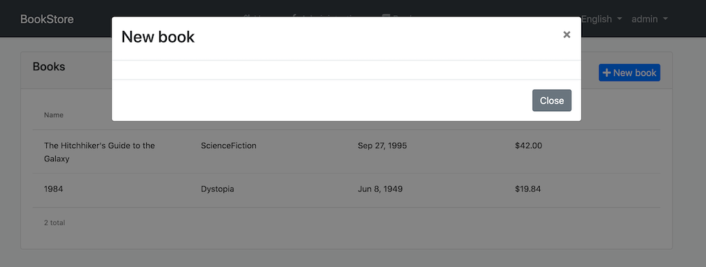
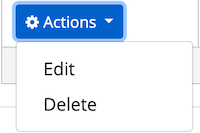

## ASP.NET Core {{UI_Value}} Tutorial - Part 2
````json
//[doc-params]
{
    "UI": ["MVC","NG"]
}
````

{{
if UI == "MVC"
  DB="ef"
  DB_Text="Entity Framework Core"
  UI_Text="mvc"
else if UI == "NG"
  DB="mongodb"
  DB_Text="MongoDB"
  UI_Text="angular"
else 
  DB ="?"
  UI_Text="?"
end
}}

### About this tutorial

This is the second part of the ASP.NET Core {{UI_Value}} tutorial series. All parts:

* [Part I: Creating the project and book list page](part-1.md)
* **Part II: Creating, updating and deleting books (this tutorial)**
* [Part III: Integration tests](part-3.md)

*You can also watch [this video course](https://amazingsolutions.teachable.com/p/lets-build-the-bookstore-application) prepared by an ABP community member, based on this tutorial.*

{{if UI == "MVC"}}

### Creating a new book

In this section, you will learn how to create a new modal dialog form to create a new book. The modal dialog will look like in the below image:


#### Create the modal form

Create a new razor page, named `CreateModal.cshtml` under the `Pages/Books` folder of the `Acme.BookStore.Web` project.


##### CreateModal.cshtml.cs

Open the `CreateModal.cshtml.cs` file (`CreateModalModel` class) and replace with the following code:

````C#
using System.Threading.Tasks;
using Microsoft.AspNetCore.Mvc;

namespace Acme.BookStore.Web.Pages.Books
{
    public class CreateModalModel : BookStorePageModel
    {
        [BindProperty]
        public CreateUpdateBookDto Book { get; set; }

        private readonly IBookAppService _bookAppService;

        public CreateModalModel(IBookAppService bookAppService)
        {
            _bookAppService = bookAppService;
        }

        public async Task<IActionResult> OnPostAsync()
        {
            await _bookAppService.CreateAsync(Book);
            return NoContent();
        }
    }
}
````

* This class is derived from the `BookStorePageModel` instead of standard `PageModel`. `BookStorePageModel` inherits the `PageModel` and adds some common properties & methods that can be used in your page model classes.
* `[BindProperty]` attribute on the `Book` property binds post request data to this property.
* This class simply injects the `IBookAppService` in the constructor and calls the `CreateAsync` method in the `OnPostAsync` handler.

##### CreateModal.cshtml

Open the `CreateModal.cshtml` file and paste the code below:

````html
@page
@inherits Acme.BookStore.Web.Pages.BookStorePage
@using Volo.Abp.AspNetCore.Mvc.UI.Bootstrap.TagHelpers.Modal
@model Acme.BookStore.Web.Pages.Books.CreateModalModel
@{
    Layout = null;
}
<abp-dynamic-form abp-model="Book" data-ajaxForm="true" asp-page="/Books/CreateModal">
    <abp-modal>
        <abp-modal-header title="@L["NewBook"].Value"></abp-modal-header>
        <abp-modal-body>
            <abp-form-content />
        </abp-modal-body>
        <abp-modal-footer buttons="@(AbpModalButtons.Cancel|AbpModalButtons.Save)"></abp-modal-footer>
    </abp-modal>
</abp-dynamic-form>
````

* This modal uses `abp-dynamic-form` tag helper to automatically create the form from the model  `CreateBookViewModel`.
  * `abp-model` attribute indicates the model object where it's the `Book` property in this case.
  * `data-ajaxForm` attribute sets the form to submit via AJAX, instead of a classic page post.
  * `abp-form-content` tag helper is a placeholder to render the form controls (it is optional and needed only if you have added some other content in the `abp-dynamic-form` tag, just like in this page).

#### Add the "New book" button

Open the `Pages/Books/Index.cshtml` and set the content of `abp-card-header` tag as below:

````html
<abp-card-header>
    <abp-row>
        <abp-column size-md="_6">
            <h2>@L["Books"]</h2>
        </abp-column>
        <abp-column size-md="_6" class="text-right">
            <abp-button id="NewBookButton"
                        text="@L["NewBook"].Value"
                        icon="plus"
                        button-type="Primary" />
        </abp-column>
    </abp-row>
</abp-card-header>
````

This adds a new button called **New book** to the **top-right** of the table:


Open the `pages/books/index.js` and add the following code just after the `Datatable` configuration:

````js
var createModal = new abp.ModalManager(abp.appPath + 'Books/CreateModal');

createModal.onResult(function () {
    dataTable.ajax.reload();
});

$('#NewBookButton').click(function (e) {
    e.preventDefault();
    createModal.open();
});
````

* `abp.ModalManager` is a helper class to manage modals in the client side. It internally uses Twitter Bootstrap's standard modal, but abstracts many details by providing a simple API.

Now, you can **run the application** and add new books using the new modal form.

### Updating a book

Create a new razor page, named `EditModal.cshtml` under the `Pages/Books` folder of the `Acme.BookStore.Web` project:


#### EditModal.cshtml.cs

Open the `EditModal.cshtml.cs` file (`EditModalModel` class) and replace with the following code:

````csharp
using System;
using System.Threading.Tasks;
using Microsoft.AspNetCore.Mvc;

namespace Acme.BookStore.Web.Pages.Books
{
    public class EditModalModel : BookStorePageModel
    {
        [HiddenInput]
        [BindProperty(SupportsGet = true)]
        public Guid Id { get; set; }

        [BindProperty]
        public CreateUpdateBookDto Book { get; set; }

        private readonly IBookAppService _bookAppService;

        public EditModalModel(IBookAppService bookAppService)
        {
            _bookAppService = bookAppService;
        }

        public async Task OnGetAsync()
        {
            var bookDto = await _bookAppService.GetAsync(Id);
            Book = ObjectMapper.Map<BookDto, CreateUpdateBookDto>(bookDto);
        }

        public async Task<IActionResult> OnPostAsync()
        {
            await _bookAppService.UpdateAsync(Id, Book);
            return NoContent();
        }
    }
}
````

* `[HiddenInput]` and `[BindProperty]` are standard ASP.NET Core MVC attributes. `SupportsGet` is used to be able to get `Id` value from query string parameter of the request.
* In the `GetAsync` method, we get `BookDto `from `BookAppService` and this is being mapped to the DTO object `CreateUpdateBookDto`.
* The `OnPostAsync` uses `BookAppService.UpdateAsync()` to update the entity.

#### Mapping from BookDto to CreateUpdateBookDto 

To be able to map the `BookDto` to `CreateUpdateBookDto`, configure a new mapping. To do this, open the `BookStoreWebAutoMapperProfile.cs` in the `Acme.BookStore.Web` project and change it as shown below:

````csharp
using AutoMapper;

namespace Acme.BookStore.Web
{
    public class BookStoreWebAutoMapperProfile : Profile
    {
        public BookStoreWebAutoMapperProfile()
        {
            CreateMap<BookDto, CreateUpdateBookDto>();
        }
    }
}
````

* We have just added `CreateMap<BookDto, CreateUpdateBookDto>();` to define this mapping.

#### EditModal.cshtml

Replace `EditModal.cshtml` content with the following content:

````html
@page
@inherits Acme.BookStore.Web.Pages.BookStorePage
@using Acme.BookStore.Web.Pages.Books
@using Volo.Abp.AspNetCore.Mvc.UI.Bootstrap.TagHelpers.Modal
@model EditModalModel
@{
    Layout = null;
}
<abp-dynamic-form abp-model="Book" data-ajaxForm="true" asp-page="/Books/EditModal">
    <abp-modal>
        <abp-modal-header title="@L["Update"].Value"></abp-modal-header>
        <abp-modal-body>
            <abp-input asp-for="Id" />
            <abp-form-content />
        </abp-modal-body>
        <abp-modal-footer buttons="@(AbpModalButtons.Cancel|AbpModalButtons.Save)"></abp-modal-footer>
    </abp-modal>
</abp-dynamic-form>
````

This page is very similar to the `CreateModal.cshtml`, except:

* It includes an `abp-input` for the `Id` property to store `Id` of the editing book (which is a hidden input).
* It uses `Books/EditModal` as the post URL and *Update* text as the modal header.

#### Add "Actions" dropdown to the table

We will add a dropdown button to the table named *Actions*. 

Open the `Pages/Books/Index.cshtml` page and change the `<abp-table>` section as shown below:

````html
<abp-table striped-rows="true" id="BooksTable">
    <thead>
        <tr>
            <th>@L["Actions"]</th>
            <th>@L["Name"]</th>
            <th>@L["Type"]</th>
            <th>@L["PublishDate"]</th>
            <th>@L["Price"]</th>
            <th>@L["CreationTime"]</th>
        </tr>
    </thead>
</abp-table>
````

* We just added a new `th` tag for the "*Actions*" button.

Open the `pages/books/index.js` and replace the content as below:

````js
$(function () {

    var l = abp.localization.getResource('BookStore');

    var createModal = new abp.ModalManager(abp.appPath + 'Books/CreateModal');
    var editModal = new abp.ModalManager(abp.appPath + 'Books/EditModal');

    var dataTable = $('#BooksTable').DataTable(abp.libs.datatables.normalizeConfiguration({
        processing: true,
        serverSide: true,
        paging: true,
        searching: false,
        autoWidth: false,
        scrollCollapse: true,
        order: [[1, "asc"]],
        ajax: abp.libs.datatables.createAjax(acme.bookStore.book.getList),
        columnDefs: [
            {
                rowAction: {
                    items:
                        [
                            {
                                text: l('Edit'),
                                action: function (data) {
                                    editModal.open({ id: data.record.id });
                                }
                            }
                        ]
                }
            },
            { data: "name" },
            { data: "type" },
            { data: "publishDate" },
            { data: "price" },
            { data: "creationTime" }
        ]
    }));

    createModal.onResult(function () {
        dataTable.ajax.reload();
    });

    editModal.onResult(function () {
        dataTable.ajax.reload();
    });

    $('#NewBookButton').click(function (e) {
        e.preventDefault();
        createModal.open();
    });
});
````

* Used `abp.localization.getResource('BookStore')` to be able to use the same localization texts defined on the server-side.
* Added a new `ModalManager` named `createModal` to open the create modal dialog.
* Added a new `ModalManager` named `editModal` to open the edit modal dialog.
* Added a new column at the beginning of the `columnDefs` section. This column is used for the "*Actions*" dropdown button.
* "*New Book*" action simply calls `createModal.open()` to open the create dialog.
* "*Edit*" action simply calls `editModal.open()` to open the edit dialog.

You can run the application and edit any book by selecting the edit action. The final UI looks as below:


### Deleting a book

Open the `pages/books/index.js` and add a new item to the `rowAction` `items`:

````js
{
    text: l('Delete'),
    confirmMessage: function (data) {
        return l('BookDeletionConfirmationMessage', data.record.name);
    },
    action: function (data) {
        acme.bookStore.book
            .delete(data.record.id)
            .then(function() {
                abp.notify.info(l('SuccessfullyDeleted'));
                dataTable.ajax.reload();
            });
    }
}
````

* `confirmMessage` option is used to ask a confirmation question before executing the `action`.
* `acme.bookStore.book.delete()` method makes an AJAX request to JavaScript proxy function to delete a book.
* `abp.notify.info()` shows a notification after the delete operation.

The final `index.js` content is shown below:

````js
$(function () {

    var l = abp.localization.getResource('BookStore');

    var createModal = new abp.ModalManager(abp.appPath + 'Books/CreateModal');
    var editModal = new abp.ModalManager(abp.appPath + 'Books/EditModal');

    var dataTable = $('#BooksTable').DataTable(abp.libs.datatables.normalizeConfiguration({
        processing: true,
        serverSide: true,
        paging: true,
        searching: false,
        autoWidth: false,
        scrollCollapse: true,
        order: [[1, "asc"]],
        ajax: abp.libs.datatables.createAjax(acme.bookStore.book.getList),
        columnDefs: [
            {
                rowAction: {
                    items:
                    [
                        {
                            text: l('Edit'),
                            action: function (data) {
                                editModal.open({ id: data.record.id });
                            }
                        },
                        {
                            text: l('Delete'),
                            confirmMessage: function (data) {
                                return l('BookDeletionConfirmationMessage', data.record.name);
                            },
                            action: function (data) {
                                acme.bookStore.book
                                    .delete(data.record.id)
                                    .then(function() {
                                        abp.notify.info(l('SuccessfullyDeleted'));
                                        dataTable.ajax.reload();
                                    });
                            }
                        }
                    ]
                }
            },
            { data: "name" },
            { data: "type" },
            { data: "publishDate" },
            { data: "price" },
            { data: "creationTime" }
        ]
    }));

    createModal.onResult(function () {
        dataTable.ajax.reload();
    });

    editModal.onResult(function () {
        dataTable.ajax.reload();
    });

    $('#NewBookButton').click(function (e) {
        e.preventDefault();
        createModal.open();
    });
});
````

Open the `en.json` in the `Acme.BookStore.Domain.Shared` project and add the following translations:

````json
"BookDeletionConfirmationMessage": "Are you sure to delete the book {0}?",
"SuccessfullyDeleted": "Successfully deleted"
````

Run the application and try to delete a book.

{{end}}

{{if UI == "NG"}}

### Creating a new book

In this section, you will learn how to create a new modal dialog form to create a new book.

#### State definitions

Open `book.action.ts` in `app\book\state` folder and replace the content as below:

```js
import { CreateUpdateBookDto } from '../models'; //<== added this line ==>

export class GetBooks {
  static readonly type = '[Book] Get';
}

// added CreateUpdateBook class
export class CreateUpdateBook {
  static readonly type = '[Book] Create Update Book';
  constructor(public payload: CreateUpdateBookDto) { }
}
```

* We imported the `CreateUpdateBookDto` model and created the `CreateUpdateBook` action.

Open `book.state.ts` file in `app\book\state` folder and replace the content as below:

```js
import { PagedResultDto } from '@abp/ng.core';
import { State, Action, StateContext, Selector } from '@ngxs/store';
import { GetBooks, CreateUpdateBook } from './book.actions'; // <== added CreateUpdateBook==>
import { BookService } from '../services';
import { tap } from 'rxjs/operators';
import { Injectable } from '@angular/core';
import { BookDto } from '../models';

export class BookStateModel {
  public book: PagedResultDto<BookDto>;
}

@State<BookStateModel>({
  name: 'BookState',
  defaults: { book: {} } as BookStateModel,
})
@Injectable()
export class BookState {
  @Selector()
  static getBooks(state: BookStateModel) {
    return state.book.items || [];
  }

  constructor(private bookService: BookService) {}

  @Action(GetBooks)
  get(ctx: StateContext<BookStateModel>) {
    return this.bookService.getListByInput().pipe(
      tap((bookResponse) => {
        ctx.patchState({
          book: bookResponse,
        });
      })
    );
  }

  // added CreateUpdateBook action listener
  @Action(CreateUpdateBook)
  save(ctx: StateContext<BookStateModel>, action: CreateUpdateBook) {
    return this.bookService.createByInput(action.payload);
  }
}
```

* We imported `CreateUpdateBook` action and defined the `save` method that will listen to a `CreateUpdateBook` action to create a book.

When the `SaveBook` action dispatched, the save method is being executed. It calls `createByInput` method of the `BookService`. 

#### Add a modal to BookListComponent

Open `book-list.component.html` file in `books\book-list` folder and replace the content as below:

```html
<div class="card">
  <div class="card-header">
    <div class="row">
      <div class="col col-md-6">
        <h5 class="card-title">
          
        </h5>
      </div>
       <!--Added new book button -->
      <div class="text-right col col-md-6">
        <div class="text-lg-right pt-2">
          <button
            id="create"
            class="btn btn-primary"
            type="button"
            (click)="createBook()"
          >
            <i class="fa fa-plus mr-1"></i>
            <span></span>
          </button>
        </div>
      </div>
    </div>
  </div>
  <div class="card-body">
    <abp-table
      [value]="books$ | async"
      [abpLoading]="loading"
      [headerTemplate]="tableHeader"
      [bodyTemplate]="tableBody"
      [rows]="10"
      [scrollable]="true"
    >
    </abp-table>
    <ng-template #tableHeader>
      <tr>
        <th></th>
        <th></th>
        <th></th>
        <th></th>
      </tr>
    </ng-template>
    <ng-template #tableBody let-data>
      <tr>
        <td></td>
        <td></td>
        <td></td>
        <td></td>
      </tr>
    </ng-template>
  </div>
</div>

<!--added modal-->
<abp-modal [(visible)]="isModalOpen">
    <ng-template #abpHeader>
        <h3></h3>
    </ng-template>

    <ng-template #abpBody> </ng-template>

    <ng-template #abpFooter>
        <button type="button" class="btn btn-secondary" #abpClose>
             
        </button>
    </ng-template>
</abp-modal>
```

* We added the `abp-modal` which renders a modal to allow user to create a new book. 
* `abp-modal` is a pre-built component to show modals. While you could use another approach to show a modal, `abp-modal` provides additional benefits.
* We added `New book` button to the `AbpContentToolbar`.

Open `book-list.component.ts` file in `app\book\book-list` folder and replace the content as below:

```js
import { Component, OnInit } from '@angular/core';
import { Select, Store } from '@ngxs/store';
import { Observable } from 'rxjs';
import { finalize } from 'rxjs/operators';
import { BookDto, BookType } from '../models';
import { GetBooks } from '../state/book.actions';
import { BookState } from '../state/book.state';

@Component({
  selector: 'app-book-list',
  templateUrl: './book-list.component.html',
  styleUrls: ['./book-list.component.scss'],
})
export class BookListComponent implements OnInit {
  @Select(BookState.getBooks)
  books$: Observable<BookDto[]>;

  booksType = BookType;

  loading = false;

  isModalOpen = false; // <== added this line ==>

  constructor(private store: Store) {}

  ngOnInit() {
    this.get();
  }

  get() {
    this.loading = true;
    this.store
      .dispatch(new GetBooks())
      .pipe(finalize(() => (this.loading = false)))
      .subscribe(() => {});
  }

  // added createBook method
  createBook() {
    this.isModalOpen = true;
  }
}
```

* We added `isModalOpen = false` and `createBook` method.

You can open your browser and click **New book** button to see the new modal.



#### Create a reactive form

[Reactive forms](https://angular.io/guide/reactive-forms) provide a model-driven approach to handling form inputs whose values change over time.

Open `book-list.component.ts` file in `app\book\book-list` folder and replace the content as below:

```js
import { Component, OnInit } from '@angular/core';
import { Select, Store } from '@ngxs/store';
import { Observable } from 'rxjs';
import { finalize } from 'rxjs/operators';
import { BookDto, BookType } from '../models';
import { GetBooks } from '../state/book.actions';
import { BookState } from '../state/book.state';
import { FormGroup, FormBuilder, Validators } from '@angular/forms'; // <== added this line ==>

@Component({
  selector: 'app-book-list',
  templateUrl: './book-list.component.html',
  styleUrls: ['./book-list.component.scss'],
})
export class BookListComponent implements OnInit {
  @Select(BookState.getBooks)
  books$: Observable<BookDto[]>;

  booksType = BookType;

  loading = false;

  isModalOpen = false;

  form: FormGroup; // <== added this line ==>

  constructor(private store: Store, private fb: FormBuilder) {} // <== added FormBuilder ==>

  ngOnInit() {
    this.get();
  }

  get() {
    this.loading = true;
    this.store
      .dispatch(new GetBooks())
      .pipe(finalize(() => (this.loading = false)))
      .subscribe(() => {});
  }

  createBook() {
    this.buildForm(); //<== added this line ==>
    this.isModalOpen = true;
  }

  // added buildForm method
  buildForm() {
    this.form = this.fb.group({
      name: ['', Validators.required],
      type: [null, Validators.required],
      publishDate: [null, Validators.required],
      price: [null, Validators.required],
    });
  }
}
```

* We imported `FormGroup, FormBuilder and Validators`.
* We added `form: FormGroup` variable.
* We injected `fb: FormBuilder` service to the constructor. The [FormBuilder](https://angular.io/api/forms/FormBuilder) service provides convenient methods for generating controls. It reduces the amount of boilerplate needed to build complex forms.
* We added `buildForm` method to the end of the file and executed  `buildForm()` in the `createBook` method. This method creates a reactive form to be able to create a new book.
  * The `group` method of `FormBuilder`, `fb` creates a `FormGroup`.
  * Added `Validators.required` static method which validates the relevant form element.

#### Create the DOM elements of the form

Open `book-list.component.html` in `app\books\book-list` folder and replace `<ng-template #abpBody> </ng-template>`  with the following code part:

```html
<ng-template #abpBody>
  <form [formGroup]="form">
    <div class="form-group">
      <label for="book-name">Name</label><span> * </span>
      <input type="text" id="book-name" class="form-control" formControlName="name" autofocus />
    </div>

    <div class="form-group">
      <label for="book-price">Price</label><span> * </span>
      <input type="number" id="book-price" class="form-control" formControlName="price" />
    </div>

    <div class="form-group">
      <label for="book-type">Type</label><span> * </span>
      <select class="form-control" id="book-type" formControlName="type">
        <option [ngValue]="null">Select a book type</option>
        <option [ngValue]="booksType[type]" *ngFor="let type of bookTypeArr"> </option>
      </select>
    </div>

    <div class="form-group">
      <label>Publish date</label><span> * </span>
      <input
        #datepicker="ngbDatepicker"
        class="form-control"
        name="datepicker"
        formControlName="publishDate"
        ngbDatepicker
        (click)="datepicker.toggle()"
      />
    </div>
  </form>
</ng-template>
```

- This template creates a form with `Name`, `Price`, `Type` and `Publish` date fields.
- We've used [NgBootstrap datepicker](https://ng-bootstrap.github.io/#/components/datepicker/overview) in this component.

#### Datepicker requirements

Open `book.module.ts` file in `app\book` folder and replace the content as below:

```js
import { NgModule } from '@angular/core';
import { CommonModule } from '@angular/common';
import { BookRoutingModule } from './book-routing.module';
import { BookListComponent } from './book-list/book-list.component';
import { SharedModule } from '../shared/shared.module';
import { NgbDatepickerModule } from '@ng-bootstrap/ng-bootstrap'; //<== added this line ==>

@NgModule({
  declarations: [BookListComponent],
  imports: [
    CommonModule,
    BookRoutingModule,
    SharedModule,
    NgbDatepickerModule, //<== added this line ==>
  ],
})
export class BookModule {}
```

* We imported `NgbDatepickerModule`  to be able to use the date picker.

Open `book-list.component.ts` file in `app\book\book-list` folder and replace the content as below:

```js
import { Component, OnInit } from '@angular/core';
import { Select, Store } from '@ngxs/store';
import { Observable } from 'rxjs';
import { finalize } from 'rxjs/operators';
import { BookDto, BookType } from '../models';
import { GetBooks } from '../state/book.actions';
import { BookState } from '../state/book.state';
import { FormGroup, FormBuilder, Validators } from '@angular/forms';
import { NgbDateNativeAdapter, NgbDateAdapter } from '@ng-bootstrap/ng-bootstrap'; // <== added this line ==>

@Component({
  selector: 'app-book-list',
  templateUrl: './book-list.component.html',
  styleUrls: ['./book-list.component.scss'],
  providers: [{ provide: NgbDateAdapter, useClass: NgbDateNativeAdapter }], // <== added this line ==>
})
export class BookListComponent implements OnInit {
  @Select(BookState.getBooks)
  books$: Observable<BookDto[]>;

  booksType = BookType;

  //added bookTypeArr array
  bookTypeArr = Object.keys(BookType).filter(
    (bookType) => typeof this.booksType[bookType] === 'number'
  );

  loading = false;

  isModalOpen = false;

  form: FormGroup;

  constructor(private store: Store, private fb: FormBuilder) {}

  ngOnInit() {
    this.get();
  }

  get() {
    this.loading = true;
    this.store
      .dispatch(new GetBooks())
      .pipe(finalize(() => (this.loading = false)))
      .subscribe(() => {});
  }

  createBook() {
    this.buildForm();
    this.isModalOpen = true;
  }

  buildForm() {
    this.form = this.fb.group({
      name: ['', Validators.required],
      type: [null, Validators.required],
      publishDate: [null, Validators.required],
      price: [null, Validators.required],
    });
  }
}
```

* We imported ` NgbDateNativeAdapter, NgbDateAdapter` 

* We added a new provider `NgbDateAdapter` that converts Datepicker value to `Date` type. See the [datepicker adapters](https://ng-bootstrap.github.io/#/components/datepicker/overview) for more details.

* We added `bookTypeArr` array to be able to use it in the combobox values. The `bookTypeArr` contains the fields of the `BookType` enum. Resulting array is shown below:

  ```js
  ['Adventure', 'Biography', 'Dystopia', 'Fantastic' ...]
  ```

  This array was used in the previous form template in the `ngFor` loop.

Now, you can open your browser to see the changes:


#### Saving the book

Open `book-list.component.ts` file in `app\book\book-list` folder and replace the content as below:

```js
import { Component, OnInit } from '@angular/core';
import { Select, Store } from '@ngxs/store';
import { Observable } from 'rxjs';
import { finalize } from 'rxjs/operators';
import { BookDto, BookType } from '../models';
import { GetBooks, CreateUpdateBook } from '../state/book.actions'; // <== added CreateUpdateBook ==>
import { BookState } from '../state/book.state';
import { FormGroup, FormBuilder, Validators } from '@angular/forms';
import { NgbDateNativeAdapter, NgbDateAdapter } from '@ng-bootstrap/ng-bootstrap';

@Component({
  selector: 'app-book-list',
  templateUrl: './book-list.component.html',
  styleUrls: ['./book-list.component.scss'],
  providers: [{ provide: NgbDateAdapter, useClass: NgbDateNativeAdapter }],
})
export class BookListComponent implements OnInit {
  @Select(BookState.getBooks)
  books$: Observable<BookDto[]>;

  booksType = BookType;

  bookTypeArr = Object.keys(BookType).filter(
    (bookType) => typeof this.booksType[bookType] === 'number'
  );

  loading = false;

  isModalOpen = false;

  form: FormGroup;

  constructor(private store: Store, private fb: FormBuilder) {}

  ngOnInit() {
    this.get();
  }

  get() {
    this.loading = true;
    this.store
      .dispatch(new GetBooks())
      .pipe(finalize(() => (this.loading = false)))
      .subscribe(() => {});
  }

  createBook() {
    this.buildForm();
    this.isModalOpen = true;
  }

  buildForm() {
    this.form = this.fb.group({
      name: ['', Validators.required],
      type: [null, Validators.required],
      publishDate: [null, Validators.required],
      price: [null, Validators.required],
    });
  }

  // <== added save ==>
  save() {
    if (this.form.invalid) {
      return;
    }

    this.store.dispatch(new CreateUpdateBook(this.form.value)).subscribe(() => {
      this.isModalOpen = false;
      this.form.reset();
      this.get();
    });
  }
}
```

* We imported `CreateUpdateBook`.
* We added `save` method

Open `book-list.component.html` in `app\book\book-list` folder and add the following `abp-button` to save the new book.

```html
<ng-template #abpFooter>
  <button type="button" class="btn btn-secondary" #abpClose>
      
  </button>
    
  <!--added save button-->
  <button class="btn btn-primary" (click)="save()" [disabled]="form.invalid">
        <i class="fa fa-check mr-1"></i>
        
  </button>
</ng-template>
```

Find the `<form [formGroup]="form">` tag and replace below content:

```html
<form [formGroup]="form" (ngSubmit)="save()"> <!-- added the ngSubmit -->
```

  
* We added the `(ngSubmit)="save()"` to `<form>` element to save a new book by pressing the enter.
* We added `abp-button` to the bottom area of the modal to save a new book.

The final modal UI looks like below:


### Updating a book

#### CreateUpdateBook action

Open the `book.actions.ts` in `app\book\state` folder and replace the content as below:

```js
import { CreateUpdateBookDto } from '../models';

export class GetBooks {
  static readonly type = '[Book] Get';
}

export class CreateUpdateBook {
  static readonly type = '[Book] Create Update Book';
  constructor(public payload: CreateUpdateBookDto, public id?: string) {} // <== added id parameter ==>
}
```

* We added `id` parameter to the `CreateUpdateBook` action's constructor.

Open the `book.state.ts` in `app\book\state` folder and replace the `save` method as below:

```js
@Action(CreateUpdateBook)
save(ctx: StateContext<BookStateModel>, action: CreateUpdateBook) {
  if (action.id) {
    return this.bookService.updateByIdAndInput(action.payload, action.id);
  } else {
    return this.bookService.createByInput(action.payload);
  }
}
```

#### BookListComponent

Open `book-list.component.ts` in `app\book\book-list` folder and inject `BookService` dependency by adding it to the constructor and add a variable named `selectedBook`.

```js
import { Component, OnInit } from '@angular/core';
import { Select, Store } from '@ngxs/store';
import { Observable } from 'rxjs';
import { finalize } from 'rxjs/operators';
import { BookDto, BookType } from '../models';
import { GetBooks, CreateUpdateBook } from '../state/book.actions';
import { BookState } from '../state/book.state';
import { FormGroup, FormBuilder, Validators } from '@angular/forms';
import { NgbDateNativeAdapter, NgbDateAdapter } from '@ng-bootstrap/ng-bootstrap';
import { BookService } from '../services'; // <== imported BookService ==>

@Component({
  selector: 'app-book-list',
  templateUrl: './book-list.component.html',
  styleUrls: ['./book-list.component.scss'],
  providers: [{ provide: NgbDateAdapter, useClass: NgbDateNativeAdapter }],
})
export class BookListComponent implements OnInit {
  @Select(BookState.getBooks)
  books$: Observable<BookDto[]>;

  booksType = BookType;

  bookTypeArr = Object.keys(BookType).filter(
    (bookType) => typeof this.booksType[bookType] === 'number'
  );

  loading = false;

  isModalOpen = false;

  form: FormGroup;

  selectedBook = {} as BookDto; // <== declared selectedBook ==>

  constructor(private store: Store, private fb: FormBuilder, private bookService: BookService) {} //<== injected BookService ==>

  ngOnInit() {
    this.get();
  }

  get() {
    this.loading = true;
    this.store
      .dispatch(new GetBooks())
      .pipe(finalize(() => (this.loading = false)))
      .subscribe(() => {});
  }

  // <== this method is replaced ==>
  createBook() {
    this.selectedBook = {} as BookDto; // <== added ==>
    this.buildForm();
    this.isModalOpen = true;
  }

  // <== added editBook method ==>
  editBook(id: string) {
    this.bookService.getById(id).subscribe((book) => {
      this.selectedBook = book;
      this.buildForm();
      this.isModalOpen = true;
    });
  }

  // <== this method is replaced ==>
  buildForm() {
    this.form = this.fb.group({
      name: [this.selectedBook.name || '', Validators.required],
      type: [this.selectedBook.type || null, Validators.required],
      publishDate: [
        this.selectedBook.publishDate ? new Date(this.selectedBook.publishDate) : null,
        Validators.required,
      ],
      price: [this.selectedBook.price || null, Validators.required],
    });
  }

  save() {
    if (this.form.invalid) {
      return;
    }

    //<== added this.selectedBook.id ==>
    this.store
      .dispatch(new CreateUpdateBook(this.form.value, this.selectedBook.id))
      .subscribe(() => {
        this.isModalOpen = false;
        this.form.reset();
        this.get();
      });
  }
}
```

* We imported `BookService`.
* We declared a variable named `selectedBook` as `BookDto`.
* We injected  `BookService` to the constructor. `BookService` is being used to retrieve the book data which is being edited.
* We added `editBook`  method. This method fetches the book with the given `Id` and sets it to `selectedBook` object. 
* We replaced the `buildForm` method so that it creates the form with the `selectedBook` data.
* We replaced the `createBook` method so it sets `selectedBook` to an empty object.
* We added `selectedBook.id` to the constructor of the new `CreateUpdateBook`.

#### Add "Actions" dropdown to the table

Open the `book-list.component.html` in `app\book\book-list` folder and replace the `<div class="card-body">` tag as below:

```html
<div class="card-body">
  <abp-table
    [value]="books$ | async"
    [abpLoading]="loading"
    [headerTemplate]="tableHeader"
    [bodyTemplate]="tableBody"
    [rows]="10"
    [scrollable]="true"
  >
  </abp-table>
  <ng-template #tableHeader>
    <tr>
      <th></th>
      <th></th>
      <th></th>
      <th></th>
      <th></th>
    </tr>
  </ng-template>
  <ng-template #tableBody let-data>
    <tr>
      <td>
        <div ngbDropdown container="body" class="d-inline-block">
          <button
            class="btn btn-primary btn-sm dropdown-toggle"
            data-toggle="dropdown"
            aria-haspopup="true"
            ngbDropdownToggle
          >
            <i class="fa fa-cog mr-1"></i>
          </button>
          <div ngbDropdownMenu>
            <button ngbDropdownItem (click)="editBook(data.id)">
              
            </button>
          </div>
        </div>
      </td>
      <td></td>
      <td></td>
      <td></td>
      <td></td>
    </tr>
  </ng-template>
</div>
```

- We added a `th` for the "Actions" column.
- We added `button` with `ngbDropdownToggle` to open actions when clicked the button.
- We have used to [NgbDropdown](https://ng-bootstrap.github.io/#/components/dropdown/examples) for the dropdown menu of actions.

The final UI looks like as below:


Open `book-list.component.html` in `app\book\book-list` folder and find the `<ng-template #abpHeader>` tag and replace the content as below.

```html
<ng-template #abpHeader>
    <h3></h3>
</ng-template>
```

* This template will show **Edit** text for edit record operation, **New Book** for new record operation in the title.

### Deleting a book

#### DeleteBook action

Open `book.actions.ts` in `app\book\state` folder and add an action named `DeleteBook`.

```js
export class DeleteBook {
  static readonly type = '[Book] Delete';
  constructor(public id: string) {}
}
```

Open the `book.state.ts` in `app\book\state` folder and replace the content as below:

```js
import { PagedResultDto } from '@abp/ng.core';
import { State, Action, StateContext, Selector } from '@ngxs/store';
import { GetBooks, CreateUpdateBook, DeleteBook } from './book.actions'; // <== added DeleteBook==>
import { BookService } from '../services';
import { tap } from 'rxjs/operators';
import { Injectable } from '@angular/core';
import { BookDto } from '../models';

export class BookStateModel {
  public book: PagedResultDto<BookDto>;
}

@State<BookStateModel>({
  name: 'BookState',
  defaults: { book: {} } as BookStateModel,
})
@Injectable()
export class BookState {
  @Selector()
  static getBooks(state: BookStateModel) {
    return state.book.items || [];
  }

  constructor(private bookService: BookService) {}

  @Action(GetBooks)
  get(ctx: StateContext<BookStateModel>) {
    return this.bookService.getListByInput().pipe(
      tap((booksResponse) => {
        ctx.patchState({
          book: booksResponse,
        });
      })
    );
  }

  @Action(CreateUpdateBook)
  save(ctx: StateContext<BookStateModel>, action: CreateUpdateBook) {
    if (action.id) {
      return this.bookService.updateByIdAndInput(action.payload, action.id);
    } else {
      return this.bookService.createByInput(action.payload);
    }
  }

  // <== added DeleteBook action listener ==>
  @Action(DeleteBook)
  delete(ctx: StateContext<BookStateModel>, action: DeleteBook) {
    return this.bookService.deleteById(action.id);
  }
}
```

- We imported `DeleteBook` .

- We added `DeleteBook` action listener to the end of the file.


#### Delete confirmation popup

Open `book-list.component.ts`  in`app\book\book-list` folder and inject the `ConfirmationService`.

Replace the constructor as below:

```js
import { ConfirmationService } from '@abp/ng.theme.shared';
//...

constructor(
    private store: Store, 
    private fb: FormBuilder,
    private bookService: BookService,
    private confirmation: ConfirmationService // <== added this line ==>
) { }
```

* We imported `ConfirmationService`.
* We injected `ConfirmationService` to the constructor.

See the [Confirmation Popup documentation](https://docs.abp.io/en/abp/latest/UI/Angular/Confirmation-Service)

In the `book-list.component.ts` add a delete method :

```js
import { GetBooks, CreateUpdateBook, DeleteBook } from '../state/book.actions' ;// <== imported DeleteBook ==>

import { ConfirmationService, Confirmation } from '@abp/ng.theme.shared'; //<== imported Confirmation ==>

//...

delete(id: string) {
    this.confirmation
        .warn('::AreYouSureToDelete', 'AbpAccount::AreYouSure')
        .subscribe(status => {
        if (status === Confirmation.Status.confirm) {
            this.store.dispatch(new DeleteBook(id)).subscribe(() => this.get());
        }
    });
}
```


The `delete` method shows a confirmation popup and subscribes for the user response. `DeleteBook` action dispatched only if user clicks to the `Yes` button. The confirmation popup looks like below:


#### Add a delete button


Open `book-list.component.html` in `app\book\book-list` folder and modify the `ngbDropdownMenu` to add the delete button as shown below:

```html
<div ngbDropdownMenu>
  <!-- added Delete button -->
    <button ngbDropdownItem (click)="delete(data.id)">
        
    </button>
</div>
```

The final actions dropdown UI looks like below:



{{end}}

### Next Part

See the [next part](part-3.md) of this tutorial.
