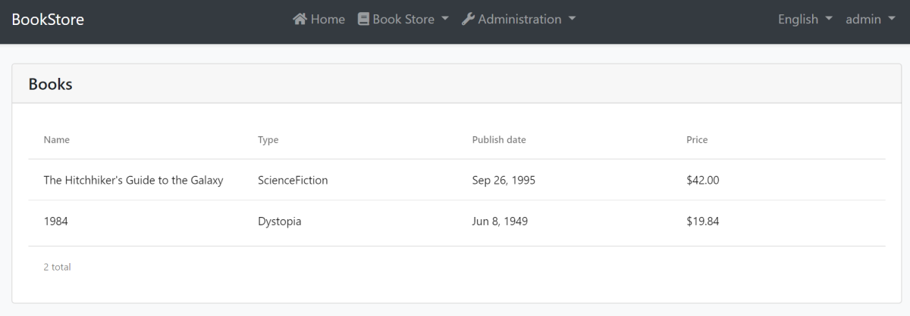

# Web Application Development Tutorial - Part 2: The Book List Page
````json
//[doc-params]
{
    "UI": ["MVC","Blazor","BlazorServer","NG"],
    "DB": ["EF","Mongo"]
}
````
## About This Tutorial

In this tutorial series, you will build an ABP based web application named `Acme.BookStore`. This application is used to manage a list of books and their authors. It is developed using the following technologies:

* **{{DB_Value}}** as the ORM provider. 
* **{{UI_Value}}** as the UI Framework.

This tutorial is organized as the following parts;

- [Part 1: Creating the server side](Part-1.md)
- **Part 2: The book list page (this part)**
- [Part 3: Creating, updating and deleting books](Part-3.md)
- [Part 4: Integration tests](Part-4.md)
- [Part 5: Authorization](Part-5.md)
- [Part 6: Authors: Domain layer](Part-6.md)
- [Part 7: Authors: Database Integration](Part-7.md)
- [Part 8: Authors: Application Layer](Part-8.md)
- [Part 9: Authors: User Interface](Part-9.md)
- [Part 10: Book to Author Relation](Part-10.md)

### Download the Source Code

This tutorial has multiple versions based on your **UI** and **Database** preferences. We've prepared a few combinations of the source code to be downloaded:

* [MVC (Razor Pages) UI with EF Core](https://github.com/abpframework/abp-samples/tree/master/BookStore-Mvc-EfCore)
* [Blazor UI with EF Core](https://github.com/abpframework/abp-samples/tree/master/BookStore-Blazor-EfCore)
* [Angular UI with MongoDB](https://github.com/abpframework/abp-samples/tree/master/BookStore-Angular-MongoDb)

> If you encounter the "filename too long" or "unzip error" on Windows, it's probably related to the Windows maximum file path limitation. Windows has a maximum file path limitation of 250 characters. To solve this, [enable the long path option in Windows 10](https://docs.microsoft.com/en-us/windows/win32/fileio/maximum-file-path-limitation?tabs=cmd#enable-long-paths-in-windows-10-version-1607-and-later).

> If you face long path errors related to Git, try the following command to enable long paths in Windows. See https://github.com/msysgit/msysgit/wiki/Git-cannot-create-a-file-or-directory-with-a-long-path
> `git config --system core.longpaths true`

{{if UI == "MVC" && DB == "EF"}}

### Video Tutorial

This part is also recorded as a video tutorial and **<a href="https://www.youtube.com/watch?v=UDNlLiPiBiw&list=PLsNclT2aHJcPNaCf7Io3DbMN6yAk_DgWJ&index=2" target="_blank">published on YouTube</a>**.

{{end}}

{{if UI == "MVC"}}

## Dynamic JavaScript Proxies

It's common to call the HTTP API endpoints via AJAX from the **JavaScript** side. You can use `$.ajax` or another tool to call the endpoints. However, ABP offers a better way.

ABP **dynamically** creates **[JavaScript Proxies](../UI/AspNetCore/Dynamic-JavaScript-Proxies.md)** for all API endpoints. So, you can use any **endpoint** just like calling a **JavaScript function**.

### Testing in the Developer Console

You can easily test the JavaScript proxies using your favorite browser's **Developer Console**. Run the application, open your browser's **developer tools** (*shortcut is generally F12*), switch to the **Console** tab, type the following code and press enter:

````js
acme.bookStore.books.book.getList({}).done(function (result) { console.log(result); });
````

* `acme.bookStore.books` is the namespace of the `BookAppService` converted to [camelCase](https://en.wikipedia.org/wiki/Camel_case).
* `book` is the conventional name for the `BookAppService` (removed `AppService` postfix and converted to camelCase).
* `getList` is the conventional name for the `GetListAsync` method defined in the `CrudAppService` base class (removed `Async` postfix and converted to camelCase).
* `{}` argument is used to send an empty object to the `GetListAsync` method which normally expects an object of type `PagedAndSortedResultRequestDto` that is used to send paging and sorting options to the server (all properties are optional with default values, so you can send an empty object).
* `getList` function returns a `promise`. You can pass a callback to the `then` (or `done`) function to get the result returned from the server.

Running this code produces the following output:


You can see the **book list** returned from the server. You can also check the **network** tab of the developer tools to see the client to server communication:


Let's **create a new book** using the `create` function:

````js
acme.bookStore.books.book.create({ 
        name: 'Foundation', 
        type: 7, 
        publishDate: '1951-05-24', 
        price: 21.5 
    }).then(function (result) { 
        console.log('successfully created the book with id: ' + result.id); 
    });
````

> If you downloaded the source code of the tutorial and following the steps from the sample, you should also pass the `authorId` parameter to the create method for **creating a new book**.

You should see a message in the console something like that:

````text
successfully created the book with id: 439b0ea8-923e-8e1e-5d97-39f2c7ac4246
````

Check the `Books` table in the database to see the new book row. You can try `get`, `update` and `delete` functions yourself.

We will use these dynamic proxy functions in the next sections to communicate to the server.

{{end}}

## Localization

Before starting to the UI development, we first want to prepare the localization texts (you normally do this when needed while developing your application).

Localization texts are located under the `Localization/BookStore` folder of the `Acme.BookStore.Domain.Shared` project:


Open the `en.json` (*the English translations*) file and change the content as below:

````json
{
  "Culture": "en",
  "Texts": {
    "Menu:Home": "Home",
    "Welcome": "Welcome",
    "LongWelcomeMessage": "Welcome to the application. This is a startup project based on the ABP framework. For more information, visit abp.io.",
    "Menu:BookStore": "Book Store",
    "Menu:Books": "Books",
    "Actions": "Actions",
    "Close": "Close",
    "Delete": "Delete",
    "Edit": "Edit",
    "PublishDate": "Publish date",
    "NewBook": "New book",
    "Name": "Name",
    "Type": "Type",
    "Price": "Price",
    "CreationTime": "Creation time",
    "AreYouSure": "Are you sure?",
    "AreYouSureToDelete": "Are you sure you want to delete this item?",
    "Enum:BookType:0": "Undefined",
    "Enum:BookType:1": "Adventure",
    "Enum:BookType:2": "Biography",
    "Enum:BookType:3": "Dystopia",
    "Enum:BookType:4": "Fantastic",
    "Enum:BookType:5": "Horror",
    "Enum:BookType:6": "Science",
    "Enum:BookType:7": "Science fiction",
    "Enum:BookType:8": "Poetry"
  }
}
````

* Localization key names are arbitrary. You can set any name. We prefer some conventions for specific text types;
  * Add `Menu:` prefix for menu items.
  * Use `Enum:<enum-type>:<enum-value>` naming convention to localize the enum members. When you do it like that, ABP can automatically localize the enums in some proper cases.

If a text is not defined in the localization file, it **fallbacks** to the localization key (as ASP.NET Core's standard behavior).

> ABP's localization system is built on [ASP.NET Core's standard localization](https://docs.microsoft.com/en-us/aspnet/core/fundamentals/localization) system and extends it in many ways. See the [localization document](../Localization.md) for details.

{{if UI == "MVC"}}

## Create a Books Page

It's time to create something visible and usable! Instead of classic MVC, we will use the [Razor Pages UI](https://docs.microsoft.com/en-us/aspnet/core/tutorials/razor-pages/razor-pages-start) approach which is recommended by Microsoft.

Create `Books` folder under the `Pages` folder of the `Acme.BookStore.Web` project. Add a new Razor Page by right clicking the Books folder then selecting **Add > Razor Page** menu item. Name it as `Index`:


Open the `Index.cshtml` and change the whole content as shown below:

````html
@page
@using Acme.BookStore.Web.Pages.Books
@model IndexModel

<h2>Books</h2>
````

`Index.cshtml.cs` content should be like that:

```csharp
using Microsoft.AspNetCore.Mvc.RazorPages;

namespace Acme.BookStore.Web.Pages.Books
{
    public class IndexModel : PageModel
    {
        public void OnGet()
        {
            
        }
    }
}
```

### Add Books Page to the Main Menu

Open the `BookStoreMenuContributor` class in the `Menus` folder and add the following code to the end of the `ConfigureMainMenuAsync` method:

````csharp
context.Menu.AddItem(
    new ApplicationMenuItem(
        "BooksStore",
        l["Menu:BookStore"],
        icon: "fa fa-book"
    ).AddItem(
        new ApplicationMenuItem(
            "BooksStore.Books",
            l["Menu:Books"],
            url: "/Books"
        )
    )
);
````

Run the project, login to the application with the username `admin` and the password `1q2w3E*` and see the new menu item has been added to the main menu:


When you click to the Books menu item under the Book Store parent, you are being redirected to the new empty Books Page.

### Book List

We will use the [Datatables.net](https://datatables.net/) jQuery library to show the book list. Datatables library completely work via AJAX, it is fast, popular and provides a good user experience.

> Datatables library is configured in the startup template, so you can directly use it in any page without including any style or script file to your page.

#### Index.cshtml

Change the `Pages/Books/Index.cshtml` as following:

````html
@page
@using Acme.BookStore.Localization
@using Acme.BookStore.Web.Pages.Books
@using Microsoft.Extensions.Localization
@model IndexModel
@inject IStringLocalizer<BookStoreResource> L
@section scripts
{
    <abp-script src="/Pages/Books/Index.js" />
}
<abp-card>
    <abp-card-header>
        <h2>@L["Books"]</h2>
    </abp-card-header>
    <abp-card-body>
        <abp-table striped-rows="true" id="BooksTable"></abp-table>
    </abp-card-body>
</abp-card>
````

* `abp-script` [tag helper](https://docs.microsoft.com/en-us/aspnet/core/mvc/views/tag-helpers/intro) is used to add external **scripts** to the page. It has many additional features compared to standard `script` tag. It handles **minification** and **versioning**. See the [bundling & minification document](../UI/AspNetCore/Bundling-Minification.md) for details.
* `abp-card` is a tag helper for Twitter Bootstrap's [card component](https://getbootstrap.com/docs/4.5/components/card/). There are other useful tag helpers provided by the ABP Framework to easily use most of the [bootstrap](https://getbootstrap.com/) components. You could use the regular HTML tags instead of these tag helpers, but using tag helpers reduces HTML code and prevents errors by help the of IntelliSense and compile time type checking. Further information, see the [tag helpers](../UI/AspNetCore/Tag-Helpers/Index.md) document.

#### Index.js

Create an `Index.js` file under the `Pages/Books` folder:


The content of the file is shown below:

````js
$(function () {
    var l = abp.localization.getResource('BookStore');

    var dataTable = $('#BooksTable').DataTable(
        abp.libs.datatables.normalizeConfiguration({
            serverSide: true,
            paging: true,
            order: [[1, "asc"]],
            searching: false,
            scrollX: true,
            ajax: abp.libs.datatables.createAjax(acme.bookStore.books.book.getList),
            columnDefs: [
                {
                    title: l('Name'),
                    data: "name"
                },
                {
                    title: l('Type'),
                    data: "type",
                    render: function (data) {
                        return l('Enum:BookType:' + data);
                    }
                },
                {
                    title: l('PublishDate'),
                    data: "publishDate",
                    render: function (data) {
                        return luxon
                            .DateTime
                            .fromISO(data, {
                                locale: abp.localization.currentCulture.name
                            }).toLocaleString();
                    }
                },
                {
                    title: l('Price'),
                    data: "price"
                },
                {
                    title: l('CreationTime'), data: "creationTime",
                    render: function (data) {
                        return luxon
                            .DateTime
                            .fromISO(data, {
                                locale: abp.localization.currentCulture.name
                            }).toLocaleString(luxon.DateTime.DATETIME_SHORT);
                    }
                }
            ]
        })
    );
});
````

* `abp.localization.getResource` gets a function that is used to localize text using the same JSON file defined in the server side. In this way, you can share the localization values with the client side.
* `abp.libs.datatables.normalizeConfiguration` is a helper function defined by the ABP Framework. There's no requirement to use it, but it simplifies the [Datatables](https://datatables.net/) configuration by providing conventional default values for missing options.
* `abp.libs.datatables.createAjax` is another helper function to adapt ABP's dynamic JavaScript API proxies to [Datatable](https://datatables.net/)'s expected parameter format
* `acme.bookStore.books.book.getList` is the dynamic JavaScript proxy function introduced before.
* [luxon](https://moment.github.io/luxon/) library is also a standard library that is pre-configured in the solution, so you can use to perform date/time operations easily.

> See [Datatables documentation](https://datatables.net/manual/) for all configuration options.

## Run the Final Application

You can run the application! The final UI of this part is shown below:


This is a fully working, server side paged, sorted and localized table of books.

{{else if UI == "NG"}}

## Install NPM packages

> Notice: This tutorial is based on the ABP Framework v3.1.0+ If your project version is older, then please upgrade your solution. See the [migration guide](../UI/Angular/Migration-Guide-v3.md) if you are upgrading an existing project with v2.x.

If you haven't done it before, open a new command line interface (terminal window) and go to your `angular` folder and then run `yarn` command to install the NPM packages:

```bash
yarn
```

## Create a Books Page

It's time to create something visible and usable! There are some tools that we will use when developing the Angular frontend application:

- [Ng Bootstrap](https://ng-bootstrap.github.io/#/home) will be used as the UI component library.
- [Ngx-Datatable](https://swimlane.gitbook.io/ngx-datatable/) will be used as the datatable library.

Run the following command line to create a new module, named `BookModule` in the root folder of the angular application:

```bash
yarn ng generate module book --module app --routing --route books
```

This command should produce the following output:

````bash
> yarn ng generate module book --module app --routing --route books

yarn run v1.19.1
$ ng generate module book --module app --routing --route books
CREATE src/app/book/book-routing.module.ts (336 bytes)
CREATE src/app/book/book.module.ts (335 bytes)
CREATE src/app/book/book.component.html (19 bytes)
CREATE src/app/book/book.component.spec.ts (614 bytes)
CREATE src/app/book/book.component.ts (268 bytes)
CREATE src/app/book/book.component.scss (0 bytes)
UPDATE src/app/app-routing.module.ts (1289 bytes)
Done in 3.88s.
````

### BookModule

Open the `/src/app/book/book.module.ts` and replace the content as shown below:

````js
import { NgModule } from '@angular/core';
import { SharedModule } from '../shared/shared.module';
import { BookRoutingModule } from './book-routing.module';
import { BookComponent } from './book.component';

@NgModule({
  declarations: [BookComponent],
  imports: [
    BookRoutingModule,
    SharedModule
  ]
})
export class BookModule { }

````

* Added the `SharedModule`. `SharedModule` exports some common modules needed to create user interfaces.
* `SharedModule` already exports the `CommonModule`, so we've removed the `CommonModule`.

### Routing

Generated code places the new route definition to the `src/app/app-routing.module.ts` file as shown below:

````js
const routes: Routes = [
  // other route definitions...
  { path: 'books', loadChildren: () => import('./book/book.module').then(m => m.BookModule) },
];
````

Now, open the `src/app/route.provider.ts` file replace the `configureRoutes` function declaration as shown below:

```js
function configureRoutes(routes: RoutesService) {
  return () => {
    routes.add([
      {
        path: '/',
        name: '::Menu:Home',
        iconClass: 'fas fa-home',
        order: 1,
        layout: eLayoutType.application,
      },
      {
        path: '/book-store',
        name: '::Menu:BookStore',
        iconClass: 'fas fa-book',
        order: 2,
        layout: eLayoutType.application,
      },
      {
        path: '/books',
        name: '::Menu:Books',
        parentName: '::Menu:BookStore',
        layout: eLayoutType.application,
      },
    ]);
  };
}
```

`RoutesService` is a service provided by the ABP Framework to configure the main menu and the routes.

* `path` is the URL of the route.
* `name` is the localized menu item name (see the [localization document](../UI/Angular/Localization.md) for details).
* `iconClass` is the icon of the menu item (you can use [Font Awesome](https://fontawesome.com/) icons by default).
* `order` is the order of the menu item.
* `layout` is the layout of the BooksModule's routes (there are three types of pre-defined layouts: `eLayoutType.application`, `eLayoutType.account` or `eLayoutType.empty`).

For more information, see the [RoutesService document](../UI/Angular/Modifying-the-Menu.md#via-routesservice).

### Service Proxy Generation

[ABP CLI](../CLI.md) provides `generate-proxy` command that generates client proxies for your HTTP APIs to make easy to consume your HTTP APIs from the client side. Before running `generate-proxy` command, your host must be up and running.

> **Warning**: There is a problem with IIS Express; it doesn't allow to connect to the application from another process. If you are using Visual Studio, select the `Acme.BookStore.HttpApi.Host` instead of IIS Express in the run button drop-down list, as shown in the figure below:


Once the host application is running, execute the following command in the `angular` folder:

```bash
abp generate-proxy -t ng
```

This command will create the following files under the `/src/app/proxy/books` folder:


### BookComponent

Open the `/src/app/book/book.component.ts` file and replace the content as below:

```js
import { ListService, PagedResultDto } from '@abp/ng.core';
import { Component, OnInit } from '@angular/core';
import { BookService, BookDto } from '@proxy/books';

@Component({
  selector: 'app-book',
  templateUrl: './book.component.html',
  styleUrls: ['./book.component.scss'],
  providers: [ListService],
})
export class BookComponent implements OnInit {
  book = { items: [], totalCount: 0 } as PagedResultDto<BookDto>;

  constructor(public readonly list: ListService, private bookService: BookService) {}

  ngOnInit() {
    const bookStreamCreator = (query) => this.bookService.getList(query);

    this.list.hookToQuery(bookStreamCreator).subscribe((response) => {
      this.book = response;
    });
  }
}
```

* We imported and injected the generated `BookService`.
* We are using the [ListService](../UI/Angular/List-Service.md), a utility service of the ABP Framework which provides easy pagination, sorting and searching.

Open the `/src/app/book/book.component.html` and replace the content as below:

```html
<div class="card">
  <div class="card-header">
    <div class="row">
      <div class="col col-md-6">
        <h5 class="card-title">
          
        </h5>
      </div>
      <div class="text-end col col-md-6"></div>
    </div>
  </div>
  <div class="card-body">
    <ngx-datatable [rows]="book.items" [count]="book.totalCount" [list]="list" default>
      <ngx-datatable-column [name]="'::Name' | abpLocalization" prop="name"></ngx-datatable-column>
      <ngx-datatable-column [name]="'::Type' | abpLocalization" prop="type">
        <ng-template let-row="row" ngx-datatable-cell-template>
          
        </ng-template>
      </ngx-datatable-column>
      <ngx-datatable-column [name]="'::PublishDate' | abpLocalization" prop="publishDate">
        <ng-template let-row="row" ngx-datatable-cell-template>
          
        </ng-template>
      </ngx-datatable-column>
      <ngx-datatable-column [name]="'::Price' | abpLocalization" prop="price">
        <ng-template let-row="row" ngx-datatable-cell-template>
          
        </ng-template>
      </ngx-datatable-column>
    </ngx-datatable>
  </div>
</div>
```

Now you can see the final result on your browser:



{{else if UI == "Blazor" || UI == "BlazorServer"}}

## Create a Books Page

It's time to create something visible and usable! Right click to the `Pages` folder under the `Acme.BookStore.Blazor` project and add a new **razor component**, named `Books.razor`:


Replace the contents of this component as shown below:

````html
@page "/books"

<h2>Books</h2>

@code {

}
````

### Add Books Page to the Main Menu

Open the `BookStoreMenuContributor` class in the `Blazor` project add the following code to the end of the `ConfigureMainMenuAsync` method:

````csharp
context.Menu.AddItem(
    new ApplicationMenuItem(
        "BooksStore",
        l["Menu:BookStore"],
        icon: "fa fa-book"
    ).AddItem(
        new ApplicationMenuItem(
            "BooksStore.Books",
            l["Menu:Books"],
            url: "/books"
        )
    )
);
````

Run the project, login to the application with the username `admin` and the password `1q2w3E*` and see the new menu item has been added to the main menu:


When you click to the Books menu item under the Book Store parent, you are being redirected to the new empty Books Page.

### Book List

We will use the [Blazorise library](https://blazorise.com/) as the UI component kit. It is a very powerful library that supports major HTML/CSS frameworks, including the Bootstrap.

ABP Framework provides a generic base class, `AbpCrudPageBase<...>`, to create CRUD style pages. This base class is compatible to the `ICrudAppService` that was used to build the `IBookAppService`. So, we can inherit from the `AbpCrudPageBase` to automate the code behind for the standard CRUD stuff.

Open the `Books.razor` and replace the content as the following:

````xml
@page "/books"
@using Volo.Abp.Application.Dtos
@using Acme.BookStore.Books
@using Acme.BookStore.Localization
@using Microsoft.Extensions.Localization
@inject IStringLocalizer<BookStoreResource> L
@inherits AbpCrudPageBase<IBookAppService, BookDto, Guid, PagedAndSortedResultRequestDto, CreateUpdateBookDto>

<Card>
    <CardHeader>
        <h2>@L["Books"]</h2>
    </CardHeader>
    <CardBody>
        <DataGrid TItem="BookDto"
                  Data="Entities"
                  ReadData="OnDataGridReadAsync"
                  TotalItems="TotalCount"
                  ShowPager="true"
                  PageSize="PageSize">
            <DataGridColumns>
                <DataGridColumn TItem="BookDto"
                                Field="@nameof(BookDto.Name)"
                                Caption="@L["Name"]"></DataGridColumn>
                <DataGridColumn TItem="BookDto"
                                Field="@nameof(BookDto.Type)"
                                Caption="@L["Type"]">
                    <DisplayTemplate>
                        @L[$"Enum:BookType:{(int)context.Type}"]
                    </DisplayTemplate>
                </DataGridColumn>
                <DataGridColumn TItem="BookDto"
                                Field="@nameof(BookDto.PublishDate)"
                                Caption="@L["PublishDate"]">
                    <DisplayTemplate>
                        @context.PublishDate.ToShortDateString()
                    </DisplayTemplate>
                </DataGridColumn>
                <DataGridColumn TItem="BookDto"
                                Field="@nameof(BookDto.Price)"
                                Caption="@L["Price"]">
                </DataGridColumn>
                <DataGridColumn TItem="BookDto"
                                Field="@nameof(BookDto.CreationTime)"
                                Caption="@L["CreationTime"]">
                    <DisplayTemplate>
                        @context.CreationTime.ToLongDateString()
                    </DisplayTemplate>
                </DataGridColumn>
            </DataGridColumns>
        </DataGrid>
    </CardBody>
</Card>
````

> If you see some syntax errors, you can ignore them if your application properly built and run. Visual Studio still has some bugs with Blazor.

* Inherited from the `AbpCrudPageBase<IBookAppService, BookDto, Guid, PagedAndSortedResultRequestDto, CreateUpdateBookDto>` which implements all the CRUD details for us.
* `Entities`, `TotalCount`, `PageSize`, `OnDataGridReadAsync` are defined in the base blass.
* Injected `IStringLocalizer<BookStoreResource>` (as `L` object) and used for localization.

While the code above pretty easy to understand, you can check the Blazorise [Card](https://blazorise.com/docs/components/card/) and [DataGrid](https://blazorise.com/docs/extensions/datagrid/) documents to understand them better.

#### About the AbpCrudPageBase

We will continue to benefit from the `AbpCrudPageBase` for the books page. You could just inject the `IBookAppService` and perform all the server side calls yourself (thanks to the [Dynamic C# HTTP API Client Proxy](../API/Dynamic-CSharp-API-Clients.md) system of the ABP Framework). We will do it manually for the authors page to demonstrate how to call server side HTTP APIs in your Blazor applications.

## Run the Final Application

You can run the application! The final UI of this part is shown below:


This is a fully working, server side paged, sorted and localized table of books.

{{end # UI }}

## The Next Part

See the [next part](Part-3.md) of this tutorial.
