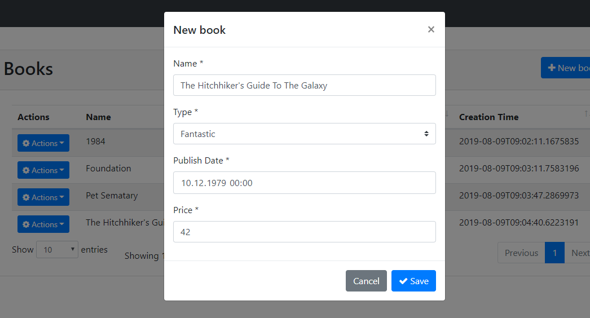
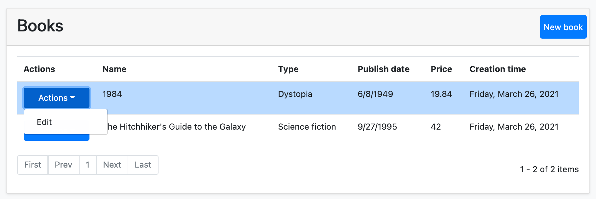

# Web Application Development Tutorial - Part 3: Creating, Updating and Deleting Books
````json
//[doc-params]
{
    "UI": ["MVC","Blazor","BlazorServer","NG"],
    "DB": ["EF","Mongo"]
}
````
## About This Tutorial

In this tutorial series, you will build an ABP based web application named `Acme.BookStore`. This application is used to manage a list of books and their authors. It is developed using the following technologies:

* **{{DB_Value}}** as the ORM provider. 
* **{{UI_Value}}** as the UI Framework.

This tutorial is organized as the following parts:

- [Part 1: Creating the server side](Part-1.md)
- [Part 2: The book list page](Part-2.md)
- **Part 3: Creating, updating and deleting books (this part)**
- [Part 4: Integration tests](Part-4.md)
- [Part 5: Authorization](Part-5.md)
- [Part 6: Authors: Domain layer](Part-6.md)
- [Part 7: Authors: Database Integration](Part-7.md)
- [Part 8: Authors: Application Layer](Part-8.md)
- [Part 9: Authors: User Interface](Part-9.md)
- [Part 10: Book to Author Relation](Part-10.md)

### Download the Source Code

This tutorial has multiple versions based on your **UI** and **Database** preferences. We've prepared a few combinations of the source code to be downloaded:

* [MVC (Razor Pages) UI with EF Core](https://github.com/abpframework/abp-samples/tree/master/BookStore-Mvc-EfCore)
* [Blazor UI with EF Core](https://github.com/abpframework/abp-samples/tree/master/BookStore-Blazor-EfCore)
* [Angular UI with MongoDB](https://github.com/abpframework/abp-samples/tree/master/BookStore-Angular-MongoDb)

> If you encounter the "filename too long" or "unzip error" on Windows, it's probably related to the Windows maximum file path limitation. Windows has a maximum file path limitation of 250 characters. To solve this, [enable the long path option in Windows 10](https://docs.microsoft.com/en-us/windows/win32/fileio/maximum-file-path-limitation?tabs=cmd#enable-long-paths-in-windows-10-version-1607-and-later).

> If you face long path errors related to Git, try the following command to enable long paths in Windows. See https://github.com/msysgit/msysgit/wiki/Git-cannot-create-a-file-or-directory-with-a-long-path
> `git config --system core.longpaths true`

{{if UI == "MVC" && DB == "EF"}}

### Video Tutorial

This part is also recorded as a video tutorial and **<a href="https://www.youtube.com/watch?v=TLShZO8u2VE&list=PLsNclT2aHJcPNaCf7Io3DbMN6yAk_DgWJ&index=3" target="_blank">published on YouTube</a>**.

{{end}}

{{if UI == "MVC"}}

## Creating a New Book

In this section, you will learn how to create a new modal dialog form to create a new book. The modal dialog will look like the image below:



### Create the Modal Form

Create a new razor page named `CreateModal.cshtml` under the `Pages/Books` folder of the `Acme.BookStore.Web` project.


#### CreateModal.cshtml.cs

Open the `CreateModal.cshtml.cs` file (`CreateModalModel` class) and replace it with the following code:

````C#
using System.Threading.Tasks;
using Acme.BookStore.Books;
using Microsoft.AspNetCore.Mvc;

namespace Acme.BookStore.Web.Pages.Books
{
    public class CreateModalModel : BookStorePageModel
    {
        [BindProperty]
        public CreateUpdateBookDto Book { get; set; }

        private readonly IBookAppService _bookAppService;

        public CreateModalModel(IBookAppService bookAppService)
        {
            _bookAppService = bookAppService;
        }

        public void OnGet()
        {
            Book = new CreateUpdateBookDto();
        }

        public async Task<IActionResult> OnPostAsync()
        {
            await _bookAppService.CreateAsync(Book);
            return NoContent();
        }
    }
}
````

* This class is derived from the `BookStorePageModel` instead of the standard `PageModel`. `BookStorePageModel` indirectly inherits the `PageModel` and adds some common properties & methods that can be shared in your page model classes.
* `[BindProperty]` attribute on the `Book` property binds post request data to this property.
* This class simply injects the `IBookAppService` in the constructor and calls the `CreateAsync` method in the `OnPostAsync` handler.
* It creates a new `CreateUpdateBookDto` object in the `OnGet` method. ASP.NET Core can work without creating a new instance like that. However, it doesn't create an instance for you and if your class has some default value assignments or code execution in the class constructor, they won't work. For this case, we set default values for some of the `CreateUpdateBookDto` properties.

#### CreateModal.cshtml

Open the `CreateModal.cshtml` file and paste the code below:

````html
@page
@using Acme.BookStore.Localization
@using Acme.BookStore.Web.Pages.Books
@using Microsoft.Extensions.Localization
@using Volo.Abp.AspNetCore.Mvc.UI.Bootstrap.TagHelpers.Modal
@model CreateModalModel
@inject IStringLocalizer<BookStoreResource> L
@{
    Layout = null;
}
<abp-dynamic-form abp-model="Book" asp-page="/Books/CreateModal">
    <abp-modal>
        <abp-modal-header title="@L["NewBook"].Value"></abp-modal-header>
        <abp-modal-body>
            <abp-form-content />
        </abp-modal-body>
        <abp-modal-footer buttons="@(AbpModalButtons.Cancel|AbpModalButtons.Save)"></abp-modal-footer>
    </abp-modal>
</abp-dynamic-form>
````

* This modal uses `abp-dynamic-form` [tag helper](../UI/AspNetCore/Tag-Helpers/Dynamic-Forms.md) to automatically create the form from the `CreateUpdateBookDto` model class.
* `abp-model` attribute indicates the model object where it's the `Book` property in this case.
* `abp-form-content` tag helper is a placeholder to render the form controls (it is optional and needed only if you have added some other content in the `abp-dynamic-form` tag, just like in this page).

> Tip: `Layout` should be `null` just as done in this example since we don't want to include all the layout for the modals when they are loaded via AJAX.

### Add the "New book" Button

Open the `Pages/Books/Index.cshtml` and set the content of `abp-card-header` tag as below:

````html
<abp-card-header>
    <abp-row>
        <abp-column size-md="_6">
            <abp-card-title>@L["Books"]</abp-card-title>
        </abp-column>
        <abp-column size-md="_6" class="text-right">
            <abp-button id="NewBookButton"
                        text="@L["NewBook"].Value"
                        icon="plus"
                        button-type="Primary"/>
        </abp-column>
    </abp-row>
</abp-card-header>
````

The final content of `Index.cshtml` is shown below:

````html
@page
@using Acme.BookStore.Localization
@using Acme.BookStore.Web.Pages.Books
@using Microsoft.Extensions.Localization
@model IndexModel
@inject IStringLocalizer<BookStoreResource> L
@section scripts
{
    <abp-script src="/Pages/Books/Index.js"/>
}

<abp-card>
    <abp-card-header>
        <abp-row>
            <abp-column size-md="_6">
                <abp-card-title>@L["Books"]</abp-card-title>
            </abp-column>
            <abp-column size-md="_6" class="text-right">
                <abp-button id="NewBookButton"
                            text="@L["NewBook"].Value"
                            icon="plus"
                            button-type="Primary"/>
            </abp-column>
        </abp-row>
    </abp-card-header>
    <abp-card-body>
        <abp-table striped-rows="true" id="BooksTable"></abp-table>
    </abp-card-body>
</abp-card>
````

This adds a new button called **New book** to the **top-right** of the table:


Open the `Pages/Books/Index.js` file and add the following code right after the `Datatable` configuration:

````js
var createModal = new abp.ModalManager(abp.appPath + 'Books/CreateModal');

createModal.onResult(function () {
    dataTable.ajax.reload();
});

$('#NewBookButton').click(function (e) {
    e.preventDefault();
    createModal.open();
});
````

* `abp.ModalManager` is a helper class to manage modals on the client side. It internally uses Twitter Bootstrap's standard modal, but abstracts many details by providing a simple API.
* `createModal.onResult(...)` used to refresh the data table after creating a new book.
* `createModal.open();` is used to open the model to create a new book.

The final content of the `Index.js` file should be like this:

````js
$(function () {
    var l = abp.localization.getResource('BookStore');

    var dataTable = $('#BooksTable').DataTable(
        abp.libs.datatables.normalizeConfiguration({
            serverSide: true,
            paging: true,
            order: [[1, "asc"]],
            searching: false,
            scrollX: true,
            ajax: abp.libs.datatables.createAjax(acme.bookStore.books.book.getList),
            columnDefs: [
                {
                    title: l('Name'),
                    data: "name"
                },
                {
                    title: l('Type'),
                    data: "type",
                    render: function (data) {
                        return l('Enum:BookType:' + data);
                    }
                },
                {
                    title: l('PublishDate'),
                    data: "publishDate",
                    render: function (data) {
                        return luxon
                            .DateTime
                            .fromISO(data, {
                                locale: abp.localization.currentCulture.name
                            }).toLocaleString();
                    }
                },
                {
                    title: l('Price'),
                    data: "price"
                },
                {
                    title: l('CreationTime'), data: "creationTime",
                    render: function (data) {
                        return luxon
                            .DateTime
                            .fromISO(data, {
                                locale: abp.localization.currentCulture.name
                            }).toLocaleString(luxon.DateTime.DATETIME_SHORT);
                    }
                }
            ]
        })
    );

    var createModal = new abp.ModalManager(abp.appPath + 'Books/CreateModal');

    createModal.onResult(function () {
        dataTable.ajax.reload();
    });

    $('#NewBookButton').click(function (e) {
        e.preventDefault();
        createModal.open();
    });
});
````

Now, you can **run the application** and add some new books using the new modal form.

## Updating a Book

Create a new razor page, named `EditModal.cshtml` under the `Pages/Books` folder of the `Acme.BookStore.Web` project:


### EditModal.cshtml.cs

Open the `EditModal.cshtml.cs` file (`EditModalModel` class) and replace it with the following code:

````csharp
using System;
using System.Threading.Tasks;
using Acme.BookStore.Books;
using Microsoft.AspNetCore.Mvc;

namespace Acme.BookStore.Web.Pages.Books
{
    public class EditModalModel : BookStorePageModel
    {
        [HiddenInput]
        [BindProperty(SupportsGet = true)]
        public Guid Id { get; set; }

        [BindProperty]
        public CreateUpdateBookDto Book { get; set; }

        private readonly IBookAppService _bookAppService;

        public EditModalModel(IBookAppService bookAppService)
        {
            _bookAppService = bookAppService;
        }

        public async Task OnGetAsync()
        {
            var bookDto = await _bookAppService.GetAsync(Id);
            Book = ObjectMapper.Map<BookDto, CreateUpdateBookDto>(bookDto);
        }

        public async Task<IActionResult> OnPostAsync()
        {
            await _bookAppService.UpdateAsync(Id, Book);
            return NoContent();
        }
    }
}
````

* `[HiddenInput]` and `[BindProperty]` are standard ASP.NET Core MVC attributes. `SupportsGet` is used to be able to get the `Id` value from the query string parameter of the request.
* In the `OnGetAsync` method, we get the `BookDto` from the `BookAppService` and this is being mapped to the DTO object `CreateUpdateBookDto`.
* The `OnPostAsync` uses `BookAppService.UpdateAsync(...)` to update the entity.

### Mapping from BookDto to CreateUpdateBookDto

To be able to map the `BookDto` to `CreateUpdateBookDto`, configure a new mapping. To do this, open the `BookStoreWebAutoMapperProfile.cs` file in the `Acme.BookStore.Web` project and change it as shown below:

````csharp
using AutoMapper;

namespace Acme.BookStore.Web
{
    public class BookStoreWebAutoMapperProfile : Profile
    {
        public BookStoreWebAutoMapperProfile()
        {
            CreateMap<BookDto, CreateUpdateBookDto>();
        }
    }
}
````

* We have just added `CreateMap<BookDto, CreateUpdateBookDto>();` to define this mapping.

> Notice that we do the mapping definition in the web layer as a best practice since it is only needed in this layer.

### EditModal.cshtml

Replace `EditModal.cshtml` content with the following content:

````html
@page
@using Acme.BookStore.Localization
@using Acme.BookStore.Web.Pages.Books
@using Microsoft.Extensions.Localization
@using Volo.Abp.AspNetCore.Mvc.UI.Bootstrap.TagHelpers.Modal
@model EditModalModel
@inject IStringLocalizer<BookStoreResource> L
@{
    Layout = null;
}
<abp-dynamic-form abp-model="Book" asp-page="/Books/EditModal">
    <abp-modal>
        <abp-modal-header title="@L["Update"].Value"></abp-modal-header>
        <abp-modal-body>
            <abp-input asp-for="Id" />
            <abp-form-content />
        </abp-modal-body>
        <abp-modal-footer buttons="@(AbpModalButtons.Cancel|AbpModalButtons.Save)"></abp-modal-footer>
    </abp-modal>
</abp-dynamic-form>
````

This page is very similar to `CreateModal.cshtml`, except:

* It includes an `abp-input` for the `Id` property to store the `Id` of the editing book (which is a hidden input).
* It uses `Books/EditModal` as the post URL.

### Add "Actions" Dropdown to the Table

We will add a dropdown button to the table named *Actions*.

Open the `Pages/Books/Index.js` file and replace the content as below:

````js
$(function () {
    var l = abp.localization.getResource('BookStore');
    var createModal = new abp.ModalManager(abp.appPath + 'Books/CreateModal');
    var editModal = new abp.ModalManager(abp.appPath + 'Books/EditModal');

    var dataTable = $('#BooksTable').DataTable(
        abp.libs.datatables.normalizeConfiguration({
            serverSide: true,
            paging: true,
            order: [[1, "asc"]],
            searching: false,
            scrollX: true,
            ajax: abp.libs.datatables.createAjax(acme.bookStore.books.book.getList),
            columnDefs: [
                {
                    title: l('Actions'),
                    rowAction: {
                        items:
                            [
                                {
                                    text: l('Edit'),
                                    action: function (data) {
                                        editModal.open({ id: data.record.id });
                                    }
                                }
                            ]
                    }
                },
                {
                    title: l('Name'),
                    data: "name"
                },
                {
                    title: l('Type'),
                    data: "type",
                    render: function (data) {
                        return l('Enum:BookType:' + data);
                    }
                },
                {
                    title: l('PublishDate'),
                    data: "publishDate",
                    render: function (data) {
                        return luxon
                            .DateTime
                            .fromISO(data, {
                                locale: abp.localization.currentCulture.name
                            }).toLocaleString();
                    }
                },
                {
                    title: l('Price'),
                    data: "price"
                },
                {
                    title: l('CreationTime'), data: "creationTime",
                    render: function (data) {
                        return luxon
                            .DateTime
                            .fromISO(data, {
                                locale: abp.localization.currentCulture.name
                            }).toLocaleString(luxon.DateTime.DATETIME_SHORT);
                    }
                }
            ]
        })
    );

    createModal.onResult(function () {
        dataTable.ajax.reload();
    });

    editModal.onResult(function () {
        dataTable.ajax.reload();
    });

    $('#NewBookButton').click(function (e) {
        e.preventDefault();
        createModal.open();
    });
});
````

* Added a new `ModalManager` named `editModal` to open the edit modal dialog.
* Added a new column at the beginning of the `columnDefs` section. This column is used for the "*Actions*" dropdown button.
* The "*Edit*" action simply calls `editModal.open()` to open the edit dialog.
* The `editModal.onResult(...)` callback refreshes the data table when you close the edit modal.

You can run the application and edit any book by selecting the edit action on a book.

The final UI looks as below:


## Deleting a Book

Open the `Pages/Books/Index.js` file and add a new item to the `rowAction` `items`:

````js
{
    text: l('Delete'),
    confirmMessage: function (data) {
        return l('BookDeletionConfirmationMessage', data.record.name);
    },
    action: function (data) {
        acme.bookStore.books.book
            .delete(data.record.id)
            .then(function() {
                abp.notify.info(l('SuccessfullyDeleted'));
                dataTable.ajax.reload();
            });
    }
}
````

* The `confirmMessage` option is used to ask a confirmation question before executing the `action`.
* The `acme.bookStore.books.book.delete(...)` method makes an AJAX request to the server to delete a book.
* `abp.notify.info()` shows a notification after the delete operation.

Since we've used two new localization texts (`BookDeletionConfirmationMessage` and `SuccessfullyDeleted`) you need to add these to the localization file (`en.json` under the `Localization/BookStore` folder of the `Acme.BookStore.Domain.Shared` project):

````json
"BookDeletionConfirmationMessage": "Are you sure to delete the book '{0}'?",
"SuccessfullyDeleted": "Successfully deleted!"
````

The final `Index.js` content is shown below:

````js
$(function () {
    var l = abp.localization.getResource('BookStore');
    var createModal = new abp.ModalManager(abp.appPath + 'Books/CreateModal');
    var editModal = new abp.ModalManager(abp.appPath + 'Books/EditModal');

    var dataTable = $('#BooksTable').DataTable(
        abp.libs.datatables.normalizeConfiguration({
            serverSide: true,
            paging: true,
            order: [[1, "asc"]],
            searching: false,
            scrollX: true,
            ajax: abp.libs.datatables.createAjax(acme.bookStore.books.book.getList),
            columnDefs: [
                {
                    title: l('Actions'),
                    rowAction: {
                        items:
                            [
                                {
                                    text: l('Edit'),
                                    action: function (data) {
                                        editModal.open({ id: data.record.id });
                                    }
                                },
                                {
                                    text: l('Delete'),
                                    confirmMessage: function (data) {
                                        return l(
                                            'BookDeletionConfirmationMessage',
                                            data.record.name
                                        );
                                    },
                                    action: function (data) {
                                        acme.bookStore.books.book
                                            .delete(data.record.id)
                                            .then(function() {
                                                abp.notify.info(
                                                    l('SuccessfullyDeleted')
                                                );
                                                dataTable.ajax.reload();
                                            });
                                    }
                                }
                            ]
                    }
                },
                {
                    title: l('Name'),
                    data: "name"
                },
                {
                    title: l('Type'),
                    data: "type",
                    render: function (data) {
                        return l('Enum:BookType:' + data);
                    }
                },
                {
                    title: l('PublishDate'),
                    data: "publishDate",
                    render: function (data) {
                        return luxon
                            .DateTime
                            .fromISO(data, {
                                locale: abp.localization.currentCulture.name
                            }).toLocaleString();
                    }
                },
                {
                    title: l('Price'),
                    data: "price"
                },
                {
                    title: l('CreationTime'), data: "creationTime",
                    render: function (data) {
                        return luxon
                            .DateTime
                            .fromISO(data, {
                                locale: abp.localization.currentCulture.name
                            }).toLocaleString(luxon.DateTime.DATETIME_SHORT);
                    }
                }
            ]
        })
    );

    createModal.onResult(function () {
        dataTable.ajax.reload();
    });

    editModal.onResult(function () {
        dataTable.ajax.reload();
    });

    $('#NewBookButton').click(function (e) {
        e.preventDefault();
        createModal.open();
    });
});
````

You can run the application and try to delete a book.

{{end}}

{{if UI == "NG"}}

## Creating a New Book

In this section, you will learn how to create a new modal dialog form to create a new book.

### BookComponent

Open `/src/app/book/book.component.ts` and replace the content as below:

```js
import { ListService, PagedResultDto } from '@abp/ng.core';
import { Component, OnInit } from '@angular/core';
import { BookService, BookDto } from '@proxy/books';

@Component({
  selector: 'app-book',
  templateUrl: './book.component.html',
  styleUrls: ['./book.component.scss'],
  providers: [ListService],
})
export class BookComponent implements OnInit {
  book = { items: [], totalCount: 0 } as PagedResultDto<BookDto>;

  isModalOpen = false; // add this line

  constructor(public readonly list: ListService, private bookService: BookService) {}

  ngOnInit() {
    const bookStreamCreator = (query) => this.bookService.getList(query);

    this.list.hookToQuery(bookStreamCreator).subscribe((response) => {
      this.book = response;
    });
  }

  // add new method
  createBook() {
    this.isModalOpen = true;
  }
}
```

* We defined a property called `isModalOpen` and a method called `createBook`.


Open `/src/app/book/book.component.html` and make the following changes:

```html
<div class="card">
  <div class="card-header">
    <div class="row">
      <div class="col col-md-6">
        <h5 class="card-title"></h5>
      </div>        
      <div class="text-right col col-md-6">
          
        <!-- Add the "new book" button here -->
        <div class="text-lg-right pt-2">
          <button id="create" class="btn btn-primary" type="button" (click)="createBook()">
            <i class="fa fa-plus mr-1"></i>
            <span></span>
          </button>
        </div>
          
      </div>
    </div>
  </div>
  <div class="card-body">
    <!-- ngx-datatable should be here! -->
  </div>
</div>

<!-- Add the modal here -->
<abp-modal [(visible)]="isModalOpen">
  <ng-template #abpHeader>
    <h3></h3>
  </ng-template>

  <ng-template #abpBody> </ng-template>

  <ng-template #abpFooter>
    <button type="button" class="btn btn-secondary" abpClose>
      
    </button>
  </ng-template>
</abp-modal>
```

* Added a `New book` button to the card header..
* Added the `abp-modal` which renders a modal to allow user to create a new book. `abp-modal` is a pre-built component to show modals. While you could use another approach to show a modal, `abp-modal` provides additional benefits.

You can open your browser and click the **New book** button to see the new modal.


### Create a Reactive Form

[Reactive forms](https://angular.io/guide/reactive-forms) provide a model-driven approach to handling form inputs whose values change over time.

Open `/src/app/book/book.component.ts` and replace the content as below:

```js
import { ListService, PagedResultDto } from '@abp/ng.core';
import { Component, OnInit } from '@angular/core';
import { BookService, BookDto, bookTypeOptions } from '@proxy/books'; // add bookTypeOptions
import { FormGroup, FormBuilder, Validators } from '@angular/forms'; // add this

@Component({
  selector: 'app-book',
  templateUrl: './book.component.html',
  styleUrls: ['./book.component.scss'],
  providers: [ListService],
})
export class BookComponent implements OnInit {
  book = { items: [], totalCount: 0 } as PagedResultDto<BookDto>;

  form: FormGroup; // add this line

  // add bookTypes as a list of BookType enum members
  bookTypes = bookTypeOptions;

  isModalOpen = false;

  constructor(
    public readonly list: ListService,
    private bookService: BookService,
    private fb: FormBuilder // inject FormBuilder
  ) {}

  ngOnInit() {
    const bookStreamCreator = (query) => this.bookService.getList(query);

    this.list.hookToQuery(bookStreamCreator).subscribe((response) => {
      this.book = response;
    });
  }

  createBook() {
    this.buildForm(); // add this line
    this.isModalOpen = true;
  }

  // add buildForm method
  buildForm() {
    this.form = this.fb.group({
      name: ['', Validators.required],
      type: [null, Validators.required],
      publishDate: [null, Validators.required],
      price: [null, Validators.required],
    });
  }

  // add save method
  save() {
    if (this.form.invalid) {
      return;
    }

    this.bookService.create(this.form.value).subscribe(() => {
      this.isModalOpen = false;
      this.form.reset();
      this.list.get();
    });
  }
}
```

* Imported `FormGroup`, `FormBuilder` and `Validators` from `@angular/forms`.
* Added a `form: FormGroup` property.
* Added a `bookTypes` property as a list of `BookType` enum members. That will be used in form options.
* Injected `FormBuilder` into the constructor. [FormBuilder](https://angular.io/api/forms/FormBuilder) provides convenient methods for generating form controls. It reduces the amount of boilerplate needed to build complex forms.
* Added a `buildForm` method to the end of the file and executed  the `buildForm()` in the `createBook` method.
* Added a `save` method.

Open `/src/app/book/book.component.html` and replace `<ng-template #abpBody> </ng-template>`  with the following code part:

```html
<ng-template #abpBody>
  <form [formGroup]="form" (ngSubmit)="save()">
    <div class="form-group">
      <label for="book-name">Name</label><span> * </span>
      <input type="text" id="book-name" class="form-control" formControlName="name" autofocus />
    </div>

    <div class="form-group">
      <label for="book-price">Price</label><span> * </span>
      <input type="number" id="book-price" class="form-control" formControlName="price" />
    </div>

    <div class="form-group">
      <label for="book-type">Type</label><span> * </span>
      <select class="form-control" id="book-type" formControlName="type">
        <option [ngValue]="null">Select a book type</option>
        <option [ngValue]="type.value" *ngFor="let type of bookTypes"> </option>
      </select>
    </div>

    <div class="form-group">
      <label>Publish date</label><span> * </span>
      <input
        #datepicker="ngbDatepicker"
        class="form-control"
        name="datepicker"
        formControlName="publishDate"
        ngbDatepicker
        (click)="datepicker.toggle()"
      />
    </div>
  </form>
</ng-template>
```

Also replace `<ng-template #abpFooter> </ng-template>` with the following code part:

````html
<ng-template #abpFooter>
  <button type="button" class="btn btn-secondary" abpClose>
      
  </button>

  <!--added save button-->
  <button class="btn btn-primary" (click)="save()" [disabled]="form.invalid">
        <i class="fa fa-check mr-1"></i>
        
  </button>
</ng-template>
````

### Datepicker

We've used [NgBootstrap datepicker](https://ng-bootstrap.github.io/#/components/datepicker/overview) in this component. So, we need to arrange the dependencies related to this component.

Open `/src/app/book/book.module.ts` and replace the content as below:

```js
import { NgModule } from '@angular/core';
import { SharedModule } from '../shared/shared.module';
import { BookRoutingModule } from './book-routing.module';
import { BookComponent } from './book.component';
import { NgbDatepickerModule } from '@ng-bootstrap/ng-bootstrap'; // add this line

@NgModule({
  declarations: [BookComponent],
  imports: [
    BookRoutingModule,
    SharedModule,
    NgbDatepickerModule, // add this line
  ]
})
export class BookModule { }
```

* We imported `NgbDatepickerModule`  to be able to use the date picker.

Open `/src/app/book/book.component.ts` and replace the content as below:

```js
import { ListService, PagedResultDto } from '@abp/ng.core';
import { Component, OnInit } from '@angular/core';
import { BookService, BookDto, bookTypeOptions } from '@proxy/books';
import { FormGroup, FormBuilder, Validators } from '@angular/forms';

// added this line
import { NgbDateNativeAdapter, NgbDateAdapter } from '@ng-bootstrap/ng-bootstrap';

@Component({
  selector: 'app-book',
  templateUrl: './book.component.html',
  styleUrls: ['./book.component.scss'],
  providers: [
    ListService,
    { provide: NgbDateAdapter, useClass: NgbDateNativeAdapter } // add this line
  ],
})
export class BookComponent implements OnInit {
  book = { items: [], totalCount: 0 } as PagedResultDto<BookDto>;

  form: FormGroup;

  bookTypes = bookTypeOptions;

  isModalOpen = false;

  constructor(
    public readonly list: ListService,
    private bookService: BookService,
    private fb: FormBuilder
  ) {}

  ngOnInit() {
    const bookStreamCreator = (query) => this.bookService.getList(query);

    this.list.hookToQuery(bookStreamCreator).subscribe((response) => {
      this.book = response;
    });
  }

  createBook() {
    this.buildForm();
    this.isModalOpen = true;
  }

  buildForm() {
    this.form = this.fb.group({
      name: ['', Validators.required],
      type: [null, Validators.required],
      publishDate: [null, Validators.required],
      price: [null, Validators.required],
    });
  }

  save() {
    if (this.form.invalid) {
      return;
    }

    this.bookService.create(this.form.value).subscribe(() => {
      this.isModalOpen = false;
      this.form.reset();
      this.list.get();
    });
  }
}
```

* Imported ` NgbDateNativeAdapter` and `NgbDateAdapter`.
* We added a new provider `NgbDateAdapter` that converts the Datepicker value to `Date` type. Check out the [datepicker adapters](https://ng-bootstrap.github.io/#/components/datepicker/overview) for more details.

Now, you can open your browser to see the changes:


## Updating a Book

Open `/src/app/book/book.component.ts` and replace the content as shown below:

```js
import { ListService, PagedResultDto } from '@abp/ng.core';
import { Component, OnInit } from '@angular/core';
import { BookService, BookDto, bookTypeOptions } from '@proxy/books';
import { FormGroup, FormBuilder, Validators } from '@angular/forms';
import { NgbDateNativeAdapter, NgbDateAdapter } from '@ng-bootstrap/ng-bootstrap';

@Component({
  selector: 'app-book',
  templateUrl: './book.component.html',
  styleUrls: ['./book.component.scss'],
  providers: [ListService, { provide: NgbDateAdapter, useClass: NgbDateNativeAdapter }],
})
export class BookComponent implements OnInit {
  book = { items: [], totalCount: 0 } as PagedResultDto<BookDto>;

  selectedBook = {} as BookDto; // declare selectedBook

  form: FormGroup;

  bookTypes = bookTypeOptions;

  isModalOpen = false;

  constructor(
    public readonly list: ListService,
    private bookService: BookService,
    private fb: FormBuilder
  ) {}

  ngOnInit() {
    const bookStreamCreator = (query) => this.bookService.getList(query);

    this.list.hookToQuery(bookStreamCreator).subscribe((response) => {
      this.book = response;
    });
  }

  createBook() {
    this.selectedBook = {} as BookDto; // reset the selected book
    this.buildForm();
    this.isModalOpen = true;
  }

  // Add editBook method
  editBook(id: string) {
    this.bookService.get(id).subscribe((book) => {
      this.selectedBook = book;
      this.buildForm();
      this.isModalOpen = true;
    });
  }

  buildForm() {
    this.form = this.fb.group({
      name: [this.selectedBook.name || '', Validators.required],
      type: [this.selectedBook.type || null, Validators.required],
      publishDate: [
        this.selectedBook.publishDate ? new Date(this.selectedBook.publishDate) : null,
        Validators.required,
      ],
      price: [this.selectedBook.price || null, Validators.required],
    });
  }

  // change the save method
  save() {
    if (this.form.invalid) {
      return;
    }

    const request = this.selectedBook.id
      ? this.bookService.update(this.selectedBook.id, this.form.value)
      : this.bookService.create(this.form.value);

    request.subscribe(() => {
      this.isModalOpen = false;
      this.form.reset();
      this.list.get();
    });
  }
}
```

* We declared a variable named `selectedBook` as `BookDto`.
* We added an `editBook`  method. This method fetches the book with the given `id` and sets it to `selectedBook` object.
* We replaced the `buildForm` method so that it creates the form with the `selectedBook` data.
* We replaced the `createBook` method so it sets `selectedBook` to an empty object.
* We changed the `save` method to handle both of create and update operations.

### Add "Actions" Dropdown to the Table

Open `/src/app/book/book.component.html`  and add the following `ngx-datatable-column` definition as the first column in the `ngx-datatable`:

```html
<ngx-datatable-column
  [name]="'::Actions' | abpLocalization"
  [maxWidth]="150"
  [sortable]="false"
>
  <ng-template let-row="row" ngx-datatable-cell-template>
    <div ngbDropdown container="body" class="d-inline-block">
      <button
        class="btn btn-primary btn-sm dropdown-toggle"
        data-toggle="dropdown"
        aria-haspopup="true"
        ngbDropdownToggle
      >
        <i class="fa fa-cog mr-1"></i>
      </button>
      <div ngbDropdownMenu>
        <button ngbDropdownItem (click)="editBook(row.id)">
          
        </button>
      </div>
    </div>
  </ng-template>
</ngx-datatable-column>
```

Added an "Actions" dropdown as the first column of the table that is shown below:


Also, change the `ng-template #abpHeader` section as shown below:

```html
<ng-template #abpHeader>
    <h3></h3>
</ng-template>
```

This template will show the **Edit** text for edit record operation, **New Book** for new record operation in the title.

## Deleting a Book

Open the `/src/app/book/book.component.ts` file and inject the `ConfirmationService`.

Replace the constructor as below:

```js
// ...

// add new imports
import { ConfirmationService, Confirmation } from '@abp/ng.theme.shared';

//change the constructor
constructor(
  public readonly list: ListService,
  private bookService: BookService,
  private fb: FormBuilder,
  private confirmation: ConfirmationService // inject the ConfirmationService
) {}

// Add a delete method
delete(id: string) {
  this.confirmation.warn('::AreYouSureToDelete', '::AreYouSure').subscribe((status) => {
    if (status === Confirmation.Status.confirm) {
      this.bookService.delete(id).subscribe(() => this.list.get());
    }
  });
}
```

* We imported `ConfirmationService`.
* We injected `ConfirmationService` to the constructor.
* Added a `delete` method.

> Check out the [Confirmation Popup documentation](../UI/Angular/Confirmation-Service) for more about this service.

### Add a Delete Button


Open `/src/app/book/book.component.html` and modify the `ngbDropdownMenu` to add the delete button as shown below:

```html
<div ngbDropdownMenu>
  <!-- add the Delete button -->
    <button ngbDropdownItem (click)="delete(row.id)">
        
    </button>
</div>
```

The final actions dropdown UI looks like below:


Clicking the "Delete" action calls the `delete` method which then shows a confirmation popup as shown below:


{{end}}

{{if UI == "Blazor" || UI == "BlazorServer"}}

## Creating a New Book

In this section, you will learn how to create a new modal dialog form to create a new book. Since we've inherited from the `AbpCrudPageBase`, we only need to develop the view part.

### Add a "New Button" Button

Open the `Books.razor` and replace the `<CardHeader>` section with the following code:

````xml
<CardHeader>
    <Row Class="justify-content-between">
        <Column ColumnSize="ColumnSize.IsAuto">
            <h2>@L["Books"]</h2>
        </Column>
        <Column ColumnSize="ColumnSize.IsAuto">
            <Button Color="Color.Primary"
                    Clicked="OpenCreateModalAsync">@L["NewBook"]</Button>
        </Column>
    </Row>
</CardHeader>
````

This will change the card header by adding a "New book" button to the right side:


Now, we can add a modal that will be opened when we click the button.

### Book Creation Modal

Open the `Books.razor` and add the following code to the end of the page:

````xml
<Modal @ref="@CreateModal">
    <ModalBackdrop />
    <ModalContent IsCentered="true">
        <Form>
            <ModalHeader>
                <ModalTitle>@L["NewBook"]</ModalTitle>
                <CloseButton Clicked="CloseCreateModalAsync"/>
            </ModalHeader>
            <ModalBody>
                <Validations @ref="@CreateValidationsRef" Model="@NewEntity" ValidateOnLoad="false">
                    <Validation MessageLocalizer="@LH.Localize">
                        <Field>
                            <FieldLabel>@L["Name"]</FieldLabel>
                            <TextEdit @bind-Text="@NewEntity.Name">
                                <Feedback>
                                    <ValidationError/>
                                </Feedback>
                            </TextEdit>
                        </Field>
                    </Validation>
                    <Field>
                        <FieldLabel>@L["Type"]</FieldLabel>
                        <Select TValue="BookType" @bind-SelectedValue="@NewEntity.Type">
                            @foreach (int bookTypeValue in Enum.GetValues(typeof(BookType)))
                            {
                                <SelectItem TValue="BookType" Value="@((BookType) bookTypeValue)">
                                    @L[$"Enum:BookType:{bookTypeValue}"]
                                </SelectItem>
                            }
                        </Select>
                    </Field>
                    <Field>
                        <FieldLabel>@L["PublishDate"]</FieldLabel>
                        <DateEdit TValue="DateTime" @bind-Date="NewEntity.PublishDate"/>
                    </Field>
                    <Field>
                        <FieldLabel>@L["Price"]</FieldLabel>
                        <NumericEdit TValue="float" @bind-Value="NewEntity.Price"/>
                    </Field>
                </Validations>
            </ModalBody>
            <ModalFooter>
                <Button Color="Color.Secondary"
                        Clicked="CloseCreateModalAsync">@L["Cancel"]</Button>
                <Button Color="Color.Primary"
                        Type="@ButtonType.Submit"
                        PreventDefaultOnSubmit="true"
                        Clicked="CreateEntityAsync">@L["Save"]</Button>
            </ModalFooter>
        </Form>
    </ModalContent>
</Modal>
````

This code requires a service; Inject the `AbpBlazorMessageLocalizerHelper<T>` at the top of the file, just before the `@inherits...` line:

````csharp
@inject AbpBlazorMessageLocalizerHelper<BookStoreResource> LH
````

* The form implements validation and the `AbpBlazorMessageLocalizerHelper` is used to simply localize the validation messages.
* The `CreateModal` object, `CloseCreateModalAsync` and `CreateEntityAsync` methods are defined by the base class. Check out the [Blazorise documentation](https://blazorise.com/docs/) if you want to understand the `Modal` and the other components.

That's all. Run the application and try to add a new book:


## Updating a Book

Editing a book is similar to creating a new book.

### Actions Dropdown

Open the `Books.razor` and add the following `DataGridEntityActionsColumn` section inside the `DataGridColumns` as the first item:

````xml
<DataGridEntityActionsColumn TItem="BookDto" @ref="@EntityActionsColumn">
    <DisplayTemplate>
        <EntityActions TItem="BookDto" EntityActionsColumn="@EntityActionsColumn">
            <EntityAction TItem="BookDto"
                          Text="@L["Edit"]"
                          Clicked="() => OpenEditModalAsync(context)" />
        </EntityActions>
    </DisplayTemplate>
</DataGridEntityActionsColumn>
````

* `OpenEditModalAsync` is defined in the base class which takes the entity (book) to edit.

The `DataGridEntityActionsColumn` component is used to show an "Actions" dropdown for each row in the `DataGrid`.  The `DataGridEntityActionsColumn` shows a **single button** instead of a dropdown if there is only one available action inside it:



### Edit Modal

We can now define a modal to edit the book. Add the following code to the end of the `Books.razor` page:

````xml
<Modal @ref="@EditModal">
    <ModalBackdrop />
    <ModalContent IsCentered="true">
        <Form>
            <ModalHeader>
                <ModalTitle>@EditingEntity.Name</ModalTitle>
                <CloseButton Clicked="CloseEditModalAsync"/>
            </ModalHeader>
            <ModalBody>
                <Validations @ref="@EditValidationsRef" Model="@NewEntity" ValidateOnLoad="false">
                    <Validation MessageLocalizer="@LH.Localize">
                        <Field>
                            <FieldLabel>@L["Name"]</FieldLabel>
                            <TextEdit @bind-Text="@EditingEntity.Name">
                                <Feedback>
                                    <ValidationError/>
                                </Feedback>
                            </TextEdit>
                        </Field>
                    </Validation>
                    <Field>
                        <FieldLabel>@L["Type"]</FieldLabel>
                        <Select TValue="BookType" @bind-SelectedValue="@EditingEntity.Type">
                            @foreach (int bookTypeValue in Enum.GetValues(typeof(BookType)))
                            {
                                <SelectItem TValue="BookType" Value="@((BookType) bookTypeValue)">
                                    @L[$"Enum:BookType:{bookTypeValue}"]
                                </SelectItem>
                            }
                        </Select>
                    </Field>
                    <Field>
                        <FieldLabel>@L["PublishDate"]</FieldLabel>
                        <DateEdit TValue="DateTime" @bind-Date="EditingEntity.PublishDate"/>
                    </Field>
                    <Field>
                        <FieldLabel>@L["Price"]</FieldLabel>
                        <NumericEdit TValue="float" @bind-Value="EditingEntity.Price"/>
                    </Field>
                </Validations>
            </ModalBody>
            <ModalFooter>
                <Button Color="Color.Secondary"
                        Clicked="CloseEditModalAsync">@L["Cancel"]</Button>
                <Button Color="Color.Primary"
                        Type="@ButtonType.Submit"
                        PreventDefaultOnSubmit="true"
                        Clicked="UpdateEntityAsync">@L["Save"]</Button>
            </ModalFooter>
        </Form>
    </ModalContent>
</Modal>
````

### AutoMapper Configuration

The base `AbpCrudPageBase` uses the [object to object mapping](../Object-To-Object-Mapping.md) system to convert an incoming `BookDto` object to a `CreateUpdateBookDto` object. So, we need to define the mapping.

Open the `BookStoreBlazorAutoMapperProfile` inside the `Acme.BookStore.Blazor` project and change the content as the following:

````csharp
using Acme.BookStore.Books;
using AutoMapper;

namespace Acme.BookStore.Blazor
{
    public class BookStoreBlazorAutoMapperProfile : Profile
    {
        public BookStoreBlazorAutoMapperProfile()
        {
            CreateMap<BookDto, CreateUpdateBookDto>();
        }
    }
}
````

* We've just added the `CreateMap<BookDto, CreateUpdateBookDto>();` line to define the mapping.

### Test the Editing Modal

You can now run the application and try to edit a book.


> Tip: Try to leave the *Name* field empty and submit the form to show the validation error message.

## Deleting a Book

Open the `Books.razor` page and add the following `EntityAction` code under the "Edit" action inside `EntityActions`:

````xml
<EntityAction TItem="BookDto"
              Text="@L["Delete"]"
              Clicked="() => DeleteEntityAsync(context)"
              ConfirmationMessage="() => GetDeleteConfirmationMessage(context)" />
````

* `DeleteEntityAsync` is defined in the base class that deletes the entity by performing a call to the server.
* `ConfirmationMessage` is a callback to show a confirmation message before executing the action.
* `GetDeleteConfirmationMessage` is defined in the base class. You can override this method (or pass another value to the `ConfirmationMessage` parameter) to customize the localization message.

The "Actions" button becomes a dropdown since it has two actions now:


Run the application and try to delete a book.

## Full CRUD UI Code

Here's the complete code to create the book management CRUD page, that has been developed in the last two parts:

````xml
@page "/books"
@using Volo.Abp.Application.Dtos
@using Acme.BookStore.Books
@using Acme.BookStore.Localization
@using Microsoft.Extensions.Localization
@using Volo.Abp.AspNetCore.Components.Web
@inject IStringLocalizer<BookStoreResource> L
@inject AbpBlazorMessageLocalizerHelper<BookStoreResource> LH
@inherits AbpCrudPageBase<IBookAppService, BookDto, Guid, PagedAndSortedResultRequestDto, CreateUpdateBookDto>

<Card>
    <CardHeader>
        <Row Class="justify-content-between">
            <Column ColumnSize="ColumnSize.IsAuto">
                <h2>@L["Books"]</h2>
            </Column>
            <Column ColumnSize="ColumnSize.IsAuto">
                <Button Color="Color.Primary"
                        Clicked="OpenCreateModalAsync">@L["NewBook"]</Button>
            </Column>
        </Row>
    </CardHeader>
    <CardBody>
        <DataGrid TItem="BookDto"
                  Data="Entities"
                  ReadData="OnDataGridReadAsync"
                  CurrentPage="CurrentPage"
                  TotalItems="TotalCount"
                  ShowPager="true"
                  PageSize="PageSize">
            <DataGridColumns>
                <DataGridEntityActionsColumn TItem="BookDto" @ref="@EntityActionsColumn">
                    <DisplayTemplate>
                        <EntityActions TItem="BookDto" EntityActionsColumn="@EntityActionsColumn">
                            <EntityAction TItem="BookDto"
                                          Text="@L["Edit"]"
                                          Clicked="() => OpenEditModalAsync(context)" />
                            <EntityAction TItem="BookDto"
                                          Text="@L["Delete"]"
                                          Clicked="() => DeleteEntityAsync(context)"
                                          ConfirmationMessage="()=>GetDeleteConfirmationMessage(context)" />
                        </EntityActions>
                    </DisplayTemplate>
                </DataGridEntityActionsColumn>
                <DataGridColumn TItem="BookDto"
                                Field="@nameof(BookDto.Name)"
                                Caption="@L["Name"]"></DataGridColumn>
                <DataGridColumn TItem="BookDto"
                                Field="@nameof(BookDto.Type)"
                                Caption="@L["Type"]">
                    <DisplayTemplate>
                        @L[$"Enum:BookType:{(int) context.Type}"]
                    </DisplayTemplate>
                </DataGridColumn>
                <DataGridColumn TItem="BookDto"
                                Field="@nameof(BookDto.PublishDate)"
                                Caption="@L["PublishDate"]">
                    <DisplayTemplate>
                        @context.PublishDate.ToShortDateString()
                    </DisplayTemplate>
                </DataGridColumn>
                <DataGridColumn TItem="BookDto"
                                Field="@nameof(BookDto.Price)"
                                Caption="@L["Price"]">
                </DataGridColumn>
                <DataGridColumn TItem="BookDto"
                                Field="@nameof(BookDto.CreationTime)"
                                Caption="@L["CreationTime"]">
                    <DisplayTemplate>
                        @context.CreationTime.ToLongDateString()
                    </DisplayTemplate>
                </DataGridColumn>
            </DataGridColumns>
        </DataGrid>
    </CardBody>
</Card>

<Modal @ref="@CreateModal">
    <ModalBackdrop />
    <ModalContent IsCentered="true">
        <Form>
            <ModalHeader>
                <ModalTitle>@L["NewBook"]</ModalTitle>
                <CloseButton Clicked="CloseCreateModalAsync"/>
            </ModalHeader>
            <ModalBody>
                <Validations @ref="@CreateValidationsRef" Model="@NewEntity" ValidateOnLoad="false">
                    <Validation MessageLocalizer="@LH.Localize">
                        <Field>
                            <FieldLabel>@L["Name"]</FieldLabel>
                            <TextEdit @bind-Text="@NewEntity.Name">
                                <Feedback>
                                    <ValidationError/>
                                </Feedback>
                            </TextEdit>
                        </Field>
                    </Validation>
                    <Field>
                        <FieldLabel>@L["Type"]</FieldLabel>
                        <Select TValue="BookType" @bind-SelectedValue="@NewEntity.Type">
                            @foreach (int bookTypeValue in Enum.GetValues(typeof(BookType)))
                            {
                                <SelectItem TValue="BookType" Value="@((BookType) bookTypeValue)">
                                    @L[$"Enum:BookType:{bookTypeValue}"]
                                </SelectItem>
                            }
                        </Select>
                    </Field>
                    <Field>
                        <FieldLabel>@L["PublishDate"]</FieldLabel>
                        <DateEdit TValue="DateTime" @bind-Date="NewEntity.PublishDate"/>
                    </Field>
                    <Field>
                        <FieldLabel>@L["Price"]</FieldLabel>
                        <NumericEdit TValue="float" @bind-Value="NewEntity.Price"/>
                    </Field>
                </Validations>
            </ModalBody>
            <ModalFooter>
                <Button Color="Color.Secondary"
                        Clicked="CloseCreateModalAsync">@L["Cancel"]</Button>
                <Button Color="Color.Primary"
                        Type="@ButtonType.Submit"
                        PreventDefaultOnSubmit="true"
                        Clicked="CreateEntityAsync">@L["Save"]</Button>
            </ModalFooter>
        </Form>
    </ModalContent>
</Modal>

<Modal @ref="@EditModal">
    <ModalBackdrop />
    <ModalContent IsCentered="true">
        <Form>
            <ModalHeader>
                <ModalTitle>@EditingEntity.Name</ModalTitle>
                <CloseButton Clicked="CloseEditModalAsync"/>
            </ModalHeader>
            <ModalBody>
                <Validations @ref="@EditValidationsRef" Model="@NewEntity" ValidateOnLoad="false">
                    <Validation MessageLocalizer="@LH.Localize">
                        <Field>
                            <FieldLabel>@L["Name"]</FieldLabel>
                            <TextEdit @bind-Text="@EditingEntity.Name">
                                <Feedback>
                                    <ValidationError/>
                                </Feedback>
                            </TextEdit>
                        </Field>
                    </Validation>
                    <Field>
                        <FieldLabel>@L["Type"]</FieldLabel>
                        <Select TValue="BookType" @bind-SelectedValue="@EditingEntity.Type">
                            @foreach (int bookTypeValue in Enum.GetValues(typeof(BookType)))
                            {
                                <SelectItem TValue="BookType" Value="@((BookType) bookTypeValue)">
                                    @L[$"Enum:BookType:{bookTypeValue}"]
                                </SelectItem>
                            }
                        </Select>
                    </Field>
                    <Field>
                        <FieldLabel>@L["PublishDate"]</FieldLabel>
                        <DateEdit TValue="DateTime" @bind-Date="EditingEntity.PublishDate"/>
                    </Field>
                    <Field>
                        <FieldLabel>@L["Price"]</FieldLabel>
                        <NumericEdit TValue="float" @bind-Value="EditingEntity.Price"/>
                    </Field>
                </Validations>
            </ModalBody>
            <ModalFooter>
                <Button Color="Color.Secondary"
                        Clicked="CloseEditModalAsync">@L["Cancel"]</Button>
                <Button Color="Color.Primary"
                        Type="@ButtonType.Submit"
                        PreventDefaultOnSubmit="true"
                        Clicked="UpdateEntityAsync">@L["Save"]</Button>
            </ModalFooter>
        </Form>
    </ModalContent>
</Modal>
````

{{end}}

## The Next Part

Check out the [next part](Part-4.md) of this tutorial.
