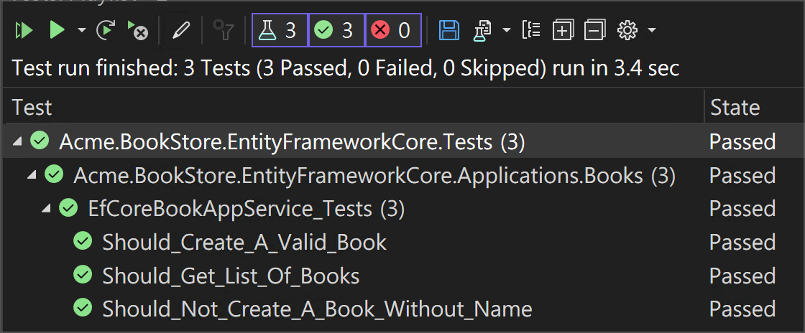

# Web Application Development Tutorial - Part 4: Integration Tests
````json
//[doc-params]
{
    "UI": ["MVC","Blazor","BlazorServer","NG"],
    "DB": ["EF","Mongo"]
}
````
## About This Tutorial

In this tutorial series, you will build an ABP based web application named `Acme.BookStore`. This application is used to manage a list of books and their authors. It is developed using the following technologies:

* **{{DB_Value}}** as the ORM provider. 
* **{{UI_Value}}** as the UI Framework.

This tutorial is organized as the following parts;

- [Part 1: Creating the server side](Part-1.md)
- [Part 2: The book list page](Part-2.md)
- [Part 3: Creating, updating and deleting books](Part-3.md)
- **Part 4: Integration tests (this part)**
- [Part 5: Authorization](Part-5.md)
- [Part 6: Authors: Domain layer](Part-6.md)
- [Part 7: Authors: Database Integration](Part-7.md)
- [Part 8: Authors: Application Layer](Part-8.md)
- [Part 9: Authors: User Interface](Part-9.md)
- [Part 10: Book to Author Relation](Part-10.md)

### Download the Source Code

This tutorial has multiple versions based on your **UI** and **Database** preferences. We've prepared a few combinations of the source code to be downloaded:

* [MVC (Razor Pages) UI with EF Core](https://github.com/abpframework/abp-samples/tree/master/BookStore-Mvc-EfCore)
* [Blazor UI with EF Core](https://github.com/abpframework/abp-samples/tree/master/BookStore-Blazor-EfCore)
* [Angular UI with MongoDB](https://github.com/abpframework/abp-samples/tree/master/BookStore-Angular-MongoDb)

> If you encounter the "filename too long" or "unzip error" on Windows, it's probably related to the Windows maximum file path limitation. Windows has a maximum file path limitation of 250 characters. To solve this, [enable the long path option in Windows 10](https://docs.microsoft.com/en-us/windows/win32/fileio/maximum-file-path-limitation?tabs=cmd#enable-long-paths-in-windows-10-version-1607-and-later).

> If you face long path errors related to Git, try the following command to enable long paths in Windows. See https://github.com/msysgit/msysgit/wiki/Git-cannot-create-a-file-or-directory-with-a-long-path
> `git config --system core.longpaths true`

{{if UI == "MVC" && DB == "EF"}}

### Video Tutorial

This part is also recorded as a video tutorial and **<a href="https://www.youtube.com/watch?v=aidRB4YFDLM&list=PLsNclT2aHJcPNaCf7Io3DbMN6yAk_DgWJ&index=4" target="_blank">published on YouTube</a>**.

{{end}}

## Test Projects in the Solution

This part covers the **server side** tests. There are several test projects in the solution:


> Test projects slightly differs based on your UI and Database selection. For example, if you select MongoDB, then the `Acme.BookStore.EntityFrameworkCore.Tests` will be `Acme.BookStore.MongoDB.Tests`.

Each project is used to test the related project. Test projects use the following libraries for testing:

* [Xunit](https://github.com/xunit/xunit) as the main test framework.
* [Shoudly](https://github.com/shouldly/shouldly) as the assertion library.
* [NSubstitute](http://nsubstitute.github.io/) as the mocking library.

{{if DB=="EF"}}

> The test projects are configured to use **SQLite in-memory** as the database. A separate database instance is created and seeded (with the [data seed system](../Data-Seeding.md)) to prepare a fresh database for every test.

{{else if DB=="Mongo"}}

> **[Mongo2Go](https://github.com/Mongo2Go/Mongo2Go)** library is used to mock the MongoDB database. A separate database instance is created and seeded (with the [data seed system](../Data-Seeding.md)) to prepare a fresh database for every test.

{{end}}

## Adding Test Data

If you had created a data seed contributor as described in the [first part](Part-1.md), the same data will be available in your tests. So, you can skip this section. If you haven't created the seed contributor, you can use the `BookStoreTestDataSeedContributor` to seed the same data to be used in the tests below.

## Testing the BookAppService

Add a new test class, named `BookAppService_Tests` in the `Books` namespace (folder) of the `Acme.BookStore.Application.Tests` project:

````csharp
using System;
using System.Linq;
using System.Threading.Tasks;
using Shouldly;
using Volo.Abp.Application.Dtos;
using Volo.Abp.Validation;
using Xunit;

namespace Acme.BookStore.Books
{ {{if DB=="Mongo"}}
    [Collection(BookStoreTestConsts.CollectionDefinitionName)]{{end}}
    public class BookAppService_Tests : BookStoreApplicationTestBase
    {
        private readonly IBookAppService _bookAppService;

        public BookAppService_Tests()
        {
            _bookAppService = GetRequiredService<IBookAppService>();
        }

        [Fact]
        public async Task Should_Get_List_Of_Books()
        {
            //Act
            var result = await _bookAppService.GetListAsync(
                new PagedAndSortedResultRequestDto()
            );

            //Assert
            result.TotalCount.ShouldBeGreaterThan(0);
            result.Items.ShouldContain(b => b.Name == "1984");
        }
    }
}
````

* `Should_Get_List_Of_Books` test simply uses `BookAppService.GetListAsync` method to get and check the list of books.
* We can safely check the book "1984" by its name, because we know that this books is available in the database since we've added it in the seed data.

Add a new test method to the `BookAppService_Tests` class that creates a new **valid** book:

````csharp
[Fact]
public async Task Should_Create_A_Valid_Book()
{
    //Act
    var result = await _bookAppService.CreateAsync(
        new CreateUpdateBookDto
        {
            Name = "New test book 42",
            Price = 10,
            PublishDate = DateTime.Now,
            Type = BookType.ScienceFiction
        }
    );

    //Assert
    result.Id.ShouldNotBe(Guid.Empty);
    result.Name.ShouldBe("New test book 42");
}
````

Add a new test that tries to create an invalid book and fails:

````csharp
[Fact]
public async Task Should_Not_Create_A_Book_Without_Name()
{
    var exception = await Assert.ThrowsAsync<AbpValidationException>(async () =>
    {
        await _bookAppService.CreateAsync(
            new CreateUpdateBookDto
            {
                Name = "",
                Price = 10,
                PublishDate = DateTime.Now,
                Type = BookType.ScienceFiction
            }
        );
    });

    exception.ValidationErrors
        .ShouldContain(err => err.MemberNames.Any(mem => mem == "Name"));
}
````

* Since the `Name` is empty, ABP will throw an `AbpValidationException`.

The final test class should be as shown below:

````csharp
using System;
using System.Linq;
using System.Threading.Tasks;
using Shouldly;
using Volo.Abp.Application.Dtos;
using Volo.Abp.Validation;
using Xunit;

namespace Acme.BookStore.Books
{ {{if DB=="Mongo"}}
    [Collection(BookStoreTestConsts.CollectionDefinitionName)]{{end}}
    public class BookAppService_Tests : BookStoreApplicationTestBase
    {
        private readonly IBookAppService _bookAppService;

        public BookAppService_Tests()
        {
            _bookAppService = GetRequiredService<IBookAppService>();
        }

        [Fact]
        public async Task Should_Get_List_Of_Books()
        {
            //Act
            var result = await _bookAppService.GetListAsync(
                new PagedAndSortedResultRequestDto()
            );

            //Assert
            result.TotalCount.ShouldBeGreaterThan(0);
            result.Items.ShouldContain(b => b.Name == "1984");
        }
        
        [Fact]
        public async Task Should_Create_A_Valid_Book()
        {
            //Act
            var result = await _bookAppService.CreateAsync(
                new CreateUpdateBookDto
                {
                    Name = "New test book 42",
                    Price = 10,
                    PublishDate = DateTime.Now,
                    Type = BookType.ScienceFiction
                }
            );

            //Assert
            result.Id.ShouldNotBe(Guid.Empty);
            result.Name.ShouldBe("New test book 42");
        }
        
        [Fact]
        public async Task Should_Not_Create_A_Book_Without_Name()
        {
            var exception = await Assert.ThrowsAsync<AbpValidationException>(async () =>
            {
                await _bookAppService.CreateAsync(
                    new CreateUpdateBookDto
                    {
                        Name = "",
                        Price = 10,
                        PublishDate = DateTime.Now,
                        Type = BookType.ScienceFiction
                    }
                );
            });

            exception.ValidationErrors
                .ShouldContain(err => err.MemberNames.Any(mem => mem == "Name"));
        }
    }
}
````

Open the **Test Explorer Window** (use Test -> Windows -> Test Explorer menu if it is not visible) and **Run All** tests:



Congratulations, the **green icons** indicates that the tests have been successfully passed!

## The Next Part

See the [next part](Part-5.md) of this tutorial.
