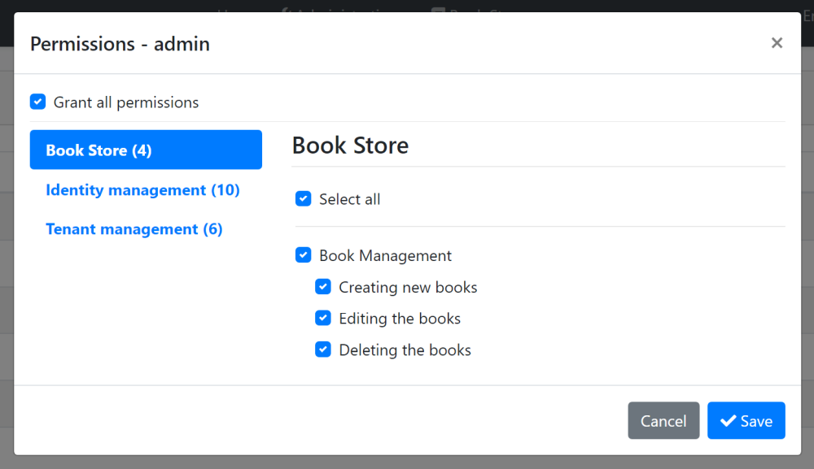
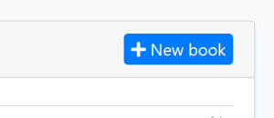
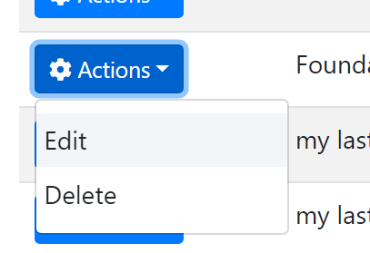

# Web Application Development Tutorial - Part 5: Authorization
````json
//[doc-params]
{
    "UI": ["MVC","Blazor","BlazorServer","NG"],
    "DB": ["EF","Mongo"]
}
````
## About This Tutorial

In this tutorial series, you will build an ABP based web application named `Acme.BookStore`. This application is used to manage a list of books and their authors. It is developed using the following technologies:

* **{{DB_Value}}** as the ORM provider. 
* **{{UI_Value}}** as the UI Framework.

This tutorial is organized as the following parts;

- [Part 1: Creating the server side](Part-1.md)
- [Part 2: The book list page](Part-2.md)
- [Part 3: Creating, updating and deleting books](Part-3.md)
- [Part 4: Integration tests](Part-4.md)
- **Part 5: Authorization (this part)**
- [Part 6: Authors: Domain layer](Part-6.md)
- [Part 7: Authors: Database Integration](Part-7.md)
- [Part 8: Authors: Application Layer](Part-8.md)
- [Part 9: Authors: User Interface](Part-9.md)
- [Part 10: Book to Author Relation](Part-10.md)

### Download the Source Code

This tutorial has multiple versions based on your **UI** and **Database** preferences. We've prepared a few combinations of the source code to be downloaded:

* [MVC (Razor Pages) UI with EF Core](https://github.com/abpframework/abp-samples/tree/master/BookStore-Mvc-EfCore)
* [Blazor UI with EF Core](https://github.com/abpframework/abp-samples/tree/master/BookStore-Blazor-EfCore)
* [Angular UI with MongoDB](https://github.com/abpframework/abp-samples/tree/master/BookStore-Angular-MongoDb)

> If you encounter the "filename too long" or "unzip error" on Windows, it's probably related to the Windows maximum file path limitation. Windows has a maximum file path limitation of 250 characters. To solve this, [enable the long path option in Windows 10](https://docs.microsoft.com/en-us/windows/win32/fileio/maximum-file-path-limitation?tabs=cmd#enable-long-paths-in-windows-10-version-1607-and-later).

> If you face long path errors related to Git, try the following command to enable long paths in Windows. See https://github.com/msysgit/msysgit/wiki/Git-cannot-create-a-file-or-directory-with-a-long-path
> `git config --system core.longpaths true`

{{if UI == "MVC" && DB == "EF"}}

### Video Tutorial

This part is also recorded as a video tutorial and **<a href="https://www.youtube.com/watch?v=1WsfMITN_Jk&list=PLsNclT2aHJcPNaCf7Io3DbMN6yAk_DgWJ&index=5" target="_blank">published on YouTube</a>**.

{{end}}

## Permissions

ABP Framework provides an [authorization system](../Authorization.md) based on the ASP.NET Core's [authorization infrastructure](https://docs.microsoft.com/en-us/aspnet/core/security/authorization/introduction). One major feature added on top of the standard authorization infrastructure is the **permission system** which allows to define permissions and enable/disable per role, user or client.

### Permission Names

A permission must have a unique name (a `string`). The best way is to define it as a `const`, so we can reuse the permission name.

Open the `BookStorePermissions` class inside the `Acme.BookStore.Application.Contracts` project (in the `Permissions` folder) and change the content as shown below:

````csharp
namespace Acme.BookStore.Permissions
{
    public static class BookStorePermissions
    {
        public const string GroupName = "BookStore";

        public static class Books
        {
            public const string Default = GroupName + ".Books";
            public const string Create = Default + ".Create";
            public const string Edit = Default + ".Edit";
            public const string Delete = Default + ".Delete";
        }
    }
}
````

This is a hierarchical way of defining permission names. For example, "create book" permission name was defined as `BookStore.Books.Create`. ABP doesn't force you to a structure, but we find this way useful.

### Permission Definitions

You should define permissions before using them.

Open the `BookStorePermissionDefinitionProvider` class inside the `Acme.BookStore.Application.Contracts` project (in the `Permissions` folder) and change the content as shown below:

````csharp
using Acme.BookStore.Localization;
using Volo.Abp.Authorization.Permissions;
using Volo.Abp.Localization;

namespace Acme.BookStore.Permissions
{
    public class BookStorePermissionDefinitionProvider : PermissionDefinitionProvider
    {
        public override void Define(IPermissionDefinitionContext context)
        {
            var bookStoreGroup = context.AddGroup(BookStorePermissions.GroupName, L("Permission:BookStore"));

            var booksPermission = bookStoreGroup.AddPermission(BookStorePermissions.Books.Default, L("Permission:Books"));
            booksPermission.AddChild(BookStorePermissions.Books.Create, L("Permission:Books.Create"));
            booksPermission.AddChild(BookStorePermissions.Books.Edit, L("Permission:Books.Edit"));
            booksPermission.AddChild(BookStorePermissions.Books.Delete, L("Permission:Books.Delete"));
        }

        private static LocalizableString L(string name)
        {
            return LocalizableString.Create<BookStoreResource>(name);
        }
    }
}
````

This class defines a **permission group** (to group permissions on the UI, will be seen below) and **4 permissions** inside this group. Also, **Create**, **Edit** and **Delete** are children of the `BookStorePermissions.Books.Default` permission. A child permission can be selected **only if the parent was selected**.

Finally, edit the localization file (`en.json` under the `Localization/BookStore` folder of the `Acme.BookStore.Domain.Shared` project) to define the localization keys used above:

````json
"Permission:BookStore": "Book Store",
"Permission:Books": "Book Management",
"Permission:Books.Create": "Creating new books",
"Permission:Books.Edit": "Editing the books",
"Permission:Books.Delete": "Deleting the books"
````

> Localization key names are arbitrary and there is no forcing rule. But we prefer the convention used above.

### Permission Management UI

Once you define the permissions, you can see them on the **permission management modal**.

Go to the *Administration -> Identity -> Roles* page, select *Permissions* action for the admin role to open the permission management modal:



Grant the permissions you want and save the modal.

> **Tip**: New permissions are automatically granted to the admin role if you run the `Acme.BookStore.DbMigrator` application.

## Authorization

Now, you can use the permissions to authorize the book management.

### Application Layer & HTTP API

Open the `BookAppService` class and add set the policy names as the permission names defined above:

````csharp
using System;
using Acme.BookStore.Permissions;
using Volo.Abp.Application.Dtos;
using Volo.Abp.Application.Services;
using Volo.Abp.Domain.Repositories;

namespace Acme.BookStore.Books
{
    public class BookAppService :
        CrudAppService<
            Book, //The Book entity
            BookDto, //Used to show books
            Guid, //Primary key of the book entity
            PagedAndSortedResultRequestDto, //Used for paging/sorting
            CreateUpdateBookDto>, //Used to create/update a book
        IBookAppService //implement the IBookAppService
    {
        public BookAppService(IRepository<Book, Guid> repository)
            : base(repository)
        {
            GetPolicyName = BookStorePermissions.Books.Default;
            GetListPolicyName = BookStorePermissions.Books.Default;
            CreatePolicyName = BookStorePermissions.Books.Create;
            UpdatePolicyName = BookStorePermissions.Books.Edit;
            DeletePolicyName = BookStorePermissions.Books.Delete;
        }
    }
}
````

Added code to the constructor. Base `CrudAppService` automatically uses these permissions on the CRUD operations. This makes the **application service** secure, but also makes the **HTTP API** secure since this service is automatically used as an HTTP API as explained before (see [auto API controllers](../API/Auto-API-Controllers.md)).

> You will see the declarative authorization, using the `[Authorize(...)]` attribute, later while developing the author management functionality.

{{if UI == "MVC"}}

### Razor Page

While securing the HTTP API & the application service prevents unauthorized users to use the services, they can still navigate to the book management page. While they will get authorization exception when the page makes the first AJAX call to the server, we should also authorize the page for a better user experience and security.

Open the `BookStoreWebModule` and add the following code block inside the `ConfigureServices` method:

````csharp
Configure<RazorPagesOptions>(options =>
{
    options.Conventions.AuthorizePage("/Books/Index", BookStorePermissions.Books.Default);
    options.Conventions.AuthorizePage("/Books/CreateModal", BookStorePermissions.Books.Create);
    options.Conventions.AuthorizePage("/Books/EditModal", BookStorePermissions.Books.Edit);
});
````

Now, unauthorized users are redirected to the **login page**.

#### Hide the New Book Button

The book management page has a *New Book* button that should be invisible if the current user has no *Book Creation* permission.



Open the `Pages/Books/Index.cshtml` file and change the content as shown below:

````html
@page
@using Acme.BookStore.Localization
@using Acme.BookStore.Permissions
@using Acme.BookStore.Web.Pages.Books
@using Microsoft.AspNetCore.Authorization
@using Microsoft.Extensions.Localization
@model IndexModel
@inject IStringLocalizer<BookStoreResource> L
@inject IAuthorizationService AuthorizationService
@section scripts
{
    <abp-script src="/Pages/Books/Index.js"/>
}

<abp-card>
    <abp-card-header>
        <abp-row>
            <abp-column size-md="_6">
                <abp-card-title>@L["Books"]</abp-card-title>
            </abp-column>
            <abp-column size-md="_6" class="text-right">
                @if (await AuthorizationService.IsGrantedAsync(BookStorePermissions.Books.Create))
                {
                    <abp-button id="NewBookButton"
                                text="@L["NewBook"].Value"
                                icon="plus"
                                button-type="Primary"/>
                }
            </abp-column>
        </abp-row>
    </abp-card-header>
    <abp-card-body>
        <abp-table striped-rows="true" id="BooksTable"></abp-table>
    </abp-card-body>
</abp-card>
````

* Added `@inject IAuthorizationService AuthorizationService` to access to the authorization service.
* Used `@if (await AuthorizationService.IsGrantedAsync(BookStorePermissions.Books.Create))` to check the book creation permission to conditionally render the *New Book* button.

### JavaScript Side

Books table in the book management page has an actions button for each row. The actions button includes *Edit* and *Delete* actions:



We should hide an action if the current user has not granted for the related permission. Datatables row actions has a `visible` option that can be set to `false` to hide the action item.

Open the `Pages/Books/Index.js` inside the `Acme.BookStore.Web` project and add a `visible` option to the `Edit` action as shown below:

````js
{
    text: l('Edit'),
    visible: abp.auth.isGranted('BookStore.Books.Edit'), //CHECK for the PERMISSION
    action: function (data) {
        editModal.open({ id: data.record.id });
    }
}
````

Do same for the `Delete` action:

````js
visible: abp.auth.isGranted('BookStore.Books.Delete')
````

* `abp.auth.isGranted(...)` is used to check a permission that is defined before.
* `visible` could also be get a function that returns a `bool` if the value will be calculated later, based on some conditions.

### Menu Item

Even we have secured all the layers of the book management page, it is still visible on the main menu of the application. We should hide the menu item if the current user has no permission.

Open the `BookStoreMenuContributor` class, find the code block below:

````csharp
context.Menu.AddItem(
    new ApplicationMenuItem(
        "BooksStore",
        l["Menu:BookStore"],
        icon: "fa fa-book"
    ).AddItem(
        new ApplicationMenuItem(
            "BooksStore.Books",
            l["Menu:Books"],
            url: "/Books"
        )
    )
);
````

And replace this code block with the following:

````csharp
var bookStoreMenu = new ApplicationMenuItem(
    "BooksStore",
    l["Menu:BookStore"],
    icon: "fa fa-book"
);

context.Menu.AddItem(bookStoreMenu);

//CHECK the PERMISSION
if (await context.IsGrantedAsync(BookStorePermissions.Books.Default))
{
    bookStoreMenu.AddItem(new ApplicationMenuItem(
        "BooksStore.Books",
        l["Menu:Books"],
        url: "/Books"
    ));
}
````

You also need to add `async` keyword to the `ConfigureMenuAsync` method and re-arrange the return values. The final `BookStoreMenuContributor` class should be the following:

````csharp
using System.Threading.Tasks;
using Microsoft.Extensions.DependencyInjection;
using Microsoft.Extensions.Localization;
using Acme.BookStore.Localization;
using Acme.BookStore.MultiTenancy;
using Acme.BookStore.Permissions;
using Volo.Abp.TenantManagement.Web.Navigation;
using Volo.Abp.UI.Navigation;

namespace Acme.BookStore.Web.Menus
{
    public class BookStoreMenuContributor : IMenuContributor
    {
        public async Task ConfigureMenuAsync(MenuConfigurationContext context)
        {
            if (context.Menu.Name == StandardMenus.Main)
            {
                await ConfigureMainMenuAsync(context);
            }
        }

        private async Task ConfigureMainMenuAsync(MenuConfigurationContext context)
        {
            if (!MultiTenancyConsts.IsEnabled)
            {
                var administration = context.Menu.GetAdministration();
                administration.TryRemoveMenuItem(TenantManagementMenuNames.GroupName);
            }

            var l = context.GetLocalizer<BookStoreResource>();

            context.Menu.Items.Insert(0, new ApplicationMenuItem("BookStore.Home", l["Menu:Home"], "~/"));

            var bookStoreMenu = new ApplicationMenuItem(
                "BooksStore",
                l["Menu:BookStore"],
                icon: "fa fa-book"
            );

            context.Menu.AddItem(bookStoreMenu);

            //CHECK the PERMISSION
            if (await context.IsGrantedAsync(BookStorePermissions.Books.Default))
            {
                bookStoreMenu.AddItem(new ApplicationMenuItem(
                    "BooksStore.Books",
                    l["Menu:Books"],
                    url: "/Books"
                ));
            }
        }
    }
}
````

{{else if UI == "NG"}}

### Angular Guard Configuration

First step of the UI is to prevent unauthorized users to see the "Books" menu item and enter to the book management page.

Open the `/src/app/book/book-routing.module.ts` and replace with the following content:

````js
import { NgModule } from '@angular/core';
import { Routes, RouterModule } from '@angular/router';
import { AuthGuard, PermissionGuard } from '@abp/ng.core';
import { BookComponent } from './book.component';

const routes: Routes = [
  { path: '', component: BookComponent, canActivate: [AuthGuard, PermissionGuard] },
];

@NgModule({
  imports: [RouterModule.forChild(routes)],
  exports: [RouterModule],
})
export class BookRoutingModule {}
````

* Imported `AuthGuard` and `PermissionGuard` from the `@abp/ng.core`.
* Added `canActivate: [AuthGuard, PermissionGuard]` to the route definition.

Open the `/src/app/route.provider.ts` and add `requiredPolicy: 'BookStore.Books'` to the `/books` route. The `/books` route block should be following:

````js
{
  path: '/books',
  name: '::Menu:Books',
  parentName: '::Menu:BookStore',
  layout: eLayoutType.application,
  requiredPolicy: 'BookStore.Books',
}
````

### Hide the New Book Button

The book management page has a *New Book* button that should be invisible if the current user has no *Book Creation* permission.


Open the `/src/app/book/book.component.html` file and replace the create button HTML content as shown below:

````html
<!-- Add the abpPermission directive -->
<button *abpPermission="'BookStore.Books.Create'" id="create" class="btn btn-primary" type="button" (click)="createBook()">
  <i class="fa fa-plus mr-1"></i>
  <span></span>
</button>
````

* Just added `*abpPermission="'BookStore.Books.Create'"` that hides the button if the current user has no permission.

### Hide the Edit and Delete Actions

Books table in the book management page has an actions button for each row. The actions button includes *Edit* and *Delete* actions:


We should hide an action if the current user has not granted for the related permission.

Open the `/src/app/book/book.component.html` file and replace the edit and delete buttons contents as shown below:

````html
<!-- Add the abpPermission directive -->
<button *abpPermission="'BookStore.Books.Edit'" ngbDropdownItem (click)="editBook(row.id)">
  
</button>

<!-- Add the abpPermission directive -->
<button *abpPermission="'BookStore.Books.Delete'" ngbDropdownItem (click)="delete(row.id)">
  
</button>
````

* Added `*abpPermission="'BookStore.Books.Edit'"` that hides the edit action if the current user has no editing permission.
* Added `*abpPermission="'BookStore.Books.Delete'"` that hides the delete action if the current user has no delete permission.

{{else if UI == "Blazor"}}

### Authorize the Razor Component

Open the `/Pages/Books.razor` file in the `Acme.BookStore.Blazor` project and add an `Authorize` attribute just after the `@page` directive and the following namespace imports (`@using` lines), as shown below:

````html
@page "/books"
@attribute [Authorize(BookStorePermissions.Books.Default)]
@using Acme.BookStore.Permissions
@using Microsoft.AspNetCore.Authorization
...
````

Adding this attribute prevents to enter this page if the current hasn't logged in or hasn't granted for the given permission. In case of attempt, the user is redirected to the login page.

### Show/Hide the Actions

The book management page has a *New Book* button and *Edit* and *Delete* actions for each book. We should hide these buttons/actions if the current user has not granted for the related permissions.

The base `AbpCrudPageBase` class already has the necessary functionality for these kind of operations.

#### Set the Policy (Permission) Names

Add the following code block to the end of the `Books.razor` file:

````csharp
@code
{
    public Books() // Constructor
    {
        CreatePolicyName = BookStorePermissions.Books.Create;
        UpdatePolicyName = BookStorePermissions.Books.Edit;
        DeletePolicyName = BookStorePermissions.Books.Delete;
    }
}
````

The base `AbpCrudPageBase` class automatically checks these permissions on the related operations. It also defines the given properties for us if we need to check them manually:

* `HasCreatePermission`: True, if the current user has permission to create the entity.
* `HasUpdatePermission`: True, if the current user has permission to edit/update the entity.
* `HasDeletePermission`: True, if the current user has permission to delete the entity.

> **Blazor Tip**: While adding the C# code into a `@code` block is fine for small code parts, it is suggested to use the code behind approach to develop a more maintainable code base when the code block becomes longer. We will use this approach for the authors part.

#### Hide the New Book Button

Wrap the *New Book* button by an `if` block as shown below:

````xml
@if (HasCreatePermission)
{
    <Button Color="Color.Primary"
            Clicked="OpenCreateModalAsync">@L["NewBook"]</Button>
}
````

#### Hide the Edit/Delete Actions

`EntityAction` component defines `Visible` attribute (parameter) to conditionally show the action.

Update the `EntityActions` section as shown below:

````xml
<EntityActions TItem="BookDto" EntityActionsColumn="@EntityActionsColumn">
    <EntityAction TItem="BookDto"
                  Text="@L["Edit"]"
                  Visible=HasUpdatePermission
                  Clicked="() => OpenEditModalAsync(context)" />
    <EntityAction TItem="BookDto"
                  Text="@L["Delete"]"
                  Visible=HasDeletePermission
                  Clicked="() => DeleteEntityAsync(context)"
                  ConfirmationMessage="()=>GetDeleteConfirmationMessage(context)" />
</EntityActions>
````

#### About the Permission Caching

You can run and test the permissions. Remove a book related permission from the admin role to see the related button/action disappears from the UI.

**ABP Framework caches the permissions** of the current user in the client side. So, when you change a permission for yourself, you need to manually **refresh the page** to take the effect. If you don't refresh and try to use the prohibited action you get an HTTP 403 (forbidden) response from the server.

> Changing a permission for a role or user immediately available on the server side. So, this cache system doesn't cause any security problem.

### Menu Item

Even we have secured all the layers of the book management page, it is still visible on the main menu of the application. We should hide the menu item if the current user has no permission.

Open the `BookStoreMenuContributor` class in the `Acme.BookStore.Blazor` project, find the code block below:

````csharp
context.Menu.AddItem(
    new ApplicationMenuItem(
        "BooksStore",
        l["Menu:BookStore"],
        icon: "fa fa-book"
    ).AddItem(
        new ApplicationMenuItem(
            "BooksStore.Books",
            l["Menu:Books"],
            url: "/books"
        )
    )
);
````

And replace this code block with the following:

````csharp
var bookStoreMenu = new ApplicationMenuItem(
    "BooksStore",
    l["Menu:BookStore"],
    icon: "fa fa-book"
);

context.Menu.AddItem(bookStoreMenu);

//CHECK the PERMISSION
if (await context.IsGrantedAsync(BookStorePermissions.Books.Default))
{
    bookStoreMenu.AddItem(new ApplicationMenuItem(
        "BooksStore.Books",
        l["Menu:Books"],
        url: "/books"
    ));
}
````

You also need to add `async` keyword to the `ConfigureMenuAsync` method and re-arrange the return value. The final `ConfigureMainMenuAsync` method should be the following:

````csharp
private async Task ConfigureMainMenuAsync(MenuConfigurationContext context)
{
    var l = context.GetLocalizer<BookStoreResource>();

    context.Menu.Items.Insert(
        0,
        new ApplicationMenuItem(
            "BookStore.Home",
            l["Menu:Home"],
            "/",
            icon: "fas fa-home"
        )
    );

    var bookStoreMenu = new ApplicationMenuItem(
        "BooksStore",
        l["Menu:BookStore"],
        icon: "fa fa-book"
    );

    context.Menu.AddItem(bookStoreMenu);

    //CHECK the PERMISSION
    if (await context.IsGrantedAsync(BookStorePermissions.Books.Default))
    {
        bookStoreMenu.AddItem(new ApplicationMenuItem(
            "BooksStore.Books",
            l["Menu:Books"],
            url: "/books"
        ));
    }
}
````

{{end}}

## The Next Part

See the [next part](Part-6.md) of this tutorial.
