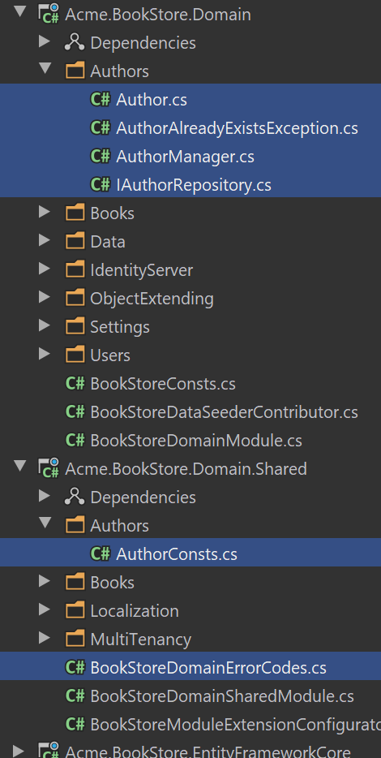

# Web Application Development Tutorial - Part 6: Authors: Domain Layer
````json
//[doc-params]
{
    "UI": ["MVC","Blazor","BlazorServer","NG"],
    "DB": ["EF","Mongo"]
}
````
## About This Tutorial

In this tutorial series, you will build an ABP based web application named `Acme.BookStore`. This application is used to manage a list of books and their authors. It is developed using the following technologies:

* **{{DB_Value}}** as the ORM provider. 
* **{{UI_Value}}** as the UI Framework.

This tutorial is organized as the following parts;

- [Part 1: Creating the server side](Part-1.md)
- [Part 2: The book list page](Part-2.md)
- [Part 3: Creating, updating and deleting books](Part-3.md)
- [Part 4: Integration tests](Part-4.md)
- [Part 5: Authorization](Part-5.md)
- **Part 6: Authors: Domain layer (this part)**
- [Part 7: Authors: Database Integration](Part-7.md)
- [Part 8: Authors: Application Layer](Part-8.md)
- [Part 9: Authors: User Interface](Part-9.md)
- [Part 10: Book to Author Relation](Part-10.md)

### Download the Source Code

This tutorial has multiple versions based on your **UI** and **Database** preferences. We've prepared a few combinations of the source code to be downloaded:

* [MVC (Razor Pages) UI with EF Core](https://github.com/abpframework/abp-samples/tree/master/BookStore-Mvc-EfCore)
* [Blazor UI with EF Core](https://github.com/abpframework/abp-samples/tree/master/BookStore-Blazor-EfCore)
* [Angular UI with MongoDB](https://github.com/abpframework/abp-samples/tree/master/BookStore-Angular-MongoDb)

> If you've been faced with the "filename too long" or "unzip error" on Windows, please try to download the samples on your root directory (You shouldn't exceed 250 chars for your path on some Windows versions). If this does not work for you you can [enable the long path option in Windows 10](https://docs.microsoft.com/en-us/windows/win32/fileio/maximum-file-path-limitation?tabs=cmd#enable-long-paths-in-windows-10-version-1607-and-later).

> If you've been faced with the Git related long path errors try the following command to enable long paths support in Git for Windows. (https://github.com/msysgit/msysgit/wiki/Git-cannot-create-a-file-or-directory-with-a-long-path)
> `git config --system core.longpaths true`

## Introduction

In the previous parts, we've used the ABP infrastructure to easily build some services;

* Used the [CrudAppService](../Application-Services.md) base class instead of manually developing an application service for standard create, read, update and delete operations.
* Used [generic repositories](../Repositories.md) to completely automate the database layer.

For the "Authors" part;

* We will **do some of the things manually** to show how you can do it in case of need.
* We will implement some **Domain Driven Design (DDD) best practices**.

> **The development will be done layer by layer to concentrate on an individual layer in one time. In a real project, you will develop your application feature by feature (vertical) as done in the previous parts. In this way, you will experience both approaches.**

## The Author Entity

Create an `Authors` folder (namespace) in the `Acme.BookStore.Domain` project and add an `Author` class inside it:

````csharp
using System;
using JetBrains.Annotations;
using Volo.Abp;
using Volo.Abp.Domain.Entities.Auditing;

namespace Acme.BookStore.Authors
{
    public class Author : FullAuditedAggregateRoot<Guid>
    {
        public string Name { get; private set; }
        public DateTime BirthDate { get; set; }
        public string ShortBio { get; set; }

        private Author()
        {
            /* This constructor is for deserialization / ORM purpose */
        }

        internal Author(
            Guid id,
            [NotNull] string name,
            DateTime birthDate,
            [CanBeNull] string shortBio = null)
            : base(id)
        {
            SetName(name);
            BirthDate = birthDate;
            ShortBio = shortBio;
        }

        internal Author ChangeName([NotNull] string name)
        {
            SetName(name);
            return this;
        }

        private void SetName([NotNull] string name)
        {
            Name = Check.NotNullOrWhiteSpace(
                name, 
                nameof(name), 
                maxLength: AuthorConsts.MaxNameLength
            );
        }
    }
}
````

* Inherited from `FullAuditedAggregateRoot<Guid>` which makes the entity [soft delete](../Data-Filtering.md) (that means when you delete it, it is not deleted in the database, but just marked as deleted) with all the [auditing](../Entities.md) properties.
* `private set` for the `Name` property restricts to set this property from out of this class. There are two ways of setting the name (in both cases, we validate the name):
  * In the constructor, while creating a new author.
  * Using the `ChangeName` method to update the name later.
* The `constructor` and the `ChangeName` method is `internal` to force to use these methods only in the domain layer, using the `AuthorManager` that will be explained later.
* `Check` class is an ABP Framework utility class to help you while checking method arguments (it throws `ArgumentException` on an invalid case).

`AuthorConsts` is a simple class that is located under the `Authors` namespace (folder) of the `Acme.BookStore.Domain.Shared` project:

````csharp
namespace Acme.BookStore.Authors
{
    public static class AuthorConsts
    {
        public const int MaxNameLength = 64;
    }
}
````

Created this class inside the `Acme.BookStore.Domain.Shared` project since we will re-use it on the [Data Transfer Objects](../Data-Transfer-Objects.md) (DTOs) later.

## AuthorManager: The Domain Service

`Author` constructor and `ChangeName` methods are `internal`, so they can be used only in the domain layer. Create an `AuthorManager` class in the `Authors` folder (namespace) of the `Acme.BookStore.Domain` project:

````csharp
using System;
using System.Threading.Tasks;
using JetBrains.Annotations;
using Volo.Abp;
using Volo.Abp.Domain.Services;

namespace Acme.BookStore.Authors
{
    public class AuthorManager : DomainService
    {
        private readonly IAuthorRepository _authorRepository;

        public AuthorManager(IAuthorRepository authorRepository)
        {
            _authorRepository = authorRepository;
        }

        public async Task<Author> CreateAsync(
            [NotNull] string name,
            DateTime birthDate,
            [CanBeNull] string shortBio = null)
        {
            Check.NotNullOrWhiteSpace(name, nameof(name));

            var existingAuthor = await _authorRepository.FindByNameAsync(name);
            if (existingAuthor != null)
            {
                throw new AuthorAlreadyExistsException(name);
            }

            return new Author(
                GuidGenerator.Create(),
                name,
                birthDate,
                shortBio
            );
        }

        public async Task ChangeNameAsync(
            [NotNull] Author author,
            [NotNull] string newName)
        {
            Check.NotNull(author, nameof(author));
            Check.NotNullOrWhiteSpace(newName, nameof(newName));

            var existingAuthor = await _authorRepository.FindByNameAsync(newName);
            if (existingAuthor != null && existingAuthor.Id != author.Id)
            {
                throw new AuthorAlreadyExistsException(newName);
            }

            author.ChangeName(newName);
        }
    }
}
````

* `AuthorManager` forces to create an author and change name of an author in a controlled way. The application layer (will be introduced later) will use these methods.

> **DDD tip**: Do not introduce domain service methods unless they are really needed and perform some core business rules. For this case, we needed this service to be able to force the unique name constraint.

Both methods checks if there is already an author with the given name and throws a special business exception, `AuthorAlreadyExistsException`, defined in the `Acme.BookStore.Domain` project (in the `Authors` folder) as shown below:

````csharp
using Volo.Abp;

namespace Acme.BookStore.Authors
{
    public class AuthorAlreadyExistsException : BusinessException
    {
        public AuthorAlreadyExistsException(string name)
            : base(BookStoreDomainErrorCodes.AuthorAlreadyExists)
        {
            WithData("name", name);
        }
    }
}
````

`BusinessException` is a special exception type. It is a good practice to throw domain related exceptions when needed. It is automatically handled by the ABP Framework and can be easily localized. `WithData(...)` method is used to provide additional data to the exception object that will later be used on the localization message or for some other purpose.

Open the `BookStoreDomainErrorCodes` in the `Acme.BookStore.Domain.Shared` project and change as shown below:

````csharp
namespace Acme.BookStore
{
    public static class BookStoreDomainErrorCodes
    {
        public const string AuthorAlreadyExists = "BookStore:00001";
    }
}
````

This is a unique string represents the error code thrown by your application and can be handled by client applications. For users, you probably want to localize it. Open the `Localization/BookStore/en.json` inside the `Acme.BookStore.Domain.Shared` project and add the following entry:

````json
"BookStore:00001": "There is already an author with the same name: {name}"
````

Whenever you throw an `AuthorAlreadyExistsException`, the end user will see a nice error message on the UI.

## IAuthorRepository

`AuthorManager` injects the `IAuthorRepository`, so we need to define it. Create this new interface in the `Authors` folder (namespace) of the `Acme.BookStore.Domain` project:

````csharp
using System;
using System.Collections.Generic;
using System.Threading.Tasks;
using Volo.Abp.Domain.Repositories;

namespace Acme.BookStore.Authors
{
    public interface IAuthorRepository : IRepository<Author, Guid>
    {
        Task<Author> FindByNameAsync(string name);

        Task<List<Author>> GetListAsync(
            int skipCount,
            int maxResultCount,
            string sorting,
            string filter = null
        );
    }
}
````

* `IAuthorRepository` extends the standard `IRepository<Author, Guid>` interface, so all the standard [repository](../Repositories.md) methods will also be available for the `IAuthorRepository`.
* `FindByNameAsync` was used in the `AuthorManager` to query an author by name.
* `GetListAsync` will be used in the application layer to get a listed, sorted and filtered list of authors to show on the UI.

We will implement this repository in the next part.

> Both of these methods might **seem unnecessary** since the standard repositories already `IQueryable` and you can directly use them instead of defining such custom methods. You're right and do it like in a real application. However, for this **"learning" tutorial**, it is useful to explain how to create custom repository methods when you really need it.

## Conclusion

This part covered the domain layer of the authors functionality of the book store application. The main files created/updated in this part was highlighted in the picture below:



## The Next Part

See the [next part](Part-7.md) of this tutorial.