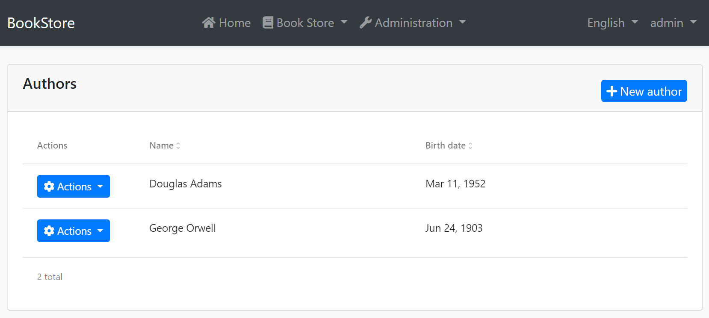

# Web Application Development Tutorial - Part 9: Authors: User Interface
````json
//[doc-params]
{
    "UI": ["MVC","Blazor","BlazorServer","NG"],
    "DB": ["EF","Mongo"]
}
````
## About This Tutorial

In this tutorial series, you will build an ABP based web application named `Acme.BookStore`. This application is used to manage a list of books and their authors. It is developed using the following technologies:

* **{{DB_Value}}** as the ORM provider. 
* **{{UI_Value}}** as the UI Framework.

This tutorial is organized as the following parts;

- [Part 1: Creating the server side](Part-1.md)
- [Part 2: The book list page](Part-2.md)
- [Part 3: Creating, updating and deleting books](Part-3.md)
- [Part 4: Integration tests](Part-4.md)
- [Part 5: Authorization](Part-5.md)
- [Part 6: Authors: Domain layer](Part-6.md)
- [Part 7: Authors: Database Integration](Part-7.md)
- [Part 8: Authors: Application Layer](Part-8.md)
- **Part 9: Authors: User Interface (this part)**
- [Part 10: Book to Author Relation](Part-10.md)

### Download the Source Code

This tutorial has multiple versions based on your **UI** and **Database** preferences. We've prepared a few combinations of the source code to be downloaded:

* [MVC (Razor Pages) UI with EF Core](https://github.com/abpframework/abp-samples/tree/master/BookStore-Mvc-EfCore)
* [Blazor UI with EF Core](https://github.com/abpframework/abp-samples/tree/master/BookStore-Blazor-EfCore)
* [Angular UI with MongoDB](https://github.com/abpframework/abp-samples/tree/master/BookStore-Angular-MongoDb)

## Introduction

This part explains how to create a CRUD page for the `Author` entity introduced in the previous parts.

{{if UI == "MVC"}}

## The Authors List Page

Create a new razor page, `Index.cshtml` under the `Pages/Authors` folder of the `Acme.BookStore.Web` project and change the content as given below.

### Index.cshtml

````html
@page
@using Acme.BookStore.Localization
@using Acme.BookStore.Permissions
@using Acme.BookStore.Web.Pages.Authors
@using Microsoft.AspNetCore.Authorization
@using Microsoft.Extensions.Localization
@inject IStringLocalizer<BookStoreResource> L
@inject IAuthorizationService AuthorizationService
@model IndexModel

@section scripts
{
    <abp-script src="/Pages/Authors/Index.js"/>
}

<abp-card>
    <abp-card-header>
        <abp-row>
            <abp-column size-md="_6">
                <abp-card-title>@L["Authors"]</abp-card-title>
            </abp-column>
            <abp-column size-md="_6" class="text-right">
                @if (await AuthorizationService
                    .IsGrantedAsync(BookStorePermissions.Authors.Create))
                {
                    <abp-button id="NewAuthorButton"
                                text="@L["NewAuthor"].Value"
                                icon="plus"
                                button-type="Primary"/>
                }
            </abp-column>
        </abp-row>
    </abp-card-header>
    <abp-card-body>
        <abp-table striped-rows="true" id="AuthorsTable"></abp-table>
    </abp-card-body>
</abp-card>
````

This is a simple page similar to the Books page we had created before. It imports a JavaScript file which will be introduced below.

### IndexModel.cshtml.cs

````csharp
using Microsoft.AspNetCore.Mvc.RazorPages;

namespace Acme.BookStore.Web.Pages.Authors
{
    public class IndexModel : PageModel
    {
        public void OnGet()
        {

        }
    }
}
````

### Index.js

````js
$(function () {
    var l = abp.localization.getResource('BookStore');
    var createModal = new abp.ModalManager(abp.appPath + 'Authors/CreateModal');
    var editModal = new abp.ModalManager(abp.appPath + 'Authors/EditModal');

    var dataTable = $('#AuthorsTable').DataTable(
        abp.libs.datatables.normalizeConfiguration({
            serverSide: true,
            paging: true,
            order: [[1, "asc"]],
            searching: false,
            scrollX: true,
            ajax: abp.libs.datatables.createAjax(acme.bookStore.authors.author.getList),
            columnDefs: [
                {
                    title: l('Actions'),
                    rowAction: {
                        items:
                            [
                                {
                                    text: l('Edit'),
                                    visible: 
                                        abp.auth.isGranted('BookStore.Authors.Edit'),
                                    action: function (data) {
                                        editModal.open({ id: data.record.id });
                                    }
                                },
                                {
                                    text: l('Delete'),
                                    visible: 
                                        abp.auth.isGranted('BookStore.Authors.Delete'),
                                    confirmMessage: function (data) {
                                        return l(
                                            'AuthorDeletionConfirmationMessage',
                                            data.record.name
                                        );
                                    },
                                    action: function (data) {
                                        acme.bookStore.authors.author
                                            .delete(data.record.id)
                                            .then(function() {
                                                abp.notify.info(
                                                    l('SuccessfullyDeleted')
                                                );
                                                dataTable.ajax.reload();
                                            });
                                    }
                                }
                            ]
                    }
                },
                {
                    title: l('Name'),
                    data: "name"
                },
                {
                    title: l('BirthDate'),
                    data: "birthDate",
                    render: function (data) {
                        return luxon
                            .DateTime
                            .fromISO(data, {
                                locale: abp.localization.currentCulture.name
                            }).toLocaleString();
                    }
                }
            ]
        })
    );

    createModal.onResult(function () {
        dataTable.ajax.reload();
    });

    editModal.onResult(function () {
        dataTable.ajax.reload();
    });

    $('#NewAuthorButton').click(function (e) {
        e.preventDefault();
        createModal.open();
    });
});
````

Briefly, this JavaScript page;

* Creates a Data table with `Actions`, `Name` and `BirthDate` columns.
  * `Actions` column is used to add *Edit* and *Delete* actions.
  * `BirthDate` provides a `render` function to format the `DateTime` value using the [luxon](https://moment.github.io/luxon/) library.
* Uses the `abp.ModalManager` to open *Create* and *Edit* modal forms.

This code is very similar to the Books page created before, so we will not explain it more.

### Localizations

This page uses some localization keys we need to declare. Open the `en.json` file under the `Localization/BookStore` folder of the `Acme.BookStore.Domain.Shared` project and add the following entries:

````json
"Menu:Authors": "Authors",
"Authors": "Authors",
"AuthorDeletionConfirmationMessage": "Are you sure to delete the author '{0}'?",
"BirthDate": "Birth date",
"NewAuthor": "New author"
````

Notice that we've added more keys. They will be used in the next sections.

### Add to the Main Menu

Open the `BookStoreMenuContributor.cs` in the `Menus` folder of the `Acme.BookStore.Web` project and add the following code in the end of the `ConfigureMainMenuAsync` method:

````csharp
if (await context.IsGrantedAsync(BookStorePermissions.Authors.Default))
{
    bookStoreMenu.AddItem(new ApplicationMenuItem(
        "BooksStore.Authors",
        l["Menu:Authors"],
        url: "/Authors"
    ));
}
````

### Run the Application

Run and login to the application. **You can not see the menu item since you don't have permission yet.** Go to the `Identity/Roles` page, click to the *Actions* button and select the *Permissions* action for the **admin role**:


As you see, the admin role has no *Author Management* permissions yet. Click to the checkboxes and save the modal to grant the necessary permissions. You will see the *Authors* menu item under the *Book Store* in the main menu, after **refreshing the page**:


The page is fully working except *New author* and *Actions/Edit* since we haven't implemented them yet.

> **Tip**: If you run the `.DbMigrator` console application after defining a new permission, it automatically grants these new permissions to the admin role and you don't need to manually grant the permissions yourself.

## Create Modal

Create a new razor page, `CreateModal.cshtml` under the `Pages/Authors` folder of the `Acme.BookStore.Web` project and change the content as given below.

### CreateModal.cshtml

```html
@page
@using Acme.BookStore.Localization
@using Acme.BookStore.Web.Pages.Authors
@using Microsoft.Extensions.Localization
@using Volo.Abp.AspNetCore.Mvc.UI.Bootstrap.TagHelpers.Modal
@model CreateModalModel
@inject IStringLocalizer<BookStoreResource> L
@{
    Layout = null;
}
<form asp-page="/Authors/CreateModal">
    <abp-modal>
        <abp-modal-header title="@L["NewAuthor"].Value"></abp-modal-header>
        <abp-modal-body>
            <abp-input asp-for="Author.Name" />
            <abp-input asp-for="Author.BirthDate" />
            <abp-input asp-for="Author.ShortBio" />
        </abp-modal-body>
        <abp-modal-footer buttons="@(AbpModalButtons.Cancel|AbpModalButtons.Save)"></abp-modal-footer>
    </abp-modal>
</form>
```

We had used [dynamic forms](../UI/AspNetCore/Tag-Helpers/Dynamic-Forms.md) of the ABP Framework for the books page before. We could use the same approach here, but we wanted to show how to do it manually. Actually, not so manually, because we've used `abp-input` tag helper in this case to simplify creating the form elements.

You can definitely use the standard Bootstrap HTML structure, but it requires to write a lot of code. `abp-input` automatically adds validation, localization and other standard elements based on the data type.

### CreateModal.cshtml.cs

```csharp
using System;
using System.ComponentModel.DataAnnotations;
using System.Threading.Tasks;
using Acme.BookStore.Authors;
using Microsoft.AspNetCore.Mvc;
using Volo.Abp.AspNetCore.Mvc.UI.Bootstrap.TagHelpers.Form;

namespace Acme.BookStore.Web.Pages.Authors
{
    public class CreateModalModel : BookStorePageModel
    {
        [BindProperty]
        public CreateAuthorViewModel Author { get; set; }

        private readonly IAuthorAppService _authorAppService;

        public CreateModalModel(IAuthorAppService authorAppService)
        {
            _authorAppService = authorAppService;
        }

        public void OnGet()
        {
            Author = new CreateAuthorViewModel();
        }

        public async Task<IActionResult> OnPostAsync()
        {
            var dto = ObjectMapper.Map<CreateAuthorViewModel, CreateAuthorDto>(Author);
            await _authorAppService.CreateAsync(dto);
            return NoContent();
        }

        public class CreateAuthorViewModel
        {
            [Required]
            [StringLength(AuthorConsts.MaxNameLength)]
            public string Name { get; set; }

            [Required]
            [DataType(DataType.Date)]
            public DateTime BirthDate { get; set; }

            [TextArea]
            public string ShortBio { get; set; }
        }
    }
}
```

This page model class simply injects and uses the `IAuthorAppService` to create a new author. The main difference between the book creation model class is that this one is declaring a new class, `CreateAuthorViewModel`, for the view model instead of re-using the `CreateAuthorDto`.

The main reason of this decision was to show you how to use a different model class inside the page. But there is one more benefit: We added two attributes to the class members, which were not present in the `CreateAuthorDto`:

* Added `[DataType(DataType.Date)]` attribute to the `BirthDate` which shows a date picker on the UI for this property.
* Added `[TextArea]` attribute to the `ShortBio` which shows a multi-line text area instead of a standard textbox.

In this way, you can specialize the view model class based on your UI requirements without touching to the DTO. As a result of this decision, we have used `ObjectMapper` to map `CreateAuthorViewModel` to `CreateAuthorDto`. To be able to do that, you need to add a new mapping code to the `BookStoreWebAutoMapperProfile` constructor:

````csharp
using Acme.BookStore.Authors; // ADDED NAMESPACE IMPORT
using Acme.BookStore.Books;
using AutoMapper;

namespace Acme.BookStore.Web
{
    public class BookStoreWebAutoMapperProfile : Profile
    {
        public BookStoreWebAutoMapperProfile()
        {
            CreateMap<BookDto, CreateUpdateBookDto>();

            // ADD a NEW MAPPING
            CreateMap<Pages.Authors.CreateModalModel.CreateAuthorViewModel,
                      CreateAuthorDto>();
        }
    }
}
````

"New author" button will work as expected and open a new model when you run the application again:


## Edit Modal

Create a new razor page, `EditModal.cshtml` under the `Pages/Authors` folder of the `Acme.BookStore.Web` project and change the content as given below.

### EditModal.cshtml

````html
@page
@using Acme.BookStore.Localization
@using Acme.BookStore.Web.Pages.Authors
@using Microsoft.Extensions.Localization
@using Volo.Abp.AspNetCore.Mvc.UI.Bootstrap.TagHelpers.Modal
@model EditModalModel
@inject IStringLocalizer<BookStoreResource> L
@{
    Layout = null;
}
<form asp-page="/Authors/EditModal">
    <abp-modal>
        <abp-modal-header title="@L["Update"].Value"></abp-modal-header>
        <abp-modal-body>
            <abp-input asp-for="Author.Id" />
            <abp-input asp-for="Author.Name" />
            <abp-input asp-for="Author.BirthDate" />
            <abp-input asp-for="Author.ShortBio" />
        </abp-modal-body>
        <abp-modal-footer buttons="@(AbpModalButtons.Cancel|AbpModalButtons.Save)"></abp-modal-footer>
    </abp-modal>
</form>
````

### EditModal.cshtml.cs

```csharp
using System;
using System.ComponentModel.DataAnnotations;
using System.Threading.Tasks;
using Acme.BookStore.Authors;
using Microsoft.AspNetCore.Mvc;
using Volo.Abp.AspNetCore.Mvc.UI.Bootstrap.TagHelpers.Form;

namespace Acme.BookStore.Web.Pages.Authors
{
    public class EditModalModel : BookStorePageModel
    {
        [BindProperty]
        public EditAuthorViewModel Author { get; set; }

        private readonly IAuthorAppService _authorAppService;

        public EditModalModel(IAuthorAppService authorAppService)
        {
            _authorAppService = authorAppService;
        }

        public async Task OnGetAsync(Guid id)
        {
            var authorDto = await _authorAppService.GetAsync(id);
            Author = ObjectMapper.Map<AuthorDto, EditAuthorViewModel>(authorDto);
        }

        public async Task<IActionResult> OnPostAsync()
        {
            await _authorAppService.UpdateAsync(
                Author.Id,
                ObjectMapper.Map<EditAuthorViewModel, UpdateAuthorDto>(Author)
            );

            return NoContent();
        }

        public class EditAuthorViewModel
        {
            [HiddenInput]
            public Guid Id { get; set; }

            [Required]
            [StringLength(AuthorConsts.MaxNameLength)]
            public string Name { get; set; }

            [Required]
            [DataType(DataType.Date)]
            public DateTime BirthDate { get; set; }

            [TextArea]
            public string ShortBio { get; set; }
        }
    }
}
```

This class is similar to the `CreateModal.cshtml.cs` while there are some main differences;

* Uses the `IAuthorAppService.GetAsync(...)` method to get the editing author from the application layer.
* `EditAuthorViewModel` has an additional `Id` property which is marked with the `[HiddenInput]` attribute that creates a hidden input for this property.

This class requires to add two object mapping declarations to the `BookStoreWebAutoMapperProfile` class:

```csharp
using Acme.BookStore.Authors;
using Acme.BookStore.Books;
using AutoMapper;

namespace Acme.BookStore.Web
{
    public class BookStoreWebAutoMapperProfile : Profile
    {
        public BookStoreWebAutoMapperProfile()
        {
            CreateMap<BookDto, CreateUpdateBookDto>();

            CreateMap<Pages.Authors.CreateModalModel.CreateAuthorViewModel,
                      CreateAuthorDto>();

            // ADD THESE NEW MAPPINGS
            CreateMap<AuthorDto, Pages.Authors.EditModalModel.EditAuthorViewModel>();
            CreateMap<Pages.Authors.EditModalModel.EditAuthorViewModel,
                      UpdateAuthorDto>();
        }
    }
}
```

That's all! You can run the application and try to edit an author.

{{else if UI == "NG"}}

## The Author Management Page

Run the following command line to create a new module, named `AuthorModule` in the root folder of the angular application:

```bash
yarn ng generate module author --module app --routing --route authors
```

This command should produce the following output:

```bash
> yarn ng generate module author --module app --routing --route authors

yarn run v1.19.1
$ ng generate module author --module app --routing --route authors
CREATE src/app/author/author-routing.module.ts (344 bytes)
CREATE src/app/author/author.module.ts (349 bytes)
CREATE src/app/author/author.component.html (21 bytes)
CREATE src/app/author/author.component.spec.ts (628 bytes)
CREATE src/app/author/author.component.ts (276 bytes)
CREATE src/app/author/author.component.scss (0 bytes)
UPDATE src/app/app-routing.module.ts (1396 bytes)
Done in 2.22s.
```

### AuthorModule

Open the `/src/app/author/author.module.ts` and replace the content as shown below:

```js
import { NgModule } from '@angular/core';
import { SharedModule } from '../shared/shared.module';
import { AuthorRoutingModule } from './author-routing.module';
import { AuthorComponent } from './author.component';
import { NgbDatepickerModule } from '@ng-bootstrap/ng-bootstrap';

@NgModule({
  declarations: [AuthorComponent],
  imports: [SharedModule, AuthorRoutingModule, NgbDatepickerModule],
})
export class AuthorModule {}
```

- Added the `SharedModule`. `SharedModule` exports some common modules needed to create user interfaces.
- `SharedModule` already exports the `CommonModule`, so we've removed the `CommonModule`.
- Added `NgbDatepickerModule` that will be used later on the author create and edit forms.

### Menu Definition

Open the `src/app/route.provider.ts` file and add the following menu definition:

````js
{
  path: '/authors',
  name: '::Menu:Authors',
  parentName: '::Menu:BookStore',
  layout: eLayoutType.application,
  requiredPolicy: 'BookStore.Authors',
}
````

The final `configureRoutes` function declaration should be following:

```js
function configureRoutes(routes: RoutesService) {
  return () => {
    routes.add([
      {
        path: '/',
        name: '::Menu:Home',
        iconClass: 'fas fa-home',
        order: 1,
        layout: eLayoutType.application,
      },
      {
        path: '/book-store',
        name: '::Menu:BookStore',
        iconClass: 'fas fa-book',
        order: 2,
        layout: eLayoutType.application,
      },
      {
        path: '/books',
        name: '::Menu:Books',
        parentName: '::Menu:BookStore',
        layout: eLayoutType.application,
        requiredPolicy: 'BookStore.Books',
      },
      {
        path: '/authors',
        name: '::Menu:Authors',
        parentName: '::Menu:BookStore',
        layout: eLayoutType.application,
        requiredPolicy: 'BookStore.Authors',
      },
    ]);
  };
}
```

### Service Proxy Generation

[ABP CLI](https://docs.abp.io/en/abp/latest/CLI) provides `generate-proxy` command that generates client proxies for your HTTP APIs to make easy to consume your HTTP APIs from the client side. Before running `generate-proxy` command, your host must be up and running.

Run the following command in the `angular` folder:

```bash
abp generate-proxy
```

This command generates the service proxy for the author service and the related model (DTO) classes:


### AuthorComponent

Open the `/src/app/author/author.component.ts` file and replace the content as below:

```js
import { Component, OnInit } from '@angular/core';
import { ListService, PagedResultDto } from '@abp/ng.core';
import { AuthorService, AuthorDto } from '@proxy/authors';
import { FormGroup, FormBuilder, Validators } from '@angular/forms';
import { NgbDateNativeAdapter, NgbDateAdapter } from '@ng-bootstrap/ng-bootstrap';
import { ConfirmationService, Confirmation } from '@abp/ng.theme.shared';

@Component({
  selector: 'app-author',
  templateUrl: './author.component.html',
  styleUrls: ['./author.component.scss'],
  providers: [ListService, { provide: NgbDateAdapter, useClass: NgbDateNativeAdapter }],
})
export class AuthorComponent implements OnInit {
  author = { items: [], totalCount: 0 } as PagedResultDto<AuthorDto>;

  isModalOpen = false;

  form: FormGroup;

  selectedAuthor = {} as AuthorDto;

  constructor(
    public readonly list: ListService,
    private authorService: AuthorService,
    private fb: FormBuilder,
    private confirmation: ConfirmationService
  ) {}

  ngOnInit(): void {
    const authorStreamCreator = (query) => this.authorService.getList(query);

    this.list.hookToQuery(authorStreamCreator).subscribe((response) => {
      this.author = response;
    });
  }

  createAuthor() {
    this.selectedAuthor = {} as AuthorDto;
    this.buildForm();
    this.isModalOpen = true;
  }

  editAuthor(id: string) {
    this.authorService.get(id).subscribe((author) => {
      this.selectedAuthor = author;
      this.buildForm();
      this.isModalOpen = true;
    });
  }

  buildForm() {
    this.form = this.fb.group({
      name: [this.selectedAuthor.name || '', Validators.required],
      birthDate: [
        this.selectedAuthor.birthDate ? new Date(this.selectedAuthor.birthDate) : null,
        Validators.required,
      ],
    });
  }

  save() {
    if (this.form.invalid) {
      return;
    }

    if (this.selectedAuthor.id) {
      this.authorService
        .update(this.selectedAuthor.id, this.form.value)
        .subscribe(() => {
          this.isModalOpen = false;
          this.form.reset();
          this.list.get();
        });
    } else {
      this.authorService.create(this.form.value).subscribe(() => {
        this.isModalOpen = false;
        this.form.reset();
        this.list.get();
      });
    }
  }

  delete(id: string) {
    this.confirmation.warn('::AreYouSureToDelete', '::AreYouSure')
        .subscribe((status) => {
          if (status === Confirmation.Status.confirm) {
            this.authorService.delete(id).subscribe(() => this.list.get());
          }
	    });
  }
}
```

Open the `/src/app/author/author.component.html` and replace the content as below:

````html
<div class="card">
  <div class="card-header">
    <div class="row">
      <div class="col col-md-6">
        <h5 class="card-title">
          
        </h5>
      </div>
      <div class="text-right col col-md-6">
        <div class="text-lg-right pt-2">
          <button *abpPermission="'BookStore.Authors.Create'" id="create" class="btn btn-primary" type="button" (click)="createAuthor()">
            <i class="fa fa-plus mr-1"></i>
            <span></span>
          </button>
        </div>
      </div>
    </div>
  </div>
  <div class="card-body">
    <ngx-datatable [rows]="author.items" [count]="author.totalCount" [list]="list" default>
      <ngx-datatable-column
        [name]="'::Actions' | abpLocalization"
        [maxWidth]="150"
        [sortable]="false"
      >
        <ng-template let-row="row" ngx-datatable-cell-template>
          <div ngbDropdown container="body" class="d-inline-block">
            <button
              class="btn btn-primary btn-sm dropdown-toggle"
              data-toggle="dropdown"
              aria-haspopup="true"
              ngbDropdownToggle
            >
              <i class="fa fa-cog mr-1"></i>
            </button>
            <div ngbDropdownMenu>
              <button *abpPermission="'BookStore.Authors.Edit'" ngbDropdownItem (click)="editAuthor(row.id)">
                
              </button>
              <button *abpPermission="'BookStore.Authors.Delete'" ngbDropdownItem (click)="delete(row.id)">
                
              </button>
            </div>
          </div>
        </ng-template>
      </ngx-datatable-column>
      <ngx-datatable-column [name]="'::Name' | abpLocalization" prop="name"></ngx-datatable-column>
      <ngx-datatable-column [name]="'::BirthDate' | abpLocalization">
        <ng-template let-row="row" ngx-datatable-cell-template>
          
        </ng-template>
      </ngx-datatable-column>
    </ngx-datatable>
  </div>
</div>

<abp-modal [(visible)]="isModalOpen">
  <ng-template #abpHeader>
    <h3></h3>
  </ng-template>

  <ng-template #abpBody>
    <form [formGroup]="form" (ngSubmit)="save()">
      <div class="form-group">
        <label for="author-name">Name</label><span> * </span>
        <input type="text" id="author-name" class="form-control" formControlName="name" autofocus />
      </div>

      <div class="form-group">
        <label>Birth date</label><span> * </span>
        <input
          #datepicker="ngbDatepicker"
          class="form-control"
          name="datepicker"
          formControlName="birthDate"
          ngbDatepicker
          (click)="datepicker.toggle()"
        />
      </div>
    </form>
  </ng-template>

  <ng-template #abpFooter>
    <button type="button" class="btn btn-secondary" abpClose>
      
    </button>

    <button class="btn btn-primary" (click)="save()" [disabled]="form.invalid">
      <i class="fa fa-check mr-1"></i>
      
    </button>
  </ng-template>
</abp-modal>
````

### Localizations

This page uses some localization keys we need to declare. Open the `en.json` file under the `Localization/BookStore` folder of the `Acme.BookStore.Domain.Shared` project and add the following entries:

````json
"Menu:Authors": "Authors",
"Authors": "Authors",
"AuthorDeletionConfirmationMessage": "Are you sure to delete the author '{0}'?",
"BirthDate": "Birth date",
"NewAuthor": "New author"
````

### Run the Application

Run and login to the application. **You can not see the menu item since you don't have permission yet.** Go to the `identity/roles` page, click to the *Actions* button and select the *Permissions* action for the **admin role**:


As you see, the admin role has no *Author Management* permissions yet. Click to the checkboxes and save the modal to grant the necessary permissions. You will see the *Authors* menu item under the *Book Store* in the main menu, after **refreshing the page**:



That's all! This is a fully working CRUD page, you can create, edit and delete authors.

> **Tip**: If you run the `.DbMigrator` console application after defining a new permission, it automatically grants these new permissions to the admin role and you don't need to manually grant the permissions yourself.

{{end}}

{{if UI == "Blazor" || UI == "BlazorServer"}}

## The Author Management Page

### Authors Razor Component

Create a new Razor Component Page, `/Pages/Authors.razor`, in the `Acme.BookStore.Blazor` project with the following content:

````xml
@page "/authors"
@using Acme.BookStore.Authors
@using Acme.BookStore.Localization
@using Volo.Abp.AspNetCore.Components.Web
@inherits BookStoreComponentBase
@inject IAuthorAppService AuthorAppService
@inject AbpBlazorMessageLocalizerHelper<BookStoreResource> LH
<Card>
    <CardHeader>
        <Row>
            <Column ColumnSize="ColumnSize.Is6">
                <h2>@L["Authors"]</h2>
            </Column>
            <Column ColumnSize="ColumnSize.Is6">
                <Paragraph Alignment="TextAlignment.Right">
                    @if (CanCreateAuthor)
                    {
                        <Button Color="Color.Primary"
                                Clicked="OpenCreateAuthorModal">
                            @L["NewAuthor"]
                        </Button>
                    }
                </Paragraph>
            </Column>
        </Row>
    </CardHeader>
    <CardBody>
        <DataGrid TItem="AuthorDto"
                  Data="AuthorList"
                  ReadData="OnDataGridReadAsync"
                  TotalItems="TotalCount"
                  ShowPager="true"
                  PageSize="PageSize">
            <DataGridColumns>
                <DataGridColumn Width="150px"
                                TItem="AuthorDto"
                                Field="@nameof(AuthorDto.Id)"
                                Sortable="false"
                                Caption="@L["Actions"]">
                    <DisplayTemplate>
                        <Dropdown>
                            <DropdownToggle Color="Color.Primary">
                                @L["Actions"]
                            </DropdownToggle>
                            <DropdownMenu>
                                @if (CanEditAuthor)
                                {
                                    <DropdownItem Clicked="() => OpenEditAuthorModal(context)">
                                        @L["Edit"]
                                    </DropdownItem>
                                }
                                @if (CanDeleteAuthor)
                                {
                                    <DropdownItem Clicked="() => DeleteAuthorAsync(context)">
                                        @L["Delete"]
                                    </DropdownItem>
                                }
                            </DropdownMenu>
                        </Dropdown>
                    </DisplayTemplate>
                </DataGridColumn>
                <DataGridColumn TItem="AuthorDto"
                                Field="@nameof(AuthorDto.Name)"
                                Caption="@L["Name"]"></DataGridColumn>
                <DataGridColumn TItem="AuthorDto"
                                Field="@nameof(AuthorDto.BirthDate)"
                                Caption="@L["BirthDate"]">
                    <DisplayTemplate>
                        @context.BirthDate.ToShortDateString()
                    </DisplayTemplate>
                </DataGridColumn>
            </DataGridColumns>
        </DataGrid>
    </CardBody>
</Card>

<Modal @ref="CreateAuthorModal">
    <ModalBackdrop />
    <ModalContent IsCentered="true">
        <Form>
            <ModalHeader>
                <ModalTitle>@L["NewAuthor"]</ModalTitle>
                <CloseButton Clicked="CloseCreateAuthorModal" />
            </ModalHeader>
            <ModalBody>
                <Validations @ref="@CreateValidationsRef" Model="@NewAuthor" ValidateOnLoad="false">
                    <Validation MessageLocalizer="@LH.Localize">
                        <Field>
                            <FieldLabel>@L["Name"]</FieldLabel>
                            <TextEdit @bind-Text="@NewAuthor.Name">
                                <Feedback>
                                    <ValidationError/>
                                </Feedback>
                            </TextEdit>
                        </Field>
                    </Validation>
                    <Field>
                        <FieldLabel>@L["BirthDate"]</FieldLabel>
                        <DateEdit TValue="DateTime" @bind-Date="@NewAuthor.BirthDate"/>
                    </Field>
                    <Validation MessageLocalizer="@LH.Localize">
                        <Field>
                            <FieldLabel>@L["ShortBio"]</FieldLabel>
                            <MemoEdit Rows="5" @bind-Text="@NewAuthor.ShortBio">
                                <Feedback>
                                    <ValidationError/>
                                </Feedback>
                            </MemoEdit>
                        </Field>
                    </Validation>
                </Validations>
            </ModalBody>
            <ModalFooter>
                <Button Color="Color.Secondary"
                        Clicked="CloseCreateAuthorModal">
                    @L["Cancel"]
                </Button>
                <Button Color="Color.Primary"
                        Type="@ButtonType.Submit"
                        PreventDefaultOnSubmit="true"
                        Clicked="CreateAuthorAsync">
                    @L["Save"]
                </Button>
            </ModalFooter>
        </Form>
    </ModalContent>
</Modal>

<Modal @ref="EditAuthorModal">
    <ModalBackdrop />
    <ModalContent IsCentered="true">
        <Form>
            <ModalHeader>
                        <ModalTitle>@EditingAuthor.Name</ModalTitle>
                        <CloseButton Clicked="CloseEditAuthorModal" />
                    </ModalHeader>
            <ModalBody>
                <Validations @ref="@EditValidationsRef" Model="@EditingAuthor" ValidateOnLoad="false">
                    <Validation MessageLocalizer="@LH.Localize">
                        <Field>
                            <FieldLabel>@L["Name"]</FieldLabel>
                            <TextEdit @bind-Text="@EditingAuthor.Name">
                                <Feedback>
                                    <ValidationError/>
                                </Feedback>
                            </TextEdit>
                        </Field>
                    </Validation>
                    <Field>
                        <FieldLabel>@L["BirthDate"]</FieldLabel>
                        <DateEdit TValue="DateTime" @bind-Date="@EditingAuthor.BirthDate"/>
                    </Field>
                    <Validation>
                        <Field>
                            <FieldLabel>@L["ShortBio"]</FieldLabel>
                            <MemoEdit Rows="5" @bind-Text="@EditingAuthor.ShortBio">
                                <Feedback>
                                    <ValidationError/>
                                </Feedback>
                            </MemoEdit>
                        </Field>
                    </Validation>
                </Validations>
            </ModalBody>
            <ModalFooter>
                <Button Color="Color.Secondary"
                        Clicked="CloseEditAuthorModal">
                    @L["Cancel"]
                </Button>
                <Button Color="Color.Primary"
                        Type="@ButtonType.Submit"
                        PreventDefaultOnSubmit="true"
                        Clicked="UpdateAuthorAsync">
                    @L["Save"]
                </Button>
            </ModalFooter>
        </Form>
    </ModalContent>
</Modal>
````

* This code is similar to the `Books.razor`, except it doesn't inherit from the `AbpCrudPageBase`, but uses its own implementation.
* Injects the `IAuthorAppService` to consume the server side HTTP APIs from the UI. We can directly inject application service interfaces and use just like regular method calls by the help of [Dynamic C# HTTP API Client Proxy System](../API/Dynamic-CSharp-API-Clients.md), which performs REST API calls for us. See the `Authors` class below to see the usage.
* Injects the `IAuthorizationService` to check [permissions](../Authorization.md).
* Injects the `IObjectMapper` for [object to object mapping](../Object-To-Object-Mapping.md).

Create a new code behind file, `Authors.razor.cs`, under the `Pages` folder, with the following content:

````csharp
using System;
using System.Collections.Generic;
using System.Linq;
using System.Threading.Tasks;
using Acme.BookStore.Authors;
using Acme.BookStore.Permissions;
using Blazorise;
using Blazorise.DataGrid;
using Microsoft.AspNetCore.Authorization;
using Volo.Abp.Application.Dtos;

namespace Acme.BookStore.Blazor.Pages
{
    public partial class Authors
    {
        private IReadOnlyList<AuthorDto> AuthorList { get; set; }

        private int PageSize { get; } = LimitedResultRequestDto.DefaultMaxResultCount;
        private int CurrentPage { get; set; }
        private string CurrentSorting { get; set; }
        private int TotalCount { get; set; }

        private bool CanCreateAuthor { get; set; }
        private bool CanEditAuthor { get; set; }
        private bool CanDeleteAuthor { get; set; }

        private CreateAuthorDto NewAuthor { get; set; }

        private Guid EditingAuthorId { get; set; }
        private UpdateAuthorDto EditingAuthor { get; set; }

        private Modal CreateAuthorModal { get; set; }
        private Modal EditAuthorModal { get; set; }

        private Validations CreateValidationsRef;
        
        private Validations EditValidationsRef;
        
        public Authors()
        {
            NewAuthor = new CreateAuthorDto();
            EditingAuthor = new UpdateAuthorDto();
        }

        protected override async Task OnInitializedAsync()
        {
            await SetPermissionsAsync();
            await GetAuthorsAsync();
        }

        private async Task SetPermissionsAsync()
        {
            CanCreateAuthor = await AuthorizationService
                .IsGrantedAsync(BookStorePermissions.Authors.Create);

            CanEditAuthor = await AuthorizationService
                .IsGrantedAsync(BookStorePermissions.Authors.Edit);

            CanDeleteAuthor = await AuthorizationService
                .IsGrantedAsync(BookStorePermissions.Authors.Delete);
        }

        private async Task GetAuthorsAsync()
        {
            var result = await AuthorAppService.GetListAsync(
                new GetAuthorListDto
                {
                    MaxResultCount = PageSize,
                    SkipCount = CurrentPage * PageSize,
                    Sorting = CurrentSorting
                }
            );

            AuthorList = result.Items;
            TotalCount = (int)result.TotalCount;
        }

        private async Task OnDataGridReadAsync(DataGridReadDataEventArgs<AuthorDto> e)
        {
            CurrentSorting = e.Columns
                .Where(c => c.Direction != SortDirection.None)
                .Select(c => c.Field + (c.Direction == SortDirection.Descending ? " DESC" : ""))
                .JoinAsString(",");
            CurrentPage = e.Page - 1;

            await GetAuthorsAsync();

            await InvokeAsync(StateHasChanged);
        }

        private void OpenCreateAuthorModal()
        {
            CreateValidationsRef.ClearAll();
            
            NewAuthor = new CreateAuthorDto();
            CreateAuthorModal.Show();
        }

        private void CloseCreateAuthorModal()
        {
            CreateAuthorModal.Hide();
        }

        private void OpenEditAuthorModal(AuthorDto author)
        {
            EditValidationsRef.ClearAll();
            
            EditingAuthorId = author.Id;
            EditingAuthor = ObjectMapper.Map<AuthorDto, UpdateAuthorDto>(author);
            EditAuthorModal.Show();
        }

        private async Task DeleteAuthorAsync(AuthorDto author)
        {
            var confirmMessage = L["AuthorDeletionConfirmationMessage", author.Name];
            if (!await Message.Confirm(confirmMessage))
            {
                return;
            }

            await AuthorAppService.DeleteAsync(author.Id);
            await GetAuthorsAsync();
        }

        private void CloseEditAuthorModal()
        {
            EditAuthorModal.Hide();
        }

        private async Task CreateAuthorAsync()
        {
            if (CreateValidationsRef.ValidateAll())
            {
                await AuthorAppService.CreateAsync(NewAuthor);
                await GetAuthorsAsync();
                CreateAuthorModal.Hide();
            }
        }

        private async Task UpdateAuthorAsync()
        {
            if (EditValidationsRef.ValidateAll())
            {
                await AuthorAppService.UpdateAsync(EditingAuthorId, EditingAuthor);
                await GetAuthorsAsync();
                EditAuthorModal.Hide();
            }
        }
    }
}
````

This class typically defines the properties and methods used by the `Authors.razor` page.

### Object Mapping

`Authors` class uses the `IObjectMapper` in the `OpenEditAuthorModal` method. So, we need to define this mapping.

Open the `BookStoreBlazorAutoMapperProfile.cs` in the `Acme.BookStore.Blazor` project and add the following mapping code in the constructor:

````csharp
CreateMap<AuthorDto, UpdateAuthorDto>();
````

You will need to declare a `using Acme.BookStore.Authors;` statement to the beginning of the file.

### Add to the Main Menu

Open the `BookStoreMenuContributor.cs` in the `Acme.BookStore.Blazor` project and add the following code to the end of the `ConfigureMainMenuAsync` method:

````csharp
if (await context.IsGrantedAsync(BookStorePermissions.Authors.Default))
{
    bookStoreMenu.AddItem(new ApplicationMenuItem(
        "BooksStore.Authors",
        l["Menu:Authors"],
        url: "/authors"
    ));
}
````

### Localizations

We should complete the localizations we've used above. Open the `en.json` file under the `Localization/BookStore` folder of the `Acme.BookStore.Domain.Shared` project and add the following entries:

````json
"Menu:Authors": "Authors",
"Authors": "Authors",
"AuthorDeletionConfirmationMessage": "Are you sure to delete the author '{0}'?",
"BirthDate": "Birth date",
"NewAuthor": "New author"
````

### Run the Application

Run and login to the application. **If you don't see the Authors menu item under the Book Store menu, that means you don't have the permission yet.** Go to the `identity/roles` page, click to the *Actions* button and select the *Permissions* action for the **admin role**:


As you see, the admin role has no *Author Management* permissions yet. Click to the checkboxes and save the modal to grant the necessary permissions. You will see the *Authors* menu item under the *Book Store* in the main menu, after **refreshing the page**:


That's all! This is a fully working CRUD page, you can create, edit and delete the authors.

> **Tip**: If you run the `.DbMigrator` console application after defining a new permission, it automatically grants these new permissions to the admin role and you don't need to manually grant the permissions yourself.

{{end}}

## The Next Part

See the [next part](Part-10.md) of this tutorial.
