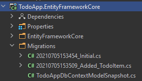
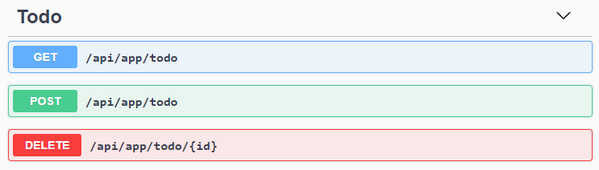

# Quick Tutorial

````json
//[doc-params]
{
    "UI": ["MVC", "Blazor", "BlazorServer", "NG"],
    "DB": ["EF", "Mongo"],
}
````

This is a single-part, quick tutorial to build a simple todo application with the ABP Framework. Here, a screenshot from the final application:


### Source Code

You can find source code of the completed application [here](https://github.com/abpframework/abp-samples/tree/master/TodoApp).

## Pre-Requirements

### IDE

You will need to an IDE (e.g. [Visual Studio](https://visualstudio.microsoft.com/vs/)) that supports [.NET 5.0+](https://dotnet.microsoft.com/download/dotnet) development.

### ABP CLI

We will use the ABP CLI to create new solutions with the ABP Framework. You can run the following command in a command-line terminal to install it:

````bash
dotnet tool install -g Volo.Abp.Cli
````

## Creating a New Solution

Create an empty folder, open a command-line terminal and execute the following command in the terminal:

````bash
abp new TodoApp
````

This will create a new solution, named *TodoApp*. Open the solution in your favorite IDE.

### Create the Database

If you are using Visual Studio, right click to the `TodoApp.DbMigrator` project, select *Set as StartUp Project*, then hit *Ctrl+F5* to run it without debugging. It will create the initial database and seed the initial data.

> Some IDEs (e.g. Rider) may have problems for the first run since *DbMigrator* adds the initial migration and re-compiles the project. In this case, open a command-line terminal in the folder of the `.DbMigrator` project and execute the `dotnet run` command.

### Run the Application

It is good to run the application before starting the development. Ensure the `TodoApp.Web` project is the startup project, then run the application (Ctrl+F5 in Visual Studio) to see the initial UI:


You can click to the *Login* button, use `admin` as the username and `1q2w3E*` as the password to login to the application.

All ready. We can start the coding!

## Domain Layer

This application has a single [entity](../../Entities.md) and we are starting by creating it. Create a new `TodoItem` class inside the *TodoApp.Domain* project:

````csharp
using System;
using Volo.Abp.Domain.Entities;

namespace TodoApp
{
    public class TodoItem : BasicAggregateRoot<Guid>
    {
        public string Text { get; set; }
    }
}
````

`BasicAggregateRoot` is one the simplest base class to create root entities, and `Guid` is the primary key (`Id`) of the entity here.

## Database Integration

Next step is to setup the [Entity Framework Core](../../Entity-Framework-Core.md) configuration. Open the `TodoAppDbContext` class in the `EntityFrameworkCore` folder of the *TodoApp.EntityFrameworkCore* project and add a new `DbSet` property to this class:

````csharp
public DbSet<TodoItem> TodoItems { get; set; }
````

Then open the `TodoAppDbContextModelCreatingExtensions` class in the same folder and add a mapping configuration for the `TodoItem` class as shown below:

````csharp
public static void ConfigureTodoApp(this ModelBuilder builder)
{
    Check.NotNull(builder, nameof(builder));

    builder.Entity<TodoItem>(b =>
    {
        b.ToTable("TodoItems");
    });
}
````

We've mapped `TodoItem` entity to a `TodoItems` table in the database.

The startup solution is configured to use Entity Framework Core [Code First Migrations](https://docs.microsoft.com/en-us/ef/core/managing-schemas/migrations). Since we've changed the database mapping configuration, we should create a new migration and apply changes to the database.

Open a command-line terminal in the directory of the *TodoApp.EntityFrameworkCore.DbMigrations* project and type the following command:

````bash
dotnet ef migrations add Added_TodoItem
````

This will add a new migration class to the project:



You can apply changes to the database using the following command, in the same command-line terminal:

````bash
dotnet ef database update
````

> If you are using Visual Studio, you may want to use `Add-Migration Added_TodoItem` and `Update-Database` commands in the *Package Manager Console (PMC)*. In this case, ensure that the `TodoApp.Web` is the startup project and `TodoApp.EntityFrameworkCore.DbMigrations` is the *Default Project* in PMC.

Now, we can use ABP repositories to save and retrieve todo items, as we'll do in the next section.

## Application Layer

An [Application Service](../../Application-Services.md) is used to perform use cases of the application. We need to perform the following use cases;

* Get the list of todo items
* Create a new todo item
* Delete an existing todo item

We can start by defining an interface for the application service. Create a new `ITodoAppService` interface in the *TodoApp.Application.Contracts* project, as shown below:

````csharp
using System;
using System.Collections.Generic;
using System.Threading.Tasks;
using Volo.Abp.Application.Services;

namespace TodoApp
{
    public interface ITodoAppService : IApplicationService
    {
        Task<List<TodoItemDto>> GetListAsync();
        Task<TodoItemDto> CreateAsync(string text);
        Task DeleteAsync(Guid id);
    }
}
````

`GetListAsync` and `CreateAsync` methods return `TodoItemDto`. Applications Services typically gets and returns DTOs ([Data Transfer Objects](../../Data-Transfer-Objects.md)) instead of entities. So, we should define the DTO class here. Create a new `TodoItemDto` class inside the *TodoApp.Application.Contracts* project:

````csharp
using System;

namespace TodoApp
{
    public class TodoItemDto
    {
        public Guid Id { get; set; }
        public string Text { get; set; }
    }
}
````

This is a very simple DTO class that matches to our `TodoItem` entity. We are ready to implement the `ITodoAppService`. Create a `TodoAppService` class inside the *TodoApp.Application* project, as shown below:

````csharp
using System;
using System.Collections.Generic;
using System.Linq;
using System.Threading.Tasks;
using Volo.Abp.Application.Services;
using Volo.Abp.Domain.Repositories;

namespace TodoApp
{
    public class TodoAppService : ApplicationService, ITodoAppService
    {
        private readonly IRepository<TodoItem, Guid> _todoItemRepository;

        public TodoAppService(IRepository<TodoItem, Guid> todoItemRepository)
        {
            _todoItemRepository = todoItemRepository;
        }
        
        // TODO: Implement the methods
    }
}
````

This class inherits from the `ApplicationService` class of the ABP Framework and implements the `ITodoAppService` that was defined before. ABP provides default generic [repositories](../../Repositories.md) for the entities. We can use them to perform the fundamental database operations. This class [injects](../../Dependency-Injection.md) `IRepository<TodoItem, Guid>`, which is the default repository for the `TodoItem` entity. We will use it to implement the use cases described before.

Let's start by implementing the `GetListAsync` method:

````csharp
public async Task<List<TodoItemDto>> GetListAsync()
{
    var items = await _todoItemRepository.GetListAsync();
    return items
        .Select(item => new TodoItemDto
        {
            Id = item.Id,
            Text = item.Text
        }).ToList();
}
````

We are simply getting the complete `TodoItem` list from database, mapping them to `TodoItemDto` objects and returning as the result.

Next method is `CreateAsync` and we can implement it as shown below:

````csharp
public async Task<TodoItemDto> CreateAsync(string text)
{
    var todoItem = await _todoItemRepository.InsertAsync(
        new TodoItem {Text = text}
    );

    return new TodoItemDto
    {
        Id = todoItem.Id,
        Text = todoItem.Text
    };
}
````

Repository's `InsertAsync` method inserts the given `TodoItem` to database and returns the same `TodoItem` object. It also sets the `Id`, so we can use it on the returning object. We are simply returning a `TodoItemDto` by creating from the new `TodoItem` entity.

Finally, we can implement the `DeleteAsync` as the following code block:

````csharp
public async Task DeleteAsync(Guid id)
{
    await _todoItemRepository.DeleteAsync(id);
}
````

The application service is ready to be used from the UI layer.

## User Interface Layer

It is time to show the todo items on the UI! Before starting to write the code, it would be good to remember what we are trying to build. Here, a sample screenshot from the final UI:


> **We will keep the UI side minimal for this tutorial to make the tutorial simple and focused. See the [web application development tutorial](../Part-1.md) to build real-life pages with all aspects.**

### Index.cshtml.cs

Open the `Index.cshtml.cs` file in the `Pages` folder of the *TodoApp.Web* project and replace with the following content:

````csharp
using System.Collections.Generic;
using System.Threading.Tasks;

namespace TodoApp.Web.Pages
{
    public class IndexModel : TodoAppPageModel
    {
        public List<TodoItemDto> TodoItems { get; set; }

        private readonly ITodoAppService _todoAppService;

        public IndexModel(ITodoAppService todoAppService)
        {
            _todoAppService = todoAppService;
        }

        public async Task OnGetAsync()
        {
            TodoItems = await _todoAppService.GetListAsync();
        }
    }
}
````

This class uses the `ITodoAppService` to get the list of todo items and assign the the `TodoItems` property. We will use it to render the todo items on the razor page.

### Index.cshtml

Open the `Index.cshtml` file in the `Pages` folder of the *TodoApp.Web* project and replace with the following content:

````xml
@page
@model TodoApp.Web.Pages.IndexModel
@section styles {
    <abp-style src="/Pages/Index.css" />
}
@section scripts {
    <abp-script src="/Pages/Index.js" />
}
<div class="container">
    <abp-card>
        <abp-card-header>
            <abp-card-title>
                TODO LIST
            </abp-card-title>
        </abp-card-header>
        <abp-card-body>
            
            <!-- FORM FOR NEW TODO ITEMS -->
            <form id="NewItemForm" class="form-inline">
                <input id="NewItemText" type="text" class="form-control mr-2" placeholder="enter text...">
                <button type="submit" class="btn btn-primary">Submit</button>
            </form>
            
            <!-- TODO ITEMS LIST -->
            <ul id="TodoList">
                @foreach (var todoItem in Model.TodoItems)
                {
                    <li data-id="@todoItem.Id">
                        <i class="fa fa-trash-o"></i> @todoItem.Text
                    </li>
                }
            </ul>
        </abp-card-body>
    </abp-card>
</div>
````

We are using ABP's [card tag helper](../../UI/AspNetCore/Tag-Helpers/Cards.md) to create a simple card view. You could directly use the standard bootstrap HTML structure, however the ABP [tag helpers]() make it much easier and type safe.

This page imports a CSS and a JavaScript file, so we should also create them.

### Index.js

Open the `Index.js` file in the `Pages` folder of the *TodoApp.Web* project and replace with the following content:

````js
$(function () {
    
    // DELETING ITEMS /////////////////////////////////////////
    $('#TodoList').on('click', 'li i', function(){
        var $li = $(this).parent();
        var id = $li.attr('data-id');
        
        todoApp.todo.delete(id).then(function(){
            $li.remove();
            abp.notify.info('Deleted the todo item.');
        });
    });
    
    // CREATING NEW ITEMS /////////////////////////////////////
    $('#NewItemForm').submit(function(e){
        e.preventDefault();
        
        var todoText = $('#NewItemText').val();        
        todoApp.todo.create(todoText).then(function(result){
            $('<li data-id="' + result.id + '">')
                .html('<i class="fa fa-trash-o"></i> ' + result.text)
                .appendTo($('#TodoList'));
            $('#NewItemText').val('');
        });
    });
});
````

In the first part, we are registering to click events of the trash icons near to the todo items, deleting the related item on the server and showing a notification on the UI. Also, we are removing the deleted item from DOM, so we don't need to refresh the page.

In the second part, we are creating a new todo item on the server. If it succeed, we are then manipulating DOM to insert a new `<li>` element to the todo list. In this way, no need to refresh the whole page after creating a new todo item.

The interesting part here is how we communicate with the server. It seems we are just calling some JavaScript functions like `todoApp.todo.delete(id)` and `todoApp.todo.create(todoText)`.

#### Dynamic JavaScript Proxies & Auto API Controllers

 `todoApp.todo.delete(...)` and `todoApp.todo.create(...)` functions are dynamically created by the ABP Framework, thanks to the [Dynamic JavaScript Client Proxy](../../UI/AspNetCore/Dynamic-JavaScript-Proxies.md) system. These functions perform HTTP API calls to the server and return a promise, so you can register a callback to the `then` function as we've done above.

However, you may ask that we haven't created any API Controller, so how server handles these requests? This question brings us the [Auto API Controller](../../API/Auto-API-Controllers.md) feature of the ABP Framework. It automatically converts the application services to API Controllers by conventions.

If you open the [Swagger UI](https://swagger.io/tools/swagger-ui/) by entering the `/swagger` URL in your application, you can see the TODO API:



### Index.css

As the final touch, open the `Index.css` file in the `Pages` folder of the *TodoApp.Web* project and replace with the following content:

````css
#TodoList{
    list-style: none;
    margin: 0;
    padding: 0;
}

#TodoList li {
    padding: 5px;
    margin: 5px 0px;
    border: 1px solid #cccccc;
    background-color: #f5f5f5;
}

#TodoList li i
{
    opacity: 0.5;
}

#TodoList li i:hover
{
    opacity: 1;
    color: #ff0000;
    cursor: pointer;
}
````

This is a simple styling for the todo page. We believe that you can do much better :)

## Conclusion

In this tutorial, we've build a very simple application to warm up to the ABP Framework. If you are looking to build a serious application, please check the [web application development tutorial](../Part-1.md) which covers all the aspects of a real-life web application development.

### Source Code

You can find source code of the completed application [here](https://github.com/abpframework/abp-samples/tree/master/TodoApp).

## See Also

* [Web Application Development Tutorial](../Part-1.md)