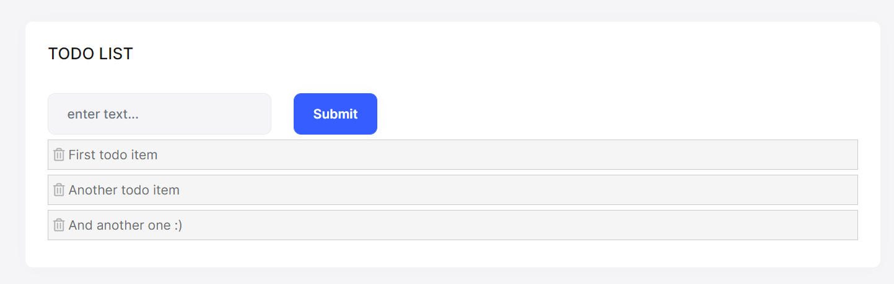

# Quick Start

````json
//[doc-params]
{
    "UI": ["MVC", "BlazorServer", "NG"],
    "DB": ["EF", "Mongo"]
}
````

This is a single-part quick-start tutorial to build a simple todo application with the ABP Framework. Here's a screenshot from the final application:



You can find the source code of the completed application [here](TODO: sample's url???).

## Pre-Requirements

* An IDE (e.g. [Visual Studio](https://visualstudio.microsoft.com/vs/)) that supports [.NET 6.0+](https://dotnet.microsoft.com/download/dotnet) development.

{{if DB=="Mongo"}}

* [MongoDB Server 4.0+](https://docs.mongodb.com/manual/administration/install-community/)

{{end}}

{{if UI=="NG"}}

* [Node v14.x](https://nodejs.org/)

{{end}}

## Creating a New Solution

In this tutorial, we will use the [ABP CLI](../../CLI.md) to create the sample application with the ABP Framework. You can run the following command in a command-line terminal to install the **ABP CLI**, if you haven't installed it yet:

````bash
dotnet tool install -g Volo.Abp.Cli
````

Then create an empty folder, open a command-line terminal and execute the following command in the terminal:

````bash
abp new TodoApp -t app-nolayers{{if UI=="BlazorServer"}} -u blazor-server{{else if UI=="NG"}} -u angular{{end}}{{if DB=="Mongo"}} -d mongodb{{end}}
````

{{if UI=="NG"}}

This will create a new solution with a single-project, named *TodoApp* with `angular` and `aspnet-core` folders. Once the solution is ready, open the solution in your favorite IDE.

{{else}}

This will create a new solution with a single-project, named *TodoApp*. Once the solution is ready, open it in your favorite IDE.

{{end}}

### Create the Database

You can run the following command in the directory of your project to create the database and seed the initial data:

```bash
dotnet run --migrate-database
```

This command will create the database and seed the initial data for you. Then you can run the application.

### Run the Application

{{if UI=="MVC" || UI=="BlazorServer"}}

It is good to run the application before starting the development. Running the application is pretty straigth-forward, you can run the application with any IDE that supports .NET or by running the `dotnet run` CLI command in the directory of your project to see the initial UI: 

{{else if UI=="NG"}}

It is good to run the application before starting the development. The solution has two main applications:

* `TodoApp` (in the .NET solution) host the server-side HTTP API, so Angular application can consume it. (server-side application)
* `angular` folder contains the Angular application. (client-side application)

Firstly, run the `TodoApp` project in your favorite IDE (or run the `dotnet run` CLI command on your project directory) to see the server-side HTTP API on the [Swagger UI](https://swagger.io/tools/swagger-ui/):


You can explore and test your HTTP API with this UI. If it works, we can run the Angular client application.

First, run the following command (or `yarn install`) to restore the NPM packages: 

````bash
npm install
````

It will take some time to install all packages. Then you can run the application using the following (or `yarn start`) command:

````bash
npm start
````

This command takes time, but eventually runs and opens the application in your default browser:

{{end}}


You can click on the *Login* button, use `admin` as the username and `1q2w3E*` as the password to login to the application.

All ready. We can start coding!

## Defining Entities

This application will have a single [entity](../../../Entities.md) and we can start by creating it. So, create a new `TodoItem` class under the **Entities** folder of the project.

````csharp
using Volo.Abp.Domain.Entities;

namespace TodoApp.Entities;

public class TodoItem : BasicAggregateRoot<Guid>
{
    public string Text { get; set; }
}
````

`BasicAggregateRoot` is the simplest base class to create root entities, and `Guid` is the primary key (`Id`) of the entity here.

## Database Integration

{{if DB=="EF"}}

Next step is to setup the [Entity Framework Core](../../../Entity-Framework-Core.md) configuration.

### Mapping Configuration

Open the `TodoAppDbContext` class (it's under the **Data** folder) and add a new `DbSet` property to this class:

````csharp
public DbSet<TodoItem> TodoItems { get; set; }
````

Then navigate to the `OnModelCreating` method in the same class and add the mapping code for the `TodoItem ` entity:

````csharp
protected override void OnModelCreating(ModelBuilder builder)
{
    base.OnModelCreating(builder);

    /* Include modules to your migration db context */

    builder.ConfigurePermissionManagement();
    ...

    /* Configure your own tables/entities inside here */
    builder.Entity<TodoItem>(b =>
    {
        b.ToTable("TodoItems");
    });
}
````

We've mapped the `TodoItem` entity to the `TodoItems` table in the database. The next step is creating a migration and apply the changes to the database.

### Code First Migrations

The startup solution is configured to use Entity Framework Core [Code First Migrations](https://docs.microsoft.com/en-us/ef/core/managing-schemas/migrations). Since we've changed the database mapping configuration, we should create a new migration and apply changes to the database.

Open a command-line terminal in the directory of your project and type the following command:

````bash
dotnet ef migrations add Added_TodoItem
````

This will add a new migration class to the project:

 TODO: add this screenshot???

You can apply changes to the database using the following command, in the same command-line terminal:

````bash
dotnet ef database update
````

{{else if DB=="Mongo"}}

Next step is to setup the [MongoDB](../../../MongoDB.md) configuration. Open the `TodoAppMongoDbContext` class (it's under the **Data** folder) in your project and make the following changes:

1. Add a new property to the class:

````csharp
public IMongoCollection<TodoItem> TodoItems => Collection<TodoItem>();
````

2. Add the following code inside the `CreateModel` method:

````csharp
modelBuilder.Entity<TodoItem>(b =>
{
    b.CollectionName = "TodoItems";
});
````

{{end}}

After the database integrations, now we can start to create application service methods and implement our use-cases.

## Creating the Application Service Interface

An [Application Service](../../Application-Services.md) is used to perform the use cases of the application. We need to perform the following use cases in this application:

* Get the list of the todo items
* Create a new todo item
* Delete an existing todo item

Let's start with defining an interface for the application service. Create a new `ITodoAppService` interface under the **Services** folder, as shown below:

```csharp
using TodoApp.Services.Dtos;
using Volo.Abp.Application.Services;

namespace TodoApp.Services;

public interface ITodoAppService : IApplicationService
{
    Task<List<TodoItemDto>> GetListAsync();
    Task<TodoItemDto> CreateAsync(string text);
    Task DeleteAsync(Guid id);
}
```

## Creating the Data Transfer Object (DTO)

`GetListAsync` and `CreateAsync` methods return `TodoItemDto`. `ApplicationService` typically gets and returns DTOs ([Data Transfer Objects](../../../Data-Transfer-Objects.md)) instead of entities but we haven't created it yet. So, create a new `TodoItemDto` class under the **Dtos** folder (it's under the **Services** folder):

```csharp
namespace TodoApp.Services.Dtos;

public class TodoItemDto
{
    public Guid Id { get; set; }
    public string Text { get; set; }
}
```

This is a very simple DTO class that have the same properties with our `TodoItem` entity. We are ready to implement the `ITodoAppService`.

## Application Service Implementation

Create a `TodoAppService` class under the **Services** folder of your project, as shown below:

```csharp
using TodoApp.Entities;
using Volo.Abp.Application.Services;
using Volo.Abp.Domain.Repositories;

namespace TodoApp.Services;

public class TodoAppService : ApplicationService, ITodoAppService
{
    private readonly IRepository<TodoItem, Guid> _todoItemRepository;
    
    public TodoAppService(IRepository<TodoItem, Guid> todoItemRepository)
    {
        _todoItemRepository = todoItemRepository;
    }
    
    // TODO: Implement the methods here...
}
```

This class inherits from the `ApplicationService` class of the ABP Framework and implements the `ITodoAppService` that created in the [Creating the Application Service Interface](#creating-the-application-service-interface) section. ABP provides default generic [repositories](../../../Repositories.md) for the entities. We can use them to perform the fundamental database operations. This class [injects](../../../Dependency-Injection.md) `IRepository<TodoItem, Guid>`, which is the default repository for the `TodoItem` entity. We will use it to implement the use cases described before.

### Getting Todo Items

Let's start by implementing the `GetListAsync` method:

````csharp
public async Task<List<TodoItemDto>> GetListAsync()
{
    var items = await _todoItemRepository.GetListAsync();
    return items
        .Select(item => new TodoItemDto
        {
            Id = item.Id,
            Text = item.Text
        }).ToList();
}
````

We are simply getting the complete `TodoItem` list from the database, mapping them to `TodoItemDto` objects and returning as the result.

#### Creating a New Todo Item

Next method is `CreateAsync` and we can implement it as shown below:

````csharp
public async Task<TodoItemDto> CreateAsync(string text)
{
    var todoItem = await _todoItemRepository.InsertAsync(
        new TodoItem {Text = text}
    );

    return new TodoItemDto
    {
        Id = todoItem.Id,
        Text = todoItem.Text
    };
}
````

The repository's `InsertAsync` method inserts the given `TodoItem` to the database and returns the same `TodoItem` object. It also sets the `Id`, so we can use it on the returning object. We are simply returning a `TodoItemDto` by creating from the new `TodoItem` entity.

#### Deleting a Todo Item

Finally, we can implement the `DeleteAsync` as the following code block:

````csharp
public async Task DeleteAsync(Guid id)
{
    await _todoItemRepository.DeleteAsync(id);
}
````

The application service is ready to be used from the UI layer.

## User Interface Layer

It is time to show the todo items on the UI! Before starting to write the code, it would be good to remember what we are trying to build. Here's a sample screenshot from the final UI:


{{if UI=="MVC"}}

{{else if UI=="BlazorServer"}}

{{else if UI=="NG"}}

{{end}}

## Conclusion 

In this tutorial, we've built a very simple application to warm up with the ABP Framework.

## Source Code

You can find source code of the completed application [here](https://github.com/abpframework/abp-samples/tree/master/TodoApp).

## See Also

* [Web Application Development Tutorial](../Part-1.md) to see a real-life web application development in a layered architecture.