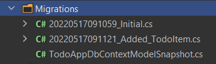

# Quick Start

````json
//[doc-params]
{
    "UI": ["MVC", "BlazorServer", "NG"],
    "DB": ["EF", "Mongo"]
}
````

This is a single-part quick-start tutorial to build a simple todo application with the ABP Framework. Here's a screenshot from the final application:


You can find the source code of the completed application [here](https://github.com/abpframework/abp-samples/tree/master/TodoApp-SingleLayer).

## Pre-Requirements

* An IDE (e.g. [Visual Studio](https://visualstudio.microsoft.com/vs/)) that supports [.NET 7.0+](https://dotnet.microsoft.com/download/dotnet) development.
* [Node v16.x](https://nodejs.org/)

{{if DB=="Mongo"}}

* [MongoDB Server 4.0+](https://docs.mongodb.com/manual/administration/install-community/)

{{end}}

## Creating a New Solution

In this tutorial, we will use the [ABP CLI](../../../CLI.md) to create the sample application with the ABP Framework. You can run the following command in a command-line terminal to install the **ABP CLI**, if you haven't installed it yet:

````bash
dotnet tool install -g Volo.Abp.Cli
````

Then create an empty folder, open a command-line terminal and execute the following command in the terminal:

````bash
abp new TodoApp -t app-nolayers{{if UI=="BlazorServer"}} -u blazor-server{{else if UI=="NG"}} -u angular{{end}}{{if DB=="Mongo"}} -d mongodb{{end}}
````

{{if UI=="NG"}}

This will create a new solution, named *TodoApp*, with `angular` and `aspnet-core` folders. Once the solution is ready, open the solution (in the `aspnet-core` folder) with your favorite IDE.

{{else}}

This will create a new solution with a single project, named *TodoApp*. Once the solution is ready, open it in your favorite IDE.

{{end}}

### Create the Database

You can run the following command in the root directory of your project (in the same folder of the `.csproj` file) to create the database and seed the initial data:

```bash
dotnet run --migrate-database
```

This command will create the database and seed the initial data for you. Then you can run the application.

### Run the Application

{{if UI=="MVC" || UI=="BlazorServer"}}

It is good to run the application before starting the development. Running the application is pretty straight-forward, you can run the application with any IDE that supports .NET or by running the `dotnet run` CLI command in the directory of your project: 

{{else if UI=="NG"}}

It is good to run the application before starting the development. The solution has two main applications:

* `TodoApp` (in the .NET solution) hosts the server-side HTTP API, so the Angular application can consume it. (server-side application)
* `angular` folder contains the Angular application. (client-side application)

Firstly, run the `TodoApp` project in your favorite IDE (or run the `dotnet run` CLI command on your project directory) to see the server-side HTTP API on [Swagger UI](https://swagger.io/tools/swagger-ui/):


You can explore and test your HTTP API with this UI. If it works, then we can run the Angular client application.

You can run the application using the following (or `yarn start`) command:

````bash
npm start
````

This command takes time, but eventually runs and opens the application in your default browser:

{{end}}


You can click on the *Login* button and use `admin` as the username and `1q2w3E*` as the password to login to the application.

All right. We can start coding!

## Defining the Entity

This application will have a single [entity](../../../Entities.md) and we can start by creating it. So, create a new `TodoItem` class under the `Entities` folder of the project:

````csharp
using Volo.Abp.Domain.Entities;

namespace TodoApp.Entities;

public class TodoItem : BasicAggregateRoot<Guid>
{
    public string Text { get; set; }
}
````

`BasicAggregateRoot` is the simplest base class to create root entities, and `Guid` is the primary key (`Id`) of the entity here.

## Database Integration

{{if DB=="EF"}}

Next step is to setup the [Entity Framework Core](../../../Entity-Framework-Core.md) configuration.

### Mapping Configuration

Open the `TodoAppDbContext` class (in the `Data` folder) and add a new `DbSet` property to this class:

````csharp
public DbSet<TodoItem> TodoItems { get; set; }
````

Then navigate to the `OnModelCreating` method in the same class and add the following mapping code for the `TodoItem ` entity:

````csharp
protected override void OnModelCreating(ModelBuilder builder)
{
    base.OnModelCreating(builder);

    /* Include modules to your migration db context */

    builder.ConfigurePermissionManagement();
    ...

    /* Configure your own tables/entities inside here */
    builder.Entity<TodoItem>(b =>
    {
        b.ToTable("TodoItems");
    });
}
````

We've mapped the `TodoItem` entity to the `TodoItems` table in the database. The next step is to create a migration and apply the changes to the database.

### Code First Migrations

The startup solution is configured to use Entity Framework Core [Code First Migrations](https://docs.microsoft.com/en-us/ef/core/managing-schemas/migrations). Since we've changed the database mapping configuration, we should create a new migration and apply changes to the database.

Open a command-line terminal in the root directory of your project and type the following command:

````bash
dotnet ef migrations add Added_TodoItem
````

This will add a new migration class to the project. You should see the new migration in the `Migrations` folder:

 

Then, you can apply changes to the database using the following command, in the same command-line terminal:

````bash
dotnet ef database update
````

{{else if DB=="Mongo"}}

The next step is to setup the [MongoDB](../../../MongoDB.md) configuration. Open the `TodoAppDbContext` class (under the **Data** folder) in your project and make the following changes:

1. Add a new property to the class:

````csharp
public IMongoCollection<TodoItem> TodoItems => Collection<TodoItem>();
````

2. Add the following code inside the `CreateModel` method:

````csharp
modelBuilder.Entity<TodoItem>(b =>
{
    b.CollectionName = "TodoItems";
});
````

{{end}}

After the database integrations, now we can start to create application service methods and implement our use-cases.

## Creating the Application Service

An [application service](../../../Application-Services.md) is used to perform the use cases of the application. We need to perform the following use cases in this application:

* Get the list of the todo items
* Create a new todo item
* Delete an existing todo item

Before starting to implement these use cases, first we need to create a DTO class that will be used in the application service.

### Creating the Data Transfer Object (DTO)

[Application services](../../../Application-Services.md) typically get and return DTOs ([Data Transfer Objects](../../../Data-Transfer-Objects.md)) instead of entities. So, create a new `TodoItemDto` class under the `Services/Dtos` folder:

```csharp
namespace TodoApp.Services.Dtos;

public class TodoItemDto
{
    public Guid Id { get; set; }
    public string Text { get; set; }
}
```

This is a very simple DTO class that has the same properties as the `TodoItem` entity. Now, we are ready to implement our use-cases.

### The Application Service Implementation

Create a `TodoAppService` class under the `Services` folder of your project, as shown below:

```csharp
using TodoApp.Entities;
using Volo.Abp.Application.Services;
using Volo.Abp.Domain.Repositories;

namespace TodoApp.Services;

public class TodoAppService : ApplicationService
{
    private readonly IRepository<TodoItem, Guid> _todoItemRepository;
    
    public TodoAppService(IRepository<TodoItem, Guid> todoItemRepository)
    {
        _todoItemRepository = todoItemRepository;
    }
    
    // TODO: Implement the methods here...
}
```

This class inherits from the `ApplicationService` class of the ABP Framework and implements our use-cases. ABP provides default generic [repositories](../../../Repositories.md) for the entities. We can use them to perform the fundamental database operations. This class [injects](../../../Dependency-Injection.md) `IRepository<TodoItem, Guid>`, which is the default repository for the `TodoItem` entity. We will use it to implement our use cases.

#### Getting the Todo Items

Let's start by implementing the `GetListAsync` method, which is used to get a list of todo items:

````csharp
public async Task<List<TodoItemDto>> GetListAsync()
{
    var items = await _todoItemRepository.GetListAsync();
    return items
        .Select(item => new TodoItemDto
        {
            Id = item.Id,
            Text = item.Text
        }).ToList();
}
````

We are simply getting the `TodoItem` list from the repository, mapping them to the `TodoItemDto` objects and returning as the result.

#### Creating a New Todo Item

The next method is `CreateAsync` and we can implement it as shown below:

````csharp
public async Task<TodoItemDto> CreateAsync(string text)
{
    var todoItem = await _todoItemRepository.InsertAsync(
        new TodoItem {Text = text}
    );

    return new TodoItemDto
    {
        Id = todoItem.Id,
        Text = todoItem.Text
    };
}
````

The repository's `InsertAsync` method inserts the given `TodoItem` to the database and returns the same `TodoItem` object. It also sets the `Id`, so we can use it on the returning object. We are simply returning a `TodoItemDto` by creating from the new `TodoItem` entity.

#### Deleting a Todo Item

Finally, we can implement the `DeleteAsync` as the following code block:

````csharp
public async Task DeleteAsync(Guid id)
{
    await _todoItemRepository.DeleteAsync(id);
}
````

The application service is ready to be used from the UI layer. So, let's implement it.

## User Interface

It is time to show the todo items on the UI! Before starting to write the code, it would be good to remember what we are trying to build. Here's a sample screenshot from the final UI:


{{if UI=="MVC"}}

### Index.cshtml.cs

Open the `Index.cshtml.cs` file in the `Pages` folder and replace the content with the following code block:

```csharp
using TodoApp.Services;
using TodoApp.Services.Dtos;
using Volo.Abp.AspNetCore.Mvc.UI.RazorPages;

namespace TodoApp.Pages;

public class IndexModel : AbpPageModel
{
    public List<TodoItemDto> TodoItems { get; set; }

    private readonly TodoAppService _todoAppService;

    public IndexModel(TodoAppService todoAppService)
    {
        _todoAppService = todoAppService;
    }
    
    public async Task OnGetAsync()
    {
        TodoItems = await _todoAppService.GetListAsync();
    }
}
```

This class uses `TodoAppService` to get the list of todo items and assign the `TodoItems` property. We will use it to render the todo items on the razor page.

### Index.cshtml

Open the `Index.cshtml` file in the `Pages` folder and replace it with the following content:

```xml
@page
@model TodoApp.Pages.IndexModel

@section styles {
    <abp-style src="/Pages/Index.cshtml.css" />
}
@section scripts {
    <abp-script src="/Pages/Index.cshtml.js" />
}

<div class="container">
    <abp-card>
        <abp-card-header>
            <abp-card-title>
                TODO LIST
            </abp-card-title>
        </abp-card-header>
        <abp-card-body>            
            <!-- FORM FOR NEW TODO ITEMS -->
            <form id="NewItemForm" class="row row-cols-lg-auto g-3 align-items-center">
                <div class="col-12">
                    <div class="input-group">
                        <input id="NewItemText" type="text" class="form-control" placeholder="enter text...">
                    </div>
                </div>
                <div class="col-12">
                    <button type="submit" class="btn btn-primary">Submit</button>
                </div>
            </form>
            <!-- TODO ITEMS LIST -->
            <ul id="TodoList">
                @foreach (var todoItem in Model.TodoItems)
                {
                    <li data-id="@todoItem.Id">
                        <i class="fa fa-trash-o"></i> @todoItem.Text
                    </li>
                }
            </ul>
        </abp-card-body>
    </abp-card>
</div>
```

We are using ABP's [card tag helper](../../../UI/AspNetCore/Tag-Helpers/Cards.md) to create a simple card view. You could directly use the standard bootstrap HTML structure, however the ABP [tag helpers](../../../UI/AspNetCore/Tag-Helpers/Index.md) make it much easier and type safe.

This page imports a CSS and a JavaScript file, so we should also create them.

### Index.cshtml.js

Open the `Index.cshtml.js` file in the `Pages` folder and replace with the following content:

````js
$(function () {
    
    // DELETING ITEMS /////////////////////////////////////////
    $('#TodoList').on('click', 'li i', function(){
        var $li = $(this).parent();
        var id = $li.attr('data-id');
        
        todoApp.services.todo.delete(id).then(function(){
            $li.remove();
            abp.notify.info('Deleted the todo item.');
        });
    });
    
    // CREATING NEW ITEMS /////////////////////////////////////
    $('#NewItemForm').submit(function(e){
        e.preventDefault();
        
        var todoText = $('#NewItemText').val();        
        todoApp.services.todo.create(todoText).then(function(result){
            $('<li data-id="' + result.id + '">')
                .html('<i class="fa fa-trash-o"></i> ' + result.text)
                .appendTo($('#TodoList'));
            $('#NewItemText').val('');
        });
    });
});
````

In the first part, we subscribed to the click events of the trash icons near the todo items, deleted the related item on the server and showed a notification on the UI. Also, we removed the deleted item from the DOM, so we wouldn't need to refresh the page.

In the second part, we created a new todo item on the server. If it succeeded, we would then manipulate the DOM to insert a new `<li>` element to the todo list. This way, we wouldn't need to refresh the whole page after creating a new todo item.

The interesting part here is how we communicate with the server. See the *Dynamic JavaScript Proxies & Auto API Controllers* section to understand how it works. But now, let's continue and complete the application.

### Index.cshtml.css

As for the final touch, open the `Index.cshtml.css` file in the `Pages` folder and replace with the following content:

````css
#TodoList{
    list-style: none;
    margin: 0;
    padding: 0;
}

#TodoList li {
    padding: 5px;
    margin: 5px 0px;
    border: 1px solid #cccccc;
    background-color: #f5f5f5;
}

#TodoList li i
{
    opacity: 0.5;
}

#TodoList li i:hover
{
    opacity: 1;
    color: #ff0000;
    cursor: pointer;
}
````

This is a simple styling for the todo page. We believe that you can do much better :)

Now, you can run the application again and see the result.

### Dynamic JavaScript Proxies & Auto API Controllers

In the `Index.cshtml.js` file, we've used the `todoApp.services.todo.delete(...)` and `todoApp.services.todo.create(...)` functions to communicate with the server. These functions are dynamically created by the ABP Framework, thanks to the [Dynamic JavaScript Client Proxy](../../../UI/AspNetCore/Dynamic-JavaScript-Proxies.md) system. They perform HTTP API calls to the server and return a promise, so you can register a callback to the `then` function as we've done above.

> `services` keyword comes from the namespace (`namespace TodoApp.Services;`). It's a naming convention.

However, you may notice that we haven't created any API Controllers, so how does the server handle these requests? This question brings us to the [Auto API Controller](../../../API/Auto-API-Controllers.md) feature of the ABP Framework. It automatically converts the application services to **API Controllers** by convention.

If you open [Swagger UI](https://swagger.io/tools/swagger-ui/) by entering the `/swagger` URL in your application, you can see the Todo API:


{{else if UI=="BlazorServer"}}

### Index.razor.cs

Open the `Index.razor.cs` file in the `Pages` folder and replace the content with the following code block:

```csharp
using Microsoft.AspNetCore.Components;
using TodoApp.Services;
using TodoApp.Services.Dtos;

namespace TodoApp.Pages;

public partial class Index
{
    [Inject]
    private TodoAppService TodoAppService { get; set; }

    private List<TodoItemDto> TodoItems { get; set; } = new List<TodoItemDto>();
    private string NewTodoText { get; set; }

    protected override async Task OnInitializedAsync()
    {
        TodoItems = await TodoAppService.GetListAsync();
    }
    
    private async Task Create()
    {
        var result = await TodoAppService.CreateAsync(NewTodoText);
        TodoItems.Add(result);
        NewTodoText = null;
    }

    private async Task Delete(TodoItemDto todoItem)
    {
        await TodoAppService.DeleteAsync(todoItem.Id);
        await Notify.Info("Deleted the todo item.");
        TodoItems.Remove(todoItem);
    }
}
```

This class uses the `TodoAppService` to get the list of todo items. It manipulates the `TodoItems` list after create and delete operations. This way, we don't need to refresh the whole todo list from the server.

### Index.razor

Open the `Index.razor` file in the `Pages` folder and replace the content with the following code block:

```xml
@page "/"
@inherits TodoAppComponentBase

<div class="container">
    <Card>
        <CardHeader>
            <CardTitle>
                TODO LIST
            </CardTitle>
        </CardHeader>
        <CardBody>
            <!-- FORM FOR NEW TODO ITEMS -->
            <form id="NewItemForm" @onsubmit:preventDefault @onsubmit="() => Create()" class="row row-cols-lg-auto g-3 align-items-center">
                <div class="col-12">
                    <div class="input-group">
                        <input name="NewTodoText" type="text" @bind-value="@NewTodoText" class="form-control" placeholder="enter text..." />
                    </div>
                </div>
                <div class="col-12">
                    <button type="submit" class="btn btn-primary">Submit</button>
                </div>
            </form>
            <!-- TODO ITEMS LIST -->
            <ul id="TodoList">
                @foreach (var todoItem in TodoItems)
                {
                    <li data-id="@todoItem.Id">
                        <i class="far fa-trash-alt"
                           @onclick="() => Delete(todoItem)"></i>
                        @todoItem.Text
                    </li>
                }
            </ul>
        </CardBody>
    </Card>
</div>
```

### Index.razor.css

As the final touch, open the `Index.razor.css` file in the `Pages` folder and replace it with the following content:

````css
#TodoList{
    list-style: none;
    margin: 0;
    padding: 0;
}

#TodoList li {
    padding: 5px;
    margin: 5px 0px;
    border: 1px solid #cccccc;
    background-color: #f5f5f5;
}

#TodoList li i
{
    opacity: 0.5;
}

#TodoList li i:hover
{
    opacity: 1;
    color: #ff0000;
    cursor: pointer;
}
````

This is a simple styling for the todo page. We believe that you can do much better :)

Now, you can run the application again to see the result.

{{else if UI=="NG"}}

### Service Proxy Generation 

ABP provides a handy feature to automatically create client-side services to easily consume HTTP APIs provided by the server.

You first need to run the `TodoApp` project since the proxy generator reads API definitions from the server application.

Once you run the `TodoApp` project (**Swagger API Definition** will be shown), open a command-line terminal in the directory of `angular` folder and run the following command:

```bash
abp generate-proxy -t ng
```

If everything goes well, it should generate an output as shown below:

```bash
CREATE src/app/proxy/generate-proxy.json (182755 bytes)
CREATE src/app/proxy/README.md (1000 bytes)
CREATE src/app/proxy/services/todo.service.ts (833 bytes)
CREATE src/app/proxy/services/dtos/models.ts (71 bytes)
CREATE src/app/proxy/services/dtos/index.ts (26 bytes)
CREATE src/app/proxy/services/index.ts (81 bytes)
CREATE src/app/proxy/index.ts (61 bytes)
```

Then, we can use the `TodoService` to use the server-side HTTP APIs, as we'll do in the next section.

### home.component.ts

Open the `/angular/src/app/home/home.component.ts` file and replace its content with the following code block:

```ts
import { ToasterService } from "@abp/ng.theme.shared";
import { Component, OnInit } from '@angular/core';
import { TodoItemDto } from "@proxy/services/dtos";
import { TodoService } from "@proxy/services";

@Component({
  selector: 'app-home',
  templateUrl: './home.component.html',
  styleUrls: ['./home.component.scss'],
})

export class HomeComponent implements OnInit {

  todoItems: TodoItemDto[];
  newTodoText: string;

  constructor(
      private todoService: TodoService,
      private toasterService: ToasterService)
  { }

  ngOnInit(): void {
    this.todoService.getList().subscribe(response => {
      this.todoItems = response;
    });
  }
  
  create(): void{
    this.todoService.create(this.newTodoText).subscribe((result) => {
      this.todoItems = this.todoItems.concat(result);
      this.newTodoText = null;
    });
  }

  delete(id: string): void {
    this.todoService.delete(id).subscribe(() => {
      this.todoItems = this.todoItems.filter(item => item.id !== id);
      this.toasterService.info('Deleted the todo item.');
    });
  }  
}
```

We've used `TodoService` to get the list of todo items and assigned the returning value to the `todoItems` array. We've also added `create` and `delete` methods. These methods will be used on the view side.

### home.component.html

Open the `/angular/src/app/home/home.component.html` file and replace its content with the following code block:

````html
<div class="container">
  <div class="card">
    <div class="card-header">
      <div class="card-title">TODO LIST</div>
    </div>
    <div class="card-body">
      <!-- FORM FOR NEW TODO ITEMS -->
      <form class="row row-cols-lg-auto g-3 align-items-center" (ngSubmit)="create()">
        <div class="col-12">
          <div class="input-group">
            <input name="NewTodoText" type="text" [(ngModel)]="newTodoText" class="form-control" placeholder="enter text..." />
          </div>
        </div>
        <div class="col-12">
          <button type="submit" class="btn btn-primary">Submit</button>
        </div>
      </form>
      <!-- TODO ITEMS LIST -->
      <ul id="TodoList">
        <li *ngFor="let todoItem of todoItems">
          <i class="fa fa-trash-o" (click)="delete(todoItem.id)"></i> 
        </li>
      </ul>
    </div>
  </div>
</div>
````

### home.component.scss

As the final touch, open the `/angular/src/app/home/home.component.scss` file and replace its content with the following code block:

````css
#TodoList{
    list-style: none;
    margin: 0;
    padding: 0;
}

#TodoList li {
    padding: 5px;
    margin: 5px 0px;
    border: 1px solid #cccccc;
    background-color: #f5f5f5;
}

#TodoList li i
{
    opacity: 0.5;
}

#TodoList li i:hover
{
    opacity: 1;
    color: #ff0000;
    cursor: pointer;
}
````

This is a simple styling for the todo page. We believe that you can do much better :)

Now, you can run the application again to see the result.

{{end}}

## Conclusion 

In this tutorial, we've built a very simple application to warm up with the ABP Framework.

## Source Code

You can find the source code of the completed application [here](https://github.com/abpframework/abp-samples/tree/master/TodoApp-SingleLayer).

## See Also

* Check the [Web Application Development Tutorial](../../Part-1.md) to see a real-life web application development in a layered architecture using the [Application Startup Template](../../../Startup-Templates/Application.md).
