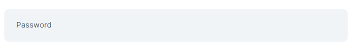
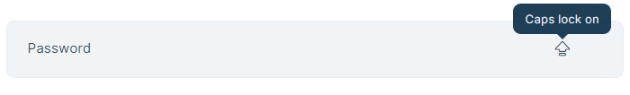

# Show Password Directive

In password inputs,You may want to show if Caps Lock is on. To make this even easier, you can use the `TrackCapsLockDirective` which has been exposed by the `@abp/ng.core` package.


## Getting Started

`TrackCapsLockDirective` is standalone. In order to use the `TrackCapsLockDirective` in an HTML template, import it to related module or your standalone component:

```ts
import { TrackCapsLockDirective } from '@abp/ng.core';

@NgModule({
  //...
  imports: [
   ...,
   TrackCapsLockDirective
  ],
})
export class MyFeatureModule {}
```

## Usage

The `TrackCapsLockDirective` is very easy to use. The directive's selector is **`abpCapsLock`**. By adding the `abpCapsLock` event to an element, you can track the status of Caps Lock. U can use this to warn user 

See an example usage:

```ts
import { TrackCapsLockDirective } from '@abp/ng.core'

@Component({
  selector: 'test-component',
  standalone: true,
  template: `
    <div class="d-flex flex-column">
      <label>Password</label>
      <input (abpCapsLock)="capsLock = $event"/>
      <i *ngIf='capsLock'>icon</i>
    </div>
  `,
  imports: [ TrackCapsLockDirective ]
})
export class TestComponent{
  capsLock = false;
}
```

The `abpCapsLock` event has been added to the `<input>` element. Press Caps Lock to activate the `TrackCapsLockDirective`.

See the result:



To see Caps Lock icon press Caps Lock.


