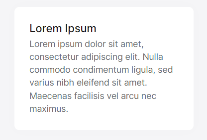

# Card Component

The ABP Card Component is a wrapper component for the Bootstrap card class.

## Usage

ABP Card Component is a part of the `ThemeSharedModule` module. If you've imported that module into your module, you don't need to import it again. If not, first import it as shown below:

```ts
// my-feature.module.ts

import { ThemeSharedModule } from '@abp/ng.theme.shared';
import { CardDemoComponent } from './chart-demo.component';

@NgModule({
  imports: [
    ThemeSharedModule ,
    // ...
  ],
  declarations: [CardDemoComponent],
  // ...
})
export class MyFeatureModule {}

```

Then, the `abp-card` component can be used. See the example below:
```ts

// card-demo.component.ts

import { Component } from '@angular/core';

@Component({
  selector: 'app-card-demo',
  template: ` 
    <abp-card [cardStyle]="{width: '18rem'}">
      <abp-card-body>
        <abp-card-title>Lorem Ipsum</abp-card-title>
        Lorem ipsum dolor sit amet, consectetur adipiscing elit. Nulla commodo condimentum ligula, sed varius nibh eleifend sit amet. Maecenas facilisis vel arcu nec maximus.
      </abp-card-body>
    </abp-card> 
  `,
})
export class CardDemoComponent { }
```

See the result below:



As you can see in the example above, you can customize your card component's style with the `cardStyle` input. You can also add your custom classes with the `cardClass` input.
