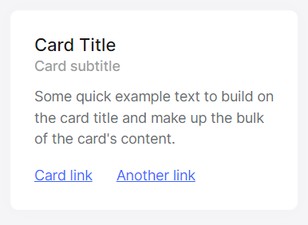
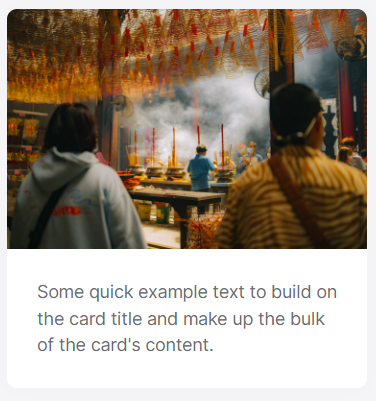
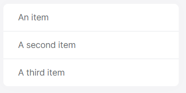
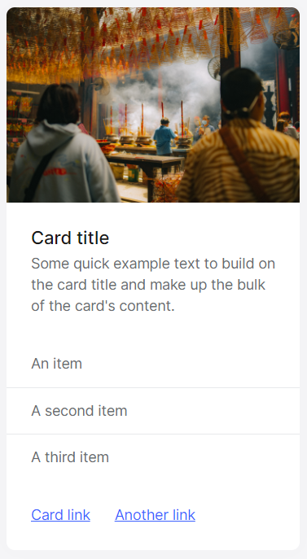

# Card Component

The ABP Card Component is a wrapper component for the Bootstrap card class.
It supports all the features that Bootstrap card component provides.

ABP Card Component has three main components, `CardHeader`, `CardBody` and `CardFooter`. These components have their own class and style inputs 

|Component |Selector         |Input Properties                    |
|--------- |-----------------|------------------------------------|
|CardHeader|`abp-card-header`| `cardHeaderClass`,`cardHeaderStyle`|
|CardBody  |`abp-card-body`  | `cardBodyClass`,`cardBodyStyle`    |          
|CardFooter|`abp-card-footer`| `cardFooterClass`,`cardFooterStyle`|

In addition to these components, the Card component provides directives like `CardHeader`,`CardTitle`,`CardSubtitle`,`CardImgTop`. 

|Directive    |Selector                                                     |
|-------------|-------------------------------------------------------------|
|CardHeader   |`abp-card-header`,`[abp-card-header]`,`[abpCardHeader]`      |
|CardTitle    |`abp-card-title`,`[abp-card-title]`,`[abpCardTitle]`         |          
|CardSubtitle |`abp-card-subtitle`,`[abp-card-subtitle]`,`[abpCardSubtitle]`|
|CardImgTop   |`abp-card-img-top`,`[abp-card-img-top]`,`[abpCardImgTop]`    |


# Usage

ABP Card Component is a part of the `ThemeSharedModule` module. If you've imported that module into your module, you don't need to import it again. If not, first import it as shown below:

```ts
// my-feature.module.ts

import { ThemeSharedModule } from '@abp/ng.theme.shared';
import { CardDemoComponent } from './card-demo.component';

@NgModule({
  imports: [
    ThemeSharedModule ,
    // ...
  ],
  declarations: [CardDemoComponent],
  // ...
})
export class MyFeatureModule {}

```

Then, the `abp-card` component can be used. See the examples below:

## CardBody

```ts
// card-demo.component.ts

import { Component } from '@angular/core';

@Component({
  selector: 'app-card-demo',
  template: ` 
    <abp-card [cardStyle]="{width: '18rem'}">
      <abp-card-body>This is some text within a card body</abp-card-body>
    </abp-card> 
  `,
})
export class CardDemoComponent { }
```
See the card body result below:


## Titles, Text and Links

```ts

//card-demo.component.ts
import { Component } from '@angular/core';

@Component({
  selector: 'app-card-demo',
  template: ` 
    <abp-card [cardStyle]="{width: '18rem'}">
      <abp-card-body>
        <h5 abpCardTitle>Card Title</h5>
        <h6 abpCardSubtitle class="mb-2 text-muted">Card subtitle</h6>
        <p class="card-text">Some quick example text to build on the card title and make up the bulk of the card's content.</p>
        <a href="#" class="card-link" >Card link</a>
        <a href="#" class="card-link" >Another link</a>
      </abp-card-body>
    </abp-card> 
  `,
})
export class CardDemoComponent { }
```
See the card title, text and link result below:



## Images

```ts

//card-demo.component.ts
import { Component } from '@angular/core';

@Component({
  selector: 'app-card-demo',
  template: ` 
    <abp-card [cardStyle]="{width:'18rem'}">
      
      <abp-card-body>
        <p class="card-text" >Some quick example text to build on the card title and make up the bulk of the card's content.</p>
      </abp-card-body>
    </abp-card>
  `,
})
export class CardDemoComponent { }
```
See the card image result below:



## List Groups

```ts

//card-demo.component.ts
import { Component } from '@angular/core';

@Component({
  selector: 'app-card-demo',
  template: ` 
    <abp-card [cardStyle]="{width:'18rem'}">
      <ul class="list-group list-group-flush">
        <li class="list-group-item">An item</li>
        <li class="list-group-item">A second item</li>
        <li class="list-group-item">A third item</li>
      </ul>
    </abp-card>
  `,
})
export class CardDemoComponent { }
```
See the group list result below:



## Kitchen Sink

```ts

//card-demo.component.ts
import { Component } from '@angular/core';

@Component({
  selector: 'app-card-demo',
  template: ` 
    <abp-card [cardStyle]="{width:'18rem'}">
      
      <abp-card-body>
        <h5 abpCardTitle>Card title</h5>
        <p class="card-text">Some quick example text to build on the card title and make up the bulk of the card's content.</p>
      </abp-card-body>
      <ul class="list-group list-group-flush">
        <li class="list-group-item">An item</li>
        <li class="list-group-item">A second item</li>
        <li class="list-group-item">A third item</li>
      </ul>
      <abp-card-body>
        <a href="#" class="card-link">Card link</a>
        <a href="#" class="card-link">Another link</a>
      </abp-card-body>
    </abp-card>
  `,
})
export class CardDemoComponent { }
```
See kitchen sink result below:



## Header and Footer

```ts

//card-demo.component.ts
import { Component } from '@angular/core';

@Component({
  selector: 'app-card-demo',
  template: ` 
    <abp-card class="text-center">
      <abp-card-header>Featured</abp-card-header>
      <abp-card-body>
        <h5 abpCardTitle>Special title treatment</h5>
        <p class="card-text">With supporting text below as a natural lead-in to additional content.</p>
        <a class="card-link" href="#" class="btn btn-primary">Go somewhere</a>
      </abp-card-body>
      <abp-card-footer class="text-muted">
        2 days ago
      </abp-card-footer>
    </abp-card>
  `,
})
export class CardDemoComponent { }
```
See the header and footer result below:


