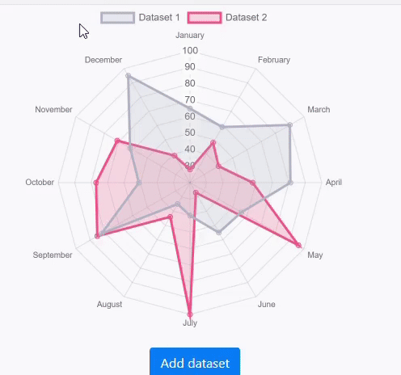

# Chart Component

ABP Chart component exposed by `@abp/ng.components/chart.js` is based on [`charts.js`](https://www.chartjs.org/) v3+. You don't need to install the `chart.js` package. Since the `@abp/ng.components` is dependent on the `chart.js`, the package is already installed in your project.

> Chart component loads `chart.js` script lazy. So it does not increase the bundle size.

## How to Use

First of all, need to import the `ChartModule` to your feature module as follows:

```ts
// your-feature.module.ts

import { ChartModule } from '@abp/ng.components/chart.js';
import { ChartDemoComponent } from './chart-demo.component';

@NgModule({
  imports: [
    ChartModule,
    // ...
  ],
  declarations: [ChartDemoComponent],
  // ...
})
export class YourFeatureModule {}
```

Then, `abp-chart` component can be used. See an example:

```ts
// chart-demo.component.ts

import { Component } from '@angular/core';

@Component({
  selector: 'app-chart-demo',
  template: ` <abp-chart type="pie" [data]="data"></abp-chart> `,
})
export class ChartDemoComponent {
  data = {
    labels: ['Data 1', 'Data 2', 'Data 3'],
    datasets: [
      {
        label: 'Dataset 1',
        data: [40, 15, 45],
        backgroundColor: ['#ff7675', '#fdcb6e', '#0984e3'],
      },
    ],
  };
}
```

> **Important Note**: Changing the chart data without creating a new data instance does not trigger change detection. In order to chart to redraw itself, a new data object needs to be created.

See the result:


## Examples

### Doughnut

```ts
import { getRandomBackgroundColor } from '@abp/ng.components/chart.js';
import { Component } from '@angular/core';

@Component({
  selector: 'app-chart-demo',
  template: `
    <abp-chart
      type="doughnut"
      [data]="data"
      [options]="options"
      width="400px"
      height="400px"
    ></abp-chart>
  `,
})
export class ChartDemoComponent {
  data = {
    labels: ['Data 1', 'Data 2', 'Data 3'],
    datasets: [
      {
        label: 'Dataset 1',
        data: [40, 15, 45],
        backgroundColor: getRandomBackgroundColor(3),
      },
    ],
  };

  options = {
    plugins: {
      title: {
        display: true,
        text: 'Doughnut Chart',
        fontSize: 16,
      },
      legend: {
        position: 'bottom',
      },
    },
  };
}
```

Result:


### Bar

```ts
import { Component } from '@angular/core';

@Component({
  selector: 'app-chart-demo',
  template: `
    <abp-chart
      type="bar"
      [data]="data"
      width="400px"
      height="400px"
    ></abp-chart>
  `,
})
export class ChartDemoComponent {
  data = {
    labels: ['January', 'February', 'March', 'April', 'May', 'June', 'July'],
    datasets: [
      {
        label: 'First dataset',
        backgroundColor: '#42A5F5',
        data: [65, 59, 80, 81, 56, 55, 40],
      },
      {
        label: 'Second dataset',
        backgroundColor: '#FFA726',
        data: [28, 48, 40, 19, 86, 27, 90],
      },
    ],
  };
}
```

Result:


### Radar

```ts
import { Component } from '@angular/core';

@Component({
  selector: 'app-chart-demo',
  template: `
    <abp-chart
      type="radar"
      [data]="data"
      width="400px"
      height="400px"
    ></abp-chart>

    <button class="btn btn-primary-outline mt-4" (click)="addDataset()">
      Add dataset
    </button>
  `,
})
export class ChartDemoComponent {
  data = {
    labels: [
      'January',
      'February',
      'March',
      'April',
      'May',
      'June',
      'July',
      'August',
      'September',
      'October',
      'November',
      'December',
    ],
    datasets: [
      {
        label: 'Dataset 1',
        backgroundColor: 'rgba(179,181,198,0.2)',
        borderColor: 'rgba(179,181,198,1)',
        data: [65, 59, 90, 81, 56, 55, 40, 35, 82, 51, 62, 95],
      },
      {
        label: 'Dataset 2',
        backgroundColor: 'rgba(255,99,132,0.2)',
        borderColor: 'rgba(255,99,132,1)',
        data: [28, 48, 40, 58, 96, 27, 100, 44, 85, 77, 71, 39],
      },
    ],
  };

  addDataset() {
    this.data = {
      ...this.data,
      datasets: [
        ...this.data.datasets,
        {
          label: 'Dataset 3',
          backgroundColor: 'rgba(54,162,235,0.2)',
          borderColor: 'rgba(54, 162, 235, 1)',
          data: [90, 95, 98, 91, 99, 96, 89, 95, 98, 93, 92, 90],
        },
      ],
    };
  }
}
```

Result:



See the [`chart.js` samples](https://www.chartjs.org/docs/latest/samples) for more examples.

## API

### `abp-chart`

#### Properties

| Name            | Description                                                      | Type                    | Default |
| --------------- | ---------------------------------------------------------------- | ----------------------- | ------- |
| `[type]`        | Type of the chart.                                               | `string`                | null    |
| `[data]`        | Chart data to display                                            | `any`                   | null    |
| `[options]`     | Chart options to customize                                       | `any`                   | null    |
| `[plugins]`     | Chart plugins to customize behaviour                             | `any`                   | null    |
| `[width]`       | Witdh of the chart                                               | `string`                | null    |
| `[height]`      | Height of the chart                                              | `string`                | null    |
| `[responsive]`  | Whether the chart is responsive                                  | `boolean`               | true    |
| `(dataSelect)`  | A callback that executes when an element on the chart is clicked | `EventEmitter<any>`     | -       |
| `(initialized)` | A callback that executes when the chart is initialized           | `EventEmitter<boolean>` | -       |

#### Methods

| Name             | Description                                                         | Parameters |
| ---------------- | ------------------------------------------------------------------- | ---------- |
| `refresh`        | Redraws the chart                                                   | -          |
| `reinit`         | Destroys the chart then creates it again                            | -          |
| `getBase64Image` | Returns a base 64 encoded string of the chart in it's current state | -          |
| `generateLegend` | Returns an HTML string of a legend for the chart                    | -          |
| `getCanvas`      | Returns the canvas HTML element                                     | -          |
