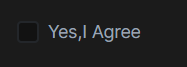

# Checkbox Component

The ABP Checkbox Component is a reusable form input component for checkbox type.

It takes `label`, `labelClass` (default form-check-label), `checkboxId`,`checkboxReadonly`,`checkboxReadonly` (default form-check-input) and `checkboxStyle` as input to customize component. Also, it emits `checkboxBlur` and `checkboxFocus` events when component gain or lose focus.

# Usage

ABP Checkbox component is a part of the `ThemeSharedModule` module. If you've imported that module into your module, you don't need to import it again. If not, first import it as shown below:

```ts
// my-feature.module.ts

import { ThemeSharedModule } from "@abp/ng.theme.shared";
import { CheckboxDemoComponent } from "./CheckboxDemoComponent.component";

@NgModule({
	imports: [
		ThemeSharedModule,
		// ...
	],
	declarations: [CheckboxDemoComponent],
	// ...
})
export class MyFeatureModule {}
```

Then, the `abp-checkbox` component can be used. See the example below:

```html
<div class="form-check">
	<abp-checkbox label="Yes,I Agree" checkboxId="checkbox-input">
	</abp-checkbox>
</div>
```

See the checkbox input result below:


