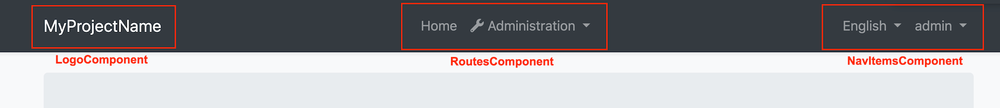
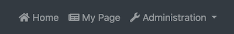

# Component Replacement

You can replace some ABP components with your custom components.

The reason that you **can replace** but **cannot customize** default ABP components is disabling or changing a part of that component can cause problems. So we named those components as _Replaceable Components_.

## How to Replace a Component

Create a new component that you want to use instead of an ABP component. Add that component to `declarations` and `entryComponents` in the `AppModule`.

Then, open the `app.component.ts` and execute the `add` method of `ReplaceableComponentsService` to replace your component with an ABP component as shown below:

```js
import { ReplaceableComponentsService } from '@abp/ng.core'; // imported ReplaceableComponentsService
import { eIdentityComponents } from '@abp/ng.identity'; // imported eIdentityComponents enum
//...

@Component(/* component metadata */)
export class AppComponent {
  constructor(
    private replaceableComponents: ReplaceableComponentsService, // injected the service
  ) {
    this.replaceableComponents.add({
      component: YourNewRoleComponent,
      key: eIdentityComponents.Roles,
    });
  }
}
```


## How to Replace a Layout

Each ABP theme module has 3 layouts named `ApplicationLayoutComponent`, `AccountLayoutComponent`, `EmptyLayoutComponent`. These layouts can be replaced the same way.

> A layout component template should contain `<router-outlet></router-outlet>` element.

The example below describes how to replace the `ApplicationLayoutComponent`:

Run the following command to generate a layout in `angular` folder:

```bash
yarn ng generate component my-application-layout
```

Add the following code in your layout template (`my-application-layout.component.html`) where you want the page to be loaded.

```html
<router-outlet></router-outlet>
```

Open `app.component.ts` in `src/app` folder and modify it as shown below:

```js
import { ReplaceableComponentsService } from '@abp/ng.core'; // imported ReplaceableComponentsService
import { eThemeBasicComponents } from '@abp/ng.theme.basic'; // imported eThemeBasicComponents enum for component keys
import { MyApplicationLayoutComponent } from './my-application-layout/my-application-layout.component'; // imported MyApplicationLayoutComponent

@Component(/* component metadata */)
export class AppComponent {
  constructor(
    private replaceableComponents: ReplaceableComponentsService, // injected the service
  ) {
    this.replaceableComponents.add({
      component: MyApplicationLayoutComponent,
      key: eThemeBasicComponents.ApplicationLayout,
    });
  }
}
```

> If you like to replace a layout component at runtime (e.g: changing the layout by pressing a button), pass the second parameter of the `add` method of `ReplaceableComponentsService` as true. DynamicLayoutComponent loads content using a router-outlet. When the second parameter of the `add` method is true, the route will be refreshed, so use it with caution. Your component state will be gone and any initiation logic (including HTTP requests) will be repeated.

### Layout Components



#### How to Replace LogoComponent


Run the following command in `angular` folder to create a new component called `LogoComponent`.

```bash
yarn ng generate component logo --inlineTemplate --inlineStyle --entryComponent

# You don't need the --entryComponent option in Angular 9
```

Open the generated `logo.component.ts` in `src/app/logo` folder and replace its content with the following:

```js
import { Component } from '@angular/core';

@Component({
  selector: 'app-logo',
  template: `
    <a class="navbar-brand" routerLink="/">
      <!-- Change the img src -->
      
    </a>
  `,
})
export class LogoComponent {}
```

Open `app.component.ts` in `src/app` folder and modify it as shown below:

```js
import { ..., ReplaceableComponentsService } from '@abp/ng.core'; // imported ReplaceableComponentsService
import { LogoComponent } from './logo/logo.component'; // imported NavItemsComponent
import { eThemeBasicComponents } from '@abp/ng.theme.basic'; // imported eThemeBasicComponents
//...

@Component(/* component metadata */)
export class AppComponent implements OnInit {
  constructor(..., private replaceableComponents: ReplaceableComponentsService) {} // injected ReplaceableComponentsService

  ngOnInit() {
    //...

    this.replaceableComponents.add({
        component: LogoComponent,
        key: eThemeBasicComponents.Logo,
      });
  }
}
```

The final UI looks like below:


#### How to Replace RoutesComponent


Run the following command in `angular` folder to create a new component called `RoutesComponent`.

```bash
yarn ng generate component routes
```

Open the generated `routes.component.ts` in `src/app/routes` folder and replace its content with the following:

```js
import { ABP } from '@abp/ng.core';
import {
  Component,
  HostBinding,
  Inject,
  Renderer2,
  TrackByFunction,
  AfterViewInit,
} from '@angular/core';
import { fromEvent } from 'rxjs';
import { debounceTime } from 'rxjs/operators';

@Component({
  selector: 'app-routes',
  templateUrl: 'routes.component.html',
})
export class RoutesComponent implements AfterViewInit {
  @HostBinding('class.mx-auto')
  marginAuto = true;

  smallScreen = window.innerWidth < 992;

  constructor(private renderer: Renderer2) {}

  ngAfterViewInit() {
    fromEvent(window, 'resize')
      .pipe(debounceTime(150))
      .subscribe(() => {
        this.smallScreen = window.innerWidth < 992;
      });
  }
}
```

Import the `SharedModule` to the `imports` array of `AppModule`:

```js
// app.module.ts

import { SharedModule } from './shared/shared.module';

@NgModule({
  imports: [
    //...
    SharedModule
  ]
)}
```

Open the generated `routes.component.html` in `src/app/routes` folder and replace its content with the following:

```html
<ul class="navbar-nav">
  <li class="nav-item">
    <a class="nav-link" routerLink="/"
      ><i class="fas fa-home"></i> </a
    >
  </li>
  <li class="nav-item">
    <a class="nav-link" routerLink="/my-page"><i class="fas fa-newspaper mr-1"></i>My Page</a>
  </li>
  <li
    #navbarRootDropdown
    [abpVisibility]="routeContainer"
    class="nav-item dropdown"
    display="static"
    (click)="
      navbarRootDropdown.expand
        ? (navbarRootDropdown.expand = false)
        : (navbarRootDropdown.expand = true)
    "
  >
    <a class="nav-link dropdown-toggle" data-toggle="dropdown" href="javascript:void(0)">
      <i class="fas fa-wrench"></i>
      
    </a>
    <div
      #routeContainer
      class="dropdown-menu border-0 shadow-sm"
      (click)="$event.preventDefault(); $event.stopPropagation()"
      [class.d-block]="smallScreen && navbarRootDropdown.expand"
    >
      <div
        class="dropdown-submenu"
        ngbDropdown
        #dropdownSubmenu="ngbDropdown"
        placement="right-top"
        [autoClose]="true"
        *abpPermission="'AbpIdentity.Roles || AbpIdentity.Users'"
      >
        <div ngbDropdownToggle [class.dropdown-toggle]="false">
          <a
            abpEllipsis="210px"
            [abpEllipsisEnabled]="!smallScreen"
            role="button"
            class="btn d-block text-left dropdown-toggle"
          >
            <i class="fa fa-id-card-o"></i>
            
          </a>
        </div>
        <div
          #childrenContainer
          class="dropdown-menu border-0 shadow-sm"
          [class.d-block]="smallScreen && dropdownSubmenu.isOpen()"
        >
          <div class="dropdown-submenu" *abpPermission="'AbpIdentity.Roles'">
            <a class="dropdown-item" routerLink="/identity/roles">
              </a
            >
          </div>
          <div class="dropdown-submenu" *abpPermission="'AbpIdentity.Users'">
            <a class="dropdown-item" routerLink="/identity/users">
              </a
            >
          </div>
        </div>
      </div>

      <div
        class="dropdown-submenu"
        ngbDropdown
        #dropdownSubmenu="ngbDropdown"
        placement="right-top"
        [autoClose]="true"
        *abpPermission="'AbpTenantManagement.Tenants'"
      >
        <div ngbDropdownToggle [class.dropdown-toggle]="false">
          <a
            abpEllipsis="210px"
            [abpEllipsisEnabled]="!smallScreen"
            role="button"
            class="btn d-block text-left dropdown-toggle"
          >
            <i class="fa fa-users"></i>
            
          </a>
        </div>
        <div
          #childrenContainer
          class="dropdown-menu border-0 shadow-sm"
          [class.d-block]="smallScreen && dropdownSubmenu.isOpen()"
        >
          <div class="dropdown-submenu" *abpPermission="'AbpTenantManagement.Tenants'">
            <a class="dropdown-item" routerLink="/tenant-management/tenants">
              </a
            >
          </div>
        </div>
      </div>
    </div>
  </li>
</ul>
```

Open `app.component.ts` in `src/app` folder and modify it as shown below:

```js
import { ..., ReplaceableComponentsService } from '@abp/ng.core'; // imported ReplaceableComponentsService
import { RoutesComponent } from './routes/routes.component'; // imported NavItemsComponent
import { eThemeBasicComponents } from '@abp/ng.theme.basic'; // imported eThemeBasicComponents
//...

@Component(/* component metadata */)
export class AppComponent implements OnInit {
  constructor(..., private replaceableComponents: ReplaceableComponentsService) {} // injected ReplaceableComponentsService

  ngOnInit() {
    //...

    this.replaceableComponents.add({
        component: RoutesComponent,
        key: eThemeBasicComponents.Routes,
      });
  }
}
```

The final UI looks like below:



#### How to Replace NavItemsComponent


Run the following command in `angular` folder to create a new component called `NavItemsComponent`.

```bash
yarn ng generate component nav-items
```

Open the generated `nav-items.component.ts` in `src/app/nav-items` folder and replace the content with the following:

```js
import {
  ApplicationConfiguration,
  AuthService,
  ConfigState,
  SessionStateService,
  SetLanguage,
} from '@abp/ng.core';
import { Component, AfterViewInit } from '@angular/core';
import { Navigate, RouterState } from '@ngxs/router-plugin';
import { Select, Store } from '@ngxs/store';
import { Observable, fromEvent } from 'rxjs';
import { map, debounceTime } from 'rxjs/operators';
import snq from 'snq';

@Component({
  selector: 'app-nav-items',
  templateUrl: 'nav-items.component.html',
})
export class NavItemsComponent implements AfterViewInit {
  @Select(ConfigState.getOne('currentUser'))
  currentUser$: Observable<ApplicationConfiguration.CurrentUser>;

  @Select(ConfigState.getDeep('localization.languages'))
  languages$: Observable<ApplicationConfiguration.Language[]>;

  smallScreen = window.innerWidth < 992;

  get defaultLanguage$(): Observable<string> {
    return this.languages$.pipe(
      map(
        languages =>
          snq(
            () => languages.find(lang => lang.cultureName === this.selectedLangCulture).displayName,
          ),
        '',
      ),
    );
  }

  get dropdownLanguages$(): Observable<ApplicationConfiguration.Language[]> {
    return this.languages$.pipe(
      map(
        languages =>
          snq(() => languages.filter(lang => lang.cultureName !== this.selectedLangCulture)),
        [],
      ),
    );
  }

  get selectedLangCulture(): string {
    return this.sessionState.getLanguage();
  }

  constructor(private store: Store, private authService: AuthService, private sessionState: SessionStateService) {}

  ngAfterViewInit() {
    fromEvent(window, 'resize')
      .pipe(debounceTime(150))
      .subscribe(() => {
        this.smallScreen = window.innerWidth < 992;
      });
  }

  onChangeLang(cultureName: string) {
    this.store.dispatch(new SetLanguage(cultureName));
  }

  logout() {
    this.authService.logout().subscribe(() => {
      this.store.dispatch(
        new Navigate(['/'], null, {
          state: { redirectUrl: this.store.selectSnapshot(RouterState).state.url },
        }),
      );
    });
  }
}
```

Import the `SharedModule` to the `imports` array of `AppModule`:

```js
// app.module.ts

import { SharedModule } from './shared/shared.module';

@NgModule({
  imports: [
    //...
    SharedModule
  ]
)}
```

Open the generated `nav-items.component.html` in `src/app/nav-items` folder and replace the content with the following:

```html
<ul class="navbar-nav">
  <input type="search" placeholder="Search" class="bg-transparent border-0 text-white" />
  <li *ngIf="(dropdownLanguages$ | async)?.length > 0" class="nav-item">
    <div class="dropdown" ngbDropdown #languageDropdown="ngbDropdown" display="static">
      <a
        ngbDropdownToggle
        class="nav-link"
        href="javascript:void(0)"
        role="button"
        id="dropdownMenuLink"
        data-toggle="dropdown"
        aria-haspopup="true"
        aria-expanded="false"
      >
        
      </a>
      <div
        class="dropdown-menu dropdown-menu-right border-0 shadow-sm"
        aria-labelledby="dropdownMenuLink"
        [class.d-block]="smallScreen && languageDropdown.isOpen()"
      >
        <a
          *ngFor="let lang of dropdownLanguages$ | async"
          href="javascript:void(0)"
          class="dropdown-item"
          (click)="onChangeLang(lang.cultureName)"
          ></a
        >
      </div>
    </div>
  </li>

  <li class="nav-item">
    <ng-template #loginBtn>
      <a role="button" class="nav-link" routerLink="/account/login"></a>
    </ng-template>
    <div
      *ngIf="(currentUser$ | async)?.isAuthenticated; else loginBtn"
      ngbDropdown
      class="dropdown"
      #currentUserDropdown="ngbDropdown"
      display="static"
    >
      <a
        ngbDropdownToggle
        class="nav-link"
        href="javascript:void(0)"
        role="button"
        id="dropdownMenuLink"
        data-toggle="dropdown"
        aria-haspopup="true"
        aria-expanded="false"
      >
        
      </a>
      <div
        class="dropdown-menu dropdown-menu-right border-0 shadow-sm"
        aria-labelledby="dropdownMenuLink"
        [class.d-block]="smallScreen && currentUserDropdown.isOpen()"
      >
        <a class="dropdown-item" routerLink="/account/manage-profile"
          ><i class="fa fa-cog mr-1"></i></a
        >
        <a class="dropdown-item" href="javascript:void(0)" (click)="logout()"
          ><i class="fa fa-power-off mr-1"></i></a
        >
      </div>
    </div>
  </li>
</ul>
```

Open `app.component.ts` in `src/app` folder and modify it as shown below:

```js
import { ..., ReplaceableComponentsService } from '@abp/ng.core'; // imported ReplaceableComponentsService
import { NavItemsComponent } from './nav-items/nav-items.component'; // imported NavItemsComponent
import { eThemeBasicComponents } from '@abp/ng.theme.basic'; // imported eThemeBasicComponents
//...

@Component(/* component metadata */)
export class AppComponent implements OnInit {
  constructor(..., private replaceableComponents: ReplaceableComponentsService) {} // injected ReplaceableComponentsService

  ngOnInit() {
    //...

    this.replaceableComponents.add({
        component: NavItemsComponent,
        key: eThemeBasicComponents.NavItems,
      });
  }
}
```

The final UI looks like below:


## See Also

- [How Replaceable Components Work with Extensions](./How-Replaceable-Components-Work-with-Extensions.md)
- [How to Replace PermissionManagementComponent](./Permission-Management-Component-Replacement.md)
