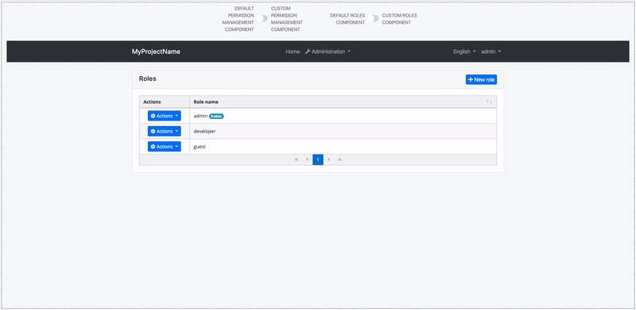

## Component Replacement

You can replace some ABP components with your custom components.

The reason that you **can replace** but **cannot customize** default ABP components is disabling or changing a part of that component can cause problems. So we named those components as _Replaceable Components_.

### How to Replace a Component

Create a new component that you want to use instead of an ABP component. Add that component to `declarations` and `entryComponents` in the `AppModule`.

Then, open the `app.component.ts` and dispatch the `AddReplaceableComponent` action to replace your component with an ABP component as shown below:

```js
import { ..., AddReplaceableComponent } from '@abp/ng.core'; // imported AddReplaceableComponent action
import { eIdentityComponents } from '@abp/ng.identity'; // imported eIdentityComponents enum
import { Store } from '@ngxs/store'; // imported Store
//...
export class AppComponent {
  constructor(..., private store: Store) {} // injected Store

  ngOnInit() {
    this.store.dispatch(
      new AddReplaceableComponent({
        component: YourNewRoleComponent,
        key: eIdentityComponents.Roles,
      }),
    );
    //...
  }
}
```




### How to Replace a Layout

Each ABP theme module has 3 layouts named `ApplicationLayoutComponent`, `AccountLayoutComponent`, `EmptyLayoutComponent`. These layouts can be replaced with the same way.

> A layout component template should contain `<router-outlet></router-outlet>` element.

The below example describes how to replace the `ApplicationLayoutComponent`:

Run the following command to generate a layout in `angular` folder:

```bash
yarn ng generate component shared/my-application-layout --export --entryComponent

# You don't need the --entryComponent option in Angular 9
```

Add the following code in your layout template (`my-layout.component.html`) where you want the page to be loaded.

```html
<router-outlet></router-outlet>
```

Open the `app.component.ts` and add the below content:

```js
import { ..., AddReplaceableComponent } from '@abp/ng.core'; // imported AddReplaceableComponent
import { eThemeBasicComponents } from '@abp/ng.theme.basic'; // imported eThemeBasicComponents enum for component keys
import { MyApplicationLayoutComponent } from './shared/my-application-layout/my-application-layout.component'; // imported MyApplicationLayoutComponent
import { Store } from '@ngxs/store'; // imported Store
//...
export class AppComponent {
  constructor(..., private store: Store) {} // injected Store

  ngOnInit() {
    // added below content
    this.store.dispatch(
      new AddReplaceableComponent({
        component: MyApplicationLayoutComponent,
        key: eThemeBasicComponents.ApplicationLayout,
      }),
    );

    //...
  }
}
```

## What's Next?

- [Custom Setting Page](./Custom-Setting-Page.md)
