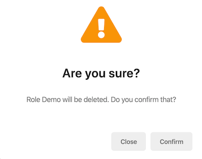

# Confirmation Popup

You can use the `ConfirmationService` in @abp/ng.theme.shared package to display a confirmation popup by placing at the root level in your project.


## Getting Started

You do not have to provide the `ConfirmationService` at module or component level, because it is already **provided in root**. You can inject and start using it immediately in your components, directives, or services.


```js
import { ConfirmationService } from '@abp/ng.theme.shared';

@Component({
  /* class metadata here */
})
class DemoComponent {
  constructor(private confirmation: ConfirmationService) {}
}
```

## Usage

You can use the `success`, `warn`, `error`, and `info` methods of `ConfirmationService` to display a confirmation popup.

### How to Display a Confirmation Popup

```js
const confirmationStatus$ = this.confirmation.success('Message', 'Title');
```

- The `ConfirmationService` methods accept three parameters that are `message`, `title`, and `options`.
- `success`, `warn`, `error`, and `info` methods return an [RxJS Subject](https://rxjs-dev.firebaseapp.com/guide/subject) to listen to confirmation popup closing event. The type of event value is [`Confirmation.Status`](https://github.com/abpframework/abp/blob/master/npm/ng-packs/packages/theme-shared/src/lib/models/confirmation.ts#L24) that is an enum.

### How to Listen Closing Event

You can subscribe to the confirmation closing event like below:

```js
import { Confirmation, ConfirmationService } from '@abp/ng.theme.shared';

constructor(private confirmation: ConfirmationService) {}

this.confirmation
  .warn('::WillBeDeleted', { key: '::AreYouSure', defaultValue: 'Are you sure?' })
  .subscribe((status: Confirmation.Status) => {
    // your code here
  });
```


- The `message` and `title` parameters accept a string, localization key or localization object. See the [localization document](./Localization.md)
- `Confirmation.Status` is an enum and has three properties;
    - `Confirmation.Status.confirm` is a closing event value that will be emitted when the popup is closed by the confirm button.
    - `Confirmation.Status.reject` is a closing event value that will be emitted when the popup is closed by the cancel button.
    - `Confirmation.Status.dismiss` is a closing event value that will be emitted when the popup is closed by pressing the escape.


If you are not interested in the confirmation status, you do not have to subscribe to the returned observable:

```js
this.confirmation.error('You are not authorized.', 'Error');
```

### How to Display a Confirmation Popup With Given Options

Options can be passed as the third parameter to `success`, `warn`, `error`, and `info` methods:

```js
const options: Partial<Confirmation.Options> = {
  hideCancelBtn: false,
  hideYesBtn: false,
  cancelText: 'Close',
  yesText: 'Confirm',
  messageLocalizationParams: ['Demo'],
  titleLocalizationParams: [],
};

this.confirmation.warn(
  'AbpIdentity::RoleDeletionConfirmationMessage',
  'Are you sure?',
  options,
);
```

- `hideCancelBtn` option hides the cancellation button when `true`. Default value is `false`
- `hideYesBtn` option hides the confirmation button when `true`. Default value is `false`
- `cancelText` is the text of the cancellation button. A localization key or localization object can be passed. Default value is `AbpUi::Cancel`
- `yesText` is the text of the confirmation button. A localization key or localization object can be passed. Default value is `AbpUi::Yes`
- `messageLocalizationParams` is the interpolation parameters for the localization of the message.
- `titleLocalizationParams` is the interpolation parameters for the localization of the title.

With the options above, the confirmation popup looks like this:



### How to Remove a Confirmation Popup

The open confirmation popup can be removed manually via the `clear` method:

```js
this.confirmation.clear();
```

## API

### success

```js
success(
  message: Config.LocalizationParam,
  title: Config.LocalizationParam,
  options?: Partial<Confirmation.Options>,
): Observable<Confirmation.Status>
```

> See the [`Config.LocalizationParam` type](https://github.com/abpframework/abp/blob/master/npm/ng-packs/packages/core/src/lib/models/config.ts#L46) and [`Confirmation` namespace](https://github.com/abpframework/abp/blob/master/npm/ng-packs/packages/theme-shared/src/lib/models/confirmation.ts)


### warn

```js
warn(
  message: Config.LocalizationParam,
  title: Config.LocalizationParam,
  options?: Partial<Confirmation.Options>,
): Observable<Confirmation.Status>
```

### error

```js
error(
  message: Config.LocalizationParam,
  title: Config.LocalizationParam,
  options?: Partial<Confirmation.Options>,
): Observable<Confirmation.Status>
```

### info

```js
info(
  message: Config.LocalizationParam,
  title: Config.LocalizationParam,
  options?: Partial<Confirmation.Options>,
): Observable<Confirmation.Status>
```

### clear

```js
clear(
  status: Confirmation.Status = Confirmation.Status.dismiss
): void
```

- `status` parameter is the value of the confirmation closing event.


## What's Next?

- [Toast Overlay](./Toaster-Service.md)
