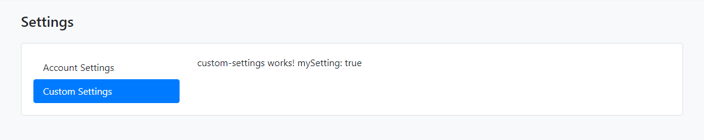

# Custom Setting Page

There are several settings tabs from different modules. You can add a custom setting page to your project.

1. Create a component with the following command:

```bash
yarn ng generate component my-settings
```

2. Open the `app.component.ts` and modify the file as shown below:

```js
import { Component } from '@angular/core';
import { SettingTabsService } from '@abp/ng.core'; // imported SettingTabsService
import { MySettingsComponent } from './my-settings/my-settings.component'; // imported MySettingsComponent

@Component(/* component metadata */)
export class AppComponent {
  constructor(private settingTabs: SettingTabsService) // injected MySettingsComponent
  {
    // added below
    settingTabs.add([
      {
        name: 'MySettings',
        order: 1,
        requiredPolicy: 'policy key here',
        component: MySettingsComponent,
      },
    ]);
  }
}
```

Navigate to `/setting-management` route to see the changes:


