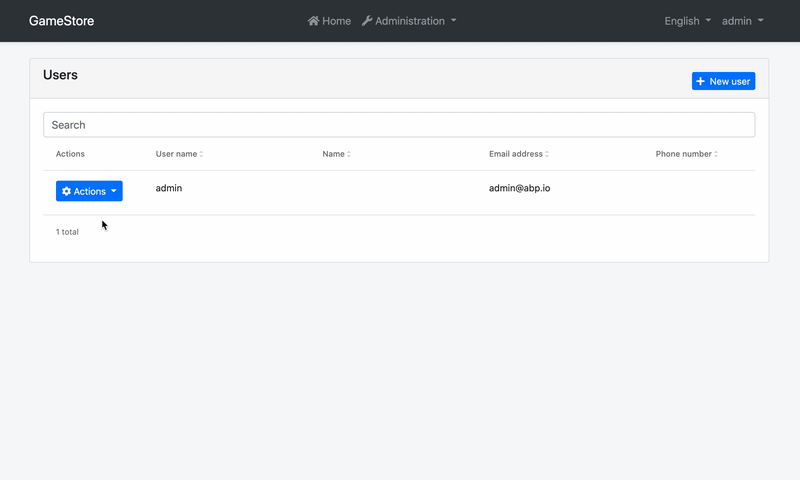
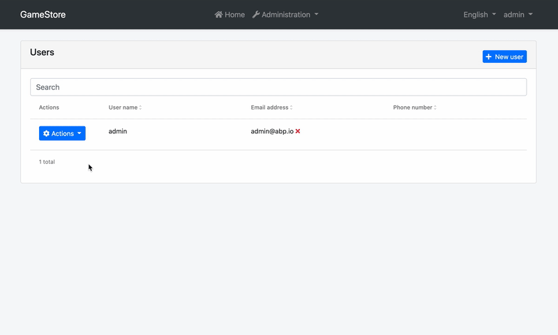

# Data Table Column (or Entity Prop) Extensions for Angular UI


## Introduction

Entity prop extension system allows you to add a new column to the data table for an entity or change/remove an already existing one. A "Name" column was added to the user management page below:



You will have access to the current entity in your code and display its value, make the column sortable, perform visibility checks, and more. You can also render custom HTML in table cells.

## How to Set Up

In this example, we will add a "Name" column and display the value of the `name` field in the user management page of the [Identity Module](../../Modules/Identity.md).

### Step 1. Create Entity Prop Contributors

The following code prepares a constant named `identityEntityPropContributors`, ready to be imported and used in your root module:

```js
// src/app/entity-prop-contributors.ts

import {
  eIdentityComponents,
  IdentityEntityPropContributors,
  IdentityUserDto,
} from '@abp/ng.identity';
import { EntityProp, EntityPropList, ePropType } from '@abp/ng.theme.shared/extensions';

const nameProp = new EntityProp<IdentityUserDto>({
  type: ePropType.String,
  name: 'name',
  displayName: 'AbpIdentity::Name',
  sortable: true,
  columnWidth: 250,
});

export function namePropContributor(propList: EntityPropList<IdentityUserDto>) {
  propList.addAfter(nameProp, 'userName', (value, name) => value.name === name);
}

export const identityEntityPropContributors: IdentityEntityPropContributors = {
  // enum indicates the page to add contributors to
  [eIdentityComponents.Users]: [
    namePropContributor,
    // You can add more contributors here
  ],
};

```

The list of props, conveniently named as `propList`, is a **doubly linked list**. That is why we have used the `addAfter` method, which adds a node with given value after the first node that has the previous value. You may find [all available methods here](../Common/Utils/Linked-List.md).

### Step 2. Import and Use Entity Prop Contributors

Import `identityEntityPropContributors` in your routing module and pass it to the static `forLazy` method of `IdentityModule` as seen below:

```js
// src/app/app-routing.module.ts

// other imports
import { identityEntityPropContributors } from './entity-prop-contributors';

const routes: Routes = [
  // other routes

  {
    path: 'identity',
    loadChildren: () =>
      import('@abp/ng.identity').then(m =>
        m.IdentityModule.forLazy({
          entityPropContributors: identityEntityPropContributors,
        })
      ),
  },

  // other routes
];
```

That is it, `nameProp` entity prop will be added, and you will see the "Name" column next to the usernames on the grid in the users page (`UsersComponent`) of the `IdentityModule`.

## How to Render Custom HTML in Cells

You can use the `valueResolver` to render an HTML string in the table. Imagine we want to show a red times icon (❌) next to unconfirmed emails and phones, instead of showing a green check icon next to confirmed emails and phones. The contributors below would do that for you.



```js
// src/app/entity-prop-contributors.ts

import {
  eIdentityComponents,
  IdentityEntityPropContributors,
  IdentityUserDto,
} from '@abp/ng.identity';
import { EntityProp, EntityPropList } from '@abp/ng.theme.shared/extensions';
import { of } from 'rxjs';

export function emailPropContributor(propList: EntityPropList<IdentityUserDto>) {
  const index = propList.indexOf('email', (value, name) => value.name === name);
  const droppedNode = propList.dropByIndex(index);
  const emailProp = new EntityProp<IdentityUserDto>({
    ...droppedNode.value,
    valueResolver: data => {
      const { email, emailConfirmed } = data.record;
      const icon = email && !emailConfirmed ? `<i class="fa fa-times text-danger ml-1"></i>` : '';

      return of((email || '') + icon); // should return an observable
    },
  });

  propList.addByIndex(emailProp, index);
}

export function phonePropContributor(propList: EntityPropList<IdentityUserDto>) {
  const index = propList.indexOf('phoneNumber', (value, name) => value.name === name);
  const droppedNode = propList.dropByIndex(index);
  const phoneProp = new EntityProp<IdentityUserDto>({
    ...droppedNode.value,
    valueResolver: data => {
      const { phoneNumber, phoneNumberConfirmed } = data.record;
      const icon =
        phoneNumber && !phoneNumberConfirmed ? `<i class="fa fa-times text-danger ml-1"></i>` : '';

      return of((phoneNumber || '') + icon); // should return an observable
    },
  });

  propList.addByIndex(phoneProp, index);
}

export const identityEntityPropContributors: IdentityEntityPropContributors = {
  [eIdentityComponents.Users]: [emailPropContributor, phonePropContributor],
};

```

> The `valueResolver` method should return an observable. You can wrap your return values with `of` from RxJS for that.

## Object Extensions

Extra properties defined on an existing entity will be included in the table based on their configuration. The values will also be mapped to and from `extraProperties` automatically. They are available when defining custom contributors, so you can drop, modify, or reorder them. The `isExtra` identifier will be set to `true` for these properties and will define this automatic behavior.

## API

### PropData\<R = any\>

`PropData` is the shape of the parameter passed to all callbacks or predicates in an `EntityProp`.

It has the following properties:

- **record** is the row data, i.e. current value rendered in the table.

  ```js
  {
    type: ePropType.String,
    name: 'name',
    valueResolver: data => {
      const name = data.record.name || '';
      return of(name.toUpperCase());
    },
  }
  ```

- **index** is the table index where the record is at.

- **getInjected** is the equivalent of [Injector.get](https://angular.io/api/core/Injector#get). You can use it to reach injected dependencies of `ExtensibleTableComponent`, including, but not limited to, its parent component.

  ```js
  {
    type: ePropType.String,
    name: 'name',
    valueResolver: data => {
      const restService = data.getInjected(RestService);
      const usersComponent = data.getInjected(UsersComponent);

      // Use restService and usersComponent public props and methods here
    },
  }
  ```

### PropCallback\<T, R = any\>

`PropCallback` is the type of the callback function that can be passed to an `EntityProp` as `prop` parameter. A prop callback gets a single parameter, the `PropData`. The return type may be anything, including `void`. Here is a simplified representation:

```js
type PropCallback<T, R = any> = (data?: PropData<T>) => R;
```

### PropPredicate\<T\>

`PropPredicate` is the type of the predicate function that can be passed to an `EntityProp` as `visible` parameter. A prop predicate gets a single parameter, the `PropData`. The return type must be `boolean`. Here is a simplified representation:

```js
type PropPredicate<T> = (data?: PropData<T>) => boolean;
```

### EntityPropOptions\<R = any\>

`EntityPropOptions` is the type that defines required and optional properties you have to pass in order to create an entity prop.

Its type definition is as follows:

```js
type EntityPropOptions<R = any> = {
  type: ePropType;
  name: string;
  displayName?: string;
  valueResolver?: PropCallback<R, Observable<any>>;
  sortable?: boolean;
  columnWidth?: number;
  permission?: string;
  visible?: PropPredicate<R>;
};
```

As you see, passing `type` and `name` is enough to create an entity prop. Here is what each property is good for:

- **type** is the type of the prop value. It is used for custom rendering in the table. (_required_)
- **name** is the property name (or key) which will be used to read the value of the prop. (_required_)
- **displayName** is the name of the property which will be localized and shown as column header. (_default:_ `options.name`)
- **valueResolver** is a callback that is called when the cell is rendered. It must return an observable. (_default:_ `data => of(data.record[options.name])`)
- **sortable** defines if the table is sortable based on this entity prop. Sort icons are shown based on it. (_default:_ `false`)
- **columnWidth** defines a minimum width for the column. Good for horizontal scroll. (_default:_ `undefined`)
- **permission** is the permission context which will be used to decide if a column for this entity prop should be displayed to the user or not. (_default:_ `undefined`)
- **visible** is a predicate that will be used to decide if this entity prop should be displayed on the table or not. (_default:_ `() => true`)

> Important Note: Do not use record in visibility predicates. First of all, the table header checks it too and the record will be `undefined`. Second, if some cells are displayed and others are not, the table will be broken. Use the `valueResolver` and render an empty cell when you need to hide a specific cell.

You may find a full example below.

### EntityProp\<R = any\>

`EntityProp` is the class that defines your entity props. It takes an `EntityPropOptions` and sets the default values to the properties, creating an entity prop that can be passed to an entity contributor.

```js
const options: EntityPropOptions<IdentityUserDto> = {
  type: ePropType.String,
  name: 'email',
  displayName: 'AbpIdentity::EmailAddress',
  valueResolver: data => {
    const { email, emailConfirmed } = data.record;

    return of(
      (email || '') + (emailConfirmed ? `<i class="fa fa-check text-success ml-1"></i>` : ''),
    );
  },
  sortable: true,
  columnWidth: 250,
  permission: 'AbpIdentity.Users.ReadSensitiveData', // hypothetical
  visible: data => {
    const store = data.getInjected(Store);
    const selectSensitiveDataVisibility = ConfigState.getSetting(
      'Abp.Identity.IsSensitiveDataVisible'  // hypothetical
    );
    
    return store.selectSnapshot(selectSensitiveDataVisibility).toLowerCase() === 'true';
  }
};

const prop = new EntityProp(options);
```

It also has two static methods to create its instances:

- **EntityProp.create\<R = any\>\(options: EntityPropOptions\<R\>\)** is used to create an instance of `EntityProp`.
  ```js
  const prop = EntityProp.create(options);
  ```
- **EntityProp.createMany\<R = any\>\(options: EntityPropOptions\<R\>\[\]\)** is used to create multiple instances of `EntityProp` with given array of `EntityPropOptions`.
  ```js
  const props = EntityProp.createMany(optionsArray);
  ```

### EntityPropList\<R = any\>

`EntityPropList` is the list of props passed to every prop contributor callback as the first parameter named `propList`. It is a **doubly linked list**. You may find [all available methods here](../Common/Utils/Linked-List.md).

The items in the list will be displayed according to the linked list order, i.e. from head to tail. If you want to re-order them, all you have to do is something like this:

```js
export function reorderUserContributors(
  propList: EntityPropList<IdentityUserDto>,
) {
  // drop email node
  const emailPropNode = propList.dropByValue(
    'AbpIdentity::EmailAddress',
    (prop, text) => prop.text === text,
  );

  // add it back after phoneNumber
  propList.addAfter(
    emailPropNode.value,
    'phoneNumber',
    (value, name) => value.name === name,
  );
}
```

### EntityPropContributorCallback\<R = any\>

`EntityPropContributorCallback` is the type that you can pass as entity prop contributor callbacks to static `forLazy` methods of the modules.

```js
export function isLockedOutPropContributor(
  propList: EntityPropList<IdentityUserDto>,
) {
  // add isLockedOutProp as 2nd column
  propList.add(isLockedOutProp).byIndex(1);
}

export const identityEntityPropContributors = {
  [eIdentityComponents.Users]: [isLockedOutPropContributor],
};
```

## See Also

- [Customizing Application Modules Guide](../../Customizing-Application-Modules-Guide.md)
