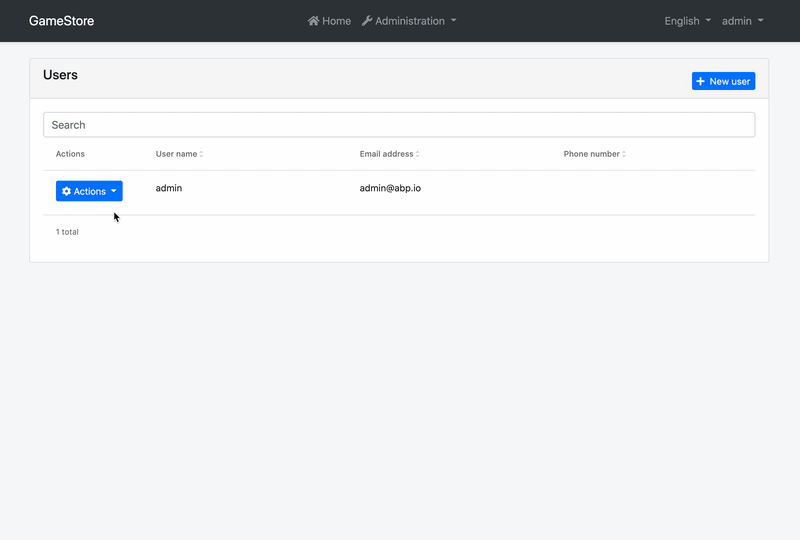

# Dynamic Form (or Form Prop) Extensions for Angular UI


## Introduction

Form prop extension system allows you to add a new field to the create and/or edit forms for a form or change/remove an already existing one. A "Date of Birth" field was added to the user management page below:



You can validate the field, perform visibility checks, and do more. You will also have access to the current entity when creating a contibutor for an edit form.

## How to Set Up

In this example, we will add a "Date of Birth" field in the user management page of the [Identity Module](../../Modules/Identity.md) and validate it.

### Step 1. Create Form Prop Contributors

The following code prepares two constants named `identityCreateFormPropContributors` and `identityEditFormPropContributors`, ready to be imported and used in your root module:

```js
// src/app/form-prop-contributors.ts

import {
  eIdentityComponents,
  IdentityCreateFormPropContributors,
  IdentityUserDto,
} from '@abp/ng.identity';
import { ePropType, FormProp, FormPropList } from '@abp/ng.theme.shared/extensions';
import { Validators } from '@angular/forms';

const birthdayProp = new FormProp<IdentityUserDto>({
  type: ePropType.Date,
  name: 'birthday',
  displayName: 'AbpIdentity::Birthday',
  validators: () => [Validators.required],
});

export function birthdayPropContributor(propList: FormPropList<IdentityUserDto>) {
  propList.addByIndex(birthdayProp, 4);
}

export const identityCreateFormPropContributors: IdentityCreateFormPropContributors = {
  // enum indicates the page to add contributors to
  [eIdentityComponents.Users]: [
    birthdayPropContributor,
    // You can add more contributors here
  ],
};

export const identityEditFormPropContributors = identityCreateFormPropContributors;
// you may define different contributors for edit form if you like

```


The list of props, conveniently named as `propList`, is a **doubly linked list**. That is why we have used the `addByIndex` method, which adds the given value to the specified index of the list. You may find [all available methods here](../Common/Utils/Linked-List.md).

### Step 2. Import and Use Form Prop Contributors

Import `identityCreateFormPropContributors` and `identityEditFormPropContributors` in your routing module and pass it to the static `forLazy` method of `IdentityModule` as seen below:

```js
// src/app/app-routing.module.ts

// other imports
import {
  identityCreateFormPropContributors,
  identityEditFormPropContributors,
} from './form-prop-contributors';

const routes: Routes = [
  // other routes

  {
    path: 'identity',
    loadChildren: () =>
      import('@abp/ng.identity').then(m =>
        m.IdentityModule.forLazy({
          createFormPropContributors: identityCreateFormPropContributors,
          editFormPropContributors: identityEditFormPropContributors,
        })
      ),
  },

  // other routes
];
```

That is it, `birthdayProp` form prop will be added, and you will see the datepicker for the "Date of Birth" field right before the "Email address" in the forms of the users page in the `IdentityModule`.

## Object Extensions

Extra properties defined on an existing entity will be included in the create and edit forms and validated based on their configuration. The form values will also be mapped to and from `extraProperties` automatically. They are available when defining custom contributors, so you can drop, modify, or reorder them. The `isExtra` identifier will be set to `true` for these properties and will define this automatic behavior.

## API

### PropData\<R = any\>

`PropData` is the shape of the parameter passed to all callbacks or predicates in a `FormProp`.

It has the following properties:

- **getInjected** is the equivalent of [Injector.get](https://angular.io/api/core/Injector#get). You can use it to reach injected dependencies of `ExtensibleFormPropComponent`, including, but not limited to, its parent components.

  ```js
  {
    type: ePropType.Enum,
    name: 'myField',
    options: data => {
      const restService = data.getInjected(RestService);
      const usersComponent = data.getInjected(UsersComponent);

      // Use restService and usersComponent public props and methods here
    }
  },
  ```

- **record** is the row data, i.e. current value of the selected item to edit. This property is _available only on edit forms_.

  ```js
  {
    type: ePropType.String,
    name: 'myProp',
    readonly: data => data.record.someOtherProp,
  }
  ```

### PropCallback\<T, R = any\>

`PropCallback` is the type of the callback function that can be passed to a `FormProp` as `prop` parameter. A prop callback gets a single parameter, the `PropData`. The return type may be anything, including `void`. Here is a simplified representation:

```js
type PropCallback<T, R = any> = (data?: PropData<T>) => R;
```

### PropPredicate\<T\>

`PropPredicate` is the type of the predicate function that can be passed to a `FormProp` as `visible` parameter. A prop predicate gets a single parameter, the `PropData`. The return type must be `boolean`. Here is a simplified representation:

```js
type PropPredicate<T> = (data?: PropData<T>) => boolean;
```

### FormPropOptions\<R = any\>

`FormPropOptions` is the type that defines required and optional properties you have to pass in order to create a form prop.

Its type definition is as follows:

```js
type FormPropOptions<R = any> = {
  type: ePropType;
  name: string;
  displayName?: string;
  id?: string;
  permission?: string;
  visible?: PropPredicate<R>;
  readonly?: PropPredicate<R>;
  disabled?: PropPredicate<R>;
  validators?: PropCallback<R, ValidatorFn[]>;
  asyncValidators?: PropCallback<R, AsyncValidatorFn[]>;
  defaultValue?: boolean | number | string | Date;
  options?: PropCallback<R, Observable<ABP.Option<any>[]>>;
  autocomplete?: string;
  isExtra? boolean;
};
```

As you see, passing `type` and `name` is enough to create a form prop. Here is what each property is good for:

- **type** is the type of the prop value. It defines which input is rendered for the prop in the form. (_required_)
- **name** is the property name (or key) which will be used to read the value of the prop. (_required_)
- **displayName** is the name of the property which will be localized and shown as column header. (_default:_ `options.name`)
- **id** will be set as the `for` attribute of the label and the `id` attribute of the input for the field. (_default:_ `options.name`)
- **permission** is the permission context which will be used to decide if a column for this form prop should be displayed to the user or not. (_default:_ `undefined`)
- **visible** is a predicate that will be used to decide if this prop should be displayed on the form or not. (_default:_ `() => true`)
- **readonly** is a predicate that will be used to decide if this prop should be readonly or not. (_default:_ `() => false`)
- **disabled** is a predicate that will be used to decide if this prop should be disabled or not. (_default:_ `() => false`)
- **validators** is a callback that returns validators for the prop. (_default:_ `() => []`)
- **asyncValidators** is a callback that returns async validators for the prop. (_default:_ `() => []`)
- **defaultValue** is the initial value the field will have. (_default:_ `null`)
- **options** is a callback that is called when a dropdown is needed. It must return an observable. (_default:_ `undefined`)
- **autocomplete** will be set as the `autocomplete` attribute of the input for the field. Please check [possible values](https://developer.mozilla.org/en-US/docs/Web/HTML/Attributes/autocomplete#Values). (_default:_ `'off'`)
- **isExtra** indicates this prop is an object extension. When `true`, the value of the field will be mapped from and to `extraProperties` of the entity. (_default:_ `undefined`)

> Important Note: Do not use `record` property of `PropData` in create form predicates and callbacks, because it will be `undefined`. You can use it on edit form contributors though.

You may find a full example below.

### FormProp\<R = any\>

`FormProp` is the class that defines your form props. It takes a `FormPropOptions` and sets the default values to the properties, creating a form prop that can be passed to a form contributor.

```js
const options: FormPropOptions<IdentityUserDto> = {
  type: ePropType.Enum,
  name: 'myProp',
  displayName: 'Default::MyPropName',
  id: 'my-prop',
  permission: 'AbpIdentity.Users.ReadSensitiveData', // hypothetical
  visible: data => {
    const store = data.getInjected(Store);
    const selectSensitiveDataVisibility = ConfigState.getSetting(
      'Abp.Identity.IsSensitiveDataVisible'  // hypothetical
    );
    
    return store.selectSnapshot(selectSensitiveDataVisibility).toLowerCase() === 'true';
  },
  readonly: data => data.record.someProp,
  disabled: data => data.record.someOtherProp,
  validators: () => [Validators.required],
  asyncValidators: data => {
    const http = data.getInjected(HttpClient);

    function validate(control: AbstractControl): Observable<ValidationErrors | null> {
      if (control.pristine) return of(null);

      return http
        .get('https://api.my-brand.io/hypothetical/endpoint/' + control.value)
        .pipe(map(response => (response.valid ? null : { invalid: true })));
    }

    return [validate];
  },
  defaultValue: 0,
  options: data => {
    const service = data.getInjected(MyIdentityService);

    return service.getMyPropOptions()
      .pipe(
        map(({items}) => items.map(
          item => ({key: item.name, value: item.id })
        )),
      );
  },
  autocomplete: 'off',
  isExtra: true,
};

const prop = new FormProp(options);
```

It also has two static methods to create its instances:

- **FormProp.create\<R = any\>\(options: FormPropOptions\<R\>\)** is used to create an instance of `FormProp`.
  ```js
  const prop = FormProp.create(options);
  ```
- **FormProp.createMany\<R = any\>\(options: FormPropOptions\<R\>\[\]\)** is used to create multiple instances of `FormProp` with given array of `FormPropOptions`.
  ```js
  const props = FormProp.createMany(optionsArray);
  ```

### FormPropList\<R = any\>

`FormPropList` is the list of props passed to every prop contributor callback as the first parameter named `propList`. It is a **doubly linked list**. You may find [all available methods here](../Common/Utils/Linked-List.md).

The items in the list will be displayed according to the linked list order, i.e. from head to tail. If you want to re-order them, all you have to do is something like this:

```js
export function reorderUserContributors(
  propList: FormPropList<IdentityUserDto>,
) {
  // drop email node
  const emailPropNode = propList.dropByValue(
    'AbpIdentity::EmailAddress',
    (prop, displayName) => prop.displayName === displayName,
  );

  // add it back after phoneNumber
  propList.addAfter(
    emailPropNode.value,
    'phoneNumber',
    (value, name) => value.name === name,
  );
}
```

### CreateFormPropContributorCallback\<R = any\>

`CreateFormPropContributorCallback` is the type that you can pass as **create form** prop contributor callbacks to static `forLazy` methods of the modules.

```js
export function myPropCreateContributor(
  propList: FormPropList<IdentityUserDto>,
) {
  // add myProp as 2nd field from the start
  propList.add(myProp).byIndex(1);
}

export const identityCreateFormPropContributors = {
  [eIdentityComponents.Users]: [myPropCreateContributor],
};
```

### EditFormPropContributorCallback\<R = any\>

`EditFormPropContributorCallback` is the type that you can pass as **edit form** prop contributor callbacks to static `forLazy` methods of the modules.

```js
export function myPropEditContributor(
  propList: FormPropList<IdentityUserDto>,
) {
  // add myProp as 2nd field from the end
  propList.add(myProp).byIndex(-1);
}

export const identityEditFormPropContributors = {
  [eIdentityComponents.Users]: [myPropEditContributor],
};
```

## See Also

- [Customizing Application Modules Guide](../../Customizing-Application-Modules-Guide.md)
