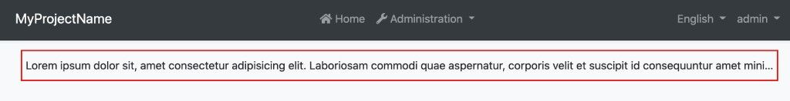
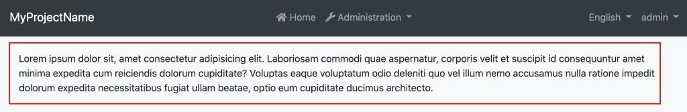
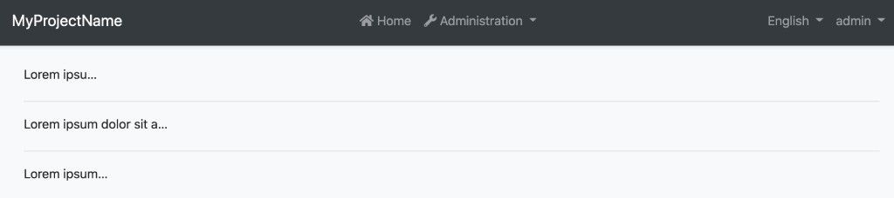

# Ellipsis

Text inside an HTML element can be truncated easily with an ellipsis by using CSS. To make this even easier, you can use the `EllipsisDirective` which has been exposed by the `@abp/ng.theme.shared` package.


## Getting Started

In order to use the `EllipsisDirective` in an HTML template, the **`ThemeSharedModule`** should be imported into your module like this:

```js
// ...
import { ThemeSharedModule } from '@abp/ng.theme.shared';

@NgModule({
  //...
  imports: [..., ThemeSharedModule],
})
export class MyFeatureModule {}
```

or **if you would not like to import** the `ThemeSharedModule`, you can import the **`EllipsisModule`** as shown below:


```js
// ...
import { EllipsisModule } from '@abp/ng.theme.shared';

@NgModule({
  //...
  imports: [..., EllipsisModule],
})
export class MyFeatureModule {}
```

## Usage

The `EllipsisDirective` is very easy to use. The directive's selector is **`abpEllipsis`**. By adding the `abpEllipsis` attribute to an HTML element, you can activate the `EllipsisDirective` for the HTML element.

See an example usage:

```html
<p abpEllipsis>
    Lorem ipsum dolor sit, amet consectetur adipisicing elit. Laboriosam commodi quae aspernatur,
    corporis velit et suscipit id consequuntur amet minima expedita cum reiciendis dolorum
    cupiditate? Voluptas eaque voluptatum odio deleniti quo vel illum nemo accusamus nulla ratione
    impedit dolorum expedita necessitatibus fugiat ullam beatae, optio eum cupiditate ducimus
    architecto.
  </p>
```

The `abpEllipsis` attribute has been added to the `<p>` element that containing very long text inside to activate the `EllipsisDirective`.

See the result:



The long text has been truncated by using the directive.

The UI before using the directive looks like this:



### Specifying Max Width of an HTML Element

An HTML element max width can be specified as shown below:

```html
<div [abpEllipsis]="'100px'">
 Lorem ipsum dolor sit amet consectetur adipisicing elit. Cumque, optio!
</div>

<div [abpEllipsis]="'15vw'">
 Lorem ipsum dolor sit amet consectetur adipisicing elit. Cumque, optio!
</div>

<div [abpEllipsis]="'50%'">
 Lorem ipsum dolor sit amet consectetur adipisicing elit. Cumque, optio!
</div>
```

See the result:

