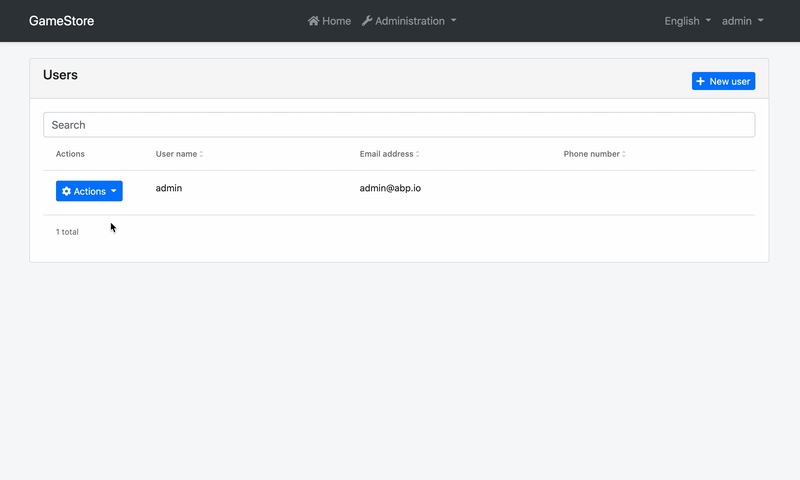

# Entity Action Extensions for Angular UI

## Introduction

Entity action extension system allows you to add a new action to the action menu for an entity. A "Click Me" action was added to the user management page below:



You can take any action (open a modal, make an HTTP API call, redirect to another page... etc) by writing your custom code. You can also access the current entity in your code.

## How to Set Up

In this example, we will add a "Click Me!" action and alert the current row's `userName` in the user management page of the [Identity Module](../../Modules/Identity.md).

### Step 1. Create Entity Action Contributors

The following code prepares a constant named `identityEntityActionContributors`, ready to be imported and used in your root module:

```js
// src/app/entity-action-contributors.ts

import {
  eIdentityComponents,
  IdentityEntityActionContributors,
  IdentityUserDto,
} from '@abp/ng.identity';
import { EntityAction, EntityActionList } from '@abp/ng.theme.shared/extensions';

const alertUserName = new EntityAction<IdentityUserDto>({
  text: 'Click Me!',
  action: data => {
    // Replace alert with your custom code
    alert(data.record.userName);
  },
  // See EntityActionOptions in API section for all options
});

export function alertUserNameContributor(actionList: EntityActionList<IdentityUserDto>) {
  actionList.addTail(alertUserName);
}

export const identityEntityActionContributors: IdentityEntityActionContributors = {
  // enum indicates the page to add contributors to
  [eIdentityComponents.Users]: [
    alertUserNameContributor,
    // You can add more contributors here
  ],
};
```

The list of actions, conveniently named as `actionList`, is a **doubly linked list**. That is why we have used the `addTail` method, which adds the given value to the end of the list. You may find [all available methods here](../Common/Utils/Linked-List.md).

### Step 2. Import and Use Entity Action Contributors

Import `identityEntityActionContributors` in your routing module and pass it to the static `forLazy` method of `IdentityModule` as seen below:

```js
// src/app/app-routing.module.ts

// other imports
import { identityEntityActionContributors } from './entity-action-contributors';

const routes: Routes = [
  // other routes

  {
    path: 'identity',
    loadChildren: () =>
      import('@abp/ng.identity').then(m =>
        m.IdentityModule.forLazy({
          entityActionContributors: identityEntityActionContributors,
        })
      ),
  },

  // other routes
];
```

That is it, `alertUserName` entity action will be added as the last action on the grid dropdown in the "Users" page (`UsersComponent`) of the `IdentityModule`.

## How to Place a Custom Modal and Trigger It by Entity Actions

Let's employ dependency injection to extend the functionality of `IdentityModule` and add a quick view action for the User entity. We will take a lazy-loaded approach.


1. Create a folder at this path: `src/app/identity-extended`

2. Add an entity action similar to this:
  ```js
  // src/app/identity-extended/entity-action-contributors.ts

  import {
    eIdentityComponents,
    IdentityEntityActionContributors,
    IdentityUserDto,
  } from '@abp/ng.identity';
  import { EntityAction, EntityActionList } from '@abp/ng.theme.shared/extensions';
  import { IdentityExtendedComponent } from './identity-extended.component';

  const quickViewAction = new EntityAction<IdentityUserDto>({
    text: 'Quick View',
    action: data => {
      const component = data.getInjected(IdentityExtendedComponent);
      component.openUserQuickView(data.record);
    },
  });

  export function customModalContributor(actionList: EntityActionList<IdentityUserDto>) {
    actionList.addTail(quickViewAction);
  }

  export const identityEntityActionContributors: IdentityEntityActionContributors = {
    // enum indicates the page to add contributors to
    [eIdentityComponents.Users]: [
      customModalContributor,
      // You can add more contributors here
    ],
  };
  ```

3. Create a parent component to the identity module.
  ```js
  // src/app/identity-extended/identity-extended.component.ts

  import { IdentityUserDto } from '@abp/ng.identity';
  import { Component } from '@angular/core';

  @Component({
    selector: 'app-identity-extended',
    templateUrl: './identity-extended.component.html',
  })
  export class IdentityExtendedComponent {
    isUserQuickViewVisible: boolean;

    user: IdentityUserDto;

    openUserQuickView(record: IdentityUserDto) {
      this.user = new Proxy(record, {
        get: (target, prop) => target[prop] || '—',
      });
      this.isUserQuickViewVisible = true;
    }
  }
  ```

4. Add a router outlet and a modal to the parent component.
  ```html
  <!-- src/app/identity-extended/identity-extended.component.html -->

  <router-outlet></router-outlet>

  <abp-modal [(visible)]="isUserQuickViewVisible">
    <ng-template #abpHeader>
      <h3></h3>
    </ng-template>

    <ng-template #abpBody>
      <table class="table table-borderless">
        <tbody>
          <tr>
            <th scope="row"></th>
            <td></td>
          </tr>
          <tr>
            <th scope="row"></th>
            <td></td>
          </tr>
          <tr>
            <th scope="row"></th>
            <td></td>
          </tr>
          <tr>
            <th scope="row"></th>
            <td></td>
          </tr>
        </tbody>
      </table>
    </ng-template>

    <ng-template #abpFooter>
      <button type="button" class="btn btn-secondary" abpClose>
        
      </button>
    </ng-template>
  </abp-modal>
  ```

5. Add a module for the component and load `IdentityModule` as seen below:
  ```js
  // src/app/identity-extended/identity-extended.module.ts

  import { CoreModule } from '@abp/ng.core';
  import { IdentityModule } from '@abp/ng.identity';
  import { ThemeSharedModule } from '@abp/ng.theme.shared';
  import { NgModule } from '@angular/core';
  import { RouterModule } from '@angular/router';
  import { identityEntityActionContributors } from './entity-action-contributors';
  import { IdentityExtendedComponent } from './identity-extended.component';

  @NgModule({
    imports: [
      CoreModule,
      ThemeSharedModule,
      RouterModule.forChild([
        {
          path: '',
          component: IdentityExtendedComponent,
          children: [
            {
              path: '',
              loadChildren: () =>
                IdentityModule.forLazy({
                  entityActionContributors: identityEntityActionContributors,
                }),
            },
          ],
        },
      ]),
    ],
    declarations: [IdentityExtendedComponent],
  })
  export class IdentityExtendedModule {}
  ```

6. Load `IdentityExtendedModule` instead of `IdentityModule` in your root routing module.
  ```js
  // src/app/app-routing.module.ts

  const routes: Routes = [
    // other routes

    {
      path: 'identity',
      loadChildren: () =>
        import('./identity-extended/identity-extended.module')
          .then(m => m.IdentityExtendedModule),
    },

    // other routes
  ];
  ```

That's it. As you see, we reached the `IdentityExtendedComponent` through dependency injection and called one of its methods in our action. The specific user was also available via `data.record`, so we were able to display a summary view.

## API

### ActionData\<R = any\>

`ActionData` is the shape of the parameter passed to all callbacks or predicates in an `EntityAction`.

It has the following properties:

- **record** is the row data, i.e. current value rendered in the table.

  ```js
  {
    text: 'Click Me!',
    action: data => {
      alert(data.record.userName);
    },
  }
  ```

- **index** is the table index where the record is at.

- **getInjected** is the equivalent of [Injector.get](https://angular.io/api/core/Injector#get). You can use it to reach injected dependencies of `GridActionsComponent`, including, but not limited to, its parent component.

  ```js
  {
    text: 'Click Me!',
    action: data => {
      const restService = data.getInjected(RestService);

      // Use restService public props and methods here
    },
    visible: data => {
      const usersComponent = data.getInjected(UsersComponent);

      // Use usersComponent public props and methods here
    },
  }
  ```

### ActionCallback\<T, R = any\>

`ActionCallback` is the type of the callback function that can be passed to an `EntityAction` as `action` parameter. An action callback gets a single parameter, the `ActionData`. The return type may be anything, including `void`. Here is a simplified representation:

```js
type ActionCallback<T, R = any> = (data?: ActionData<T>) => R;
```

### ActionPredicate\<T\>

`ActionPredicate` is the type of the predicate function that can be passed to an `EntityAction` as `visible` parameter. An action predicate gets a single parameter, the `ActionData`. The return type must be `boolean`. Here is a simplified representation:

```js
type ActionPredicate<T> = (data?: ActionData<T>) => boolean;
```

### EntityActionOptions\<R = any\>

`EntityActionOptions` is the type that defines required and optional properties you have to pass in order to create an entity action.

Its type definition is as follows:

```js
type EntityActionOptions<R = any> = {
  action: ActionCallback<R>,
  text: string,
  icon?: string,
  permission?: string,
  visible?: ActionPredicate<R>,
};
```

As you see, passing `action` and `text` is enough to create an entity action. Here is what each property is good for:

- **action** is a callback that is called when the grid action is clicked. (_required_)
- **text** is the button text which will be localized. (_required_)
- **icon** is the classes that define an icon to be placed before the text. (_default:_ `''`)
- **permission** is the permission context which will be used to decide if this type of grid action should be displayed to the user or not. (_default:_ `undefined`)
- **visible** is a predicate that will be used to decide if the current record should have this grid action or not. (_default:_ `() => true`)

You may find a full example below.

### EntityAction\<R = any\>

`EntityAction` is the class that defines your entity actions. It takes an `EntityActionOptions` and sets the default values to the properties, creating an entity action that can be passed to an entity contributor.

```js
const options: EntityActionOptions<IdentityUserDto> = {
  action: data => {
    const component = data.getInjected(IdentityExtendedComponent);
    component.unlock(data.record.id);
  },
  text: 'AbpIdentity::Unlock',
  icon: 'fa fa-unlock',
  permission: 'AbpIdentity.Users.Update',
  visible: data => data.record.isLockedOut,
};

const action = new EntityAction(options);
```

It also has two static methods to create its instances:

- **EntityAction.create\<R = any\>\(options: EntityActionOptions\<R\>\)** is used to create an instance of `EntityAction`.
  ```js
  const action = EntityAction.create(options);
  ```
- **EntityAction.createMany\<R = any\>\(options: EntityActionOptions\<R\>\[\]\)** is used to create multiple instances of `EntityAction` with given array of `EntityActionOptions`.
  ```js
  const actions = EntityAction.createMany(optionsArray);
  ```

### EntityActionList\<R = any\>

`EntityActionList` is the list of actions passed to every action contributor callback as the first parameter named `actionList`. It is a **doubly linked list**. You may find [all available methods here](../Common/Utils/Linked-List.md).

The items in the list will be displayed according to the linked list order, i.e. from head to tail. If you want to re-order them, all you have to do is something like this:

```js
export function reorderUserContributors(
  actionList: EntityActionList<IdentityUserDto>,
) {
  // drop "Unlock" button
  const unlockActionNode = actionList.dropByValue(
    'AbpIdentity::Unlock',
    (action, text) => action.text === text,
  );

  // add it back to the head of the list
  actionList.addHead(unlockActionNode.value);
}
```

### EntityActionContributorCallback\<R = any\>

`EntityActionContributorCallback` is the type that you can pass as entity action contributor callbacks to static `forLazy` methods of the modules.

```js
// lockUserContributor should have EntityActionContributorCallback<IdentityUserDto> type

export function lockUserContributor(
  actionList: EntityActionList<IdentityUserDto>,
) {
  // add lockUser as 3rd action
  actionList.add(lockUser).byIndex(2);
}

export const identityEntityActionContributors = {
  [eIdentityComponents.Users]: [lockUserContributor],
};
```

## See Also

- [Customizing Application Modules Guide](../../Customizing-Application-Modules-Guide.md)
