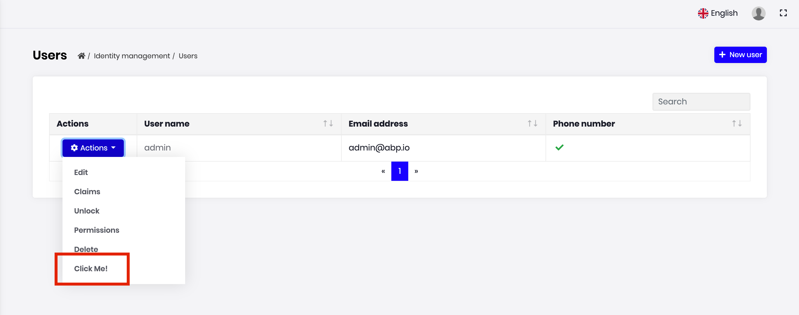

# Entity Action Extensions for Angular UI

## Introduction

Entity action extension system allows you to add a new action to the action menu for an entity. A "Click Me" action was added to the user management page below:



You can take any action (open a modal, make an HTTP API call, redirect to another page... etc) by writing your custom code. You can access to the current entity in your code.

## How to Set Up

In this example, we will add a "Click Me!" action and alert the current row's `userName` in the user management page of the [Identity Module](../../Modules/Identity.md).

### Step 1. Create Entity Action Contributors

The following code prepares a constant named `identityEntityActionContributors`, ready to be imported and used in your root module:

```js
// entity-action-contributors.ts

import { EntityAction, EntityActionList } from '@abp/ng.theme.shared/extensions';
import { IdentityEntityActionContributors, IdentityUserDto } from '@volo/abp.ng.identity';

const alertUserName = new EntityAction<IdentityUserDto>({
  text: 'Click Me!',
  action: data => {
    // Replace alert with your custom code
    alert(data.record.userName);
  },
  // See EntityActionOptions in API section for all options
});

export function alertUserNameContributor(
  actionList: EntityActionList<IdentityUserDto>,
) {
  actionList.addTail(alertUserName);
}

export const identityEntityActionContributors: IdentityEntityActionContributors = {
  // enum indicates the page to add contributors to
  [eIdentityComponents.Users]: [
    alertUserNameContributor,
    // You can add more contributors here
  ],
};
```

The list of actions, conveniently named as `actionList`, is a **doubly linked list**. That is why we have used the `addTail` method, which adds the given value to the end of the list. You may find [all available methods here](../Common/Utils/Linked-List.md).

> **Important Note 1:** AoT compilation does not support function calls in decorator metadata. This is why we have defined `alertUserNameContributor` as an exported function declaration here. Please do not forget exporting your contributor callbacks and forget about lambda functions (a.k.a. arrow functions). Please refer to [AoT metadata errors](https://angular.io/guide/aot-metadata-errors#function-calls-not-supported) for details.

> **Important Note 2:** Please use one of the following if Ivy is not enabled in your project. Otherwise, you will get an "Expression form not supported." error.

```js
export const identityEntityActionContributors: IdentityEntityActionContributors = {
  'Identity.UsersComponent': [ alertUserNameContributor ],
};

/* OR */

const identityContributors: IdentityEntityActionContributors = {};
identityContributors[eIdentityComponents.Users] = [ alertUserNameContributor ];
export const identityEntityActionContributors = identityContributors;
```

### Step 2. Import and Use Entity Action Contributors

Import `identityEntityActionContributors` in your routing module and pass it to the static `forLazy` method of `IdentityModule` as seen below:

```js
import { identityEntityActionContributors } from './entity-action-contributors';

const routes: Routes = [
  {
    path: '',
    component: DynamicLayoutComponent,
    children: [
      {
        path: 'identity',
        loadChildren: () =>
          import('@volo/abp.ng.identity').then(m =>
            m.IdentityModule.forLazy({
              entityActionContributors: identityEntityActionContributors,
            }),
          ),
      },
      // other child routes
    ],
    // other routes
  }
];
```

That is it, `alertUserName` entity action will be added as the last action on the grid dropdown in the users page (`UsersComponent`) of the `IdentityModule`.

## How to Place a Custom Modal and Trigger It by Entity Actions

Incase you need to place a custom modal that will be triggered by an entity action, there are two ways to do it: A quick one and an elaborate one.

### The Quick Solution

1. Place your custom modal inside `AppComponent` template.
  ```html
  <abp-modal [(visible)]="isModalOpen">
    <ng-template #abpHeader>
      <h3><!-- YOUR TITLE HERE --></h3>
    </ng-template>

    <ng-template #abpBody>
      <!-- YOUR CONTENT HERE -->
    </ng-template>

    <ng-template #abpFooter>
      <button type="button" class="btn btn-secondary" #abpClose>
        
      </button>
      
      <!-- YOUR CONFIRMATION BUTTON HERE -->
    </ng-template>
  </abp-modal>
  ```

2. Add the following inside your `AppComponent` class:
  ```js
  isModalOpen: boolean;

  openModal(/* may take parameters */) {
    /* and set things before showing the modal */
    this.isModalOpen = true;
  }
  ```

3. Add an entity action similar to this:
  ```js
  const customModalAction = new EntityAction<IdentityUserDto>({
    text: 'Custom Modal Action',
    action: data => {
      const component = data.getInjected(AppComponent);
      component.openModal(/* you may pass parameters */);
    },
  });
  ```

That should work. However, there is a longer but lazy-loading solution, and we are going to use NGXS for it.

### The Elaborate Solution

Consider the modal will be displayed in the Identity module. How can we lazy-load it too?

1. Create a folder called `identity-extended` inside your app folder.
2. Create a file called `identity-popups.store.ts` in it.
3. Insert the following code in the new file:
  ```js
  import { Action, Selector, State, StateContext } from '@ngxs/store';

  export class ToggleIdentityPopup {
    static readonly type = '[IdentityPopups] Toggle';
    constructor(public readonly payload: boolean) {}
  }

  @State<IdentityPopupsStateModel>({
    name: 'IdentityPopups',
    defaults: {
      isVisible: false,
    },
  })
  export class IdentityPopupsState {
    @Selector()
    static isVisible(state: IdentityPopupsStateModel) {
      return state.isVisible;
    }

    @Action(ToggleIdentityPopup)
    toggleModal(
      context: StateContext<IdentityPopupsStateModel>,
      { payload }: ToggleIdentityPopup,
    ) {
      context.patchState({ isVisible: payload });
    }
  }

  interface IdentityPopupsStateModel {
    isVisible: boolean;
  }
  ```

4. Create a file called `identity-extended.module.ts` in the same folder.
5. Insert the following code in the new file:
  ```js
  import { CoreModule } from '@abp/ng.core';
  import { ThemeSharedModule } from '@abp/ng.theme.shared';
  import { Component, NgModule } from '@angular/core';
  import { RouterModule } from '@angular/router';
  import { NgxsModule, Select, Store } from '@ngxs/store';
  import { Observable } from 'rxjs';
  import { IdentityPopupsState, ToggleIdentityPopup } from './identity-popups.store';

  @Component({
    template: `
      <router-outlet></router-outlet>
      <router-outlet name="popup"></router-outlet>
    `,
  })
  export class IdentityOutletComponent {}

  @Component({
    template: `
      <abp-modal [visible]="isVisible$ | async" (disappear)="onDisappear()">
        <ng-template #abpHeader>
          <h3><!-- YOUR TITLE HERE --></h3>
        </ng-template>

        <ng-template #abpBody>
          <!-- YOUR CONTENT HERE -->
        </ng-template>

        <ng-template #abpFooter>
          <button type="button" class="btn btn-secondary" #abpClose>
            
          </button>
          
          <!-- YOUR CONFIRMATION BUTTON HERE -->
        </ng-template>
      </abp-modal>
    `,
  })
  export class IdentityPopupsComponent {
    @Select(IdentityPopupsState.isVisible)
    isVisible$: Observable<boolean>;

    constructor(private store: Store) {}

    onDisappear() {
      this.store.dispatch(new ToggleIdentityPopup(false));
    }
  }

  @NgModule({
    declarations: [IdentityPopupsComponent, IdentityOutletComponent],
    imports: [
      CoreModule,
      ThemeSharedModule,
      NgxsModule.forFeature([IdentityPopupsState]),
      RouterModule.forChild([
        {
          path: '',
          component: IdentityOutletComponent,
          children: [
            {
              path: '',
              outlet: 'popup',
              component: IdentityPopupsComponent,
            },
            {
              path: '',
              loadChildren: () => import('@volo/abp.ng.identity').then(m => m.IdentityModule),
            },
          ],
        },
      ]),
    ],
  })
  export class IdentityExtendedModule {}
  ```

6. Change the `identity` path in your `AppRoutingModule` to this:
  ```js
  {
    path: 'identity',
    loadChildren: () =>
      import('./identity-extended/identity-extended.module').then(m => m.IdentityExtendedModule),
  },
  ```

7. Add an entity action similar to this:
  ```js
  const customModalAction = new EntityAction<IdentityUserDto>({
    text: 'Custom Modal Action',
    action: data => {
      const store = data.getInjected(Store);
      store.dispatch(new ToggleIdentityPopup(true));
    },
  });
  ```

It should now be working well with lazy-loading. The files are compact in the description to make it quicker to explain. You may split the files as you wish.

## API

### ActionData\<R = any\>

`ActionData` is the shape of the parameter passed to all callbacks or predicates in an `EntityAction`.

It has the following properties:

- **record** is the row data, i.e. current value rendered in the table.

  ```js
  {
    text: 'Click Me!',
    action: data => {
      alert(data.record.userName);
    },
  }
  ```

- **index** is the table index where the record is at.

- **getInjected** is the equivalent of [Injector.get](https://angular.io/api/core/Injector#get). You can use it to reach injected dependencies of `GridActionsComponent`, including, but not limited to, its parent component.

  ```js
  {
    text: 'Click Me!',
    action: data => {
      const restService = data.getInjected(RestService);

      // Use restService public props and methods here
    },
    visible: data => {
      const usersComponent = data.getInjected(UsersComponent);

      // Use usersComponent public props and methods here
    },
  }
  ```

### ActionCallback\<T, R = any\>

`ActionCallback` is the type of the callback function that can be passed to an `EntityAction` as `action` parameter. An action callback gets a single parameter, the `ActionData`. The return type may be anything, including `void`. Here is a simplified representation:

```js
type ActionCallback<T, R = any> = (data?: ActionData<T>) => R;
```

### ActionPredicate\<T\>

`ActionPredicate` is the type of the predicate function that can be passed to an `EntityAction` as `visible` parameter. An action predicate gets a single parameter, the `ActionData`. The return type must be `boolean`. Here is a simplified representation:

```js
type ActionPredicate<T> = (data?: ActionData<T>) => boolean;
```

### EntityActionOptions\<R = any\>

`EntityActionOptions` is the type that defines required and optional properties you have to pass in order to create an entity action.

Its type definition is as follows:

```js
type EntityActionOptions<R = any> = {
  action: ActionCallback<R>,
  text: string,
  icon?: string,
  permission?: string,
  visible?: ActionPredicate<R>,
};
```

As you see, passing `action` and `text` is enough to create an entity action. Here is what each property is good for:

- **action** is a callback that is called when the grid action is clicked. (_required_)
- **text** is the button text which will be localized. (_required_)
- **icon** is the classes that define an icon to be placed before the text. (_default:_ `''`)
- **permission** is the permission context which will be used to decide if this type of grid action should be displayed to the user or not. (_default:_ `undefined`)
- **visible** is a predicate that will be used to decide if the current record should have this grid action or not. (_default:_ `() => true`)

You may find a full example below.

### EntityAction\<R = any\>

`EntityAction` is the class that defines your entity actions. It takes an `EntityActionOptions` and sets the default values to the properties, creating an entity action that can be passed to an entity contributor.

```js
const options: EntityActionOptions<IdentityUserDto> = {
  action: data => {
    const component = data.getInjected(UsersComponent);
    component.unlock(data.record.id);
  },
  text: 'AbpIdentity::Unlock',
  icon: 'fa fa-unlock',
  permission: 'AbpIdentity.Users.Update',
  visible: data => data.record.isLockedOut,
};

const action = new EntityAction(options);
```

It also has two static methods to create its instances:

- **EntityAction.create\<R = any\>\(options: EntityActionOptions\<R\>\)** is used to create an instance of `EntityAction`.
  ```js
  const action = EntityAction.create(options);
  ```
- **EntityAction.createMany\<R = any\>\(options: EntityActionOptions\<R\>\[\]\)** is used to create multiple instances of `EntityAction` with given array of `EntityActionOptions`.
  ```js
  const actions = EntityAction.createMany(optionsArray);
  ```

### EntityActionList\<R = any\>

`EntityActionList` is the list of actions passed to every action contributor callback as the first parameter named `actionList`. It is a **doubly linked list**. You may find [all available methods here](../Common/Utils/Linked-List.md).

The items in the list will be displayed according to the linked list order, i.e. from head to tail. If you want to re-order them, all you have to do is something like this:

```js
export function reorderUserContributors(
  actionList: EntityActionList<IdentityUserDto>,
) {
  // drop "Unlock" button
  const unlockActionNode = actionList.dropByValue(
    'AbpIdentity::Unlock',
    (action, text) => action.text === text,
  );

  // add it back to the head of the list
  actionList.addHead(unlockActionNode.value);
}
```

### EntityActionContributorCallback\<R = any\>

`EntityActionContributorCallback` is the type that you can pass as entity action contributor callbacks to static `forLazy` methods of the modules.

```js
// lockUserContributor should have EntityActionContributorCallback<IdentityUserDto> type

export function lockUserContributor(
  actionList: EntityActionList<IdentityUserDto>,
) {
  // add lockUser as 3rd action
  actionList.add(lockUser).byIndex(2);
}

export const identityEntityActionContributors = {
  [eIdentityComponents.Users]: [lockUserContributor],
};
```

## See Also

- [Customizing Application Modules Guide](../../Customizing-Application-Modules-Guide.md)
