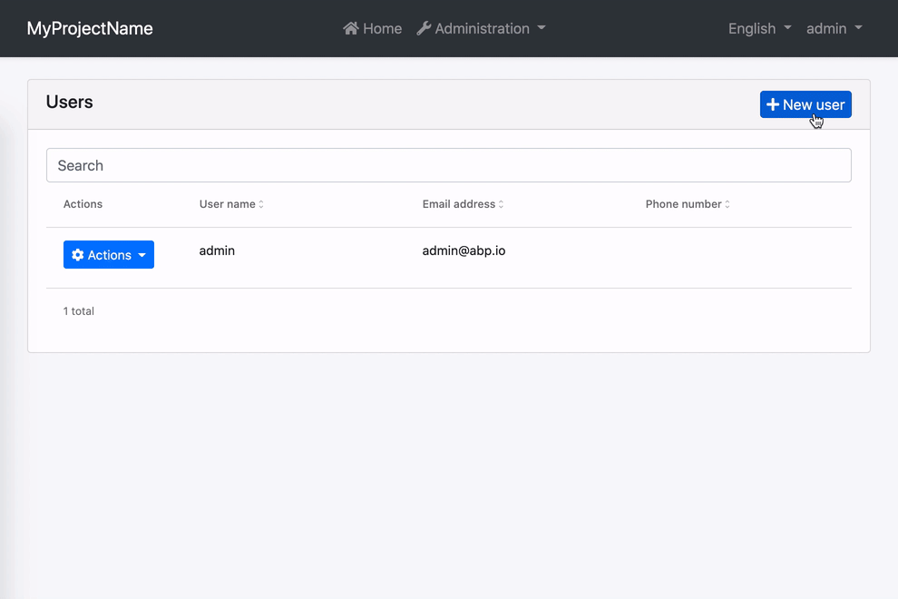
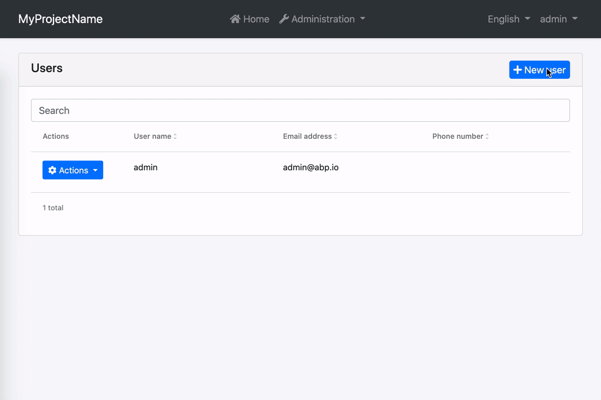

# Form Validation

Reactive forms in ABP Angular UI are validated by [ngx-validate](https://www.npmjs.com/package/@ngx-validate/core) and helper texts are shown automatically based on validation rules and error blueprints. You do not have to add any elements or components to your templates. The library handles that for you. Here is how the experience is:


## How to Add New Error Messages

You can add a new error message by passing validation options to the `ThemeSharedModule` in your root module.

```js
import { VALIDATION_BLUEPRINTS } from "@ngx-validate/core";
import { DEFAULT_VALIDATION_BLUEPRINTS } from "@abp/ng.theme.shared";

@NgModule({
  imports: [
    ThemeSharedModule.forRoot({
      validation: {
        blueprints: {
          uniqueUsername: "::AlreadyExists[]",
        },
      },

      // rest of theme shared config
    }),

    // other imports
  ],

  // rest of the module metadata
})
export class AppModule {}
```

Alternatively, you may provide the `VALIDATION_BLUEPRINTS` token directly in your root module. Please do not forget to spread `DEFAULT_VALIDATION_BLUEPRINTS`. Otherwise, built-in ABP validation messages will not work.

```js
import { VALIDATION_BLUEPRINTS } from "@ngx-validate/core";
import { DEFAULT_VALIDATION_BLUEPRINTS } from "@abp/ng.theme.shared";

@NgModule({
  providers: [
    {
      provide: VALIDATION_BLUEPRINTS,
      useValue: {
        ...DEFAULT_VALIDATION_BLUEPRINTS,
        uniqueUsername: "::AlreadyExists[]",
      },
    },

    // other providers
  ],

  // rest of the module metadata
})
export class AppModule {}
```

When a [validator](https://angular.io/guide/form-validation#defining-custom-validators) or an [async validator](https://angular.io/guide/form-validation#creating-asynchronous-validators) returns an error with the key given to the error blueprints (`uniqueUsername` here), the validation library will be able to display an error message after localizing according to the given key and interpolation params. The result will look like this:


In this example;

- Localization key is `::AlreadyExists`.
- The interpolation param is `username`.
- Localization resource is defined as `"AlreadyExists": "Sorry, “{0}” already exists."`.
- And the validator should return `{ uniqueUsername: { username: "admin" } }` as the error object.

## How to Change Existing Error Messages

You can overwrite an existing error message by passing validation options to the `ThemeSharedModule` in your root module. Let's imagine you have a custom localization resource for required inputs.

```json
"RequiredInput": "Oops! We need this input."
```

To use this instead of the built-in required input message, all you need to do is the following.

```js
import { VALIDATION_BLUEPRINTS } from "@ngx-validate/core";
import { DEFAULT_VALIDATION_BLUEPRINTS } from "@abp/ng.theme.shared";

@NgModule({
  imports: [
    ThemeSharedModule.forRoot({
      validation: {
        blueprints: {
          required: "::RequiredInput",
        },
      },

      // rest of theme shared config
    }),

    // other imports
  ],

  // rest of the module metadata
})
export class AppModule {}
```

Alternatively, you may provide the `VALIDATION_BLUEPRINTS` token directly in your root module. Please do not forget to spread `DEFAULT_VALIDATION_BLUEPRINTS`. Otherwise, built-in ABP validation messages will not work.

```js
import { VALIDATION_BLUEPRINTS } from "@ngx-validate/core";
import { DEFAULT_VALIDATION_BLUEPRINTS } from "@abp/ng.theme.shared";

@NgModule({
  providers: [
    {
      provide: VALIDATION_BLUEPRINTS,
      useValue: {
        ...DEFAULT_VALIDATION_BLUEPRINTS,
        required: "::RequiredInput",
      },
    },

    // other providers
  ],

  // rest of the module metadata
})
export class AppModule {}
```

The error message will look like this:



## How to Disable Validation on a Form

If you want to validate a form manually, you can always disable automatic validation on it. All you need to do is place `skipValidation` on the form element.

```html
<form [formGroup]="form" skipValidation>
  <!-- form fields here -->
</form>
```

## How to Disable Validation on a Specific Field

Validation works on any element or component with a `formControl` or `formControlName` directive. You can disable automatic validation on a specific field by placing `skipValidation` on the input element or component.

```html
<input type="text" formControlName="name" skipValidation />
```

## How to Use a Custom Error Component

First, build a custom error component. Extending the existing `ValidationErrorComponent` would make it easier.

```js
import { ValidationErrorComponent } from "@abp/ng.theme.basic";
import { ChangeDetectionStrategy, Component } from "@angular/core";

@Component({
  selector: "app-validation-error",
  template: `
    <div
      class="font-weight-bold font-italic px-1 invalid-feedback"
      *ngFor="let error of abpErrors; trackBy: trackByFn"
    >
      
    </div>
  `,
  changeDetection: ChangeDetectionStrategy.OnPush,
})
export class ErrorComponent extends ValidationErrorComponent {}
```

Then, declare and provide it in your root module.

```js
import { VALIDATION_ERROR_TEMPLATE } from "@ngx-validate/core";

@NgModule({
  // rest of the module metadata

  declarations: [
    // other declarables
    ErrorComponent,
  ],
  providers: [
    // other providers
    {
      provide: VALIDATION_ERROR_TEMPLATE,
      useValue: ErrorComponent,
    },
  ],
})
export class AppModule {}
```

The error message will be bold and italic now:


