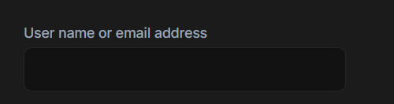

# Form Input Component

The ABP FormInput Component is a reusable form input component for text type.

It takes `label`, `labelClass` (default form-label), `inputId`,`inputPlaceholder`,`inputReadonly`,`inputClass` (default form-control) and `inputStyle` as input to customize component. Also, it emits `formBlur` and `formFocus` events when component gain or lose focus.

# Usage

ABP FormInput component is a part of the `ThemeSharedModule` module. If you've imported that module into your module, you don't need to import it again. If not, first import it as shown below:

```ts
// my-feature.module.ts

import { ThemeSharedModule } from "@abp/ng.theme.shared";
import { FomrInputDemoComponent } from "./FomrInputDemoComponent.component";

@NgModule({
	imports: [
		ThemeSharedModule,
		// ...
	],
	declarations: [FomrInputDemoComponent],
	// ...
})
export class MyFeatureModule {}
```

Then, the `abp-form-input` component can be used. See the example below:

```html
<div class="row">
	<div class="col-4">
		<abp-form-input
			label="AbpAccount::UserNameOrEmailAddress"
			inputId="login-input-user-name-or-email-address"
		></abp-form-input>
	</div>
</div>
```

See the form input result below:


