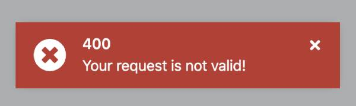

# HTTP Error Handling

When the `RestService` is used, all HTTP errors are reported to the [`HttpErrorReporterService`](./HTTP-Error-Reporter-Service), and then `ErrorHandler`, a service exposed by the `@abp/ng.theme.shared` package automatically handles the errors.

## Custom HTTP Error Handler

A custom HTTP error handler service can be registered to an injection token named **`CUSTOM_ERROR_HANDLERS`**. ABP has some default error handlers, you can see them [here](https://github.com/abpframework/abp/blob/dev/npm/ng-packs/packages/theme-shared/src/lib/providers/error-handlers.provider.ts).

### How ABP handles errors and How to add new one?

- First of all it will be better to understand how ABP handles errors.
- ABP error handler services are implements the interface of **CustomHttpErrorHandlerService**.

**Interface of `CUSTOM_ERROR_HANDLERS`**

```ts
interface CustomHttpErrorHandlerService {
  readonly priority: number;
  canHandle(error: unknown): boolean;
  execute(): void;
}
```

- **`priority`** ABP sorts the services according to the number of the priority variable. Higher priority will be checked first. You can think this as a z-index property in CSS.
- **`canHandle(error: unknown): boolean :`** Check if the service can handle the error. Returns boolean.
- **`execute(): void :`** If the service can handle the error, then run the execute method.

**In Summarry**

- Services are sorted by their priority number.
- Start from highest priority service and run canHandle() method. Pick the service if can handle the error, if not check next service.
- If the service found, run the execute method of a service. Done.

See an example:

```ts
// custom-error-handler.service.ts
import { inject, Injectable } from "@angular/core";
import { HttpErrorResponse } from "@angular/common/http";
import { CustomHttpErrorHandlerService } from "@abp/ng.theme.shared";
import { CUSTOM_HTTP_ERROR_HANDLER_PRIORITY } from "@abp/ng.theme.shared";
import { ToasterService } from "@abp/ng.theme.shared";

@Injectable({ providedIn: "root" })
export class MyCustomErrorHandlerService
  implements CustomHttpErrorHandlerService
{

  // You can write any number here, ex: 9999
  readonly priority = CUSTOM_HTTP_ERROR_HANDLER_PRIORITY.veryHigh; 
  private toaster = inject(ToasterService);
  private error: HttpErrorResponse | undefined = undefined;

  // What kind of error should be handled by this service? You can decide it in this method. If error is suitable to your case then return true; otherwise return false.
  canHandle(error: unknown): boolean {
    if (error instanceof HttpErrorResponse && error.status === 400) {
      this.error = error;
      return true;
    }
    return false;
  }

  // If this service is picked from ErrorHandler, this execute method will be called.
  execute() {
    this.toaster.error(
      this.error.error?.error?.message || "Bad request!",
      "400"
    );
  }
}
```

```ts

// app.module.ts
import { CUSTOM_ERROR_HANDLERS, ... } from '@abp/ng.theme.shared';
import { MyCustomErrorHandlerService } from './custom-error-handler.service';

@NgModule({
  // ...
  providers: [
    // ...
    { provide: CUSTOM_ERROR_HANDLERS, useExisting: MyCustomErrorHandlerService, multi: true }
  ]
})
export class AppModule {}
```

In the example above:

- Created a service named `MyCustomErrorHandlerService`, and provided via `useExisting` key because we dont want another instance of it. And set `multi` key to true because ABP default error handlers are also provided with **CUSTOM_ERROR_HANDLERS** injection token.

- 400 errors are handled from custom `MyCustomErrorHandlerService`. When a 400 error occurs, backend error message will be displayed as shown below:



**Note 1:** If your service cannot handle the error. Then ABP will check the next Error Service.
**Note 2:** If none of the service handle the error. Then basic confirmation message about the error will be shown to the user.
**Note 3:** You can provide more than one service, with CUSTOM_ERROR_HANDLER injection token.
**Note 4:** If you want your custom service to be evaluated (checked) earlier, set the priority variable high.
