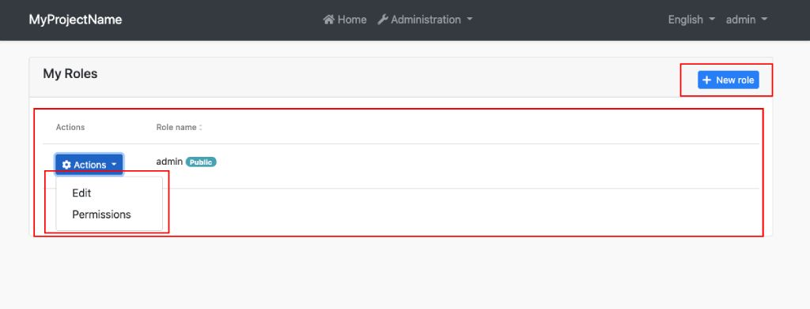
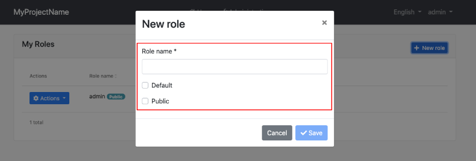

# How Replaceable Components Work with Extensions

Additional UI extensibility points ([Entity action extensions](https://docs.abp.io/en/abp/latest/UI/Angular/Entity-Action-Extensions), [data table column extensions](https://docs.abp.io/en/abp/latest/UI/Angular/Data-Table-Column-Extensions), [page toolbar extensions](https://docs.abp.io/en/abp/latest/UI/Angular/Page-Toolbar-Extensions) and others) are used in ABP pages to allow to control entity actions, table columns and page toolbar of a page. If you replace a page, you need to apply some configurations to be able to work extension components in your component. Let's see how to do this by replacing the roles page.

Create a new module called `MyRolesModule`:

```bash
yarn ng generate module my-roles --module app
```

Create a new component called `MyRolesComponent`:

```bash
yarn ng generate component my-roles/my-roles --flat --export
```

Open the generated `src/app/my-roles/my-roles.component.ts` file and replace its content with the following:

```js
import { ListService, PagedAndSortedResultRequestDto } from '@abp/ng.core';
import {
  CreateRole,
  DeleteRole,
  eIdentityComponents,
  GetRoleById,
  GetRoles,
  IdentityRoleDto,
  IdentityState,
  RolesComponent,
  UpdateRole,
} from '@abp/ng.identity';
import { ePermissionManagementComponents } from '@abp/ng.permission-management';
import { Confirmation, ConfirmationService } from '@abp/ng.theme.shared';
import {
  EXTENSIONS_IDENTIFIER,
  FormPropData,
  generateFormFromProps,
} from '@abp/ng.theme.shared/extensions';
import { Component, Injector, OnInit } from '@angular/core';
import { FormGroup } from '@angular/forms';
import { Select, Store } from '@ngxs/store';
import { Observable } from 'rxjs';
import { finalize, pluck } from 'rxjs/operators';

@Component({
  selector: 'app-my-roles',
  templateUrl: './my-roles.component.html',
  providers: [
    ListService,
    {
      provide: EXTENSIONS_IDENTIFIER,
      useValue: eIdentityComponents.Roles,
    },
    { provide: RolesComponent, useExisting: MyRolesComponent },
  ],
})
export class MyRolesComponent implements OnInit {
  @Select(IdentityState.getRoles)
  data$: Observable<IdentityRoleDto[]>;

  @Select(IdentityState.getRolesTotalCount)
  totalCount$: Observable<number>;

  form: FormGroup;

  selected: IdentityRoleDto;

  isModalVisible: boolean;

  visiblePermissions = false;

  providerKey: string;

  modalBusy = false;

  permissionManagementKey = ePermissionManagementComponents.PermissionManagement;

  onVisiblePermissionChange = event => {
    this.visiblePermissions = event;
  };

  constructor(
    public readonly list: ListService<PagedAndSortedResultRequestDto>,
    protected confirmationService: ConfirmationService,
    protected store: Store,
    protected injector: Injector
  ) {}

  ngOnInit() {
    this.hookToQuery();
  }

  buildForm() {
    const data = new FormPropData(this.injector, this.selected);
    this.form = generateFormFromProps(data);
  }

  openModal() {
    this.buildForm();
    this.isModalVisible = true;
  }

  add() {
    this.selected = {} as IdentityRoleDto;
    this.openModal();
  }

  edit(id: string) {
    this.store
      .dispatch(new GetRoleById(id))
      .pipe(pluck('IdentityState', 'selectedRole'))
      .subscribe(selectedRole => {
        this.selected = selectedRole;
        this.openModal();
      });
  }

  save() {
    if (!this.form.valid) return;
    this.modalBusy = true;

    this.store
      .dispatch(
        this.selected.id
          ? new UpdateRole({ ...this.selected, ...this.form.value, id: this.selected.id })
          : new CreateRole(this.form.value)
      )
      .pipe(finalize(() => (this.modalBusy = false)))
      .subscribe(() => {
        this.isModalVisible = false;
        this.list.get();
      });
  }

  delete(id: string, name: string) {
    this.confirmationService
      .warn('AbpIdentity::RoleDeletionConfirmationMessage', 'AbpIdentity::AreYouSure', {
        messageLocalizationParams: [name],
      })
      .subscribe((status: Confirmation.Status) => {
        if (status === Confirmation.Status.confirm) {
          this.store.dispatch(new DeleteRole(id)).subscribe(() => this.list.get());
        }
      });
  }

  private hookToQuery() {
    this.list.hookToQuery(query => this.store.dispatch(new GetRoles(query))).subscribe();
  }

  openPermissionsModal(providerKey: string) {
    this.providerKey = providerKey;
    setTimeout(() => {
      this.visiblePermissions = true;
    }, 0);
  }

  sort(data) {
    const { prop, dir } = data.sorts[0];
    this.list.sortKey = prop;
    this.list.sortOrder = dir;
  }
}
```

```js
    {
      provide: EXTENSIONS_IDENTIFIER,
      useValue: eIdentityComponents.Roles,
    },
    { 
      provide: RolesComponent, 
      useExisting: MyRolesComponent 
    }
```

The two providers we have defined in `MyRolesComponent` are required for the extension components to work correctly.

* With the first provider, we defined the extension identifier for using `RolesComponent`'s extension actions in the `MyRolesComponent`.
* With the second provider, we have replaced the `RolesComponent` injection with the `MyRolesComponent`. Default extension actions of the `RolesComponent` try to get `RolesComponent` instance. However, the actions can get the `MyRolesComponent` instance after defining the second provider.

Open the generated `src/app/my-role/my-role.component.html` file and replace its content with the following:

```html
<div id="identity-roles-wrapper" class="card">
  <div class="card-header">
    <div class="row">
      <div class="col col-md-6">
        <h5 class="card-title">My Roles</h5>
      </div>
      <div class="text-right col col-md-6">
        <abp-page-toolbar [record]="data$ | async"></abp-page-toolbar>
      </div>
    </div>
  </div>

  <div class="card-body">
    <abp-extensible-table
      [data]="data$ | async"
      [recordsTotal]="totalCount$ | async"
      [list]="list"
    ></abp-extensible-table>
  </div>
</div>

<abp-modal size="md" [(visible)]="isModalVisible" [busy]="modalBusy">
  <ng-template #abpHeader>
    <h3></h3>
  </ng-template>

  <ng-template #abpBody>
    <form [formGroup]="form" (ngSubmit)="save()" validateOnSubmit>
      <abp-extensible-form [selectedRecord]="selected"></abp-extensible-form>
    </form>
  </ng-template>

  <ng-template #abpFooter>
    <button type="button" class="btn btn-secondary" #abpClose>
      
    </button>
    <abp-button iconClass="fa fa-check" [disabled]="form?.invalid" (click)="save()"></abp-button>
  </ng-template>
</abp-modal>

<abp-permission-management
  #abpPermissionManagement="abpPermissionManagement"
  *abpReplaceableTemplate="
    {
      inputs: {
        providerName: { value: 'R' },
        providerKey: { value: providerKey },
        visible: { value: visiblePermissions, twoWay: true },
        hideBadges: { value: true }
      },
      outputs: { visibleChange: onVisiblePermissionChange },
      componentKey: permissionManagementKey
    };
    let init = initTemplate
  "
  (abpInit)="init(abpPermissionManagement)"
>
</abp-permission-management>
```

We have added the `abp-page-toolbar`, `abp-extensible-table`, and `abp-extensible-form` extension components to template of the `MyRolesComponent`.

You should import the required modules for the `MyRolesComponent` to `MyRolesModule`. Open the `src/my-roles/my-roles.module.ts` file and replace the content with the following:

```js
import { UiExtensionsModule } from '@abp/ng.theme.shared/extensions';
import { NgModule } from '@angular/core';
import { SharedModule } from '../shared/shared.module';
import { MyRolesComponent } from './my-roles.component';
import { PermissionManagementModule } from '@abp/ng.permission-management';

@NgModule({
  declarations: [MyRolesComponent],
  imports: [SharedModule, UiExtensionsModule, PermissionManagementModule],
  exports: [MyRolesComponent],
})
export class MyRolesModule {}
```

- `UiExtensionsModule` imported to be able to use the extension components in your component.
- `PermissionManagementModule` imported to be able to use the `abp-permission-*management` in your component.

As the last step, it is needs to be replaced the `RolesComponent` with the `MyRolesComponent`. Open the `app.component.ts` and modify its content as shown below:

```js
import { ReplaceableComponentsService } from '@abp/ng.core';
import { eIdentityComponents } from '@abp/ng.identity';
import { MyRolesComponent } from './my-roles/my-roles.component';

@Component(/* component metadata */)
export class AppComponent {
  constructor(private replaceableComponents: ReplaceableComponentsService) {
    this.replaceableComponents.add({ component: MyRolesComponent, key: eIdentityComponents.Roles });
  }
}
```

After the steps above, the `RolesComponent` has been successfully replaced with the `MyRolesComponent`. When you navigate to the `/identity/roles` URL, you will see the `MyRolesComponent`'s template and see the extension components working correctly.




