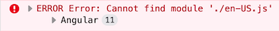

# Localization

Before you read about _the Localization Pipe_ and _the Localization Service_, you should know about localization keys.

The Localization key format consists of 2 sections which are **Resource Name** and **Key**.
`ResourceName::Key`

> If you do not specify the resource name, it will be `defaultResourceName` which is declared in `environment.ts`

```js
const environment = {
  //...
  localization: {
    defaultResourceName: 'MyProjectName',
  },
};
```

So these two are the same:

```html
<h1></h1>

<h1></h1>
```

## Using the Localization Pipe

You can use the `abpLocalization` pipe to get localized text as in this example:

```html
<h1></h1>
```

The pipe will replace the key with the localized text.

You can also specify a default value as shown below:

```html
<h1></h1>
```

To use interpolation, you must give the values for interpolation as pipe parameters, for example:

Localization data is stored in key-value pairs:

```js
{
  //...
  AbpAccount: { // AbpAccount is the resource name
    Key: "Value",
    PagerInfo: "Showing {0} to {1} of {2} entries"
  }
}
```

So we can use this key like this:

```html
<h1></h1>

<!-- Output: Showing 20 to 30 of 50 entries -->
```

### Using the Localization Service

First of all you should import the `LocalizationService` from **@abp/ng.core**

```js
import { LocalizationService } from '@abp/ng.core';

class MyClass {
  constructor(private localizationService: LocalizationService) {}
}
```

After that, you are able to use localization service.

> You can add interpolation parameters as arguments to `instant()` and `get()` methods.

```js
this.localizationService.instant('AbpIdentity::UserDeletionConfirmation', 'John');

// with fallback value
this.localizationService.instant(
  { key: 'AbpIdentity::UserDeletionConfirmation', defaultValue: 'Default Value' },
  'John',
);

// Output
// User 'John' will be deleted. Do you confirm that?
```

To get a localized text as [_Observable_](https://rxjs.dev/guide/observable) use `get` method instead of `instant`:

```js
this.localizationService.get('Resource::Key');

// with fallback value
this.localizationService.get({ key: 'Resource::Key', defaultValue: 'Default Value' });
```

## RTL Support

As of v2.9 ABP has RTL support. If you are generating a new project with v2.9 and above, everything is set, you do not need to do any changes. If you are migrating your project from an earlier version, please follow the 2 steps below:

#### Step 1. Create Chunks for Bootstrap LTR and RTL

Find [styles configuration in angular.json](https://angular.io/guide/workspace-config#style-script-config) and make sure the chunks in your project has `bootstrap-rtl.min` and `bootstrap-ltr.min` as shown below.

```json
{
  "projects": {
    "MyProjectName": {
      "architect": {
        "build": {
          "options": {
            "styles": [
              {
                "input": "node_modules/@fortawesome/fontawesome-free/css/all.min.css",
                "inject": true,
                "bundleName": "fontawesome-all.min"
              },
              {
                "input": "node_modules/@fortawesome/fontawesome-free/css/v4-shims.min.css",
                "inject": true,
                "bundleName": "fontawesome-v4-shims.min"
              },
              {
                "input": "node_modules/@abp/ng.theme.shared/styles/bootstrap-rtl.min.css",
                "inject": false,
                "bundleName": "bootstrap-rtl.min"
              },
              {
                "input": "node_modules/bootstrap/dist/css/bootstrap.min.css",
                "inject": true,
                "bundleName": "bootstrap-ltr.min"
              },
              "apps/dev-app/src/styles.scss"
            ],
          }
        }
      }
    }
  }
}
```

#### Step 2. Clear Lazy Loaded Fontawesome in AppComponent

If you have created and injected chunks for Fontawesome as seen above, you no longer need the lazy loading in the `AppComponent` which was implemented before v2.9. Simply remove them. The `AppComponent` in the template of the new version looks like this:

```js
import { Component } from '@angular/core';

@Component({
  selector: 'app-root',
  template: `
    <abp-loader-bar></abp-loader-bar>
    <router-outlet></router-outlet>
  `,
})
export class AppComponent {}
```

## Registering a New Locale

Since ABP has more than one language, Angular locale files loads lazily using [Webpack's import function](https://webpack.js.org/api/module-methods/#import-1) to avoid increasing the bundle size and register to Angular core using the [`registerLocaleData`](https://angular.io/api/common/registerLocaleData) function. The chunks to be included in the bundle are specified by the [Webpack's magic comments](https://webpack.js.org/api/module-methods/#magic-comments) as hard-coded. Therefore a `registerLocale` function that returns Webpack `import` function must be passed to `CoreModule`.

### registerLocaleFn

`registerLocale` function that exported from `@abp/ng.core/locale` package is a higher order function that accepts `cultureNameLocaleFileMap` object and `errorHandlerFn` function as params and returns Webpack `import` function. A `registerLocale` function must be passed to the `forRoot` of the `CoreModule` as shown below:

```js
// app.module.ts

import { registerLocale } from '@abp/ng.core/locale';
// if you have commercial license and the language management module, add the below import
// import { registerLocale } from '@volo/abp.ng.language-management/locale';


@NgModule({
  imports: [
    // ...
    CoreModule.forRoot({
      // ...other options,
      registerLocaleFn: registerLocale(
        // you can pass the cultureNameLocaleFileMap and errorHandlerFn as optionally
        {
          cultureNameLocaleFileMap: { 'pt-BR': 'pt' },
          errorHandlerFn: ({ resolve, reject, locale, error }) => {
            // the error can be handled here
          },
        },
      )
    }),
    //...
  ]
```


### Mapping of Culture Name to Angular Locale File Name

Some of the culture names defined in .NET do not match Angular locales. In such cases, the Angular app throws an error like below at runtime:



If you see an error like this, you should pass the `cultureNameLocaleFileMap` property like below to the `registerLocale` function.

```js
// app.module.ts

import { registerLocale } from '@abp/ng.core/locale';
// if you have commercial license and the language management module, add the below import
// import { registerLocale } from '@volo/abp.ng.language-management/locale';


@NgModule({
  imports: [
    // ...
    CoreModule.forRoot({
      // ...other options,
      registerLocaleFn: registerLocale(
        {
          cultureNameLocaleFileMap: { 
            "DotnetCultureName": "AngularLocaleFileName",
            "pt-BR": "pt"  // example
          },
        },
      )
    }),
    //...
```

See [all locale files in Angular](https://github.com/angular/angular/tree/master/packages/common/locales).

### Adding a New Culture

Add the below code to the `app.module.ts` by replacing `your-locale` placeholder with a correct locale name.

```js
//app.module.ts

import { storeLocaleData } from '@abp/ng.core/locale';
import(
/* webpackChunkName: "_locale-your-locale-js"*/
/* webpackMode: "eager" */
'@angular/common/locales/your-locale.js'
).then(m => storeLocaleData(m.default, 'your-locale'));
```

...or a custom `registerLocale` function can be passed to the `CoreModule`:

```js
// register-locale.ts

import { differentLocales } from '@abp/ng.core';
export function registerLocale(locale: string) {
  return import(
    /* webpackChunkName: "_locale-[request]"*/
    /* webpackInclude: /[/\\](en|fr).js/ */
    /* webpackExclude: /[/\\]global|extra/ */
    `@angular/common/locales/${differentLocales[locale] || locale}.js`
  )
}

// app.module.ts

import { registerLocale } from './register-locale';

@NgModule({
  imports: [
    // ...
    CoreModule.forRoot({
      // ...other options,
      registerLocaleFn: registerLocale
    }),
    //...
  ]
```

After this custom `registerLocale` function, since the en and fr added to the `webpackInclude`, only en and fr locale files will be created as chunks:


Which locale files you add to `webpackInclude` magic comment, they will be included in the bundle


## See Also

* [Localization in ASP.NET Core](../../Localization.md)
