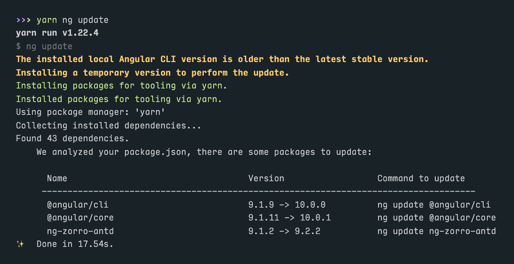

# v2.9 to v3.0 Angular UI Migration Guide

## What Changed in v3.0?

### Angular 10

The new ABP Angular UI is based on Angular 10 and TypeScript 3.9, and we have dropped support for Angular 8. Nevertheless, ABP modules will keep working with Angular 9. Therefore, if your project is Angular 9, you do not need to update to Angular 10. The update is usually very easy though.

#### What to Do When Migrating?

Open a terminal at your root folder and run the following command:

```shell
yarn ng update @angular/cli @angular/core --force
```

This will make the following modifications:

- Update your package.json and install new packages
- Revise tsconfig.json files to create a "Solution Style" configuration
- Rename `browserslist` as `.browserslistrc`

On the other hand, it would be better if you check which packages to update first with `yarn ng update` command alone. Angular will give you a list of packages to update.



When Angular reports the packages above, your command would look like this:

```shell
yarn ng update @angular/cli @angular/core ng-zorro-antd --force
```

> If Angular complains about uncommited changes in your repo, you can either commit/stash them or add `--allow-dirty` parameter to the command.


### Config Modules

In ABP v2.x, every lazy loaded module had a config module available via a separate package and module configuration was as follows:

```js
import { AccountConfigModule } from '@abp/ng.account.config';

@NgModule({
  imports: [
    // other imports
    AccountConfigModule.forRoot({ redirectUrl: '/' }),
  ],
  // providers, declarations, and bootstrap
})
export class AppModule {}
```

...and in app-routing.module.ts...

```js
const routes: Routes = [
  // other route configuration
  {
    path: 'account',
    loadChildren: () => import(
      './lazy-libs/account-wrapper.module'
    ).then(m => m.AccountWrapperModule),
  },
];
```

Although working, this had a few disadvantages:

- Every module came in two independent packages, but in reality, those packages were interdependent.
- Configuring lazy loaded modules required a wrapper module.
- ABP Commercial had extensibility system and configuring extensible modules at the root module was increasing the bundle size.

In ABP v3.0, we have introduced a secondary entry points for each config module as well as a new way to configure lazy loaded modules without the wrappers. Now, the module configuration looks like this:

```js
import { AccountConfigModule } from '@abp/ng.account/config';

@NgModule({
  imports: [
    // other imports
    AccountConfigModule.forRoot(),
  ],
  // providers, declarations, and bootstrap
})
export class AppModule {}
```

...and in app-routing.module.ts...

```js
const routes: Routes = [
  // other route configuration
  {
    path: 'account',
    loadChildren: () => import('@abp/ng.account')
      .then(m => m.AccountModule.forLazy({ redirectUrl: '/' })),
  },
];
```

This change helped us reduce bundle size and build times substantially. We believe you will notice the difference in your apps.

#### A Better Example

AppModule:

```js
import { AccountConfigModule } from '@abp/ng.account/config';
import { CoreModule } from '@abp/ng.core';
import { IdentityConfigModule } from '@abp/ng.identity/config';
import { SettingManagementConfigModule } from '@abp/ng.setting-management/config';
import { TenantManagementConfigModule } from '@abp/ng.tenant-management/config';
import { ThemeBasicModule } from '@abp/ng.theme.basic';
import { ThemeSharedModule } from '@abp/ng.theme.shared';
import { NgModule } from '@angular/core';
import { BrowserModule } from '@angular/platform-browser';
import { BrowserAnimationsModule } from '@angular/platform-browser/animations';
import { NgxsModule } from '@ngxs/store';
import { environment } from '../environments/environment';
import { AppRoutingModule } from './app-routing.module';

@NgModule({
  imports: [
    BrowserModule,
    BrowserAnimationsModule,
    AppRoutingModule,
    CoreModule.forRoot({
      environment,
      sendNullsAsQueryParam: false,
      skipGetAppConfiguration: false,
    }),
    ThemeSharedModule.forRoot(),
    AccountConfigModule.forRoot(),
    IdentityConfigModule.forRoot(),
    TenantManagementConfigModule.forRoot(),
    SettingManagementConfigModule.forRoot(),
    ThemeBasicModule.forRoot(),
    NgxsModule.forRoot(),
  ],
  // providers, declarations, and bootstrap
})
export class AppModule {}
```

AppRoutingModule:

```js
import { NgModule } from '@angular/core';
import { RouterModule, Routes } from '@angular/router';

const routes: Routes = [
  {
    path: '',
    pathMatch: 'full',
    loadChildren: () => import('./home/home.module').then(m => m.HomeModule),
  },
  {
    path: 'account',
    loadChildren: () =>
      import('@abp/ng.account').then(m => m.AccountModule.forLazy({ redirectUrl: '/' })),
  },
  {
    path: 'identity',
    loadChildren: () => import('@abp/ng.identity').then(m => m.IdentityModule.forLazy()),
  },
  {
    path: 'tenant-management',
    loadChildren: () =>
      import('@abp/ng.tenant-management').then(m => m.TenantManagementModule.forLazy()),
  },
  {
    path: 'setting-management',
    loadChildren: () =>
      import('@abp/ng.setting-management').then(m => m.SettingManagementModule.forLazy()),
  },
];

@NgModule({
  imports: [RouterModule.forRoot(routes)],
  exports: [RouterModule],
})
export class AppRoutingModule {}
```

AppComponent:

```js
import { Component } from '@angular/core';

@Component({
  selector: 'app-root',
  template: `
    <abp-loader-bar></abp-loader-bar>
    <abp-dynamic-layout></abp-dynamic-layout>
  `,
})
export class AppComponent {}
```


> You may have noticed that we used `<abp-dynamic-layout>` instead of `<router-outlet>` in the AppComponent template. We made this change in order to avoid unnecessary renders and flickering. It is not mandatory, but we recommend doing the same in your AppComponent.

#### What to Do When Migrating?

- Remove config packages from your project using `yarn remove`.
- Import config modules from secondary entry points (e.g. `@abp/ng.identity/config`).
- Call static `forRoot` method of all new config modules, even if a configuration is not passed.
- Call static `forRoot` method of `ThemeBasicModule` (or `ThemeLeptonModule` if commercial) and remove `SharedModule` from imports (unless you have added anything that is necessary for your root module in it).
- Import lazy ABP modules directly in app routing module (e.g. `() => import('@abp/ng.identity').then(...)`).
- Call static `forLazy` method of all lazy modules inside `then`, even if a configuration is not passed.
- [OPTIONAL] Add the `<abp-dynamic-layout></abp-dynamic-layout>` to the AppComponent template and remove the `<router-outlet></router-outlet>` for better performance and UX.


### RoutesService

In ABP v2.x, adding a route to the menu was done by one of two ways:

- [Via `routes` Property in `AppRoutingModule`](https://docs.abp.io/en/abp/2.9.0/UI/Angular/Modifying-the-Menu#via-routes-property-in-approutingmodule)
- [Via ConfigState](https://docs.abp.io/en/abp/2.9.0/UI/Angular/Modifying-the-Menu#via-configstate)

As of v3.0, we have changed how routes are added and modified. We are no longer storing routes in `ConfigState` (breaking change). Instead, there is a new service called `RoutesService` which is used for adding, patching, or removing menu items. Please check [the documentation](./Modifying-the-Menu.md) for details.

#### What to Do When Migrating?

- Check if you have ever used `ConfigState` or `ConfigStateService` to add any routes. If so, replace them with `add` method of `RoutesService`.
- Check if you have ever patched a route. If so, convert them to `patch` method of `RoutesService`.
- Double-check that you are using absolute paths and providing a `parentName` instead of `children` property for sub-menu items in `add` or `patch` method calls.


### NavItemsService

In ABP v2.x, adding a navigation element was done [via LayoutStateService](https://docs.abp.io/en/abp/2.9.0/UI/Angular/Modifying-the-Menu#how-to-add-an-element-to-right-part-of-the-menu)

As of v3.0, we have changed how navigation items are added and modified and previous method of doing so is no longer available (breaking change). Please check [the documentation](./Modifying-the-Menu.md) for details.

#### What to Do When Migrating?

- Replace all `dispatchAddNavigationElement` calls with `addItems` method of `NavItemsService`.


### ngx-datatable

Until v3, we had been using a custom component, `abp-table`, as the default table. However, data grids are complicated components and implementing a fully-featured one requires considerable effort, which we are planning to put in to other features and issues.

As of ABP v3, we have switched to a battle-tested, well-executed data grid: [ngx-datatable](https://github.com/swimlane/ngx-datatable). All ABP modules will come with ngx-datatable already implemented in them. `ThemeSharedModule` already exports `NgxDatatableModule`. So, if you install the package by running `yarn add @swimlane/ngx-datatable` in your terminal, it will be available for use in all modules of your app.

For proper styling, you need to add the following in the styles section of your angular.json file (above all others):

```json
"styles": [
  {
    "input": "node_modules/@swimlane/ngx-datatable/index.css",
    "inject": true,
    "bundleName": "ngx-datatable-index"
  },
  {
    "input": "node_modules/@swimlane/ngx-datatable/assets/icons.css",
    "inject": true,
    "bundleName": "ngx-datatable-icons"
  },
  {
    "input": "node_modules/@swimlane/ngx-datatable/themes/material.css",
    "inject": true,
    "bundleName": "ngx-datatable-material"
  },
  // other styles
]
```

Since `abp-table` is not dropped yet, modules previously built by ABP v2.x will not suddenly lose all their tables. Yet, they will look and feel different from built-in ABP v3 modules. Therefore, you will probably want to convert the tables in those modules to ngx-datatable. In order to decrease the amount of work required to convert an abp-table into ngx-datatable, we have modified the [ListService](./List-Service.md) to work well with ngx-datatable and [introduced](https://volosoft.com/blog/attribute-directives-to-avoid-repetition-in-angular-templates) two new directives: `NgxDatatableListDirective` and `NgxDatatableDefaultDirective`.

The usage of those directives is rather simple:

```js
@Component({
  providers: [ListService],
})
export class SomeComponent {
  data$ = this.list.hookToQuery(
    query => this.dataService.get(query)
  );

  constructor(
    public readonly list: ListService,
    public readonly dataService: SomeDataService,
  ) {}
}
```

...and in component template...

```html
<ngx-datatable
  [rows]="(data$ | async)?.items || []"
  [count]="(data$ | async)?.totalCount || 0"
  [list]="list"
  default
>
  <!-- column templates here -->
</ngx-datatable>
```

Once you bind the injected `ListService` instance through `NgxDatatableListDirective`, you no longer need to worry about pagination or sorting. Similarly, `NgxDatatableDefaultDirective` gets rid of several property bindings to make ngx-datatable fit our styles.

#### A Better Example

```html
<ngx-datatable
  [rows]="items"
  [count]="count"
  [list]="list"
  default
>
  <!-- the grid actions column -->
  <ngx-datatable-column
    name=""
    [maxWidth]="150"
    [width]="150"
    [sortable]="false"
  >
    <ng-template
      ngx-datatable-cell-template
      let-row="row"
      let-i="rowIndex"
    >
      <abp-grid-actions
        [index]="i"
        [record]="row"
        text="AbpUi::Actions"
      ></abp-grid-actions>
    </ng-template>
  </ngx-datatable-column>

  <!-- a basic column -->
  <ngx-datatable-column
    prop="someProp"
    [name]="'::SomeProp' | abpLocalization"
    [width]="200"
  ></ngx-datatable-column>

  <!-- a column with a custom template -->
  <ngx-datatable-column
    prop="someOtherProp"
    [name]="'::SomeOtherProp' | abpLocalization"
    [width]="250"
  >
    <ng-template
      ngx-datatable-cell-template
      let-row="row"
      let-i="index"
    >
      <div abpEllipsis></div>
    </ng-template>
  </ngx-datatable-column>
</ngx-datatable>
```

#### What to Do When Migrating?

- Install `@swimlane/ngx-datatable` package.
- Add ngx-datatable styles in the angular.json file.
- If you can, update your modules according to the example above.
- If you have to do that later and are planning to keep abp-table for a while, make sure you update your pagination according to the [breaking change described here](./List-Service.md).

**Important Note:** The `abp-table` is not removed, but is deprecated and will be removed in the future. Please consider switching to ngx-datatable.


### Extensions System [COMMERCIAL]

The extensions system is open sourced now and is publicly available from `@abp/ng.theme.shared/extensions` package instead of `@volo/abp.commercial.ng.ui`. Also, according to the new structure of config packages, the configuration is given through `forLazy` static methods as described above.

#### What to Do When Migrating?

If you have never used the extensions system before, you do not have to do anything. If you have, then please check the documentation again to see what changed. Extension system itself works the same as before. The only changes are the package you import from and the static method and the module you pass your contributors to.


### Lepton Theme Logos [COMMERCIAL]

In ABP v2.x, Lepton had one light and one dark logo per color theme. We have realized we could make it work with only one light and one dark logo. So, we have changed how Lepton looks up logo images and now you just need to have a `logo-light.png` and a `logo-dark.png` in your project.

#### What to Do When Migrating?

If you have switched template logo PNGs before, the change is simple:

- Go to `/assets/images/logo` folder.
- Rename `theme1.png` as `logo-light.png` and `theme1-reverse.png` as `logo-dark.png`.
- Delete all other `theme*.png` files.

If you have replaced the logo component(s), the change is a little bit different, but still simple. The `LayoutStateService` has a two new members: `primaryLogoColor` and `secondaryLogoColor`. They have an observable stream of `'light'` and `'dark'` strings as value. You can consume their value in your custom logo component templates with the `async` pipe. Here is a complete example which covers both primary and secondary (account) layout logos.

```js
import { AddReplaceableComponent } from '@abp/ng.core';
import { CommonModule } from '@angular/common';
import { APP_INITIALIZER, Component, Injector, NgModule } from '@angular/core';
import { Store } from '@ngxs/store';
import { eAccountComponents } from '@volo/abp.ng.account';
import {
  AccountLayoutComponent,
  eThemeLeptonComponents,
  LayoutStateService,
} from '@volo/abp.ng.theme.lepton';
import { Observable } from 'rxjs';
import { map } from 'rxjs/operators';

@Component({
  template: `
    <div class="account-brand p-4 text-center mb-1" *ngIf="isAccount; else link">
      <ng-template [ngTemplateOutlet]="link"></ng-template>
    </div>

    <ng-template #link>
      <a [style.background-image]="logoUrl | async" class="navbar-brand" routerLink="/"></a>
    </ng-template>
  `,
})
export class LogoComponent {
  isAccount: boolean;

  logoColor: Observable<'dark' | 'light'>;

  get logoUrl() {
    return this.logoColor.pipe(map(color => `url(/assets/images/logo/logo-${color}.png)`));
  }

  constructor(injector: Injector) {
    const layout = injector.get(LayoutStateService);
    this.isAccount = Boolean(injector.get(AccountLayoutComponent, false));
    this.logoColor = this.isAccount ? layout.secondaryLogoColor : layout.primaryLogoColor;
  }
}

@NgModule({
  imports: [CommonModule],
  declarations: [LogoComponent],
  exports: [LogoComponent],
})
export class LogoModule {}

export const APP_LOGO_PROVIDER = [
  { provide: APP_INITIALIZER, useFactory: switchLogos, multi: true, deps: [Store] },
];

export function switchLogos(store: Store) {
  return () => {
    store.dispatch(
      new AddReplaceableComponent({
        component: LogoComponent,
        key: eThemeLeptonComponents.Logo,
      }),
    );

    store.dispatch(
      new AddReplaceableComponent({
        component: LogoComponent,
        key: eAccountComponents.Logo,
      }),
    );
  };
}
```

Just add `APP_LOGO_PROVIDER` to the providers of your root module (usually `AppModule`) and you will have a custom logo component adjusting to the theme colors.


### Deprecated Interfaces

Some interfaces have long been marked as deprecated and now they are removed.

#### What to Do When Migrating?

- Please check if you are still using [anything listed in this issue](https://github.com/abpframework/abp/issues/4281)

